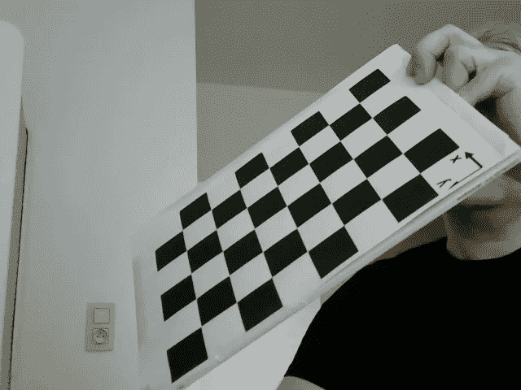
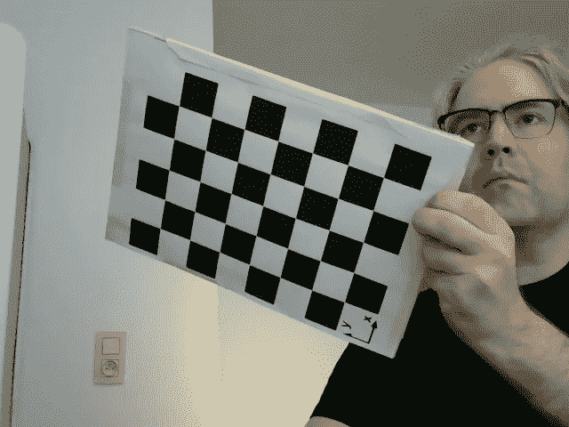
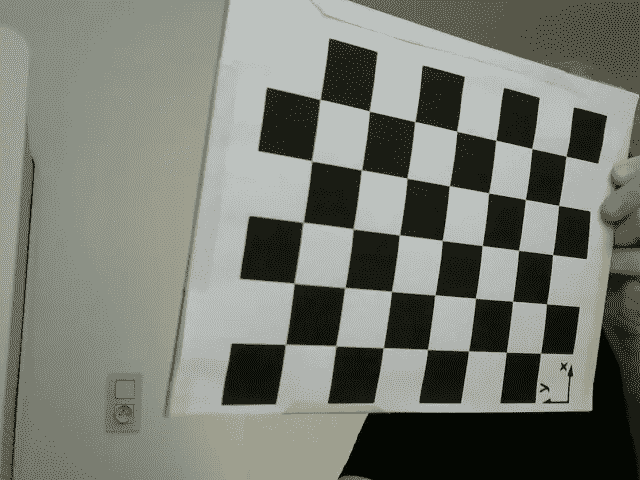
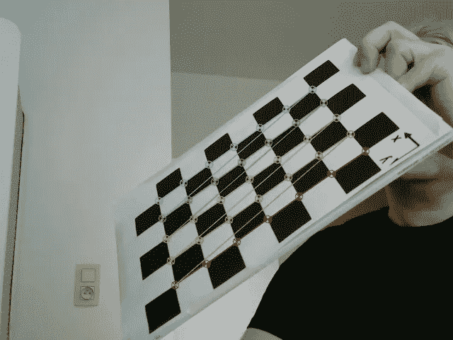
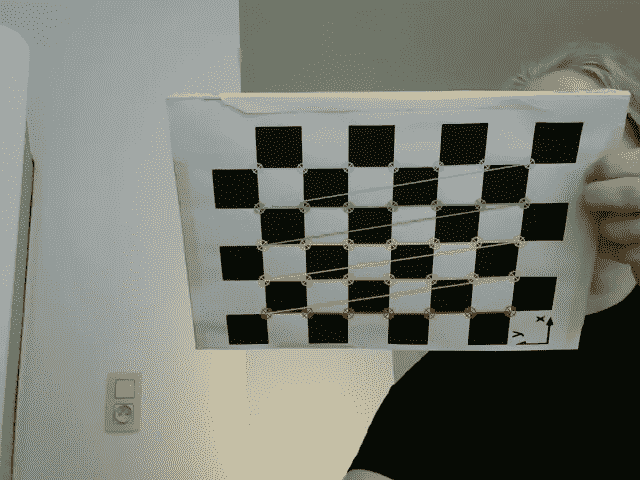
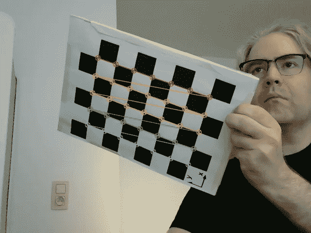
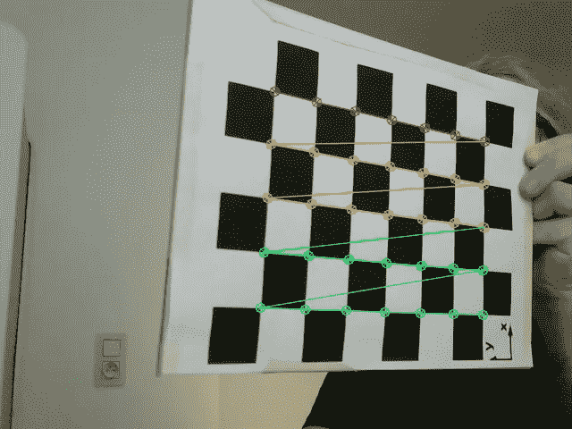
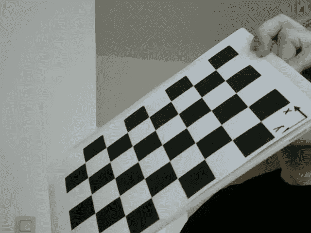
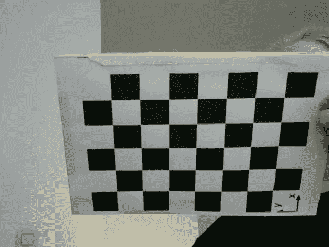

# 如何使用 Python 和 OpenCV 校准相机

> 原文：<https://betterprogramming.pub/how-to-calibrate-a-camera-using-python-and-opencv-23bab86ca194>

## 在本文中，我们将看看如何使用 Python 和 OpenCV 来确定单目摄像机的摄像机矩阵和失真系数，以获得无失真的图像。

照片由[帕特里克](https://unsplash.com/@patuphotos?utm_source=medium&utm_medium=referral)在 [Unsplash](https://unsplash.com?utm_source=medium&utm_medium=referral) 上拍摄

首先，我们将使用单筒相机拍摄一些照片——在我的情况下，这是我的网络摄像头。这些图片将包含一个不同位置和姿态的棋盘。

然后，一个校准程序将获取这些图像，提取这些棋盘上的角，并使用它们来确定我们相机的失真系数和内在属性。输出将保存在一个 JSON 文件中。

最后，我们将从 JSON 文件中加载相机矩阵和失真系数，并使用它们来消除原始棋盘图像的失真。

以下文档是我最近出于好奇进行的一些实验的结果。

# 用相机拍照

首先，让我们用相机拍一些照片。在我的情况下，这是一个罗技 C270 高清网络摄像头。

有无数种方法可以做到这一点。我是这样做的:

在这里，我们首先从我们的相机打开一个视频流。`src=0`表示我们将使用源 0 处的摄像机。如果您安装了多台摄像机，则信号源可能会有所不同。

接下来，我们使用无限循环继续从视频流中读取图像帧。我们刚刚读取的画面显示在我们的屏幕上，看看我们的摄像机看到了什么。

然后，我们听两次按键。如果按下`q`键，程序退出，如果按下`c`键，则当前图像帧被保存到文件中。

使用这个程序，我们将在框架内以不同的位置和姿态拍摄一些(在我的例子中是 16 张)棋盘的图像。如果你需要一个棋盘图案的生成器，那么你可以[到这里](https://calib.io/pages/camera-calibration-pattern-generator)选择“棋盘”作为“目标类型”

生成的图像看起来如下所示:

# 计算相机矩阵和失真系数

现在我们有了一堆棋盘的图片，我们可以使用下面的程序提取相机矩阵`mtx`和失真系数`dist`。相机矩阵和失真系数将被保存到一个 JSON 文件中。像这样，我们可以快速地将它们加载到其他需要来自网络摄像头的不失真图像的程序中。

确保行数和列数比棋盘上的实际行数和列数少一。这样做的原因是该算法将在棋盘上寻找内角，而不是外角。在我们的棋盘上，我们有 6 行 8 列，所以我们写 5 行 7 列。

创建一些数组来存储棋盘上所有图像的目标点和图像点。

从当前目录中获取所有校准 PNG 图像的文件名。

对于每个 PNG 文件名，加载图像并将其转换为灰度。

棋盘标志引导搜索棋盘角的算法。您也可以将标志设置为`None`。接下来使用`findChessboardCorners()`尝试找到棋盘的角落。你可以在这里找到关于功能和标志[的更多信息。](https://docs.opencv.org/4.x/d9/d0c/group__calib3d.html#ga93efa9b0aa890de240ca32b11253dd4a)

每次寻找棋盘上所有角点的算法成功后，我们会将角点和空的 3D 对象点添加到两个数组中，我们还会使用`cornerSubPix()`来细化角点位置。点击阅读更多关于此功能及其标准的信息[。](https://docs.opencv.org/4.x/dd/d1a/group__imgproc__feature.html#ga354e0d7c86d0d9da75de9b9701a9a87e)

此外，我们将画出在图像上发现的角，并将该图像输出到屏幕上的一个窗口和一个 PNG 文件中。

一旦每个校准图像都处理完毕，我们就可以使用保存为`imgpoints`的角点，通过功能`calibrateCamera()`校准摄像机。

我们继续将这个函数返回的所有变量保存在一个 JSON 文件中。假设一些变量是 NumPy 数组，我们需要通过编码器运行这些变量，将它们保存为列表。

# 示例使用案例

让我们尝试使用保存在 JSON 文件中的相机矩阵和失真系数。在这里，我们将加载我们的原始棋盘图像，并不失真。

我们打开 JSON 文件并检索距离系数`dist`和相机矩阵`mtx`。然后我们使用`glob`来查找所有以‘calibrate’开头并带有‘的文件名。' png '扩展名。

获取第一个图像以确定所有图像的大小(高度`h`和宽度`w`)——假设它们都具有相同的尺寸。

然后，计算特定尺寸图像和感兴趣区域`roi`的特定摄像机矩阵`newcameramtx`。

对于我们找到的每个文件名，从该文件中读取图像，并将图像解压缩到一个名为`dst`的新图像中。在这里，我已经注释掉了根据感兴趣的区域对图像的裁剪。

最后，显示我们刚刚未失真的图像，并保存它。

下面，你可以看到这样的图像的几个例子。

当将这些图像与原件进行比较时，它们似乎非常接近。这让我怀疑 Logitec 设备驱动程序可能对网络摄像头图像做了一些不失真的处理——开箱即用。

# 参考

*   [“从网络摄像头获取图像”Rip 教程](https://riptutorial.com/opencv/example/21401/get-image-from-webcam)
*   OpenCV 的“摄像机校准”
*   [“NumPy 数组不是 JSON 可序列化的”在 Stackoverflow 上](https://stackoverflow.com/questions/26646362/numpy-array-is-not-json-serializable)
*   [“Python 读取 JSON 文件——如何从文件加载 JSON 并解析转储”来自 freeCodeCamp](https://www.freecodecamp.org/news/python-read-json-file-how-to-load-json-from-a-file-and-parse-dumps/)
*   [calib . io 的“模式生成器”](https://calib.io/pages/camera-calibration-pattern-generator)