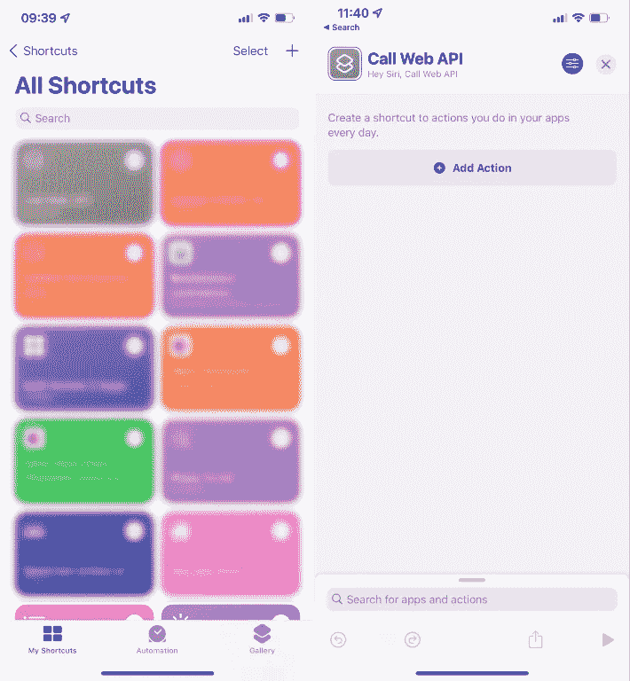
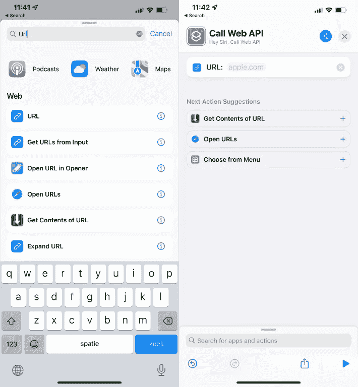
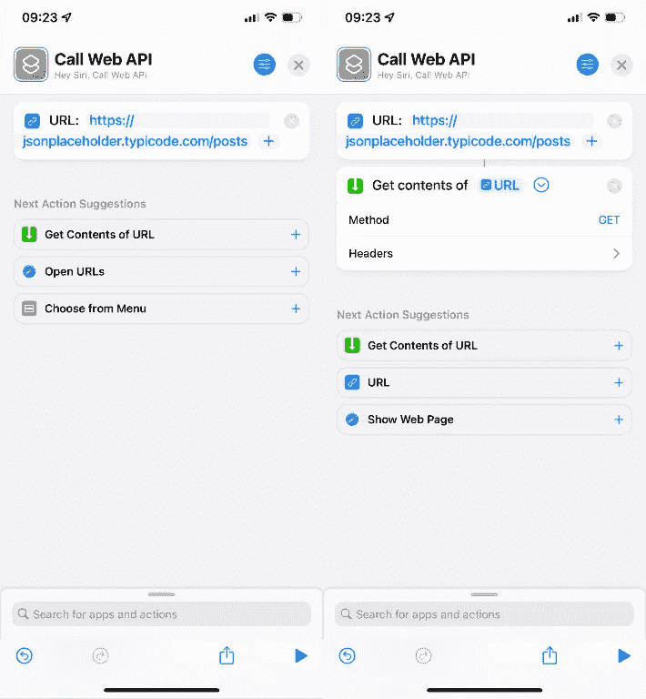
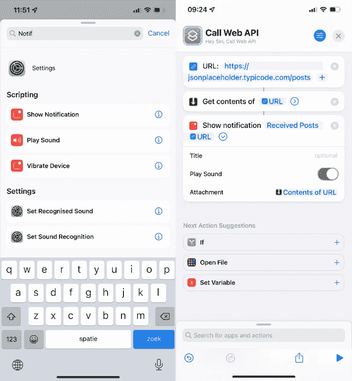
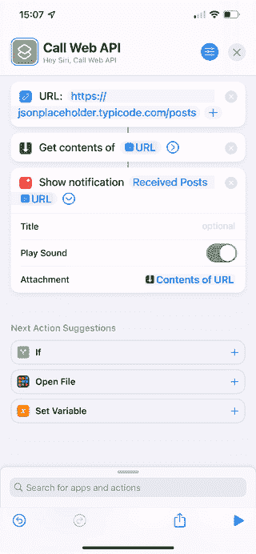
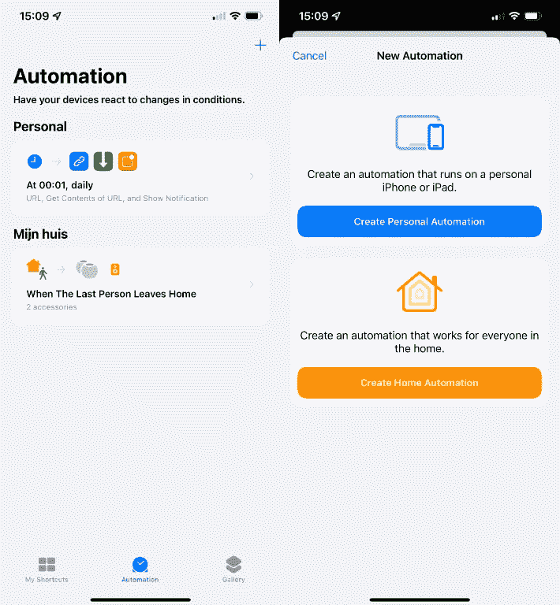
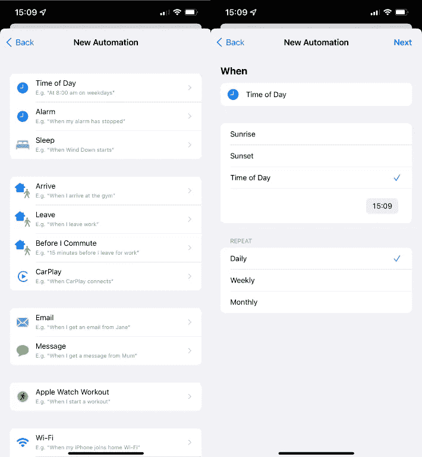
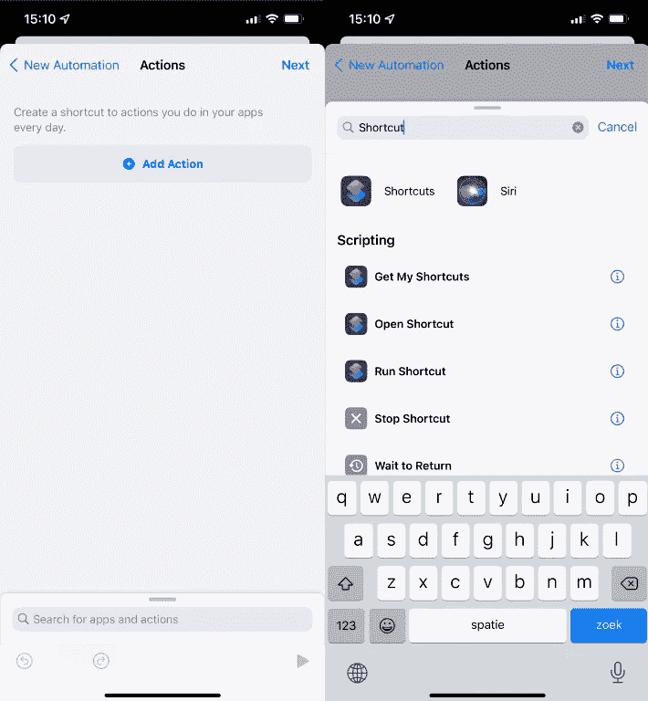
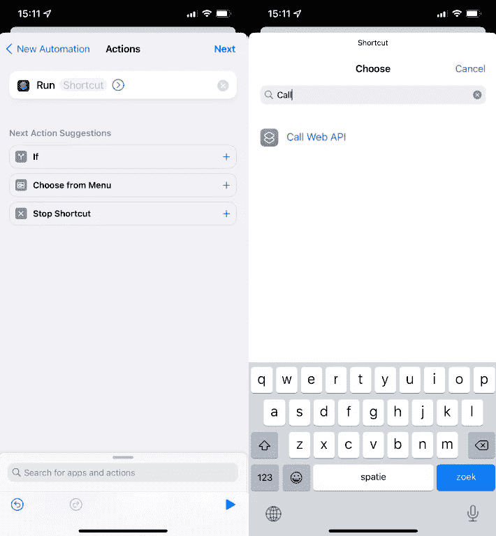
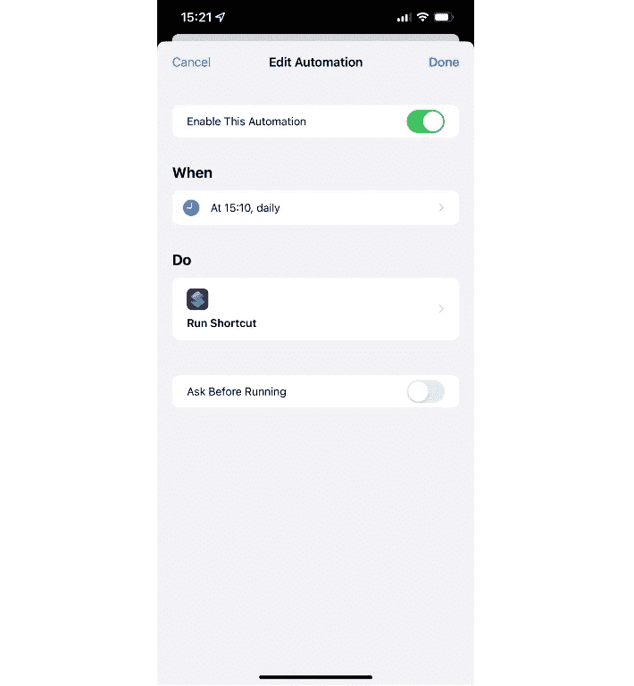

# 如何使用 iOS 快捷方式定期调用无服务器功能或 Web API

> 原文：<https://betterprogramming.pub/how-to-call-a-serverless-function-or-web-api-periodically-with-ios-shortcuts-24f3e696c105>

## 使用 iOS 中快捷方式的强大功能自动完成任务

迪米特里·卡拉斯泰列夫在 [Unsplash](https://unsplash.com?utm_source=medium&utm_medium=referral) 上的照片

每隔一段时间运行一次无服务器功能或 Web API 可以通过多种方式实现。但是今天，我想给你看一个免费的选项，如果你有 iPhone 或者 iPad 的话。就是快捷 app。

运行 iOS 13.1 及更高版本的所有 iPhone、iPad 或 iPod touch 都可以使用该快捷应用。如果你没有苹果设备，向下滚动到通过不同的服务进行相同操作的替代方法。

# 运行基于时间的操作

我不知道你是怎么想的，但是每当我在做一个副业项目时，我觉得有必要一天或一小时运行一次 API 或无服务器功能。

但我并不特别欣赏设置 cron 工作。因为我在 Netlify 上运行所有的应用程序，所以我没有任何地方可以这样做。

所以我想，我看到我可以通过 iOS 快捷方式应用程序调用一个 Web API。让我们实现自动化吧！

# 我的使用案例

我正在用 Angular、Angular Material、无服务器功能和[Upstash](https://upstash.com/)(Redis 的无服务器数据库)构建一个仪表盘。对于这个仪表板，我使用的数据来自“我们的数据世界”，这是开源的。

由于从他们的库加载大量数据需要很长时间，我想让我们通过 Upstash 将数据保存到 Redis，这样数据加载会更快。

更新信息需要大量时间，所以我的目标是为 Netlify 创建一个无服务器功能，每天用快捷方式应用程序调用它。

> PS:我现在已经运行了几天了，这真是太好了。

例如，checkout 可以在下面找到我的无服务器函数，以了解我是如何创建它的:

在这篇文章中，我不会深入探讨无服务器函数的创建，但是如果你想了解更多关于无服务器函数以及如何构建它们，请查看下面的链接。

*   [在 Netlify 上开始使用无服务器功能的 4 个步骤](/4-steps-to-get-started-with-serverless-functions-on-netlify-a6942bf071ca)
*   [如何建立一个无服务器的网上商店](https://medium.com/how-to-build-a-serverless-webshop/how-to-build-a-serverless-webshop-3dabd13b0ac7)

# 如何定期自动调用 Web API

## 1.设置快捷方式

首先，让我们打开快捷方式应用程序，点击+号创建一个新的快捷方式。

作者图片

点击“添加动作”并搜索“URL”，点击后添加想要调用的 API URL。

作者图片

我粘贴了一个 API 的 URL。要选择我们想要的请求类型，我们必须点击“获取 URL 的内容”(如果它在您的设备上不可见，您可以在底部的输入字段中搜索)。

您可以选择获取、发布、上传、修补和删除。如果你愿意，你可以在需要的时候发送一些头。

同时，尝试通过按底部的“播放”按钮来创建请求。

作者图片

在发出请求后，我们希望有一个通知告诉我们什么时候完成。点击底部输入字段搜索“显示通知”，找到后按下它。

你可以在这里输入任何你喜欢的东西。对于这个例子，我做了“收到的帖子 URL”。在这种情况下，URL 是我们在顶部设置的 URL。

让我们按下底部的“播放”按钮来测试我们的快捷方式:

## 自动化快捷方式

既然我们已经证明了我们的快捷方式是可行的，我们就可以自动运行它，每天、每周或者任何时候运行它。

打开“自动化”按钮，您可以在快捷方式应用程序的主屏幕底部找到它，然后单击“创建个人自动化”。

作者图片

单击“一天中的时间”,并选择您希望运行此自动化的时间。选择权在你！

作者图片

按顶部的“下一步”，然后单击“添加操作”。现在找到“运行快捷方式”动作并按下它。

作者图片

现在我们必须选择我们之前创建的“调用 Web API”快捷方式。按“快捷方式”，搜索您的快捷方式并按下它。

在我的情况下，这种自动化将在每天 15:10 执行，这太棒了！

作者图片

使用 Shortcuts 应用程序的最大好处是一切都可以在我的设备上本地运行。只需调用“嗨 Siri，调用 Web API”，快捷方式就可以了！

# Github 动作作为自动化 Web API 调用的替代

如果你没有苹果设备，你就不能使用快捷方式应用。我对提供相同功能的 Android 不够熟悉，但我认为 Github Actions 是自动化 Web API 或无服务器函数调用的一个很好的选择。

由于 Github Actions 提供的不仅仅是自动化的 Web API 调用，我强烈推荐阅读由[杰森·埃特科维奇](https://twitter.com/JasonEtco)撰写的教程“[按计划](https://jasonet.co/posts/scheduled-actions/)运行你的 Github Actions 工作流程”。

# 结论

除了使用 iOS 快捷方式或 Github 操作之外，可能还有许多其他方法来自动化 Web API 或无服务器函数调用。但最重要的是你用你觉得最容易用的。

对我来说，在我的设备上免费做这件事非常重要——这就是我使用快捷方式应用程序的原因。如果你有其他建议，请分享。我也喜欢把它们添加到帖子里

快乐的编码和自动化。

> 关于快捷方式应用程序的更多效率提示，请查看来自[马尼什·贾恩](https://medium.com/u/728e7aeac31a?source=post_page-----24f3e696c105--------------------------------)的“[iPhone 惊人的效率快捷方式](https://medium.com/macoclock/5-cool-tricks-your-iphones-shortcuts-app-can-do-fcdcd4fe153e)

# 阅读更多我的 JavaScript 和 TypeScript 故事

 [## 中等

### 编辑描述

blog.byrayray.dev](https://blog.byrayray.dev/list/latest-javascript-typescript-stories-0358ad941491)