# 如何从 Solidity 智能契约中调用任何 API，第 2 部分

> 原文：<https://betterprogramming.pub/how-to-call-any-api-from-a-solidity-smart-contract-part-2-6552b6e2e174>

## 制定和部署请求者契约，以从 Airnode 请求数据


照片由 [Unsplash](https://unsplash.com?utm_source=medium&utm_medium=referral) 上的 GuerrillaBuzz Crypto PR 拍摄

这是本教程的第二部分，我们将部署请求者契约并从 Airnode 请求数据。点击这里查看第一部。

在第一部分中，我们通过 ChainAPI 成功地集成和部署了一个 Airnode。现在，我们将编写一个简单的请求者契约来调用和读取 Airnode 中的数据。

开始之前，请确保您在系统上设置了 [Airnode Monorepo](https://github.com/api3dao/airnode) 。按照自述文件安装并构建所有依赖项和软件包，以便能够访问 Airnode CLI。

克隆 Airnode Monorepo。

```
$ git clone [https://github.com/api3dao/airnode.git](https://github.com/api3dao/airnode.git) .
```

要安装依赖项，

```
$ yarn run bootstrap
```

为了构建所有的包，

```
$ yarn run build
```

*air node 是第一方 oracle，它将链外 API 数据推送到您的链内合同。它向链上的* [*RRP 协议契约*](https://docs.api3.org/airnode/v0.8/concepts/)*(*[*airnoderrpv 0 . sol*](https://docs.api3.org/airnode/v0.8/concepts/#airnoderrpv0-sol)*)发出请求，将请求添加到事件日志中。然后，离线 Airnode 访问事件日志，获取 API 数据并对请求者执行回调。*

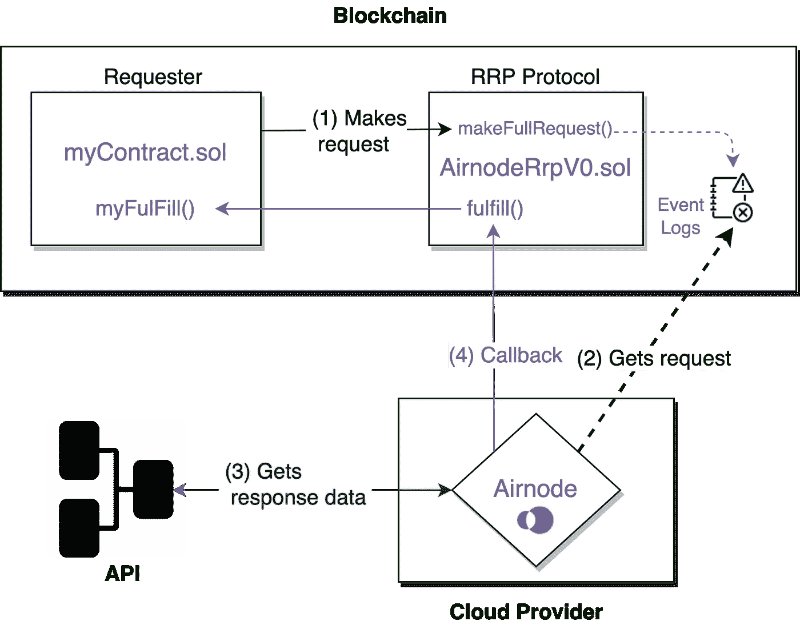

[https://docs.api3.org/airnode/v0.8/grp-developers/](https://docs.api3.org/airnode/v0.8/grp-developers/)

[*请求方*](https://docs.api3.org/airnode/v0.8/grp-developers/call-an-airnode.html) 是触发 Airnode 请求的契约。为此，请求者需要得到赞助，并使用匹配的赞助者钱包进行请求。

请求者然后调用协议契约，该协议契约发出一个带有请求参数的区块链事件。Airnode 监听由 *AirnodeRrpV0* 契约发出的事件。在下一个运行周期中，Airnode 从发出的事件中获取请求参数。

# 编码请求者. sol

请求者契约将有两个主要功能，`makeRequest()`和`fulfill()`。`makeRequest()`函数将调用 [AirnodeRrpV0.sol](https://docs.api3.org/airnode/v0.8/concepts/#airnoderrpv0-sol) 协议契约的`makeFullRequest()`函数，该函数将请求添加到其存储器中。目标离链 [Airnode](https://docs.api3.org/airnode/v0.8/concepts/airnode.html) 从 AirnodeRrpV0.sol 的存储中收集请求，并使用 AirnodeRrpV0.sol 的`fulFill()`函数进行响应

# 请求参数

`makeRequest()`函数期望下面的参数产生一个有效的请求。

*   `airnode`(地址)和`endpointId`指定端点。
*   `sponsor`和`sponsorWallet`(地址)指定将使用哪个钱包来完成请求。
*   `parameters`指定 API 和[保留参数](https://docs.api3.org/ois/v1.1/ois.html#_5-4-reservedparameters)(参见 [Airnode ABI 规范](https://docs.api3.org/airnode/v0.8/reference/specifications/airnode-abi-specifications.html)了解这些如何编码)我们将使用`@airnode-abi`库对参数进行离线编码。

# 响应参数

对*请求者*的回调包含两个参数:

*   `**requestId**`:发出请求时第一次获取，并在此处作为参考传递，以标识响应所针对的请求。
*   `**data**`:如果响应成功，这是已被编码的请求数据，除其他响应数据外，还包含一个[时间戳](https://docs.api3.org/ois/v1.1/reserved-parameters.html#timestamp-encoded-to-uint256-on-chain)。使用来自`abi`对象的函数`decode()`对其进行解码。

# 编制合同

为了部署请求者契约，我们将使用 [Remix IDE](https://remix.ethereum.org/) 。这是一个在线 IDE，允许为 EVM 兼容的区块链开发、部署和管理智能合同。

制作一个合同并粘贴到 [Requester.sol](https://github.com/vanshwassan/AirnodeTutorials/blob/master/Contracts/Requester.sol) 代码中。

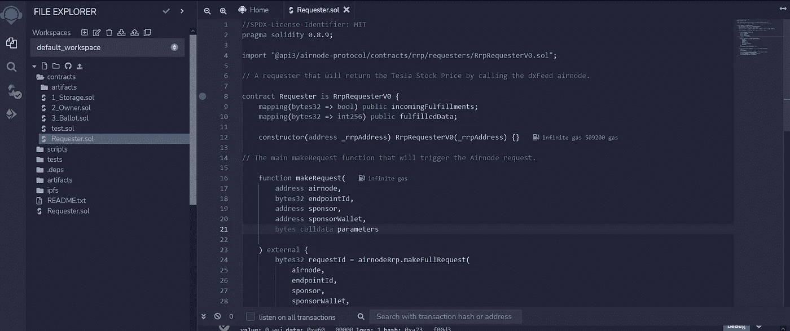

现在点击仪表板右侧的 compile，编译智能合约。

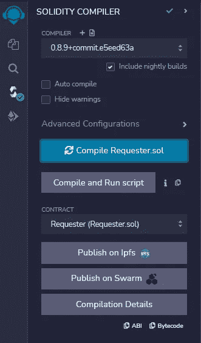

现在我们已经准备好部署我们的请求者了。

# 部署请求者

由于我们将在 Polygon Mumbai Testnet 上部署合同，请确保您的钱包中有足够的 MATIC 来部署请求者，然后稍后再为`sponsorWallet`提供资金。你可以从孟买的水龙头那里得到一些。

开始部署和运行事务，并选择 Environment 下的 Injected Provider-meta mask 选项。连接您的元掩码。确保你在孟买测试网上。

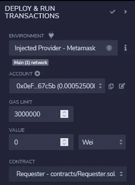

`_rrpAddress`是主*气节点。*RRP 合同已经在链上部署。您可以在这里查看您的具体链条[。](https://docs.api3.org/airnode/v0.8/reference/airnode-addresses.html#airnoderrpv0)

填写`_rrpAddress`并点击部署。确认元掩码上的事务，并等待它部署请求者契约。

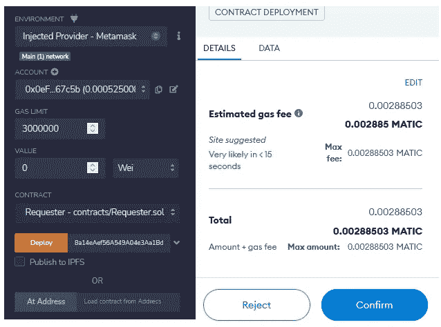

确保你在多边形孟买测试网上

# 呼叫请求者

当您的合同被部署后，转到“部署和运行事务”,并单击“已部署的合同”下您的请求者的下拉列表。

现在选择`makeRequest`下拉菜单，查看向 Airnode 发出完整请求所需传递的所有参数。

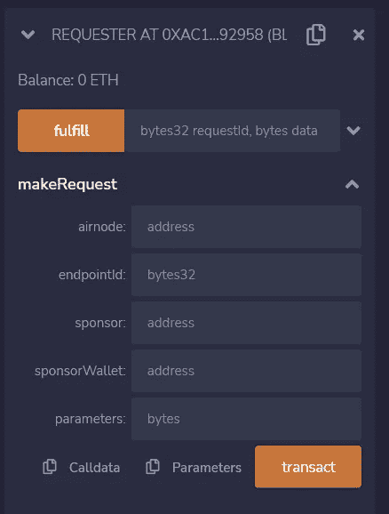

这里，您需要传入您的`airnode` (Airnode 地址)、`endpointID`、`sponsor`(请求者本身)、`sponsorWallet`和`parameters`，以便调用`makeRequest()`函数。

我们可以在部署 Airnode 时获得的输出目录下的`receipt.json`中找到`airnode`。

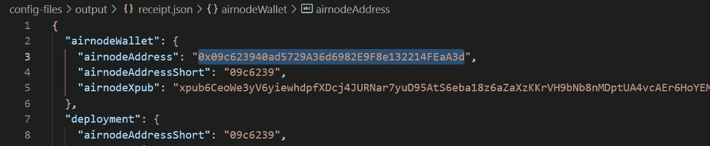

`endpointID`可以在`config.json`文件下找到。

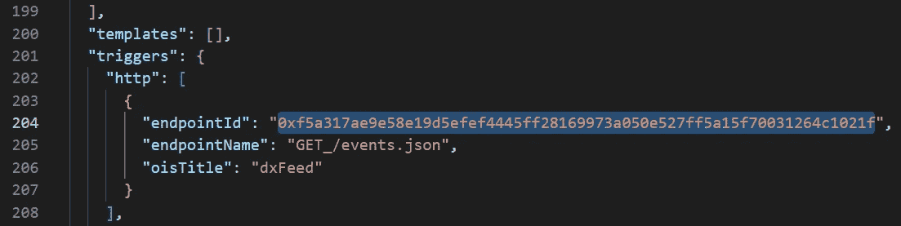

我们需要通过将进行实际调用的 Airnode CLI 命令派生出`sponsorWallet`。我们还需要一些现金来支付油费。

在设置了 Airnode CLI 并安装和构建了所有的依赖项和包之后，运行以下命令来派生您的`sponsorWallet`:

## Linux:

```
npx @api3/airnode-admin derive-sponsor-wallet-address \
  --airnode-xpub xpub6CUGRUo... \
  --airnode-address 0xe1...dF05s \
  --sponsor-address 0xF4...dDyu9
```

## 窗口:

```
npx @api3/airnode-admin derive-sponsor-wallet-address ^
  --airnode-xpub xpub6CUGRUo... ^
  --airnode-address 0xe1...dF05s ^
  --sponsor-address 0xF4...dDyu9
```

您的`airnode-address`和`airnode-xpub`(*air node 的*扩展公钥)可以在同一个`receipt.json.`中找到。`sponsor-address`将是请求者契约本身的地址(您刚刚部署的那个)。

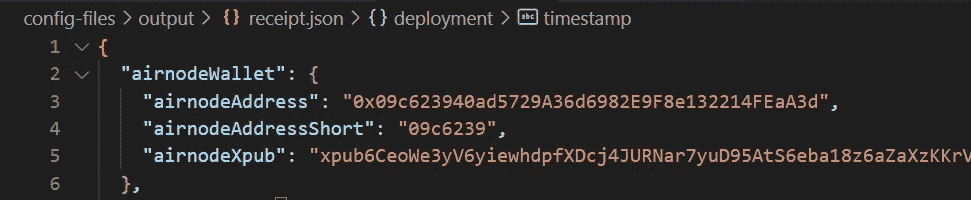

运行命令获得您的`sponsorWallet`。

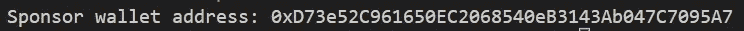

为`sponsorWallet`提供一些测试工具。

在发送之前，参数需要在`bytes32`中编码。我们将使用`@airnode-abi`库对参数进行离线编码，然后将其发送给请求者。

你可以通过克隆本教程的库来设置它。

运行以下命令来获得您的编码`parameters`:

```
node .\src\encodeParams.js
```

现在您已经拥有了运行`makeRequest`功能所需的所有参数。填写所有字段，然后单击 Transact。

*注意:这里的* `*sponsor*` *将是您刚刚部署的请求者契约的地址。*

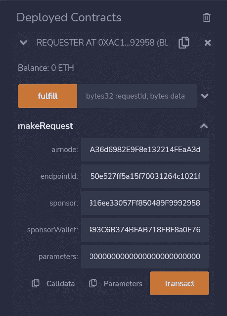

单击 transact，在 MetaMask 上确认事务，然后等待事务完成。

现在你可以前往 https://mumbai.polygonscan.com 查看你的新交易。

*您可能需要等待一段时间，因为 Airnode 调用 AirnodeRrpV0.sol 中的* `*fulfill()*` *函数，该函数将使用函数* `*fulfillFunctionId*` *回调* `*fulfillAddress*` *处的请求者契约，以交付* `*data*` *。*


在这里，我们可以看到最新的*完成*交易。

现在回到 Remix 上，在日志下检查最近的交易。

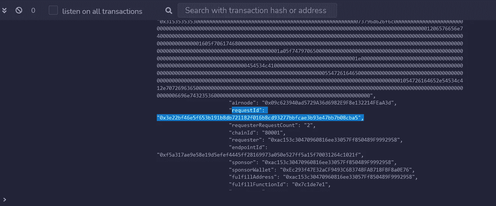

你也可以在多边形孟买区块浏览器的日志下找到你的`requestId`。

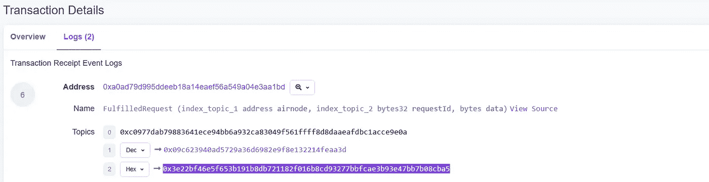

复制您的`requestId`并粘贴到`fulfilledData`方法下以解码响应。单击 call，您将看到 API 响应。在这里，我们请求特斯拉的股票价格。

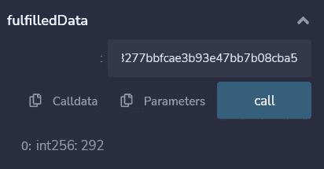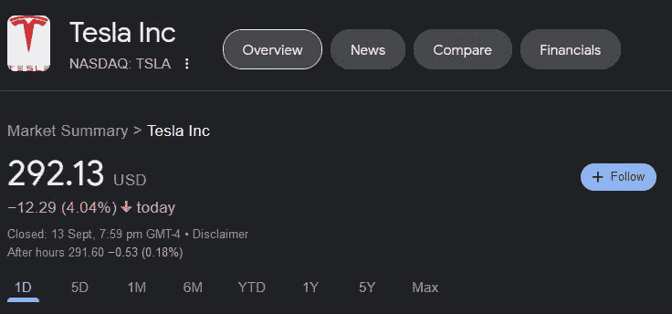

现在，您已经成功地部署了一个 Airnode，并与请求者签订了一个从其中读取数据的合同。你也可以参考[这个报告](https://github.com/vanshwassan/AirnodeTutorials)中我在本教程中使用的所有代码。

感谢阅读。

```
**Any questions?** Check out [**API3’s Discord Server**](https://discord.com/invite/qnRrcfnm5W) and drop your queries there!
```