# 如何从 Solidity 智能契约中调用任何 API，第一部分

> 原文：<https://betterprogramming.pub/how-to-call-any-api-from-a-solidity-smart-contract-part-i-d1d2f34461b6>

## 部署 Airnode 以获取智能合约中的链外数据


照片由 [DeepMind](https://unsplash.com/@deepmind?utm_source=medium&utm_medium=referral) 在 [Unsplash](https://unsplash.com?utm_source=medium&utm_medium=referral) 上拍摄

众所周知，智能合约不可能直接访问区块链之外的外部 API。对于许多 dApps 来说，在使用智能合约时与外链数据交互是一个真正的问题。

> 以太坊区块链被设计成完全确定性的，而互联网不是。直接调用 API 听起来很容易，但是在区块链上，这需要所有节点同时调用同一个端点，并期望获得相同的数据，以便达成共识。此外，区块链的核心概念是其安全性，这源自独立验证器的分散网络，这些验证器有目的地限制它们与外部世界的连接。

然而，使用 [API3](https://api3.org/) ，您可以拥有由 API 提供者直接操作的第一方 oracles，称为 [Airnodes](https://docs.api3.org/airnode) ，它向任何链上 dApp *提供数据。*因此，您可以轻松地让任何 REST API 访问智能合约。

# 向 ChainAPI 问好

[ChainAPI](https://bit.ly/Va-Part1-Polygon-ChainAPI) 是一个平台，使您能够使用其逐步集成和部署工具来集成和部署开源 Airnode。

要开始，请转到 [ChainAPI](https://bit.ly/Va-Part1-Polygon-ChainAPI) 并通过连接元掩码登录。

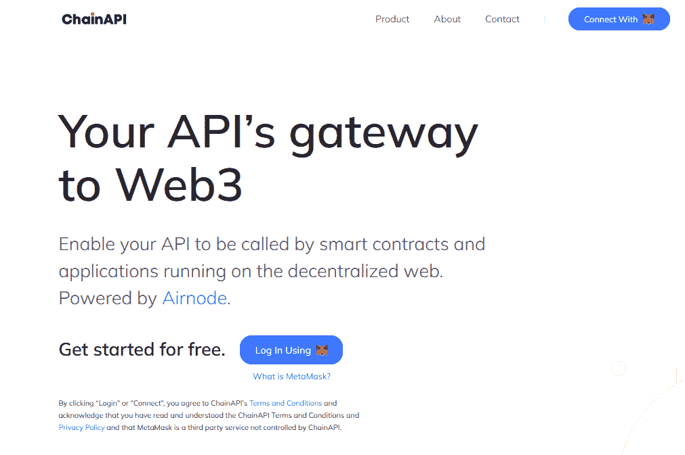

系统将提示您通过元掩码扩展确认并签署交易。

确保你使用的是一个新的元掩码钱包，带有新的助记符。您的助记符稍后将用于部署 Airnode。您需要非常安全地保存它，因为它将作为您部署的 Airnode 的“私钥”。

*每次返回 ChainAPI 时，您将使用元掩码再次连接，通过为同一帐户签署消息来识别您的身份。*

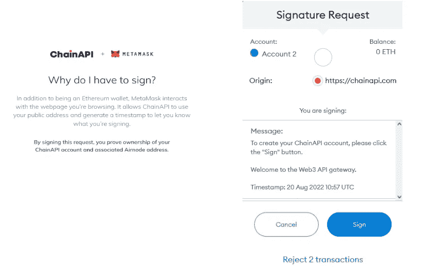

完成注册过程并命名您的工作空间。

*Workspaces 为您提供了邀请其他用户帮助或协作集成和部署的方式。这使得将您的 Airnodes 作为一个团队进行管理或外包过程变得容易，同时仍然保持对您的集成和部署的控制。*


*要在将来更改工作区的名称，请点击仪表板左上角的名称*

在 ChainAPI 中，您将能够通过导航到左侧导航面板上的“integrations”或“Deploy”仪表板来创建和管理您的集成或 Airnode 部署。

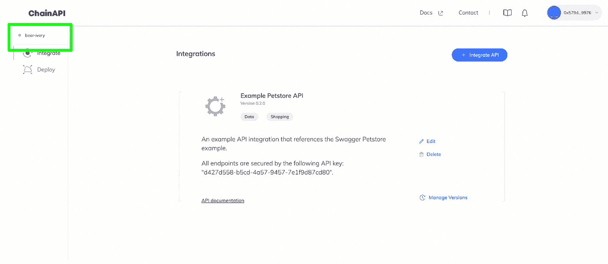

## 集成您的 Airnode

对于本教程，我将使用 [dxFeed 的公共 REST API](https://bit.ly/3TwKnQI) 端点来检索股票数据。

要开始，选择仪表板右上角的“集成 API”选项。

输入关于要集成的 API 的详细信息。

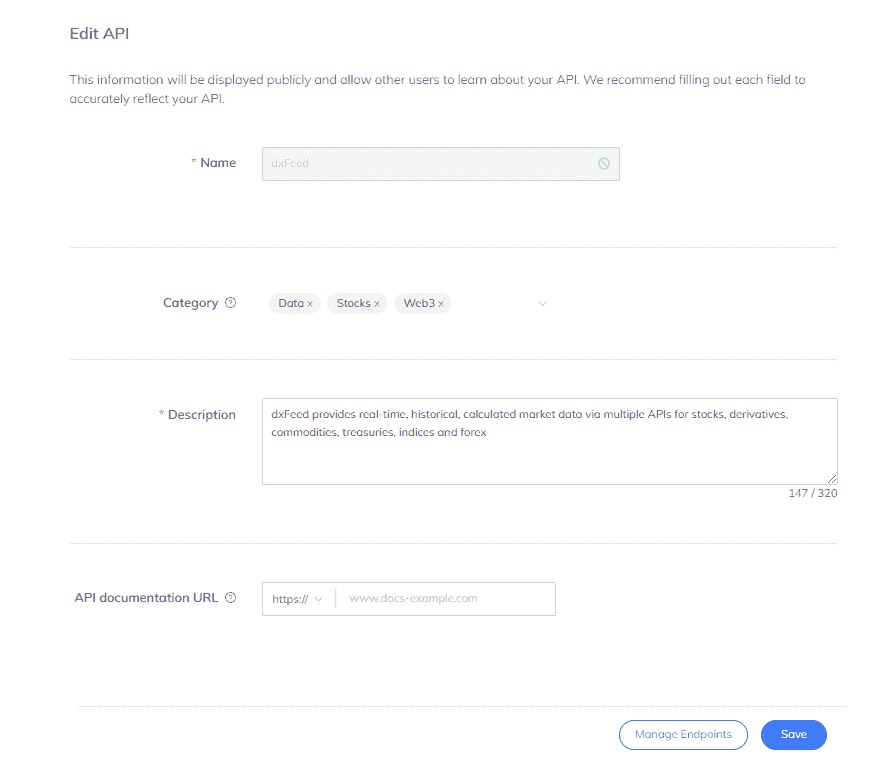

您需要输入 API 的基本 URL 以及您想要集成的所有端点。如果您的 API 需要任何安全模式(API Key，基本 HTTP Auth ),您也可以选择添加。

因为它是一个公共 API，所以它没有任何安全方案。

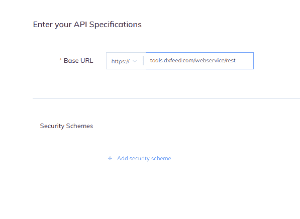

现在，您可以开始添加所有端点。

这里，dxFeed REST API 有一个带有一些查询参数的端点`/events.json`。您可以添加 API 需要的所有参数。

dxFeed 的 API 需要的参数有:

*   `events` —查询参数—计入市场事件。它将由用户定义。
*   `symbols` —查询参数—取股票代码。它将由用户定义。

关于 dxFeed 的 API 及其工作原理的更多信息，[点击这里](https://tools.dxfeed.com/webservice/rest-demo.jsp)测试他们的 API。

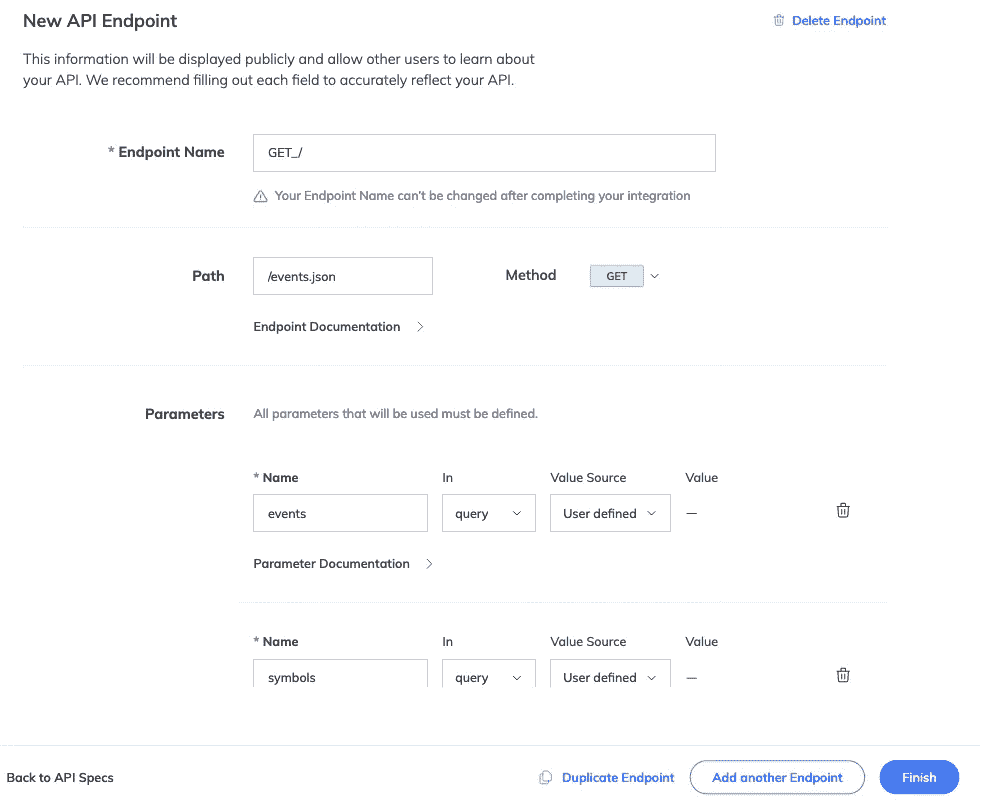

现在您需要添加所有参数并定义它们的位置(查询/头/路径/cookie)。您还可以决定是否要固定它们的值。

这里，dxFeed REST API 有一个带有一些查询参数的 GET 端点`/events.json`。您可以添加 API 需要的所有参数。

[保留参数](https://bit.ly/3Touiwp)定义响应的哪一部分在实现前被选择和编码。它可以由请求者定义，但我们也可以在 Airnode 配置中硬编码它。

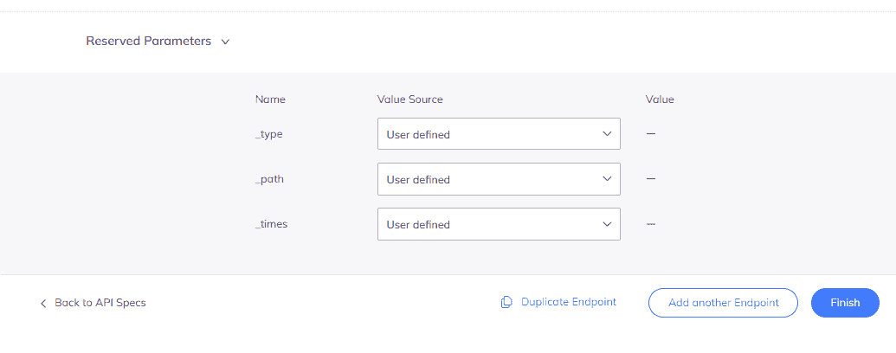

您还可以为 Airnode 添加[预处理和后处理片段](https://docs.api3.org/ois/v1.4/processing.html)。尽管我们不会在这个集成中使用这个特性。

*   [预处理](https://docs.api3.org/ois/v1.4/ois.html#_5-9-preprocessingspecifications)在向 Airnode 发出请求之前执行代码片段。
*   [后处理](https://docs.api3.org/ois/v1.4/ois.html#_5-10-postprocessingspecifications)片段在收到 Airnode 的响应后执行。

添加完所有必需的端点后，现在可以按 finish，准备部署 Airnode 了。

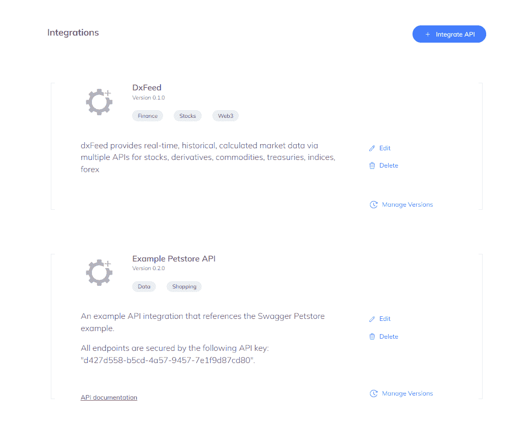

## 部署 Airnode

要部署 Airnode，请转到菜单上的 deploy 部分。命名您的部署，并选择您想要使用的集成。


选择您希望部署 Airnode 的云提供商。

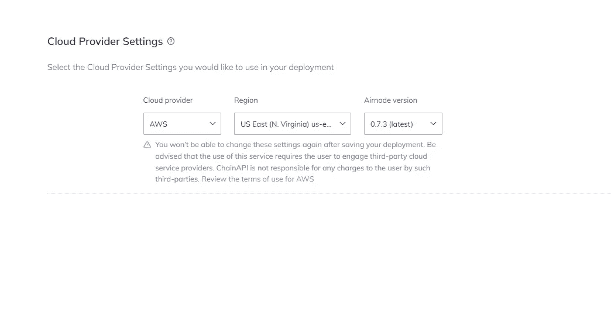

现在为您的部署选择链。如果您希望在多个链上使用，也可以选择多个网络和提供商。

在这里，我们将把我们的 Airnode 放在多边形孟买测试网上。

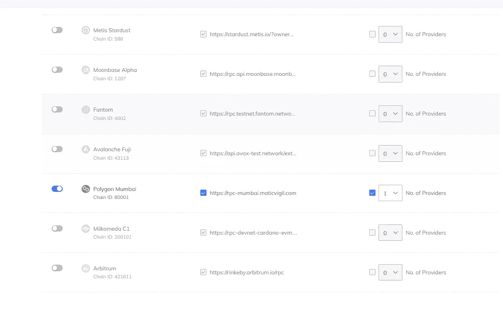

[授权者](https://docs.api3.org/airnode/v0.10/concepts/authorizers.html)契约允许您指定哪些智能契约可以向您的 Airnode 端点发出请求。对于本教程，我们将把它设置为 Public。

当 Airnode 收到请求时，它可以使用链上授权者契约来验证是否需要响应。这允许 Airnode 实现各种各样的策略，并授权请求者约定对其底层 API 的访问。

*   公共授权者将允许任何智能合约向您的 Airnode 发出请求。
*   受限授权者将只允许已被授权访问的智能合同地址向您的 Airnode 发出请求。

[点击此处了解更多关于授权的信息](https://docs.api3.org/airnode/v0.10/concepts/authorizations.html)。

最后一次检查您的配置。如果一切正常，单击下一步。

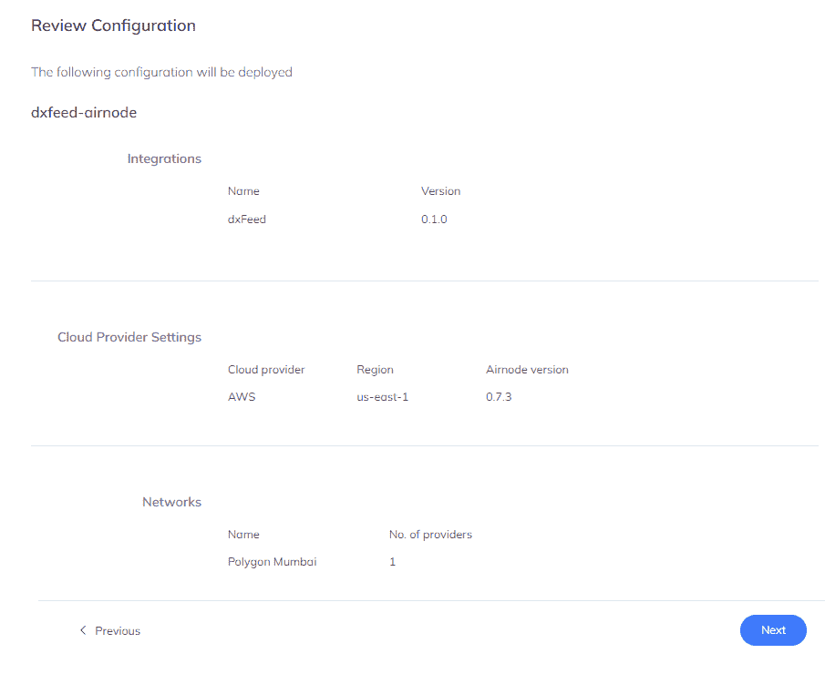

下载所有的 Airnode 配置文件并解压。

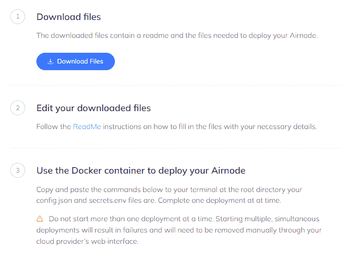

您的 Airnode 配置目录应该是这样的:

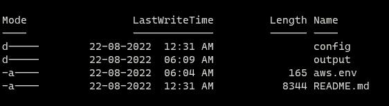

`config` 包含`config.json`和`secrets.env`。

*   在 Airnode 的部署/重新部署期间，使用`config.json`文件来配置其行为并提供 API 操作的映射。
*   `secrets.env`文件保存了 config.json 的值，这些值必须保密。

输出目录将会有在您成功部署 airnode 之后生成的`receipt.json`。

`aws.env`文件保存了针对 AWS 的部署的 AWS 凭证。

*由于我们使用 AWS 作为我们的云提供商，我们需要使用管理员访问策略添加我们的 AWS IAM 访问密钥。如果不确定如何获取，可以参考这个* [*视频*](https://www.youtube.com/watch?v=KngM5bfpttA) *。*

`README.md`包含了部署以 markdown 格式提供的 airnode 的所有步骤。

打开`aws.env`，添加你刚刚创建的`AWS_ACCESS_KEY_ID`和`AWS_SECRET_ACCESS_KEY`。

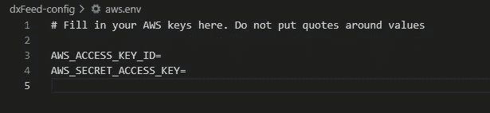

打开`config/secrets.env` ，添加钱包助记符。请确保它非常安全，因为这将作为您部署的 Airnode 的“私钥”。根据助记短语，Airnode 能够将钱包地址分配给 Airnode 实例及其用户。

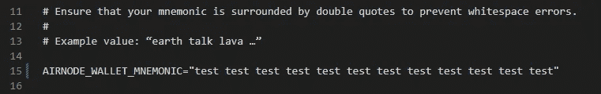

您还需要添加您的区块链提供商 URL。在这里，我们将使用 Alchemy 获得一个免费的多边形 Mumbai Testnet 提供者 URL。您可以使用任何支持您网络的区块链提供商。

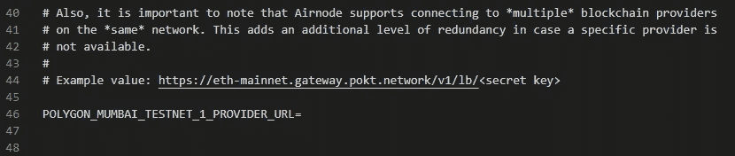

您也可以设置您的[*http gateway*](https://bit.ly/3Tvamrv)*凭证。这是一个可选的服务，允许经过身份验证的用户向您部署的 Airnode 实例发出 HTTP 请求以进行测试。ChainAPI 已经为您生成了这些密钥，但是您可以根据需要更改它们。*

*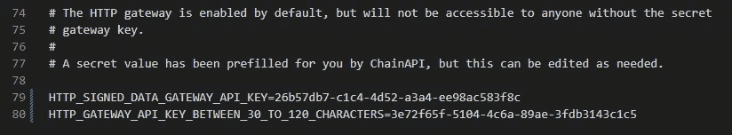*

*部署 Airnode 之前的最后一步是在 *config.json* 文件中设置[授权者](https://bit.ly/3D1knXC)。*

**当 Airnode 收到请求时，它可以使用链上授权者合同来验证是否需要响应。这允许 Airnode 实现各种各样的策略，并授权请求者约定对其底层 API 的访问。**

*对于本教程的范围，我们可以在 *config.json* 中将授权者数组设置为空，这样任何请求者契约都可以访问 Airnode。*

*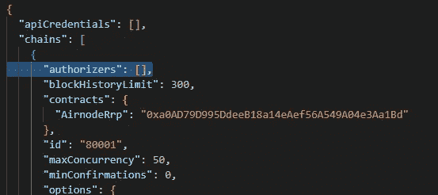*

*现在，您已经准备好部署 Airnode 了。确保你的系统上安装了 [Docker](https://www.docker.com/) 。*

*将下面的命令复制并粘贴到您的终端部署包的根目录下。*

*Windows 操作系统*

```
*docker run -it --rm ^
      --env-file aws.env ^
      -v "%cd%/config:/app/config" ^
      -v "%cd%/output:/app/output" ^
      api3/airnode-deployer:0.7.3 deploy*
```

*OSX*

```
*docker run -it --rm \
      --env-file aws.env \
      -e USER_ID=$(id -u) -e GROUP_ID=$(id -g) \
      -v "$(pwd)/config:/app/config" \
      -v "$(pwd)/output:/app/output" \
      api3/airnode-deployer:0.7.3 deploy*
```

*Linux 操作系统*

```
*docker run -it --rm \
      --env-file aws.env \
      -e USER_ID=$(id -u) -e GROUP_ID=$(id -g) \
      -v "$(pwd)/config:/app/config" \
      -v "$(pwd)/output:/app/output" \
      api3/airnode-deployer:0.7.3 deploy*
```

*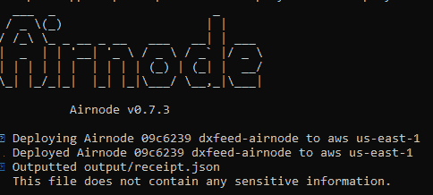*

*您的 Airnode 现在应该已经部署好了。您可以在部署部分检查其状态。*

*点击查看本指南[的 GitHub Repo。](https://github.com/vanshwassan/AirnodeTutorials/)*

*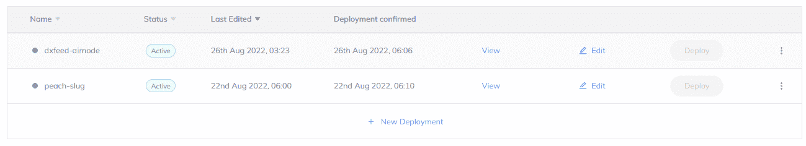*

*在第 2 部分中，我们将向您展示如何编写请求者契约来调用和读取来自 Airnode 的数据。*