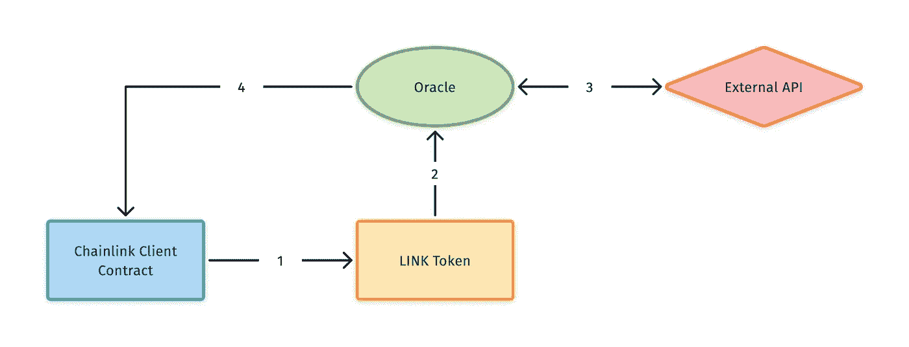
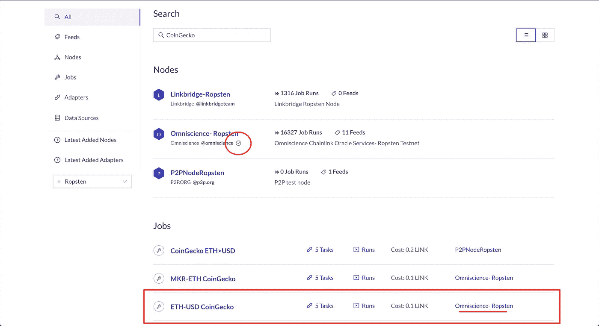
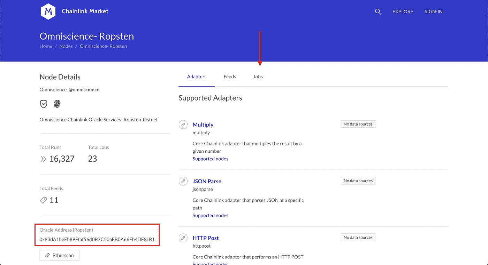
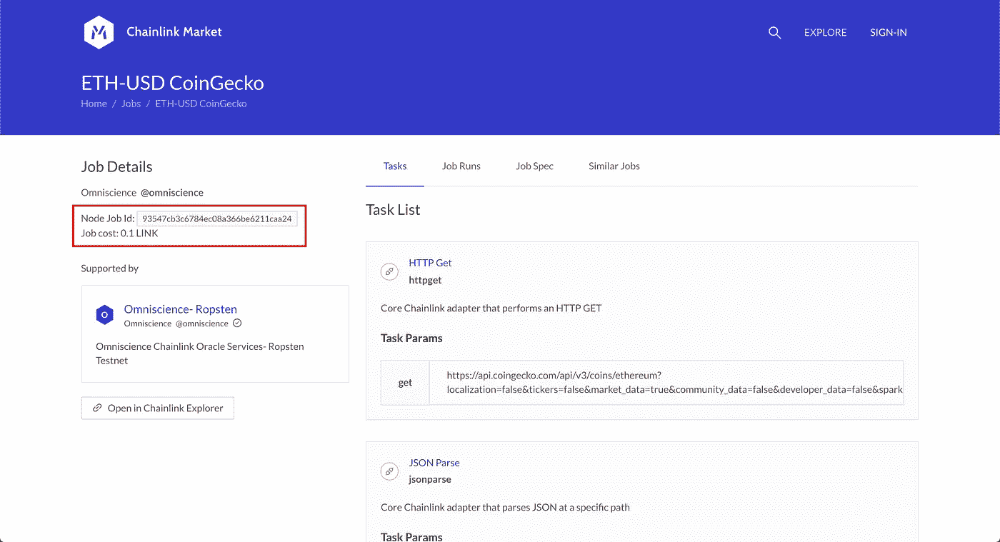
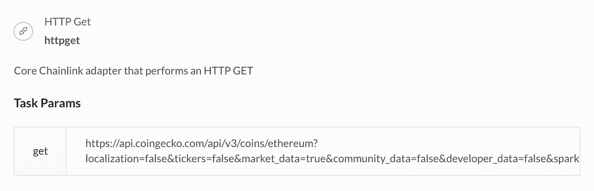
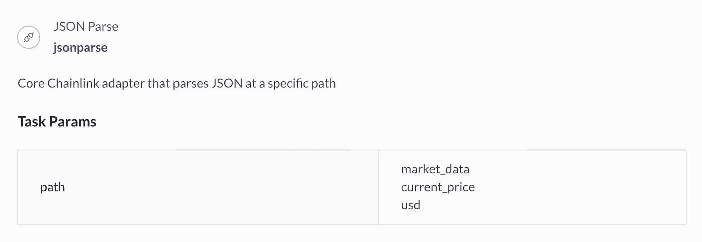
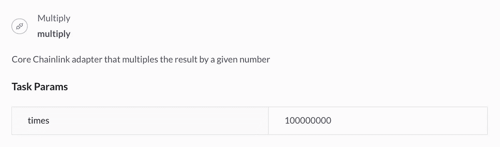
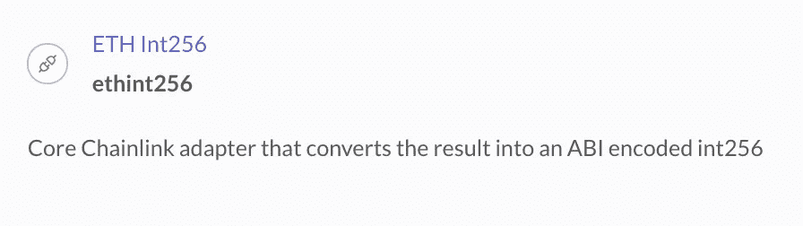
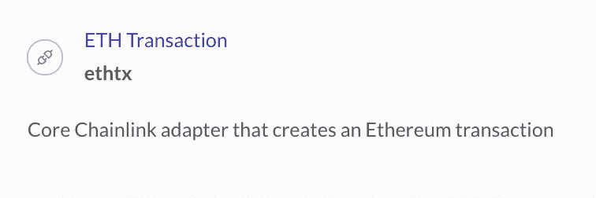
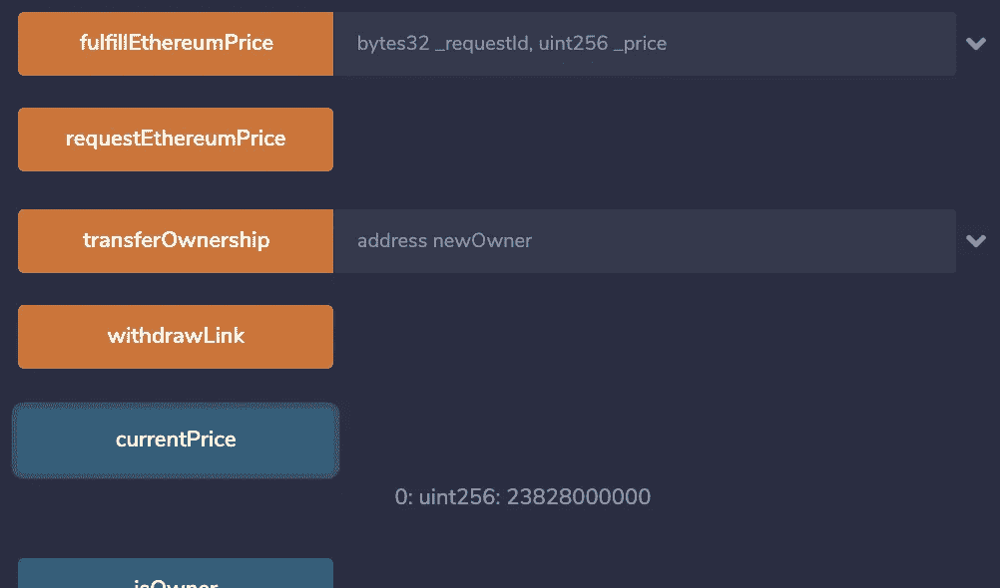

# 如何从以太坊智能合约调用 API

> 原文：<https://betterprogramming.pub/how-to-call-apis-from-ethereum-smart-contracts-e2f1500198c7>

## 在您的智能合同中查找并使用 oracles 检索链外数据


图片由[皮克斯拜](https://pixabay.com/?utm_source=link-attribution&utm_medium=referral&utm_campaign=image&utm_content=3537401)的 Gerd Altmann 提供

由于区块链生态系统的性质，从链上智能合约访问链外数据本身是不可能的。然而，Chainlink 为区块链 oracles 提供了一个平台，oracles 是网络上的节点，充当链上和链下数据之间的桥梁。Oracles 使智能合约能够从外部世界检索数据。

根据支持的适配器，每个 oracle 节点都可以配置为执行各种任务。其中一些适配器包括 HTTP GET、HTTP POST、JSON Parse、Multiply 等等。

# 如何使用 Chainlink Oracles

*注意:在这个例子中，我们使用的是 Ropsten testnet。*

让我们假设我们想要创建一个智能合约，它根据流行的价格分析网站 [CoinGecko](https://www.coingecko.com/en) 报告的以太坊的美元价格进行操作。我们知道，我们的智能契约无法调用外部 HTTP API，但是 oracle 节点可以。

使用请求-响应循环，我们的智能契约可以从 oracle 节点请求数据，配置为执行 HTTP GET 请求，并实现回调函数，以便 oracle 使用响应来完成。



图 1:请求和接收数据流

我们不能使用任何 oracle，因为每个 Oracle 都被配置为根据其支持来执行特定的任务。为了找到一个高质量的甲骨文来满足我们的需求，我们必须使用[列表服务](https://docs.chain.link/docs/listing-services)如 [Chainlink Market](http://market.link) 来搜索。

## 连锁市场

列表服务使我们能够找到能够满足我们要求的神谕。流行的 API 通常预先配置了对特定端点的请求的 oracle 实现，这使得我们的开发更加简单。我们可以通过访问 Chainlink Market 主页并在搜索栏中键入“CoinGecko”来确定 oracle 是否已经实现了我们想要的 CoinGecko 端点。



图 2: Chainlink 市场搜索“CoinGecko”

正如我们在图 2 中看到的，我们有一些结果！

“节点”部分列出了返回搜索字符串结果的 oracle 节点。这可能意味着它们支持从 CoinGecko API 中检索数据的作业。在三个可用的节点中，Omniscience-Ropsten 通过了验证(圈出)，表明它是可信的。它还拥有最高数量的作业运行。

向下滚动我们可以看到就业标题下的 ETH-USD CoinGecko。这看起来很完美，因为它似乎准确地描述了我们想要检索的内容，并且使用了经过验证的节点。点击该链接将为我们提供关于该工作的更多信息。



图 3:节点详细信息页面

图 3 显示了节点细节页面，它为我们提供了关于 Oracle 节点的更多信息。左侧(红色矩形内)是 oracle 的链上地址。如果我们要使用这个神谕，我们需要记下这个地址。

屏幕右侧有三个选项卡:适配器、源和作业。点击工作和滚动，直到你找到 ETH-USD CoinGecko。单击该链接显示职务信息页面。



图 4:工作信息页面

图 4 向我们展示了 job information 页面，在这里我们可以看到它在被请求时做什么的细节。突出显示的是作业 ID 和运行该作业的成本(也记下这些内容)。

页面的右侧是任务列表。这是作业被调用时执行的操作列表。每个任务都使用一个受支持的适配器，一个接一个地创建任务链。让我们浏览一下列表中的每个任务，看看作业是如何获得我们想要的数据的:

**1。HTTP GET 请求**



任务 1

第一个任务是使用 HTTP GET 调用 CoinGecko API。我们可以从 params 中的 URL 确认它发出了正确的 CoinGecko 请求。这将返回一个 JSON 响应体。

**2。JSON 解析**



任务 2

由于任务 1 返回 JSON，下一个任务需要解析它来访问目标数据。任务 2 使用 JSON 解析适配器通过提供的路径遍历返回的 JSON 对象。例如，task 2 路径中的目标数据将位于以下 JSON 结构中:

```
{
  "market_data":
    {
      "current_price":
        {
          "usd": "PRICE_HERE"
        }
    }
}
```

**3。乘法**



任务 3

我们已经从 JSON 中检索了价格，但是还没有完全准备好。由于 Solidity 不能处理小数，task 3 将价格乘以 100，000，000，以确保它可以表示为整数。

**4。ETH Int256**



任务 4

任务 4 然后将结果转换成编码的 int256。

**5。ETH 交易**



任务 5

最后，task 5 创建一个以太坊事务，将结果发送回原始契约。

# 写合同

现在，我们已经选择了一个我们知道可以满足我们请求的 oracle，让我们来编写发出请求的合同。Chainlink 提供了一个名为`ChainlinkClient`的父契约，我们将对其进行扩展以促进请求-响应循环。

图 5:示例 OracleClient.sol

图 5 显示了我们的`ExampleOracleClient`合同。它具有从 CoinGecko 请求以太坊的最新美元价格的功能，使用我们通过 Chainlink Market 找到的 oracle。让我们一行一行地走一遍:

*   **第 7 行:**图 3 中节点细节页面上的 Oracle 地址
*   **第 8 行和第 9 行:**图 4 中的作业 ID 和价格
*   **第 11 行:** `currentPrice`是完成请求的 oracle 将填充的字段。
*   **第 19 行:** `setPublicChainlinkToken()`是`ChainlinkClient`母合同中提供的功能，用于设置当前网络上链接令牌的地址。
*   **第 22–25 行:** `requestEthereumPrice()`使用 oracle 地址、任务 ID、价格和回调函数构建 Chainlink 请求。然后它使用`sendChainlinkRequestTo()`请求数据，这是父`ChainlinkClient`契约提供的另一个函数。
*   **第 27 行:**Oracle 用来完成请求的回调函数
*   **第 32 行:**使所有者能够从合同中提取链接令牌的功能
*   第 37 行:一个用于构建请求的实用函数

尝试将此契约粘贴到 [Remix IDE](http://remix.ethereum.org/) 中，并部署到 Ropsten testnet。一旦部署，发送一些 Ropsten 链接到它的地址(你可以在这里找到 [Ropsten 链接龙头](https://ropsten.chain.link/))。然后，当交易成功时，在可用功能列表中单击`requestEthereumPrice`。几秒/几分钟后，点击`currentPrice`按钮，您应该会看到一个价格！



图 6:当前价格响应

# **结论**

Chainlink oracles 是实现外部世界和区块链之间互操作性的强大工具。像 Chainlink Market 这样的列表服务是一种有用的目录服务，可以找到最适合您的智能合约需求的 oracles。

在我们的示例中，我们发现一个 oracle 作业已经配置为从我们的目标端点请求数据。如果这样的工作不存在，或者你找不到，那也是可以的。Oracles 还支持接受 GET 请求 URL 作为参数来获取数据的作业。这意味着您可以使用 Chainlink oracles 从任何外部 API 检索数据。

# 进一步阅读

如果你对区块链开发感兴趣，我会写一些关于入门和建立投资组合的教程、演练、提示和技巧。查看以下资源:

[](https://medium.com/blockcentric/blockchain-development-resources-b44b752f3248) [## Medium 上最好的区块链开发资源

### 学习区块链、以太坊和 DApp 开发的资源列表

medium.com](https://medium.com/blockcentric/blockchain-development-resources-b44b752f3248)