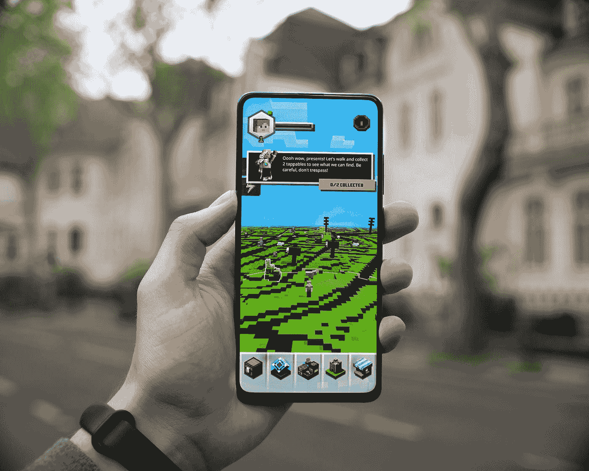

# 如何在 Android 中捕捉应用内截图

> 原文：<https://betterprogramming.pub/how-to-capture-in-app-screenshots-in-android-567548eb78a2>

## 看一看`getDrawingCache and` PixelCopy API 实现

照片由[米卡·鲍梅斯特](https://unsplash.com/@mbaumi?utm_source=medium&utm_medium=referral)在 [Unsplash](https://unsplash.com?utm_source=medium&utm_medium=referral) 上拍摄

在本文中，我们将学习一种广泛使用的截图方法，并解决其实时性问题。然后探索一个简单的解决方案，使用 canvas 进行基于视图的屏幕截图。

# 介绍

说到移动应用，截图的一个常见用法是提供更好的客户支持。我们通常更需要截图来更好地理解用户遇到的问题的背景。

除了更好的服务之外，截图还被用于许多事情，比如当涉及到教育技术应用程序时，可以在屏幕上分享你的问题，或者从电子商务应用程序向你的家人发送入围购物项目的列表。

我最近开始寻找一个完美的解决方案来拍摄应用程序内截图。我遇到了很多解决方案，但大多数都不能在不同 Android 版本或定制操作系统的设备上运行。但我最终找到了一个解决方案，它不涉及不赞成使用的方法，并且可以完美地与 Android Canvas API 一起工作。

没有任何延迟，让我们开始吧:

# 传统 getDrawingCache

`getDrawingCache`是视图类中的一个函数，其返回类型是表示视图的非缩放位图，如果缓存被禁用，则返回 null*。*看一下代码:

通过`getDrawingCache`截图

基本上，它是视图类的一个扩展函数。首先，我们通过 date 创建了一个具有唯一名称的文件，然后通过`getDrawingCache`获得视图的位图。一旦我们有了位图和文件，我们使用我创建的`saveFile`扩展函数来保存文件。看看`saveFile`功能:

将位图保存到文件系统中

这种方法非常有效，但是有两个缺点:

1.  在 Android 8 及以上设备上就不行了
2.  如果在视图上禁用缓存，则返回类型将为 null，实时用例可以在 webview 上禁用缓存。

# 新的 PixelCopy API

我看到大多数人建议使用的一个解决方案是 PixelCopy API。它很容易使用，而且大多数时候都有效。看一下代码:

通过 PixelCopy API 的视图截图

首先，我们用视图的尺寸创建一个空位图，然后在屏幕上定位视图，并开始将像素复制到位图中。这里我们想传递一个 Kotlin 函数，它将 bitmap 作为输入参数。这个函数用于将位图保存到一个文件中。看一看:

PixelCopy API 做得相当不错，但我看到在很多情况下它并不起作用。因此，我还需要另一个标准解决方案，这就引出了下面这个问题。

# 强大的旧帆布抢救

当我遇到一个基于 canvas 的解决方案时，我很满意。Canvas 类保存“绘制”调用。要绘制一些东西，您需要四个基本组件:一个保存像素的位图、一个托管绘制调用(写入位图)的画布、一个绘图原语(例如，Rect、Path、text、bitmap)和一个 paint(描述绘图的颜色和样式)。

首先，我们需要根据视图的尺寸创建一个位图。这里的逻辑相当简单，我们使用视图上的 canvas 和 draw 函数来创建位图。看一下代码:

拍摄 view va 画布的屏幕截图

就我而言，这就像一个没有任何操作系统或基于视图的限制的魔咒。如果您发现任何问题，请在评论中添加它们，以便我们可以一起改进解决方案。

# 奖金

我最近看到了 Satya Pavan Kantamani 发表的这篇关于 Jetpack 视图绑定的优秀文章。强烈建议:

 [## 在 Android 中用 Jetpack 视图绑定替换已弃用的 Kotlin 合成

### 如果科特林合成材料正在消失，是时候转向替代品了吗？

better 编程. pub](/android-jetpack-view-binding-c0947f7a6e9e)