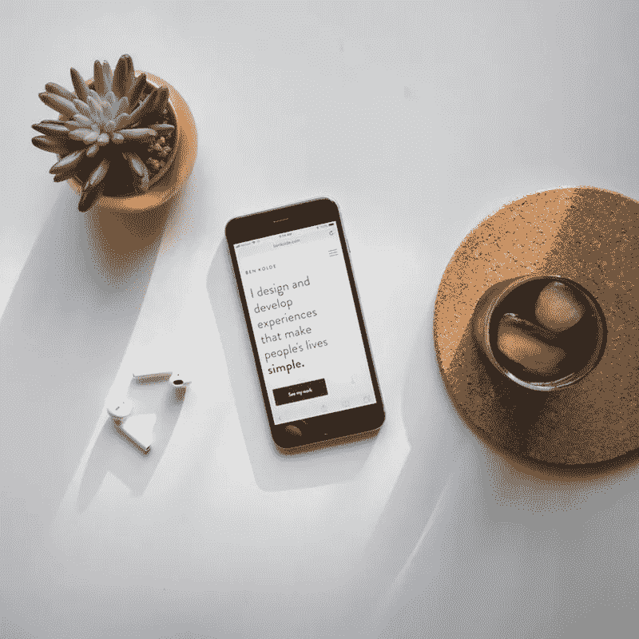

# 将 CSS 样式居中—操作方法

> 原文：<https://betterprogramming.pub/how-to-center-things-with-style-in-css-dc87b7542689>

## 学会将 CSS 居中。我们都发现自己对在 CSS 中居中感到沮丧，这是正确的做法

实话实说吧。在我们的编码生涯中，我们都发现自己对 CSS 中的居中内容感到沮丧，并发现自己在 Google 或 Stack Overflow 上寻找如何将 div 中的 div 居中。

这应该是最简单的任务之一，但是当您向页面添加更多的元素和样式时，可能会变得混乱。

因为这是一个常见的问题，所以我整理了一个 CSS 居中方式的列表。我还包含了我在 CodePen 中创建的每个例子的嵌入/链接。随意叉，分享，或复制你想要的！

*查看我的* [*CodePens 这里*](https://codepen.io/stephen_sun/) *。*

**事不宜迟，我们开始吧！**

使用文本对齐、自动边距和绝对定位方法居中

# 文本对齐方法

“text-align: center”方法可能是最常见的居中方法。它主要用于在 HTML 页面上居中文本，但也可以用于居中 div。

**这里的窍门是:**

1.  用父元素(通常称为包装器或容器)将想要居中的 div 括起来
2.  将`text-align: center`设置为父元素
3.  然后将内部 div 设置为`display: inline-block`

在我的蓝色正方形示例中，我用另一个名为`blue-square-container`的 div 将它括起来。为了使蓝色方块居中，我必须创建一个父元素，并将蓝色方块的 display 属性设置为 inline-block。

这是因为，默认情况下，div 的 display 属性设置为 block，这意味着它将跨越页面的整个宽度。通过将我的蓝色方块的 display 属性设置为 inline-block，我们可以确保蓝色方块只跨越我设置的宽度，即 100 像素。

**在父元素中添加多个子元素(本例中为蓝色方块)，会使所有子元素居中。**

# 自动边距方法

另一种常见的居中方式是使用自动边距方法。使用这种方法，我们不需要一个父元素。

我们可以简单地将`margin: 0 auto`应用到我们的黄色框中，只要我们有一个定义的宽度。

`margin: 0 auto`是将上下页边距设置为零，左右页边距设置为自动的简写。

这很重要，因为如果没有我定义的 100 像素的宽度，浏览器将无法呈现使黄色框居中所需的左右边距。通过设置宽度，浏览器将自动在黄色框的两边分配适当的边距。

“0”部分可以设置为上下页边距的任意像素数。

另一个很酷的技巧是将 margin-left 设置为 auto，或者 margin-right 设置为 auto，这允许我们将 div 分别推到页面的右侧或左侧——试试看！

# 绝对定位方法

绝对定位一个元素允许我们把元素放在页面上我们想要的任何地方……但是有一个缺点。

**绝对定位将元素从页面流中移除。**

为什么这很重要？

这很重要，因为如果使用不当，会导致元素重叠。

如果我们想简单地将一个元素在页面上水平居中，就像我们在前两种方法中所做的那样，我们需要记住三个步骤:

1.  将元素的位置属性设置为绝对
2.  对元素应用“左:50%”
3.  设置元素宽度一半的左边距

在这个例子中，我们使用一个绿色的正方形(多么美丽的绿色！)和其他例子的大小一样，所以我们的宽度还是 100px。

正如你所看到的，我已经给了“位置:绝对”和应用“左:50%”到我们的绿色方块。这告诉浏览器将左边向右移动 50%。

但是如果你要重新创建这个例子，我们不希望左边在中间，我们希望正方形的中间与页面的中间对齐。

这使我们进入了最后一步。为了对齐事物并抵消额外的空间，我们应用绿色正方形宽度一半的左边距。在我们的例子中，它是 50px(不管元素的宽度如何，它总是一半)。

使用变换/平移居中

# 转换/翻译方法

到目前为止，我们只处理了水平居中的事情，但是如果我们想把一些东西放在页面的正中间呢？

让我们将红色方块水平和垂直居中。

虽然这种方法也使用绝对定位和“left: 50%”，但我还对元素应用了另外两个属性。

通过将 top 属性也设置为 50%,我告诉浏览器将红色方块的上边缘与页面的中间垂直对齐。但是和前面的例子一样，我们不希望边缘和中心对齐，我们希望正方形的中心正好在页面中心的上方。

**这是我们应用一个叫做变换的新属性的地方。**

你可以用 transform 做很多很酷的事情，比如平移、旋转和缩放动画，但是对于这个例子，我们将使用 **translate。**

我们给变换属性“transform: translate(-50%，-50%)”,然后*瞧——*我们的红色方块水平和垂直居中！

我喜欢这种方法，因为不管元素的宽度或高度是多少，它总是在页面的中央。

**这种方法常用于响应式设计，不需要像绝对定位法那样定义余量。**

# 柔性盒方法

使用 Flexbox 对中

如果你不熟悉 Flexbox，没关系！Flexbox 是一个布局模块，它提供了一种在页面上对齐和放置元素的更有效的方式。

如果你**对学习 Flexbox 感兴趣(强烈推荐)**、[、 **Flexbox Froggy** 、](https://flexboxfroggy.com/)是一种很棒很有趣的学习方式(当然不是附属的——这只是我以前学习 Flexbox 的方式！)

使用 Flexbox 进行水平和垂直居中的四个步骤是:

1.  HTML、主体和父容器需要有 100%的高度
2.  将显示设置为在父容器上伸缩
3.  将 align-items 设置为在父容器上居中
4.  将 justify-content 设置为在父容器上居中

在父级上将 display 设置为 flex 会将其定义为 flex 容器。

通过将 align-items 设置为 center，我们说子项或 flex 项将在父项中垂直居中。

Justify-content 以同样的方式工作，但是在我们的例子中是在水平方向上。

我也喜欢使用这种方法，因为，同样，它既**响应**又**不需要任何余量计算**。

我希望这篇文章对你有所帮助。我很想听听你的反馈！

**感谢阅读！:)**