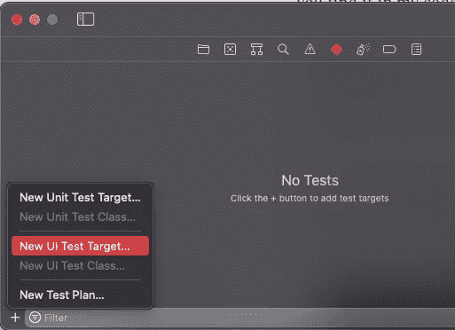

# 如何在 UI 测试期间更改控制中心中的任何 iOS 设置

> 原文：<https://betterprogramming.pub/how-to-change-any-setting-in-control-centre-during-a-ui-test-ea6377a31fd6>

## 无需离开应用程序即可自动点击超过 15 个按钮


照片由 [charlesdeluvio](https://unsplash.com/@charlesdeluvio?utm_source=medium&utm_medium=referral) 在 [Unsplash](https://unsplash.com?utm_source=medium&utm_medium=referral) 上拍摄

控制中心允许你在不离开应用程序的情况下更改许多系统设置，这在自动化 UI 测试中非常有用。

这包括更改设备的互联网连接，无论是通过禁用 WiFi 还是蜂窝数据。这使得我可以看到我的应用程序如何实时响应连接故障，让我可以确保用户得到通知，并且 API 请求不会白白发送。

我称它为“控制中心”，而不是“控制中心”，因为我来自英国。

如果你喜欢用美国的方式做事，请随意替换我代码中的英国拼写。

我将从向我的应用程序添加一个 UI 测试目标开始。为此，我在 Xcode 的左侧面板中选择 Test navigator，并选择 New UI Test Target。



作者图片

我的应用程序被恰当地命名为`MyApp`，所以我的测试目标的默认名称是`MyAppUITests`。

您的应用程序或 UI 测试目标被称为什么并不重要，因为它不会以任何方式影响功能。

新创建的测试类将带有一些样板代码，但是您可以删除所提供的内容。我将从我认为的 UI 测试的最低要求开始:一个存储视图层次结构最高级别的`app`属性，我可以在设置过程中调用这个属性的`launch()`。

得知`continueAfterFailure`的默认值为 true，我觉得很有意思，但是苹果的模板 UI 测试类总是手动将其设置为 false，这就提出了为什么一开始就默认为 true 的问题。

除了创建一个不做任何事情的非常基本的 UI 测试类，我还扩展了`XCUIApplication`来给自己一些有用的功能。

首先，有一个简单的方法来访问跳板，iOS 系统应用程序负责主屏幕和其他事情。

纪录片《跳板》讲述的是 Visorphone Handspring，这是一款早期智能手机，对行业产生了巨大影响。我不知道它的命名是否是为了承认苹果公司受到 Handspring 的启发，但它肯定符合他们将自己受到启发的想法的名称融入其中的趋势。Sherlocking 这个词来源于苹果抄袭了现有的沃森软件，称他们的版本为夏洛克。

控制中心是跳板应用程序的一部分，所以如果我想找到任何按钮，我需要访问它。

被称为`app,`的`XCUIApplication`的实例引用了当前正在测试的应用程序。它不能查询另一个应用程序的层次结构。

在那下面我有`controlCentre(open: Bool)`、`tapControlCentreButton(label: String)`和`toggleControlCentreSwitch(identifier: String)`。

为什么开关用标识符，按钮用标签？

我发现标签的变化是为了指定状态。比如 WiFi，没有连接。标识符始终保持不变，从而更容易在两个方向切换设置，而不必指定不同的标签。一个例外是黑暗模式，由于某种原因，它只有一个标签，没有标识符。

虽然常规按钮没有变化的状态，但是我发现控制中心的一些按钮只有一个标签，它们的标识符是空白的。

因为它永远不会改变，所以使用标签来访问按钮是没问题的。

现在我可以开始实际测试我的应用程序了。代码如下:

您可能想知道我是如何找到这些元素的标识符和标签的。当控制中心打开时，打印`XCUIApplication.springboard.switches` 或`XCUIApplication.springboard.buttons`告诉我一切。你可能需要这样做，如果你添加自定义控制中心按钮，因为我试图坚持在这里的默认值。

我现在可以在控制中心修改 13 种不同的设置，但是为什么要止步于此呢？

相反，我将做一些更复杂的事情，这将需要另一个`XCUIApplication`的扩展。当控制中心被打开时，媒体控制在一个小部件中。轻按此按钮会显示一个更大的版本，这对于 UI 测试能够轻按 AirPlay 图标非常有用。

这个按钮的标签是 AirPlay audio，但苹果忘记给它一个标识符。

这意味着当您选择了一个输出设备(如 AirPods 或 HomePod)时，标签会改变以反映新图标。为了不让我的测试在选择输出设备时失败，我决定只选择媒体控件中包含的最后一个按钮。

这似乎总是 AirPlay 按钮，不管其他正在进行的事情。

请注意，有必要调用两次`controlCentre(open: false)`，因为第一次点击会在控制中心本身被解除之前解除扩展的媒体控制。

测试 AirPlay 时，我会打开控制中心，然后打开 AirPlay 菜单。我正在获取所有的设备，每个设备都是`staticText`。唯一的另一个`staticText`在扬声器和电视按钮下面，所以我把它从数组中过滤掉了。

我还打印了可用的 AirPlay 设备，主要是为了演示如果您有特定的想法，可以从这个数组中选择一个选项。

最后，`testAudioControls`一次按下一个媒体控件，与 AirPlay 按钮不同的是，这不需要首先展开小部件。

```
**Want Daily Coding Tips like these?**This tutorial previously appeared in my newsletter [Type Safely](https://typesafely.substack.com/).
```