# 如何使用 NVM 在项目之间更改 Node.js 版本

> 原文：<https://betterprogramming.pub/how-to-change-node-js-version-between-projects-using-nvm-3ad2416bda7e>

## 在您的机器上管理具有不同版本的节点的多个项目


丹尼尔·库鲁维拉在 [Unsplash](https://unsplash.com?utm_source=medium&utm_medium=referral) 上拍摄的照片

[节点 v14.0.0](https://nodejs.org/en/blog/release/v14.0.0/) 已经发布，这一次我想展示我成功地将节点更改为不同的版本。使用 NVM 在项目之间更改 Node.js 版本确实帮助我处理和切换多个项目版本。它确实增加了 Node.js 生态系统的力量。这对我很重要，因为我的一些项目运行在不同的版本中。

我的许多项目都是基于 Node.js 生态系统——gulp . js、Express.js 以及在 Next.js 框架中开发的 React.js 等其他库。在相当长的一段时间里，他们更新并发布了新版本，其中一些版本需要升级 Node.js 版本。所以，这篇文章是关于如何在项目之间更新节点版本的。

除非您已经使用了 Docker 容器项目，否则您可以使用您的节点版本。但这是另一个不同于这个的话题，我可能会在未来和你们分享。这是我的故事，关于我如何在我的 macOS 机器上的所有 Node.js 项目上使用 NVM。

**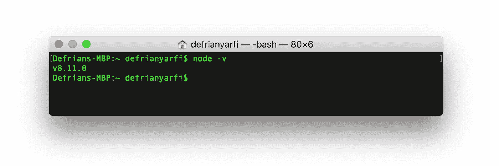**

**我的 MacOS 中的默认 Node.js 版本**

# ****安装 NVM****

1.  **在 MacOS 终端控制台中使用 brew: `brew install nvm`获取 NVM/Node 版本管理器。**
2.  **使用`curl`获取 NVM /节点版本管理器:**

```
**curl** -o- https://raw.githubusercontent.com/nvm-sh/nvm/v0.35.0/install.sh | bash
```

**或者`wget`:**

```
 **wget** -qO- https://raw.githubusercontent.com/nvm-sh/nvm/v0.35.0/install.sh | bash
```

# ****设置 NVM****

*   **关闭并重新打开终端，键入`source ~/.bash_profile`或`source ~/.profile`，以确保 *NVM* 包含在您的配置文件中。**
*   **然后键入`export NVM_DIR=~/.nvm`和`source $(brew --prefix nvm)/nvm.sh`来设置 NVM 目录和 shell 脚本。**
*   **下面是已经为在系统中安装 NVM 而设置的`.bash_profile`:**

**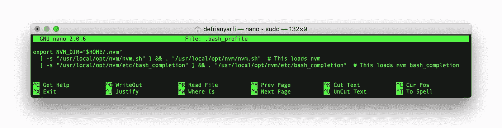**

**NVM 输入。bash_profile**

*   **重启终端，并通过在终端中键入`nvm --version`来验证 NVM 是否正确安装:**

**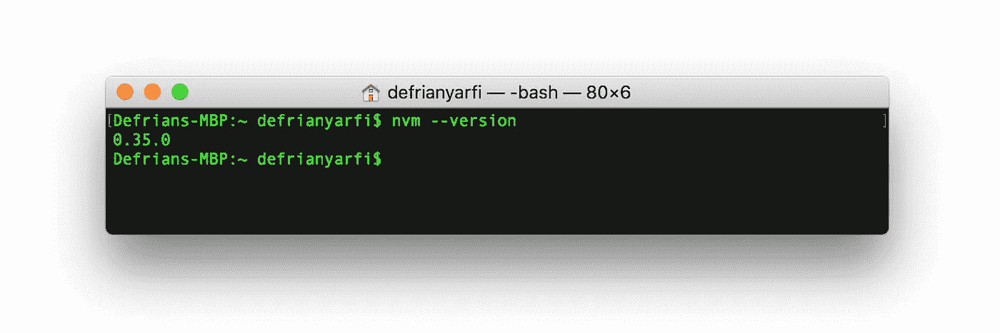**

**NVM 版本**

*   **在终端中使用命令
    `nvm install v8.11.0`或`nvm install v12.6.0`安装来自 8 或 12 的多节点版本:**

**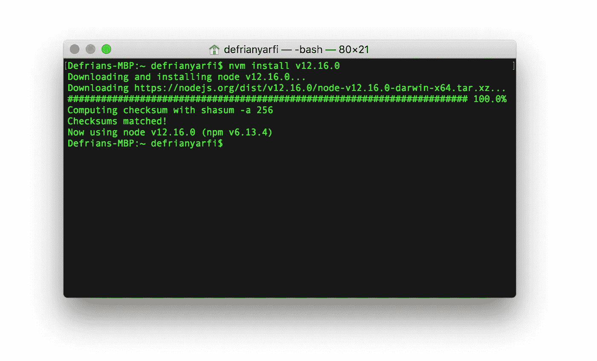**

**NVM 安装版本 12.16.0**

*   **使用`nvm list`或`nvm ls`命令列出已安装的版本，箭头表示当前 Node.js 版本:**

**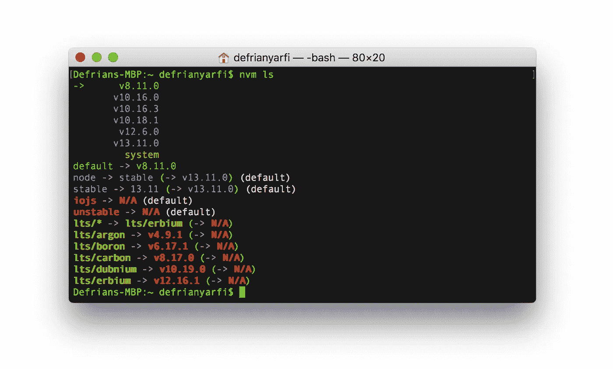**

**NVM 列出安装的所有 Node.js 版本**

*   **使用 NVM `nvm use v8.11.0`或`nvm use v12.16.0`使用或切换节点版本，以及验证当前节点`node -v`的方式与您选择的方式相同:**

**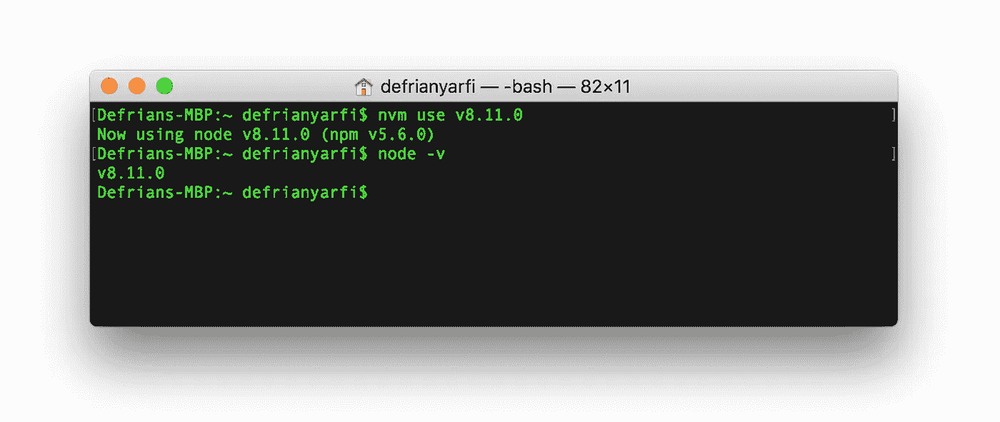**

**NVM 使用 8.11.0 版并检查节点版本**

**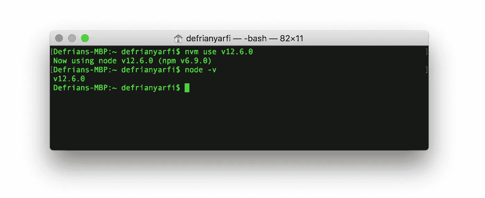**

**NVM 使用 v12.6.0 并检查节点版本**

*****注意*** *:* `*nvm use*` *命令只在你打开你的项目时在每个终端上可用。如果您关闭所有终端并再次打开一个终端，默认版本将始终起作用。为了克服这一点，但不丢失旧版本，您可以只设置一个* `*.nvmrc*` *文件，或者您可以设置一个节点默认别名来更改当前默认版本，使其可用于您打开的任何 shell 终端。***

# ****NVM 中的项目设置。nvmrc 文件****

**NVM 提供了一个简单的快捷方式帮助器，使您的每个项目能够识别您的 Node.js 在 usg 中的版本，使用文件名`.nvmrc`将其放入您的项目根目录中。**

*   **在项目目录下打开编辑器，在根目录下创建并保存一个名为`.nvmrc`的文件。键入您默认的或想要的 Node.js 版本，如`v10.13.0`或`v8.0.6`继续。**

**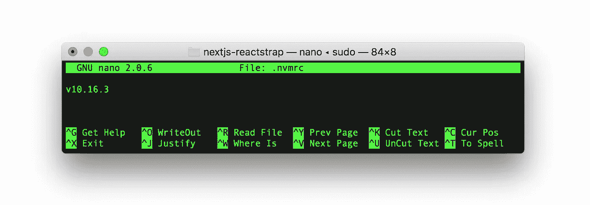**

**。包含所需节点版本的 nvmrc 文件**

*   **现在，您的根目录中已经有了一个`.nvmrc`，它为您的项目定义了默认的 Node.js 版本，您可以只键入`nvm use`来告诉 nvm 在您开始开发之前切换要使用的版本。**

**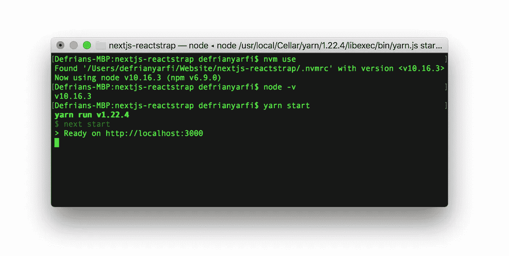**

**NVM 使用命令切换节点版本**

*   **您可以在所有 Node.js 根目录中添加一个`.nvmrc`,并记下该项目中使用的默认版本。通过在终端中键入`nvm use`来切换 Node.js 版本。**

**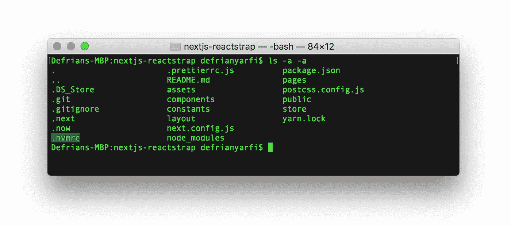**

**。项目根目录中的 nvmrc**

# **在任何打开的 Shell 中将 NVM 中的 Node.js 默认别名设置为`available`**

**使用 NVM 安装必要的 Node.js 版本后，现在可以为已安装的版本创建默认别名。NVM 别名只有在安装了带有 NVM 的 Node.js 后才能使用。**

**假设您想要使用 Node.js `v10.16.3`作为您的默认版本。只需在你的终端输入`nvm alias default v10.16.3`，然后输入`nvm use default`。这个命令将使`v10.16.3` 在您打开的任何 shell 中都可用——您只需重启您的终端以确保它工作。您可以再次使用该命令切换回任何其他默认版本，它将立即在任何打开的 shell 中可用。**

**使用命令`nvm use default`，已经创建的别名将在终端中可用。切换示例中可用的其他别名；只需键入`nvm use stable`或`nvm use node`或`nvm use system`来选择 NVM 已经安装的系统默认版本。**

**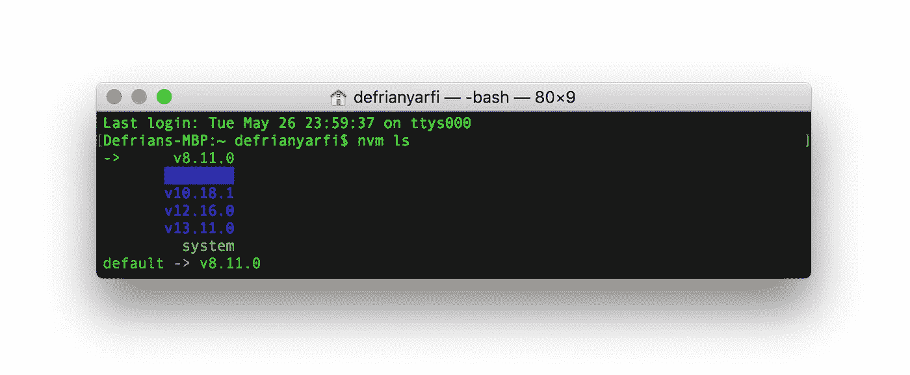**

**$ nvm ls —列出所有可用的节点版本。**

**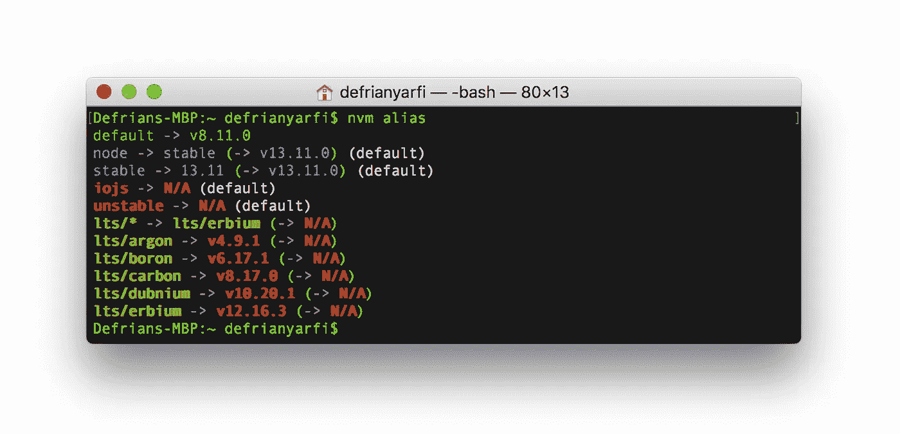**

**$ nvm 别名—列出所有可用的别名**

**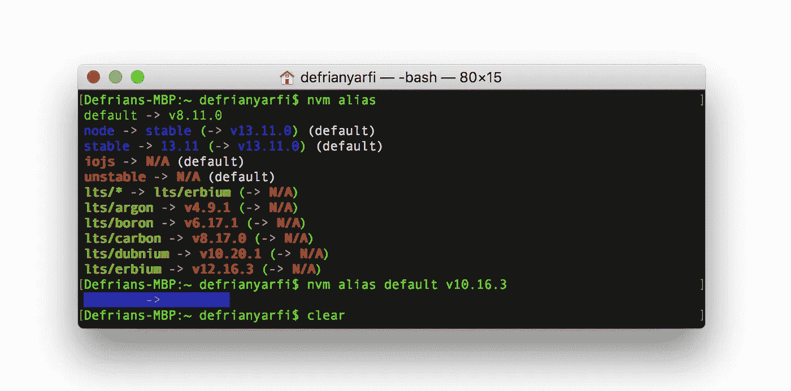**

**$ nvm 别名默认版本 10.16.3 —将节点默认版本设置为版本 10.16.3**

**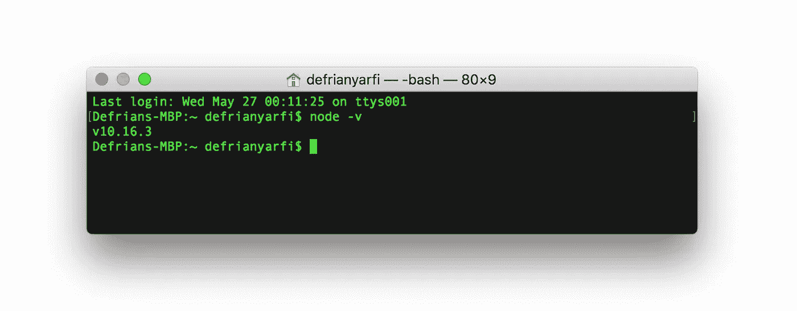**

**重启所有终端并检查节点版本默认更改为 v10.16.3 版本**

**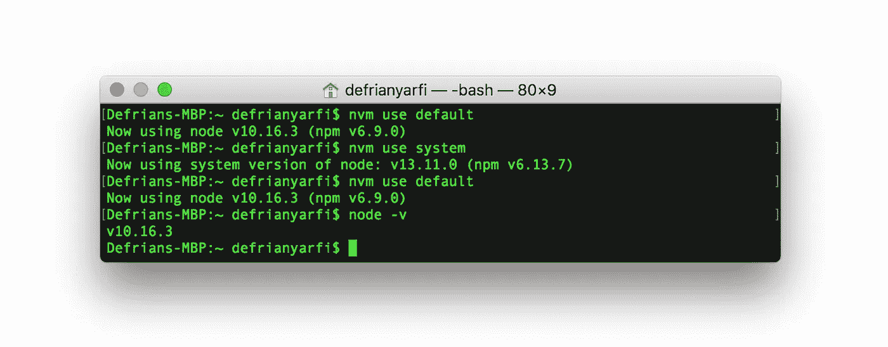**

**$ nvm 别名默认值—使用 nvm 中的别名在节点版本之间更改，并设置回默认版本**

## ****使用 NVM** 安装 [**节点 v14.0.0**](https://nodejs.org/en/blog/release/v14.0.0/)**

****在终端中键入`nvm install node`，这将安装节点的[最新版本。或者，只需在终端中键入版本`nvm install v14.4.0`。](https://nodejs.org/en/blog/release/v14.0.0/)****

****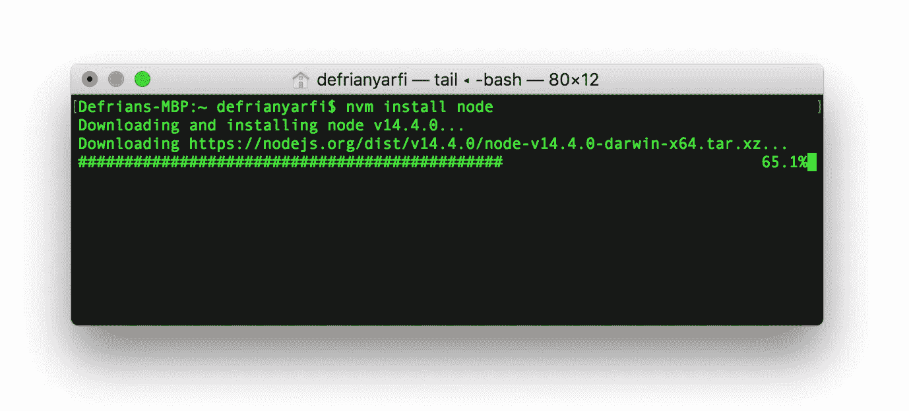****

****$ nvm 安装节点—将安装最新的节点版本 v14.4.0****

****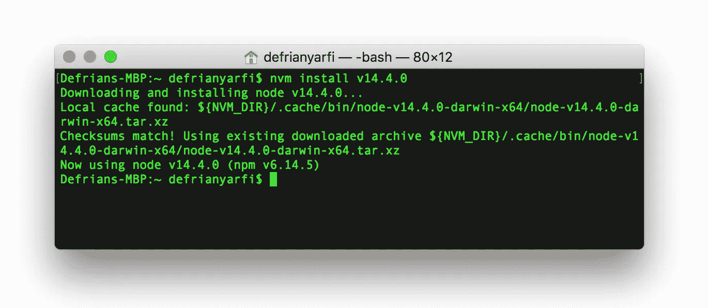****

****$ nvm install v14.4.0 —将安装最新的节点版本 v14.4.0****

*******注意:*** *如果安装* `*v14.0.0*` *或其他版本并退出所有终端，该版本将不能作为您节点的默认版本。记住，我们已经在* `*v10.16.3*` *中设置了一个全局节点版本。您需要将* `*v14.0.0*` *设置为您机器的默认节点版本，并执行* `*nvm use default*` *。*****

# ****将节点 v14.0.0 设置为默认版本****

****退出所有终端，列出所有版本，并检查默认版本。默认节点版本仍然是我们之前设置的`v10.16.3`(*注意箭头表示节点当前默认)版本。另外，请注意`v14.0.01`已经安装并在版本列表中列出。要将默认版本更改为`v14.0.0`，键入`nvm use default v14.0.0`和`nvm use default`，然后重启所有终端实例。最后，检查已经设置为`v14.0.0`的版本`node -v`，以便随时使用。****

****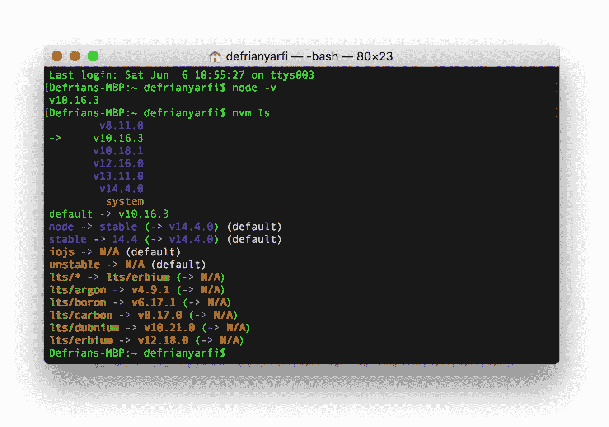****

****nvm ls —使用新的 v14.0.0 版本检查所有可用版本****

****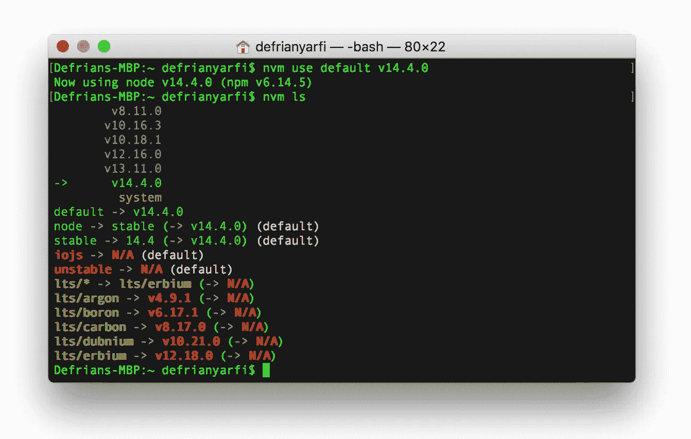****

****nvm 使用默认版本 14.4.0 —将版本 14.0.0 设置为节点默认版本****

****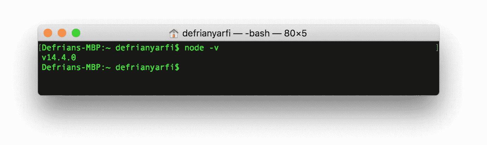****

****关闭所有终端并检查您的最新默认 v14.0.0 节点版本****

# ****关闭****

****感谢阅读。我希望这可以帮助您在 web 开发项目的 Node.js 版本之间切换。NVM 真的帮我度过了这种情况。既然我已经转向 Docker 容器，NVM 将永远是我可以依赖的工具。****

****祝你今天开心！玩的开心！****

# ****参考****

****[](https://github.com/nvm-sh/nvm) [## nvm-sh/nvm

### nvm 是 node.js 的版本管理器，设计为按用户安装，按 shell 调用。nvm 可以在任何…

github.com](https://github.com/nvm-sh/nvm)****