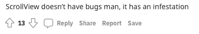
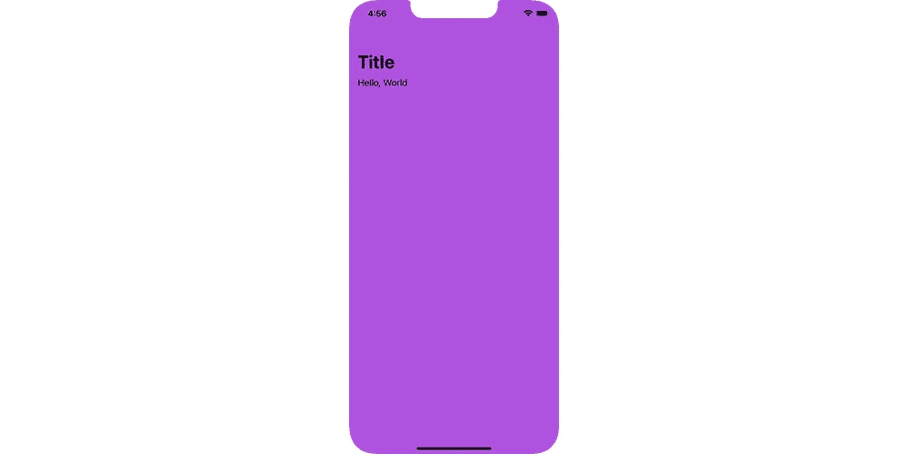
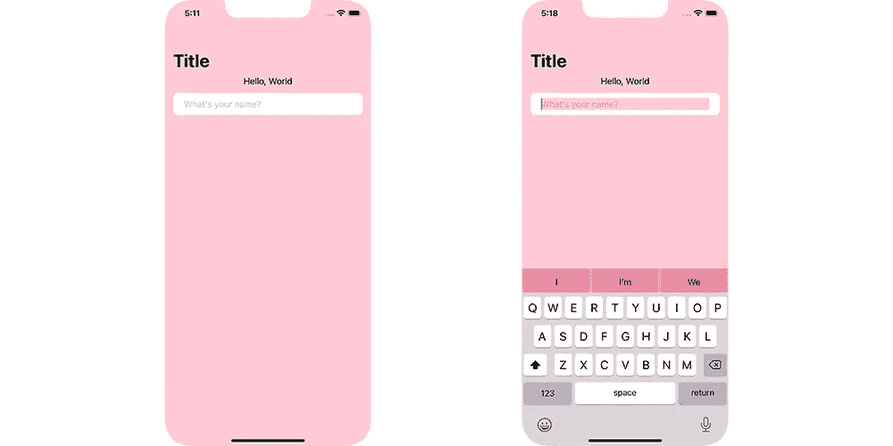

# 如何在 SwiftUI 中更改滚动视图颜色

> 原文：<https://betterprogramming.pub/how-to-change-scroll-view-color-in-swiftui-4b6b84f4a305>

## 这比想象的要难


[医生](https://unsplash.com/@docusign?utm_source=medium&utm_medium=referral)在 [Unsplash](https://unsplash.com?utm_source=medium&utm_medium=referral) 上拍摄的照片

iOS 15 的发布为 SwiftUI 带来了一些急需的改进。我们现在有了原生搜索栏，甚至对文本视图的标记支持。

但是不知何故，SwiftUI `ScrollView`仍然有点混乱。这个来自 Reddit 的家伙说得很好:



像改变 SwiftUI `ScrollView`的背景颜色仍然是一个相当大的挑战。直观的做法是直接在`ScrollView`上使用`.background`修改器，就像这样:



```
ScrollView {
    Text(“Hello, World”)
}
.background(Color.purple)
```

我发现这在某些情况下确实有效，但有一些注意事项。

1.  你的`ScrollView`必须直接在一个`NavigationView`里面(不是导航到的)
2.  您的`ScrollViews`内容必须使用带有`Spacers`的`HStack`水平缩放，以强制`ScrollView`填充屏幕宽度(或手动设置其框架)

如果这些警告中的任何一个没有被满足，你将会以不想要的行为结束。

要么你的`ScrollView`以不同于实际视图背景的颜色显示在中间(问题较少)，要么如果你没有将`ScrollView`直接用包裹在`NavigationView`中，`ScrollView`不会自动折叠导航栏—*—它在下面—* ，就好像导航栏是透明的一样。

> *绝对不是理想的解决方案！*

在我自己的用例中，我发现自己在一个细节屏幕中使用了一个`ScrollView`(从另一个屏幕导航到)。

这意味着我没有办法在`ScrollView`周围使用另一个`NavigationView`(参见警告 2)。还有把我的`ScrollView`包在两层`NavigationViews`(也许还藏了一层？)就是不给我喊稳定。

如果你像我一样在谷歌上搜索这些问题，你可能会遇到使用`appearance()`修饰语的解决方案。

通常，当我希望我的`ScrollViews`背景变成粉红色时，会出现如下情况:

```
UIScrollView.appearance().backgroundColor = UIColor.systemPink
```

乍一看，一切都很好。你可以从 UIKit `ScrollView`中得到你所期望的行为。导航栏折叠，一切正常…

直到你尝试用一个`TextField`。编辑`TextField`时，您的`TextField`的背景颜色会变成您的`ScrollView`的颜色。你可以在下面(右)看到一个例子:



为什么会这样？我不知道。使用`appearance()`修饰符有点令人不快，但这是在 SwiftUI 中让一些东西工作的唯一方法。

不管怎样，它也应该改变完全不相关的组件的颜色是没有意义的。

像这样使用`appearance()`修饰符可以改变`TextFields`的背景颜色(当编辑它们的时候)以及(以某种方式)键盘自动更正区域。我猜这和某种神奇的 SwiftUI 巫毒术有关。

我们越来越接近了，但如果你必须破坏应用程序中的每个文本字段才能让它工作，这并不是一个真正的解决方案。

经过一大堆摆弄和测试，我发现了一个`appearance()`修改器，似乎包含了伤害。

您实际上可以为`appearance`修饰符指定条件。这对于 UIKit 很有用，因为您可以指定想要应用样式的视图控制器。您还可以指定一个`UITraitCollection`来进一步过滤应用样式的地方。

经过反复试验，我发现了一个非常有效的组合:

这包括两个部分:

首先，我们指定`userInterfaceLevel`仅适用于接口级别被视为`base`的区域。

苹果文档说这基本上只是你的 windows 主要内容。还有`elevated`的值，我只能假设是`Alerts`或`Sheets`。

然后我们指定`whenContainedInInstancesOf`属性为:

```
...whenContainedInInstancesOf: [UINavigationController.self]...
```

这些条件的结合阻止了滚动视图`appearance()`修改器破坏我们的`TextFields`和键盘。

指定`whenContainedInInstancesOf`属性会将键盘自动校正颜色固定为默认灰色。我猜这是因为键盘不包含在导航控制器中，因为它不是我们应用程序的一部分(它是由 iOS 提供的)。

然后，指定`userInterfaceLevel`固定`TextField`背景。我不确定这是为什么。你会认为你的应用程序中的任何视图都可以被认为是一个`base`用户界面级别。也许`TextField`改变背景颜色的部分被认为是`elevated`。

一个不幸的副作用是，这将改变你的应用程序中每个`ScrollView`的颜色。但是如果你的应用有一致的风格，那么这个解决方案可能就是你要找的。

要使用它，把外观修改器放在你的根视图中，或者如果你想保持它是独立的，你可以使用一个类似我做的辅助视图。

我希望这篇文章能帮助您在 SwiftUI 这个复杂多变的世界中导航。希望 iOS 16 中情况有所改善(敲敲木头)。

感谢阅读。

```
**Want to Connect With the Author?**Give me a follow on [Twitter](https://twitter.com/iamzanecarter) to see what I’m working on.
```