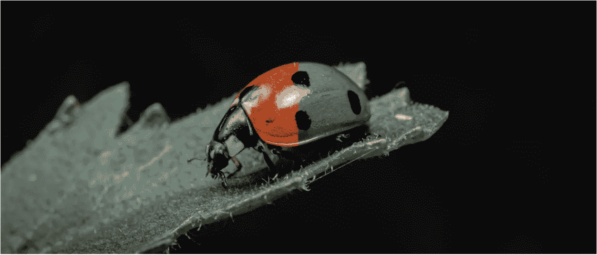
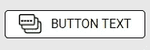

# 如何用 CSS 改变图像的颜色

> 原文：<https://betterprogramming.pub/how-to-change-the-color-of-an-image-with-css-83664f6527ac>

## 仅仅因为你得到了某种颜色的图像并不意味着它必须保持这种颜色



[Alexandre Debiève](https://unsplash.com/@alexkixa?utm_source=unsplash&utm_medium=referral&utm_content=creditCopyText) 在 [Unsplash](https://unsplash.com/s/photos/ladybug?utm_source=unsplash&utm_medium=referral&utm_content=creditCopyText) 上的原始照片(无 BW)。

假设您从产品团队收到了一张特定的图片，该图片旨在充当按钮的图标。按钮有白色背景，黑色边框，黑色文本，图像本身更暗。



初始元素状态

此元素的 CSS 如下所示:

当用户*将*悬停在按钮上时，期望的行为是背景颜色变成黑色，字体变成白色，图像也是白色。


悬停元素状态

当用户将鼠标悬停在按钮上时，`background-color`、`color`和`border`的变化非常简单。您可以在样式表中的`:hover`选择器下声明这些更新的样式:

这些样式考虑了大部分的变化，但是它们没有考虑图像颜色的变化。我们如何应对预期的变化？

如果产品团队也提供了图像的白色版本，你可以简单地将图像的`src`切换到悬停状态。这可以使用 JavaScript 来完成。您可以使用一个`onmouseover`函数将图像的`src`设置为`white.png`，然后使用一个`onmouseleave`函数将图像的`src`设置为`black.png`。

这是可行的，但是我们实际上可以用纯 CSS 来完成这个任务。然而，这需要包含另一个元素来包装图像。有了图像的包装器，你可以根据你是否停留在它上面来分配属性`background-image`或者`black.png`或者`white.png`:

更多关于如何使用 CSS 在悬停时改变图像的`src` ,参见[堆栈溢出时的线程](https://stackoverflow.com/questions/18032220/css-change-image-src-on-imghover)。

虽然这个解决方案确实有效，但是你仍然需要添加更多的 HTML *和*只有当你足够幸运地得到第二个资产时它才有效。如果你只想使用 CSS，没有额外的标记，*和*你不想必须依赖产品团队的另一项资产呢？能做到吗？是的。是的，可以。

使用`filter` CSS 属性，很容易获取我们现有的图像并改变它的颜色以适应我们当前的需要。我们只需要使用全灰度和全反转。见下文:

```
.myButton:hover img{
   -webkit-filter: grayscale(1) invert(1);
   filter: grayscale(1) invert(1);
}
```

# 灰度等级

`[grayscale](https://developer.mozilla.org/en-US/docs/Web/CSS/filter-function/grayscale())`是一个 CSS 函数，将提供的图像转换为灰度，`0`为原始(无灰度变化)`1`为完全灰度(使其看起来更黑白)。但是，为黑色图像提供灰度不会使其看起来是白色的。深色更接近黑色，浅色更接近白色。所以给一幅黑色图像分配一个`1`的灰度几乎是多余的(我们一会儿会讲到)。这就把我们带到了`filter`的下一个 CSS 函数。

# 转化的

`[invert](https://developer.mozilla.org/en-US/docs/Web/CSS/filter-function/invert())`是一个 CSS 函数，将提供的图像中的颜色样本反转，`0`为原始，`1`为相反。与`grayscale`结合使用，我们可以确保图像尽可能暗，然后反转最终比例，使其尽可能亮(在这种情况下，白色)。

在我们当前的情况下，您实际上可以只使用`invert`而不被发现:

```
.myButton:hover img{
   -webkit-filter: invert(1);
   filter: invert(1);
}
```

由于我们的原始资产是黑色的，我们不需要使用`grayscale`来使图像变暗(如前所述，这有点多余)。灰度可能更有意义的情况是当您有一个对比图像或至少一个不全是黑/白的图像时。

在下面提供的[代码沙箱](https://codesandbox.io/s/wandering-wildflower-x46ug?file=/index.html)中，你可以看到`grayscale`和`invert`是如何操作一个多了一点色彩(或者我敢说，天赋)的图像的:

在此 *将你的免费中级会员升级为付费会员，每月只需 5 美元，你就可以获得数以千计作家的无限量无广告故事。这是一个附属链接，你的会员资格的一部分帮助我为我创造的内容获得奖励。谢谢大家！*

# 参考

[](https://stackoverflow.com/questions/18032220/css-change-image-src-on-imghover) [## CSS:更改 img 上的图像 src:hover

### 问我需要在悬停时更改源 URL。我试过了，但不起作用:HTML CSS #my-img:hover { content…

stackoverflow.com](https://stackoverflow.com/questions/18032220/css-change-image-src-on-imghover) [](https://developer.mozilla.org/en-US/docs/Web/CSS/filter-function/grayscale%28%29) [## 灰度()

### 灰度()CSS 函数将输入图像转换为灰度。其结果是一个过滤函数。

developer.mozilla.org](https://developer.mozilla.org/en-US/docs/Web/CSS/filter-function/grayscale%28%29) [](https://developer.mozilla.org/en-US/docs/Web/CSS/filter-function/invert%28%29) [## 反转()

### 函数的作用是:反转输入图像中的颜色样本。其结果是一个过滤函数。

developer.mozilla.org](https://developer.mozilla.org/en-US/docs/Web/CSS/filter-function/invert%28%29)