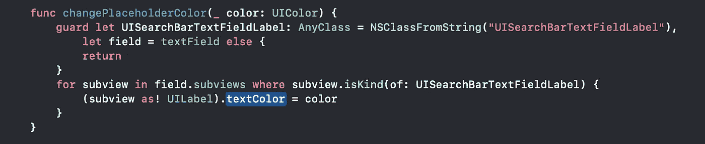

# 如何更改 UISearchBar 中的占位符颜色

> 原文：<https://betterprogramming.pub/how-to-change-the-placeholder-color-in-a-uisearchbar-1f47e5266e10>

## 更改 UISearchBar 的占位符颜色，兼容所有 iOS 版本


Andrew Ridley 在 [Unsplash](https://unsplash.com?utm_source=medium&utm_medium=referral) 上拍摄的照片。

# 访问 UITextField

我们知道，苹果并没有让我们在不同的操作系统上方便地访问`UITextField`参考。所以这里的代码可以帮助你在所有 iOS 版本中安全地访问`UITextField`。


用于访问 TextField 并更改其属性的代码段

这将帮助我们定制`UITextField`的字体、背景色、搜索图标等等。下面是一个示例片段:

```
searchBar.textField?.textColor = UIColor.gray
searchBar.textField?.font = // Your font
```

# 更改占位符颜色

注意:如果你调入`viewDidLoad`，这将不起作用。在`viewDidAppear`称之为:



更改 UISearchBar 占位符颜色的代码段

现在只需一行代码，您就可以更改`UISearchBar`的占位符颜色。

```
searchBar.changePlaceholderColor(UIColor.orange)
```


输出:占位符颜色变化

# 结论

感谢您的阅读。希望这篇文章对你有帮助。请分享您的宝贵反馈。

# 其他文章

*   [如何更改用户搜索栏中的搜索图标](https://medium.com/better-programming/how-to-change-the-search-icon-in-a-uisearchbar-150b775fb6c8)
*   [如何在 UISearchBar 中添加活动加载器](https://medium.com/better-programming/how-to-add-an-activity-loader-in-a-uisearchbar-6993f8476004)
*   [如何在 UISearchBar 中添加左填充](https://medium.com/better-programming/how-to-add-left-padding-to-a-uisearchbar-2406bcaf9271)