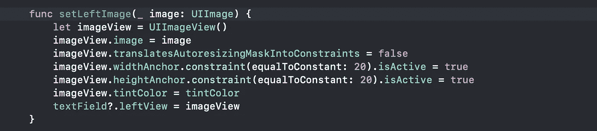
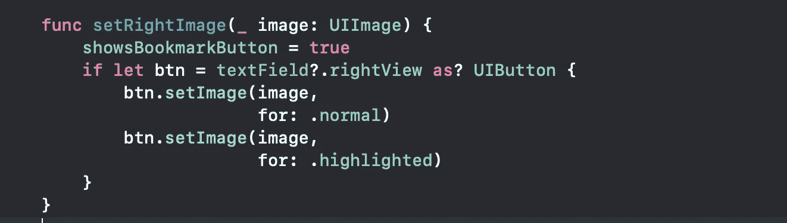
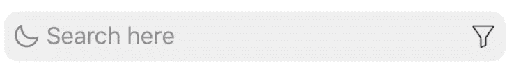

# 如何更改 UISearchBar 中的搜索图标

> 原文：<https://betterprogramming.pub/how-to-change-the-search-icon-in-a-uisearchbar-150b775fb6c8>

## 自定义 UISearchBar 的左右图标—兼容所有 iOS 版本


# 先说`UITextField`

你可能知道，苹果让我们在其他操作系统版本上访问`UITextField`参考变得不容易。下面是帮助你们在所有 iOS 版本中安全访问`UITextField`的代码:


用于访问 textfield 并更改其属性的代码段

# 更改用户搜索栏左侧图标



在 UISearchBar 中添加左侧图标的代码段

现在，只需一行代码，您就可以在您的`UISearchBar`中更改左边的搜索图标:

```
searchBar.setLeftImage(UIImage(named: "dark mode")!)
```


# 更改用户搜索栏右侧图标



在 UISearchBar 中添加右图标的代码段

现在，只需一行代码，你就可以改变`UISearchBar`的右视图图标。

**注意:**此呼叫在`viewDidLoad`不起作用；在`viewDidAppear`中调用这个上面的方法。

```
// Set Custom Right View
searchBar.setRightImage(normalImage: UIImage(named: “filter”)!,
                        highLightedImage: UIImage(named: “filter_selected”)!)
```



要调用您的方法，单击`UISearchBar`中的`Right View`，覆盖下面的`UISearchBarDelegate`方法:

```
// Override method
func searchBarBookmarkButtonClicked(_ searchBar: UISearchBar) {
    // Filter Action
    tappedFilter()
}
```

# 感谢您的阅读

我希望这篇文章能帮助你定制`UISearchBar`。请分享您的宝贵反馈。

# 其他文章

*   [如何更改 UISearchBar 中的占位符颜色](https://medium.com/better-programming/how-to-change-the-placeholder-color-in-a-uisearchbar-1f47e5266e10)
*   [如何在 UISearchBar 中添加活动加载器](https://medium.com/better-programming/how-to-add-an-activity-loader-in-a-uisearchbar-6993f8476004)
*   [如何在 UISearchBar 中添加左填充](https://medium.com/better-programming/how-to-add-left-padding-to-a-uisearchbar-2406bcaf9271)