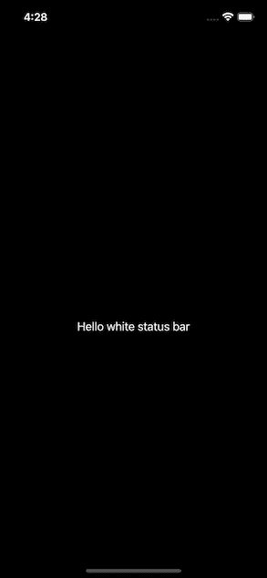

# 如何使用 SwiftUI 在特定视图上更改状态栏颜色

> 原文：<https://betterprogramming.pub/how-to-change-the-status-bar-color-with-swiftui-on-a-specific-view-36f773d78549>

## 在 *SwiftUI* 中使用 *ViewModifier* 的小技巧


资料来源:undraw.co

还记得以前在 UIKit 中的美好时光吗？那时只需在特定的`UIViewController`上使用这段代码就可以非常简单地改变状态栏的颜色。

```
override var preferredStatusBarStyle: UIStatusBarStyle {
    .lightContent
}
```

现在有了 SwiftUI，即使我们的生活在声明式 UI 下看起来更简单，但我们似乎总会在这里或那里发现一些小问题，让我们做更多的工作。SwiftUI 中的类似行为就是这种情况。

这里有一个解决方案(不是理想的解决方案，因为`UIApplication.shared.statusBarStyle` 在 iOS 13 中被声明不推荐使用，但仍然有效，特别是如果你没有场景委托，并且你正在使用 iOS 14)。

# 1.配置*信息列表*

确保您已经将`Info.plist`配置为允许这样做。只要在上面加上这一行:

```
<key>UIViewControllerBasedStatusBarAppearance</key>
<false/>
```

# 2.创建自定义 ViewModifier 和 View 协议的扩展

让我们创建一个自定义的`ViewModifier`(关于它的更多信息，你可以查看苹果的文档链接[这里](https://developer.apple.com/documentation/swiftui/viewmodifier))，然后将它应用到我们的屏幕`MyView`:

警告:`ViewModifier`应用于颜色，而不是`NavigationView`，否则它不会在视图消失时重置(因为导航将保持活动)。



上面代码的模拟器屏幕

如果你有一个`SceneDelegate`(主要是在 iOS 14 之前)，那么你可以用一个自定义的`UIHostController` *来完成这个任务。*

在以后的文章中，我将展示如何在使用`@main`和`WindowGroup`时做到这一点。