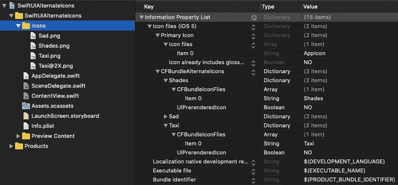
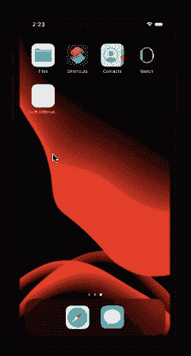
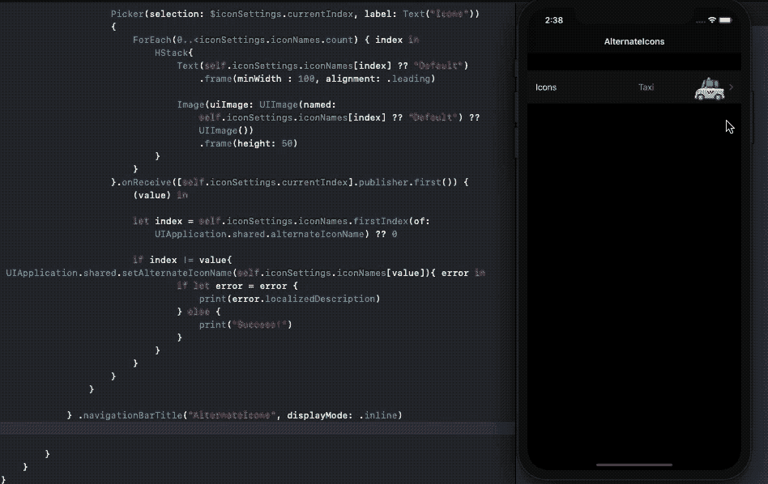
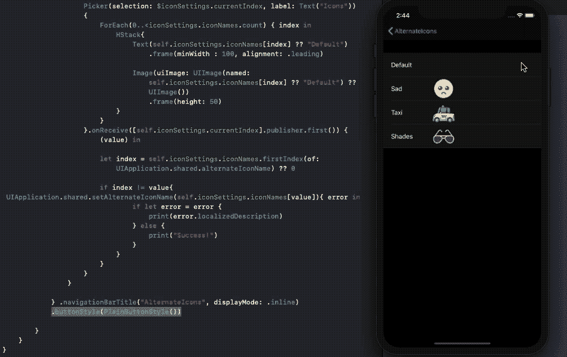
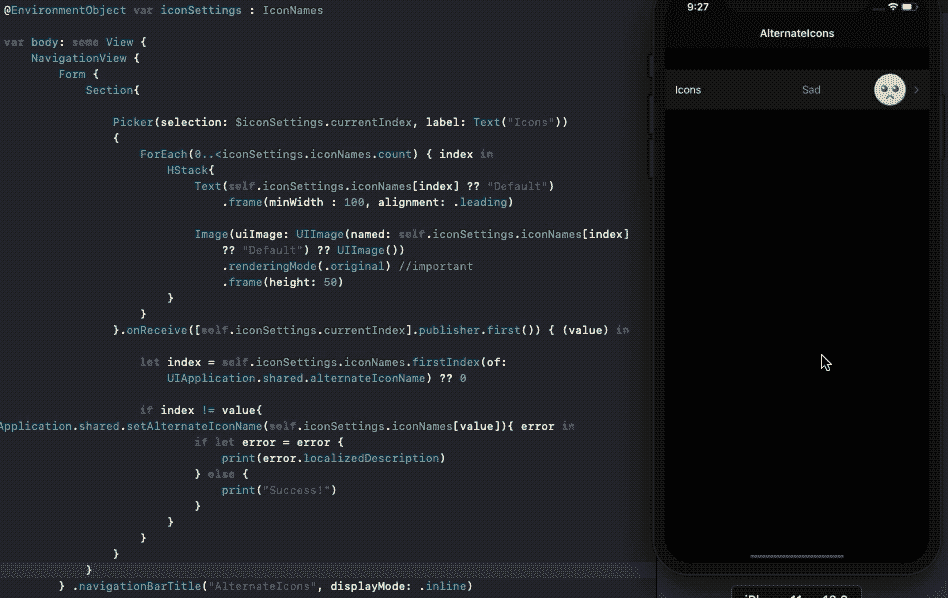

# 如何在 SwiftUI 中更改您的应用程序图标

> 原文：<https://betterprogramming.pub/how-to-change-your-apps-icon-in-swiftui-1f2ff3c44344>

## 让您的用户以编程方式设置替代图标


照片由[威廉·胡克](https://www.flickr.com/photos/williamhook/)在 [Flickr](https://www.flickr.com/photos/williamhook/38109880456) 上拍摄

以编程方式改变应用程序图标的功能已经存在好几年了。具体来说，这项功能是在 iOS 10.3 中发布的，它允许开发人员在一组预定义的备用图标之间切换。

当您的应用程序基于订阅时，动态图标非常有用。Tinder 是一个很好地利用这一功能的应用程序，因为它给 Tinder Gold 会员提供了一个切换图标的选项。

## 我们的目标

*   在本文中，我们将向您展示如何使用 SwiftUI 以编程方式更改您的应用程序图标
*   我们将利用 SwiftUI `Picker` s 来允许用户从菜单列表中选择他们最喜欢的图标。
*   最后，我们将解决一个严重的陷阱。`Picker` s 和`NavigationView`目前没有按照我们希望的方式相处——我们会看到原因。

# 以编程方式设置备用应用程序图标

设置替代图标的代码并没有那么大。几乎算不上一句台词。这是需要一点时间的设置。

## 获取备选应用程序图标

下面一行代码返回一个可选字符串，代表当前应用程序图标的键名。如果正在使用默认的应用程序图标，它将返回`nil`:

```
UIApplication**.**shared**.**alternateIconName
```

## 设置备用图标

要设置替代图标，只需在下面的函数中传递图标的名称。处理完成处理程序来检查错误是一个很好的实践。

```
UIApplication.shared.setAlternateIconName(**iconName**, completionHandler: {error in})
```

但是我们在哪里设置图标名称呢？我们一会儿再回到这个话题。

以下是在应用程序中使用替代图标时需要遵循的规则:

## 1.不要在资产目录中添加替代图标

创建一个单独的组来保存所有备用图标(包括 2x 和 3x 文件)是至关重要的。

## 2.小心处理 Info.plist 文件

在`Info.plist`文件中，你需要为备用图标(和主图标)建立字典。由于字典是嵌套的，我发现编辑原始 XML 格式的`Info.plist`比编辑那些按钮容易得多。

下面的代码片段显示了`CFBundleIcons`键的字典结构。将它添加到您看到的 XML 字典的顶层。

一开始看起来可能有点吓人，但这很简单。`CFBundleIcons`容纳两个字典:

*   `CFBundlePrimaryIcon`对于资产目录中的主要图标
*   `CFBundleAlternateIcons`用于保存备用图标。`CFBundleAlternateIcons`中的键代表您将在代码中使用的名称。这个名字取代了我们之前看到的`iconName`。
*   在`CFBundleIconFiles`中，我们传递图标文件名——没有扩展名，也没有 2x 和 3x 变体。只有名字。
*   `UIPrerenderedIcon` 是表示光泽效果的布尔键。将此项设置为`false`，让系统在您的图标上添加闪亮效果。

# 项目结构

现在我们都准备好了，让我们看看项目结构。我们在应用目标的`Icons`群组文件夹中添加了三种图标。



# 解码替代图标字典

我们的想法是获取所有可选图标的键名，并将它们设置在一个数组中。下面的函数就是通过解码`Info.plist`来实现的。

`iconNames`是在下面的`ObservableObject`类中定义的字符串数组，在`init`方法中调用`getAlternateIconNames`函数:

```
class IconNames: ObservableObject {
    var iconNames: [String?] = [nil]
    @Published var currentIndex = 0

    init() {
        **getAlternateIconNames()**

        if let currentIcon = UIApplication.shared.alternateIconName{
            self.currentIndex = iconNames.firstIndex(of: currentIcon) ?? 0
        }}
```

*   在上面的代码中，`iconNames`数组的第一个元素被设置为`nil`，作为主应用程序图标的指示器。
*   活动图标的索引被设置为`@Published`属性包装。它由当前活动的图标初始化。

我们将通过 SwiftUI `ContentView`到`@EnvironmentObject`共享上面的数据模型，它从`SceneDelegate`传递到视图层次结构。

```
window.rootViewController = UIHostingController(rootView: contentView.environmentObject(**IconNames**()))
```

# 在 ContentView 中设置 SwiftUI 选择器

在下面的代码中，我们用来自`EnvironmentObject`属性包装器实例的图标名填充 SwiftUI `Picker`:

*   每当`Picker`的选择改变时，就会触发`onReceive`修改器。它发布它得到的最新值(所选图标的索引)。
*   在闭包内部，我们将新选择的图标名称与当前活动的应用程序图标名称进行比较。这是至关重要的一步，因为只有当用户选择不同的图标时，它才会触发图标变化。

下面看一下我们的应用程序:



输出

正如我们在上面看到的，当替代图标被成功更改时，系统会发送一个警报。因此，一旦视图被设置，从主线程调用`setAlternateIconName`是很重要的。

现在，让我们看看如何在 SwiftUI 视图中设置替代图标，并解决当`Picker`和`NavigationView`一起操作时的问题。

# SwiftUI 选择器和导航视图缺陷

虽然上面的 SwiftUI 应用程序在管理状态方面做得很好，但是在使用 NavigationView 和 Pickers 时还是有一些缺陷。不小心处理这些案件可能会困扰你以后。

## 陷阱 1

以下屏幕截图将备选图标添加到 Pickers 下的 SwiftUI 图像中，并且由于`NavigationView`它们被屏蔽:



现在我们可以通过在 NavigationView 上设置一个按钮样式来解决覆盖问题，如[这个片段](https://medium.com/better-programming/swiftui-navigation-links-and-the-common-pitfalls-faced-505cbfd8029b)所示。但随后，我们失去了 SwiftUI `Picker`的选择指标:



## **补救措施**

**将** `**renderingMode**` **设置为** `**Image**`上的原件通过将`renderingMode`设置为原件，叠加被隐藏，拾取器选择可见，我们不需要为 NavigationView 设置`buttonStyle`。



因此，我们最终让我们的应用程序使用显示在 SwiftUI 选择器中的替代图标。

## **陷阱二**

此外，还有另一种情况，SwiftUI `Picker`和`NavigationView`目前不能按预期工作。将`NavigationView`的样式设置为`automatic`或更大将导致`Picker`在导航期间重新定位一次，从而在 UI 中显示抖动。

## 治疗

目前，唯一的解决方法是将 NavigationView 的`displayMode`设置为 inline。更多详细信息，请参考[该堆栈溢出帖子](https://stackoverflow.com/questions/58773687/why-is-swiftui-picker-in-form-repositioning-after-navigation)。

# 结论

我们看到了如何使用 SwiftUI `Picker`菜单以编程方式设置应用程序的图标。

此外，我们解决了在 SwiftUI 中使用`NavigationView`和`Pickers`时的两个常见陷阱。这些问题导致子视图中出现叠加颜色，并寻找解决方法。

这篇文章的完整源代码可以在这个 [Github 库](https://github.com/anupamchugh/iowncode/tree/master/SwiftUIAlternateIcons)中找到。

这一篇就到此为止——感谢阅读。