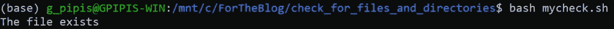
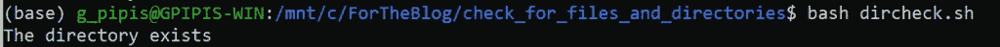

# 如何在 R、Python 和 Bash 中检查文件或目录是否存在

> 原文：<https://betterprogramming.pub/how-to-check-if-a-file-or-directory-exists-in-r-python-and-bash-841688b52e96>

## 检查文件和目录是否存在的实践示例


Maksym Kaharlytskyi 在 [Unsplash](https://unsplash.com/s/photos/files?utm_source=unsplash&utm_medium=referral&utm_content=creditCopyText) 上拍摄的照片。

[](https://jorgepit-14189.medium.com/membership) [## 用我的推荐链接加入媒体-乔治皮皮斯

### 阅读乔治·皮皮斯(以及媒体上成千上万的其他作家)的每一个故事。您的会员费直接支持…

jorgepit-14189.medium.com](https://jorgepit-14189.medium.com/membership) 

在构建数据工作流和机器学习管道时，我们经常会检查特定文件和目录(文件夹)的存在。在本文中，我们将提供一些实际例子，说明如何在 R、Python 和 Bash 中检查文件或目录。

# 检查 R 中的文件或目录是否存在

对于这个例子，我们已经创建了一个名为`myfile.txt`的文件和一个名为`my_test_folder`的目录。

## 如何检查文件是否存在

我们可以通过基础包中的`file.exists()`命令轻松检查文件是否存在。让我们看看下面的例子:

```
if (file.exists("myfile.txt")) {

  print("The file exists")
} else {

  print("The file does not exist")
}
```

我们得到了:

```
[1] "The file exists"
```

现在让我们用一个不存在的文件试试:

```
if (file.exists("nofile.txt")) {

  print("The file exists")
} else {

  print("The file does not exist")
}
```

我们得到了:

```
[1] "The file does not exist"
```

注意，通过在`if`语句中添加`!`，表达式`if not file exists`可以写成如下形式:

```
if (!file.exists("myfile.txt"))
```

最后，如果您想创建一个空文件，您可以运行以下命令:

```
file.create("mynewfile.txt")
```

## 如何检查目录是否存在

类似地，使用`file.exists()`，我们可以使用`dir.exists()`命令来处理目录。例如:

```
if (dir.exists("my_test_folder")) {

  print("The direcoty exists")
} else {

  print("The file does not exist")
}
```

我们得到:

```
[1] "The direcoty exists"
```

现在，让我们做下面的练习。我们将检查目录是否存在。如果没有，我们将创建一个新的:

而`my_new_folder`文件夹是在我们的工作目录下创建的。

# 检查 Python 中的文件或目录是否存在

对于这个例子，我们已经创建了一个名为`myfile.txt`的文件和一个名为`my_test_folder`的目录。

## 如何检查文件是否存在

我们可以按如下方式使用`os`模块:

```
import os.pathif os.path.isfile('myfile.txt'):
    print("The file exists")
else:
    print("The file does not exist")
```

我们也可以使用`pathlib`模块，如下所示:

注意，在 Python 中，可以用命令`with open(filename.txt, 'w')`创建一个空文件。例如:

```
import osif not os.path.isfile('myfile.txt'):
    with open('myfile.txt', 'w'): pass
```

或者:

```
if not os.path.isfile('myfile.txt'):
    file_name = 'myfile2.txt'
    f = open(file_name, 'w')
    f.close()
```

打开文件时，请记住以下模式:

```
w  write mode
r  read mode
a  append mode
w+  create file if it doesn't exist and open it in (over)write mode
    [it overwrites the file if it already exists]
r+  open an existing file in read+write mode
a+  create file if it doesn't exist and open it in append mode
```

## 如何检查一个目录是否存在

类似地，我们可以检查目录是否存在，如下所示:

```
import os.pathif os.path.isdir('my_test_folder'):
    print("The directory exists")
else:
    print("The directory does not exist")
```

我们得到了:

```
The directory exists
```

请注意，您可以创建一个目录，如下所示:

```
import os
if not os.path.isdir('my_folder'):
    os.makedirs('my_folder')
```

最后，要检查一个`Path`对象是否独立存在，或者它是一个文件还是一个目录，使用`exists()`:

```
from pathlib import Pathmy_file = Path("/path/to/file")
if my_file.exists():
    # path exists
```

或者用`os`模块:

```
import os.pathpath.exists("myfile.txt")
```

# 检查 Bash 中是否存在文件或目录

## 如何检查文件是否存在

对于这个例子，我们已经创建了一个名为`myfile.txt`的文件和一个名为`my_test_folder`的目录。我们可以使用`-f`标志，它检查常规文件的存在——而不是目录。

假设`mycheck.sh`脚本如下:



文件如预期的那样存在。现在，如果我们想创建一个空脚本，我们可以运行以下命令:

```
touch filename.txt
```

## 如何检查目录是否存在

类似地，我们可以通过将`-f`标志改为`-d`来检查目录，这将检查目录是否存在。假设`dircheck.sh`如下:



不出所料，我们收到了目录存在的消息。

请注意，如果您想要创建一个目录，可以运行以下命令:

```
mkdir yourdirectory
```

最后，注意表达式`if not`带有一个`!`，如下所示:

```
if [ ! -d my_test_folder ]
```

最后，我们为 bash 中的文件和目录检查提供了必要的标志:

*   `-b filename` —阻止特殊文件。
*   `-c filename` —特殊字符文件。
*   `-d directoryname` —检查目录是否存在。
*   `-e filename` —检查文件是否存在，无论文件类型(节点、目录、套接字等)如何。).
*   `-f filename` —检查常规文件是否存在—不是目录。
*   `-G filename` —检查文件是否存在并由有效的组 ID 拥有。
*   `-G filename set-group-id` — `True`如果文件存在并且是`set-group-id`。
*   `-k filename` —粘粘的钻头。
*   `-L filename` —符号链接。
*   `-O filename` — `True`文件是否存在，是否为有效用户 id 所有。
*   `-r filename` —检查文件是否可读。
*   `-S filename` —检查文件是否是套接字。
*   `-s filename` —检查文件是否为非零大小。
*   `-u filename` —检查文件`set-user-id`位是否置位。
*   `-w filename` —检查文件是否可写。
*   `-x filename` —检查文件是否可执行。

*最初发表于*[T5【https://predictivehacks.com】](https://predictivehacks.com/how-to-check-if-a-file-or-a-directory-exists-in-r-python-and-bash/)*。*