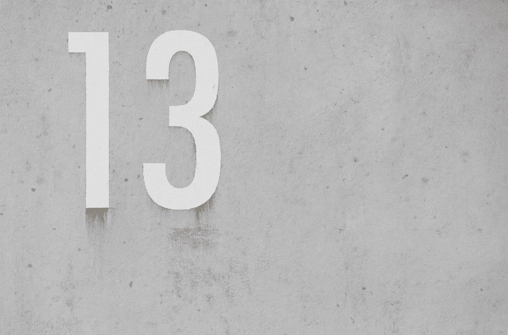

# 如何在 Python 中检查一个数是否是质数

> 原文：<https://betterprogramming.pub/how-to-check-if-a-number-is-prime-in-python-9855e87cd9f8>

## 用这个简单的算法构建一个函数



帕斯卡尔·迈耶在 [Unsplash](https://unsplash.com/s/photos/prime-number?utm_source=unsplash&utm_medium=referral&utm_content=creditCopyText) 上拍摄的照片

质数——它们勾起了我对中学时代的回忆，我坐在书桌前，绞尽脑汁地想着每一个可能的除法。

对于那些可能不熟悉的人来说，质数是大于 1 的自然数(计数)，不能由两个较小的数相乘产生。

换句话说，质数只能被 1 和它们自己整除。

快速数学检查，在下列数字中，1、2、3、4、5、2、3 和 5 是质数。数字 1 不大于 1，数字 4 可以通过乘以 2x2 产生。

那么，我们如何通过编程来确定一个数是否是质数呢？

我们需要检查这个数字是否符合我们的所有标准:

1.  整体。
2.  大于 1。
3.  不能被除自身和 1 之外的任何数整除。

# 该算法

让我们从求解一个设定值开始，这个设定值将存储在一个变量`n`中，并假设我们的值是质数。这意味着我们会在算法中取消它的资格。

```
n = 5
isPrime = True
```

接下来，我们需要检查该值是否大于 1 并且是一个整数。

```
if n <= 1 or n % 1 > 0:
   isPrime = False
```

如果你不熟悉模数运算符`%`，可以看看我关于这个便捷的[算术运算符](https://medium.com/better-programming/lesser-known-arithmetic-operators-in-python-a34670087b3a)的文章。

假设我们通过了这项检查，下一步就是遍历 1 和`n`之间的值范围，看看我们是否找到了一个偶数除法。

```
for i in range(2, n-1):
   if n % i == 0:
      isPrime = False
```

`range()`函数接受两个参数，我们的开始和停止值，并返回两者之间的每个数字，而`for`循环将迭代从 range 返回的每个值。

我们可以通过只迭代到最大界限`n / 2`来对循环的效率做一点小小的改进。这是因为我们看到的任何大于`n`一半的整除都会被发现，因为互补值小于`n`的一半。

由于`range()`需要整数值，我们使用整数除法`//`将`n`除以 2。这是整个算法。

# 将我们的算法转换成一个函数

现在，我们不想每次需要时都复制/粘贴这个算法，所以是时候创建一个函数了。我们的函数将根据传递的值是否是质数返回`True`或`False`。

你有不同的方法来确定一个数是否是质数吗？你需要在教室外使用质数吗？在下面分享你的想法和反馈吧！