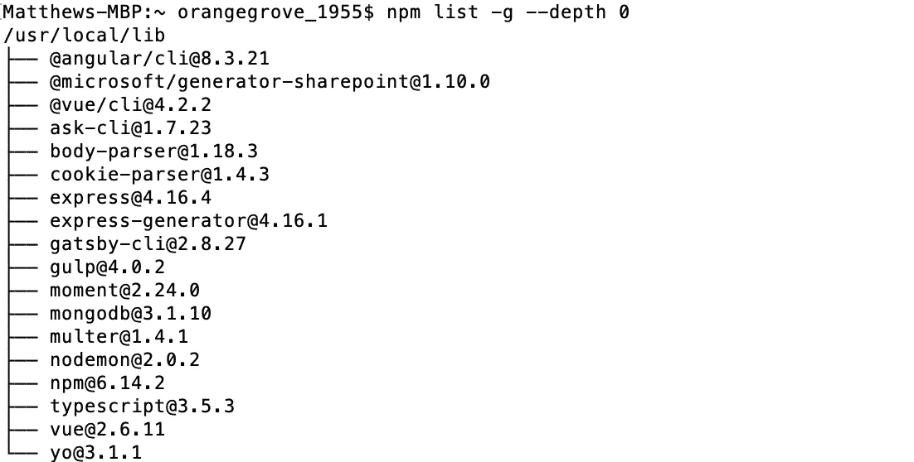
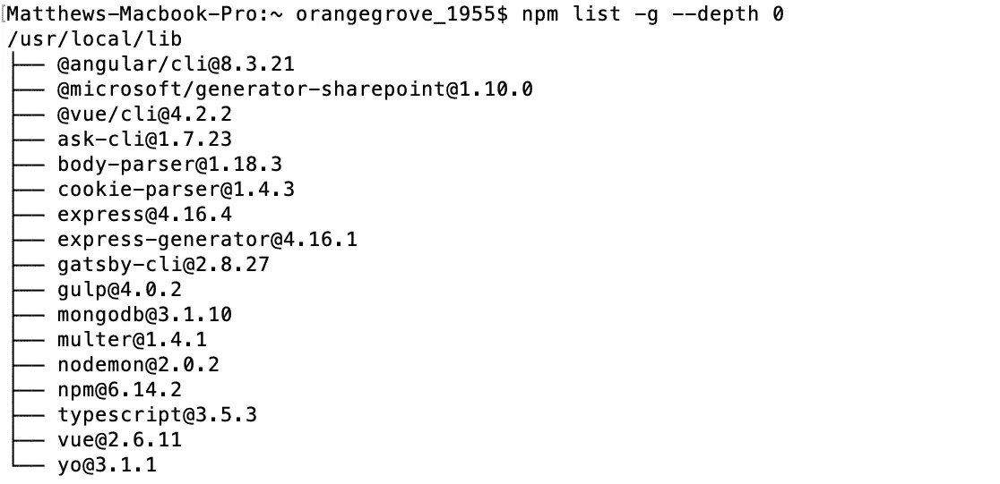

# 如何检查全球安装的 npm 软件包

> 原文：<https://betterprogramming.pub/how-to-check-your-globally-installed-npm-packages-32a14469b95a>

## 有时候清理我们的机器是有好处的


如果您是一名经验丰富的节点开发人员，回想一下您刚刚开始使用 npm 的时候。你是否盲目地跟随教程，在任何时候被告知添加`-g`标志？

你知道那面旗到底做了什么吗？你认为你已经在全球范围内安装了多少软件包，它们只是坐在那里，除了占用空间什么也不做？

对于阅读这篇文章的新手来说，`-g`标志会在全球范围内安装你的包，这意味着它们在任何地方都是可用的。

虽然这对于您将在许多项目中重复使用的 Angular CLI 或 TypeScript 非常有用，但是删除单个项目并不能消除这些包。他们和他们所有的依赖者一起留在一个全球空间中，耐心地等待你再次召唤他们。

我敢肯定，在这个全球空间中，至少有几个包是你可以不用的。让我们看看如何检查包，并删除我们不再需要的包。

# 检查您的全球包裹

几乎每个 npm 软件包都有一组依赖项，它依赖这些依赖项才能正常工作。

因此，当查看您的全局软件包时，有两个选项:查看您在全局空间中的每个软件包，或者仅查看您个人安装的顶层软件包。

查看这两个选项的命令非常相似，但最终输出会有很大不同。

## 查看每个全局包(包括依赖项)

如果您想查看您全局安装的每个软件包，包括那些只是依赖关系的软件包，请在终端中运行以下命令:

```
npm list -g
```

这可能需要一点时间来完成，取决于您安装了多少个全局软件包。该命令将为所有全局安装的软件包及其依赖项构建一个树，如下所示:


不容易读懂

虽然这对于查看系统上的所有内容和理解整个包结构很有用，但它并不是最用户友好的。

有可能一些树结构会很深，并且不容易弄清楚你个人安装了什么。

## 仅查看顶层包

为了更好地理解您已经安装的顶层包，有一个您可以运行的命令的修改版本。

这将产生一个不太密集的树(同样，取决于您实际上有多少个包)，这将更容易阅读。

```
npm list -g --depth 0
```

包含`--depth 0`标志意味着 npm 将只在树的顶层列出包。

运行这个命令可能还需要一些时间，但是一旦完成，您应该会看到类似下面的输出:



更容易阅读

从这里，您将能够以一种更加用户友好的方式看到您在全球范围内安装的 npm 包。使用这个列表，您可以确定您想要删除哪些包，从而在您的系统上释放一些空间。

# 删除全局包

现在你已经看到了你安装了什么，是时候决定你需要什么和不需要什么了。

从我的全球安装包列表中，你可以看到我已经安装了`moment`。这是一个可能应该在单个项目级别使用的包，因为我可能不会在我创建的每个项目中都使用它。让我们摆脱它，并节省一些宝贵的磁盘空间。

很容易删除全球安装的软件包；只需运行下面的命令(很可能使用`sudo`权限)，用您想要删除的包替换`moment`:

```
sudo npm uninstall -g moment
```

一旦执行了这个命令，您将会看到这个包已经被成功地删除了，您可以在本地项目级别安装它。



包裹不见了

# 结论

开始使用任何工具都不容易，总有很多东西要学。对于 CLI 命令来说尤其如此，因为很难弄清楚标志告诉工具做什么。

一点点的知识可以走很长的路，所以现在你应该知道如何保持你的包有序。您可以跟踪您已经安装的内容，并删除任何不再需要的内容。

这不仅会为你节省大量的磁盘空间，也意味着你的 npm 生态系统更容易维护。这两个简短的命令会让你在以后免去很多头疼的事情。

# 资源

*   [npm CLI 文档](https://docs.npmjs.com/cli-documentation/cli)