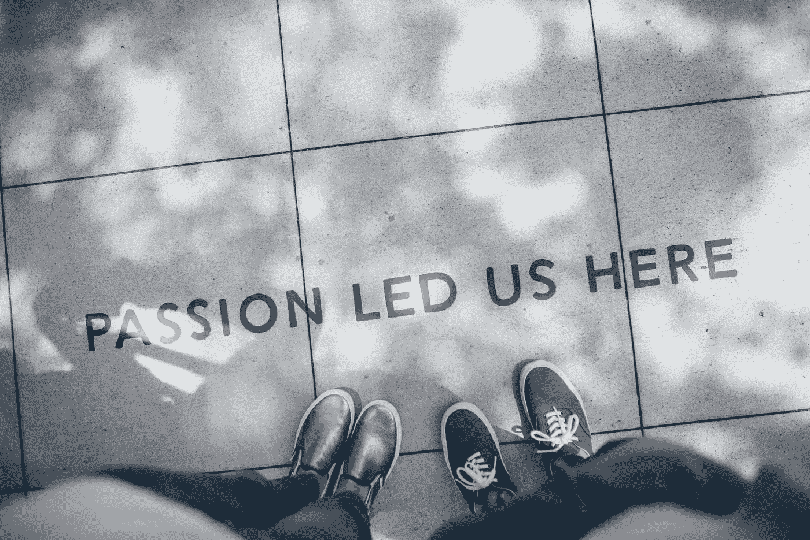

# 我选择职业的方法

> 原文：<https://betterprogramming.pub/how-to-choose-a-career-path-185463d5e566>

## **如果你不确定该走哪条职业道路也没关系**

伊恩·施耐德在 [Unsplash](https://unsplash.com/s/photos/career?utm_source=unsplash&utm_medium=referral&utm_content=creditCopyText) 上的照片

几周前，我和我十几岁的弟弟谈论他的未来。他是一个非常聪明的孩子，对自己想从事的职业有一个模糊的想法，但他仍然有点不知道该走哪条职业道路。

他擅长许多事情。然而，他不确定该选择哪一个。他想知道我是如何选择职业的。我问了他很多问题，希望他的回答能给我一些线索，更好地回答他的问题。

我很幸运，有一天在高中看电影时偶然发现了编程。

人们有时会从事他们并不打算从事的职业。当然，重新开始永远不会太晚。然而，第一次做对总是更好。

尽管我热爱作为一名软件工程师的一切，但我有时会对此产生怀疑。各种各样的问题在我脑海中涌现。

我将与大家分享我自己应用的一些概念，我认为它们会让选择职业道路变得不那么困惑和痛苦。

# **找出你擅长的事情**

帮助我选择职业的一件事是知道我擅长什么。你必须知道你擅长什么。

你可以擅长很多事情。但是，在接下来的 20-40 年里，你能想象自己在做什么？对某件事充满热情并不能让你擅长它。

回答这些问题时，你需要对自己诚实。你有天赋还是擅长某件事？有什么区别，你可能会问自己？很高兴你问了。

技能被定义为在职业、工艺或艺术方面的准备和熟练程度。天赋(或天赋或才能)是某人必须做好人们通常喜欢但很难的事情的技能。

理解这种差异将有助于我们理解我们需要为职业生涯付出多少努力。

我们大多数人都知道，一个人可以拿起视频游戏控制器，第一次开始玩任何游戏，就像他们自己创建游戏一样。我们也知道，一个人在某件事情上投入了很多时间，却几乎没有进展。

每个人都有擅长的东西。也许你很有运动天赋，善于言辞，有音乐天赋，等等。只要你愿意，你所擅长的任何事情都可以成为你的职业。

如果你碰巧在某方面有天赋，那就更好了。如果你不能在一件事情上下定决心，因为你擅长这么多，那也没关系。接下来我们将进一步缩小名单。

# **找出对你来说什么是重要的**

在选择职业道路时，人们面临着无数的选择。有些比其他的更明显。

例如，你知道擅长拥抱或搂抱可以成为一种职业吗？当然，你总是可以从事一些更传统的工作，比如当医生、研究员、生物学家、工程师等等…

对你来说重要的东西可以决定你的职业选择，尽管你在某方面很有技能或天赋。

你如何发现什么对你来说是重要的？

你需要问自己很多问题来找出什么职业适合你。这里有几个问题你可以先问一下。

1.  我是户外型还是室内型的人？
2.  我喜欢做重复性的工作吗？
3.  我是属于幕后型还是前台型的人？
4.  钱对我来说是最重要的吗？
5.  我想改变这个世界吗？
6.  我是分析型还是综合型思想家？
7.  我是领导者还是追随者？

回答这些问题将有助于你找到更合适的职业。考虑这些场景。

吉娜喜欢呆在室内，喜欢成为关注的焦点，而且她是个美食爱好者。她喜欢谈论食物，并向朋友推荐她最喜欢的餐馆。

她过着保守的生活，喜欢玩乐和吃美食。

Gina 的描述回答了问题 1、2、3 和 4。吉娜有几个选择。但是，既然我们试图帮助她找到适合她的个性的东西，我认为烹饪艺术似乎是一个很好的职业。美食评论家的职业对她来说是最理想的选择。

唐纳德是一个非常有才华的音乐家，喜欢室内和室外。他的声音可以安抚愤怒的龙。他写歌，但他不太喜欢成为关注的焦点。

他更喜欢让别人唱他的歌。他喜欢创作音乐，因为他相信音乐能改善人们的生活。

唐纳德的描述回答了问题 1、3 和 5。与吉娜类似，他有几个选择。但是，如果我要根据唐纳德的形象做出决定，我会说歌曲作者/作曲家/制作人的职业生涯对唐纳德来说是最理想的。

当你把你所知道的和重要的结合起来，并且能够回答所有重要的问题，那么这个过程就会变得容易得多。越多越开心。

一次探索多条路径是可以的。找出相似点和不同点，帮助你进一步缩小选择范围。如果你碰巧是那种喜欢在做决定前全面考虑事情的人，那么最好早点开始问这些问题。

# **尽职调查**

做你的研究。确保你知道无论你选择什么样的职业都会是什么样的。

在我决定获得计算机科学学士学位之前，我参加了一些网页设计课程，只是为了感受一下会是什么样子。如今，你可以在任何领域找到关于其他人经历的故事和证词。利用你所掌握的任何工具做出明智的选择。

我也问过我哥哥同样的问题和其他一些问题。他很有艺术细胞，喜欢画卡通和动画，他喜欢户外和室内，现在不太在乎钱。

他还希望通过他的艺术改善人们的生活。经过几次试探，我们能够将他的选择缩小到两条职业道路，平面设计和网络开发。

如果你碰巧认识某个你正在考虑选择的领域的人，和他们谈谈。他们可以提供更多的见解，而不是在网上搜索信息。

我计划带我哥哥和我一起工作一天，这样他就可以跟着我们的一个平面设计师了。没有解决任何问题的灵丹妙药，但是这个简单而有效的方法会让你的生活变得更轻松。

# 相关作品

*   [我在技术领域获得晋升的策略](https://medium.com/better-programming/how-i-set-myself-up-for-promotions-b95b2d953e1d)
*   [什么时候是离开现在职位的合适时机？](https://medium.com/better-programming/is-it-time-to-leave-your-job-981d4e1a1b38)
*   [如果辞职后给你更多的钱，你还会离开吗？](https://medium.com/better-programming/should-you-still-leave-if-offered-more-money-after-resigning-67b10d440db3)
*   拥抱失败，这是成功之旅的一部分
*   [成功一定要有学历吗？](https://medium.com/better-programming/is-a-degree-necessary-to-be-successful-297911f5dda8)
*   [我蹒跚学步的孩子，我的导师](https://medium.com/better-programming/my-toddler-helped-my-professional-career-b99ce7fa42e)
*   用一个梦想换另一个梦想是可以的