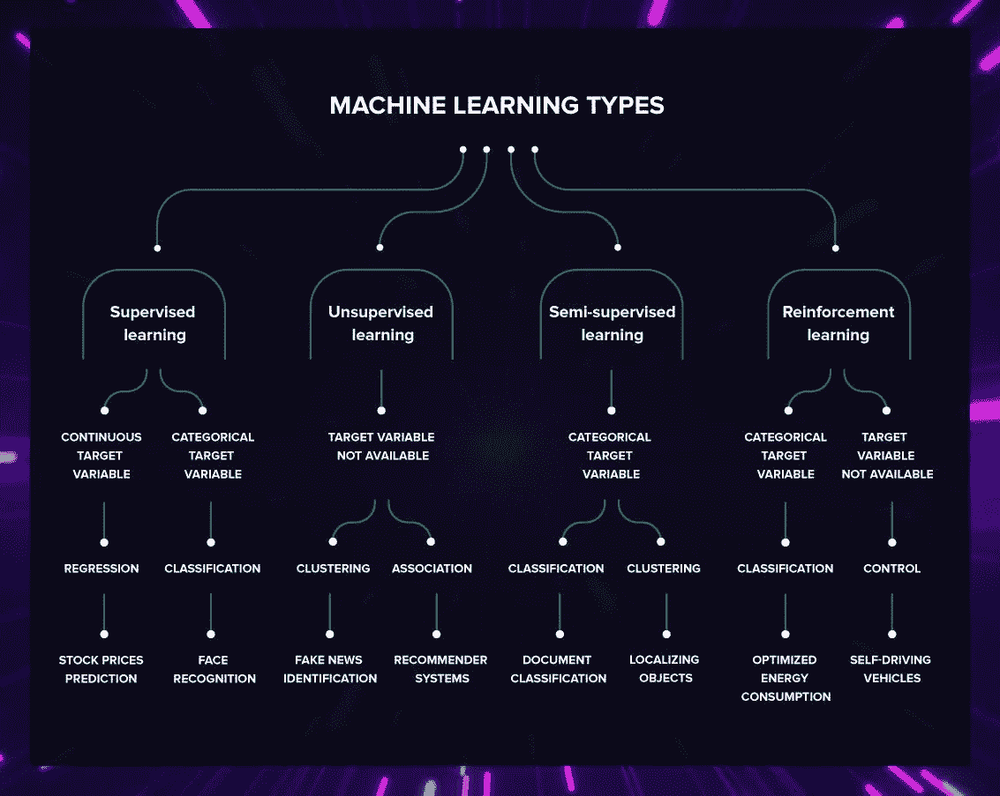
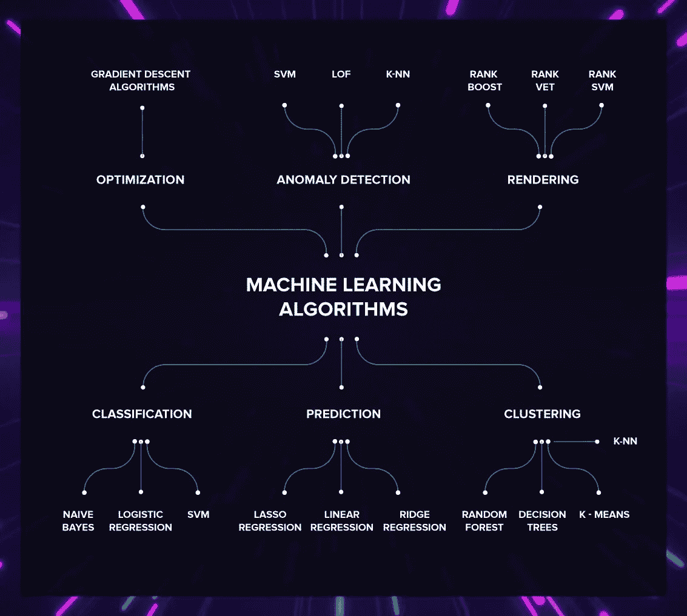
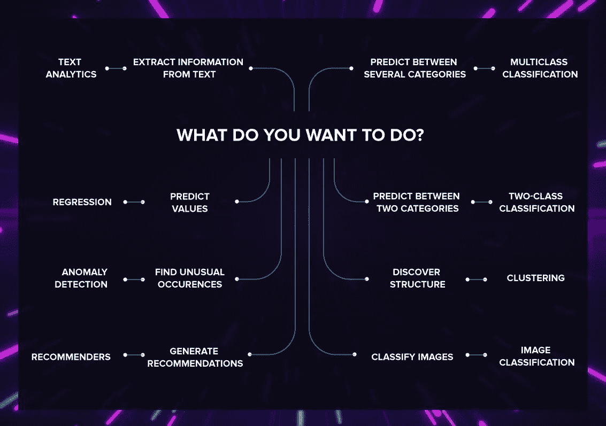

# 如何选择适合自己的机器学习算法

> 原文：<https://betterprogramming.pub/how-to-choose-the-machine-learning-algorithm-thats-right-for-you-652983383720>

## 让我们来谈谈它们的不同之处

为什么有这么多机器学习技术？问题是不同的算法解决不同的问题。你得到的结果直接取决于你选择的模型。这就是为什么知道如何将机器学习算法与特定问题相匹配如此重要。

在这篇文章中，我们将谈论这一点。让我们开始吧。

# 有多种机器学习技术

首先，要为你的项目选择一个算法，你需要知道存在哪些种类。让我们复习一下不同分类的知识。

## 按学习风格分组的算法

可以根据学习风格对算法进行分组。

**监督学习**

在监督学习的情况下，机器需要一个*老师*来*教育*它们。在这种情况下，机器学习专家收集一组数据，并对其进行标记。然后，他们需要将训练集和规则传达给机器。下一步是观察机器如何处理测试数据。如果出现一些错误，程序员会纠正它们，并重复该操作，直到算法准确运行。

**无监督学习**

这种类型的机器学习不需要教育者。给计算机一组未标记的数据。它应该自己找到模式并提出见解。人们也可以通过提供一组带标签的训练数据来稍微指导机器。在这种情况下，它被称为*半监督学习。*

**强化学习**

强化学习发生在计算机需要运行的环境中。环境充当老师，为机器提供积极或消极的反馈，这被称为*强化。*

*你可以在我们关于* [*人工智能和机器学习的区别*](https://serokell.io/blog/ai-ml-dl-difference) 的帖子中找到关于这些技术的更详细的解释

# 按问题类型分组的机器学习技术

另一种将技术分组的方法是基于它们解决的问题。

在这一部分，我们将讨论分类、回归、优化和其他算法组。我们还将看看它们在工业中的用途。我们之前也写过关于[机器学习算法分类](https://serokell.io/blog/machine-learning-algorithm-classification-overview)。

## 常见算法

下面是最流行的 ML 算法。有时他们属于不止一个群体，因为他们能有效地解决不止一个问题。

*   逻辑回归
*   线性回归
*   决策图表
*   SVM
*   朴素贝叶斯
*   k-神经网络
*   k 均值
*   神经网络
*   随机森林
*   降维算法
*   梯度推进算法

为了帮助你确定自己的方位，请使用这张图片。它包含了我们将要讨论的常见算法。

## 分类

分类帮助我们处理各种各样的问题。它可以让我们做出更明智的决定，整理垃圾邮件，预测借款人是否会归还贷款，或者在脸书的照片上标记朋友。

这些算法预测离散变量标签。一个*离散变量*有可计数的可能值，并且可以被分类。预测的准确性取决于您选择的模型。

想象一下，你开发了一种算法，可以预测一个人是否患有癌症。在这种情况下，你选择的模型在预测结果时应该非常精确。

典型的分类算法是[逻辑回归、朴素贝叶斯和 SVM](https://serokell.io/blog/machine-learning) 。

## 使聚集

有时候你需要把东西分门别类，但是你不知道这些类别是什么。分类使用预定义的类来分配给对象。

另一方面，聚类允许您识别对象之间的相似性，并根据它们共有的特征对它们进行分组。这是检测欺诈、分析文档、对客户进行分组等工作背后的机制。聚类在销售和营销中广泛用于客户细分和个性化交流。

K-NN、k-means 聚类、决策树和随机森林都可以用于聚类任务。

## 预言；预测；预告

试图找出两个或多个连续变量之间的关系是一个典型的回归任务。

**注:**如果一个变量可以取其最小值和最大值之间的任意值，则称之为*连续变量。*

这种任务的一个例子是根据房屋的大小和位置来预测房价。在这种情况下，房子的价格是一个连续的数字变量。

线性回归是该领域最常用的算法。当需要对两个以上变量之间的关系进行建模时，可以使用多元回归算法、岭回归和 LASSO 回归。

## 最佳化

机器学习软件使您能够提供一种数据驱动的方法来持续改进几乎任何领域。您可以应用产品使用分析来发现新产品功能如何影响需求。配备经验数据的复杂软件有助于发现无效的措施，让您避免不成功的决策。

例如，为了提高动态制造系统适应和自我管理的能力，可以使用一个分层制造控制系统。机器学习技术实时发现各种情况下的最佳行为——从而导致系统的持续改进。

[梯度下降算法](https://towardsdatascience.com/demystifying-optimizations-for-machine-learning-c6c6405d3eea)通常在 ML 中用于优化。

## 异常检测

金融机构每年因欺诈损失约 5%的收入。通过基于历史交易、社交网络信息和其他数据来源建立模型，有可能在为时已晚之前发现异常。这有助于实时检测和防止欺诈交易，即使是以前未知的欺诈类型。

典型的异常检测算法有 SVM、LOF、k-NN 和 k-means。

## 等级

你可以应用机器学习来建立[排名模型](https://en.wikipedia.org/wiki/Learning_to_rank)。机器学习排名(MLR)通常涉及监督、半监督或强化算法的应用。排名任务的一个例子是搜索引擎系统，如谷歌的搜索维基[。](https://en.wikipedia.org/wiki/Google_SearchWiki)

排名算法的例子有 RankNet、RankBoost、RankSVM 等。

## 建议

推荐系统为用户提供有价值的建议。这种方法给用户带来了效用，也使公司受益，因为它激励他们的客户购买更多或探索更多的内容。

项目根据它们的相关性进行排序。最相关的显示给用户。相关性是基于历史数据确定的。如果你在 YouTube 或网飞上看过任何东西，你就会知道它是如何运作的。这些系统为你提供与你已经看过的视频相似的视频。

用于推荐系统的主要算法是协同过滤算法和基于内容的系统。

# 如何选择机器学习技术来解决你的问题

如何找到最适合你问题的机器学习算法？您可以使用三种基本方法。

## 任务型学习

将你的问题分类。可以根据输入和输出对任务进行分类。

**通过输入**

*   如果你有一组标记数据或者可以准备这样一组数据，这就是监督学习的领域
*   如果你仍然需要定义一个结构，这是一个无监督的学习问题
*   如果您需要模型与环境交互，您将应用强化学习算法

**按输出**

*   如果模型的输出是一个数字，这就是回归问题
*   如果模型的输出是一个类，并且期望的类的数量是已知的，那么这就是一个分类问题
*   如果模型的输出是一个类，但是期望的类的数量是未知的，这是一个聚类问题
*   如果你需要提高性能，那就是优化
*   如果你想让一个系统提供基于动作历史的选项，这是一个推荐问题
*   如果你想从数据中获得洞察力，应用模式识别模型
*   如果您想检测问题，请使用异常检测算法

# 了解您的数据

选择算法的过程不限于对问题进行分类。您还需要仔细查看您的数据，因为它在为问题选择正确的算法时起着重要的作用。

一些算法在较小的样本集下正常工作，而另一些算法需要大量的样本。某些算法处理分类数据，而其他算法只处理数字输入。

了解您的数据需要某些步骤:

*   **处理:**数据处理的组成部分是预处理、分析、清理以及从不同的内部和外部来源收集数据
*   **特征工程:**你需要将原始数据转换成能够向预测模型表示潜在问题的特征。它有助于提高准确性，并更快地获得所需的结果。

选择算法是一项综合任务，需要分析各种因素。

可能影响型号选择的其他因素:

*   模型的准确性
*   模型的可解释性
*   模型的复杂性
*   模型的可扩展性
*   构建、训练和测试模型所需的时间
*   使用模型进行预测所需的时间
*   如果模型符合您的业务目标

# 试错法

有时候问题太复杂，不知道从何下手。不止一个模型看起来很合适，很难预测哪一个会是最有效的。在这种情况下，您可以测试几个模型并对它们进行评估。

建立一个[机器学习管道](https://towardsdatascience.com/architecting-a-machine-learning-pipeline-a847f094d1c7)。它将根据您的评估标准比较数据集上每个算法的性能。另一种方法是将你的数据分成子集，然后[对不同的组使用相同的算法](https://www.researchgate.net/post/How_to_compare_feature_importance_of_two_different_datasets_using_same_supervised_learning_algorithm)。最好的解决方案是执行一次，或者让一个服务在添加新数据时定期运行。

# 神经网络

最后，ML 今天必须解决的大部分任务都可以在神经网络的帮助下解决。因此，选择最大似然模型的最后一种方法是始终使用人工神经网络。

然而，这些模型构建起来既昂贵又耗时，这也是其他模型仍然存在的原因。为了精确，神经网络需要非常大的数据库。其他类型的 ML 技术可能不那么通用，但即使在处理小数据集时也能有效地解决分配的任务。

此外，它们往往会过度拟合，也很难解释——神经网络基本上是黑盒，研究人员不知道内部发生了什么。

因此，如果你的预算很少，数据样本很少，或者渴望获得容易理解的有价值的见解，那么神经网络不适合你。

# 最后的想法

你的结果取决于你是否设法选择和建立一个成功的 ML 模型。如果你心中有一个机器学习项目，并且正在寻找解决方案，Serokell 的开发人员可以帮助你建立和实现一个适合你的业务目标的机器学习模型。