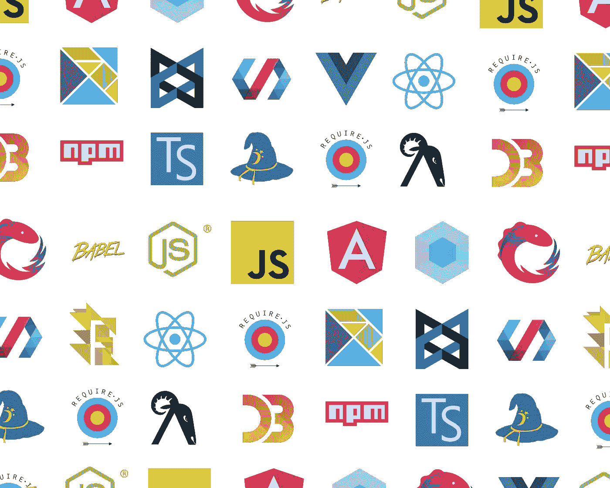

# 如何为您的项目选择正确的依赖项

> 原文：<https://betterprogramming.pub/how-to-choose-the-right-dependencies-for-your-project-310cdbbcb05e>

## 关于为项目选择库、框架或 SDK 的建议

JavaScript 框架集:版权归 Jose Aguinaga 所有

外部库和框架通过提供现成的功能使我们的生活变得更加容易。这有助于我们避免为每个项目重新发明轮子的需要。

鉴于可用的解决方案多种多样，选择正确的依赖项可能会令人困惑且耗时。在这篇文章中，我会给你一些如何做出最佳决定的策略。

# 库、框架和 SDK

库、框架和 SDK 都提供了将预写代码引入项目的方法。

根据[马丁·福勒](https://martinfowler.com/bliki/InversionOfControl.html)的说法，库和框架的主要区别在于:

*   框架调用您的代码
*   您的代码调用了一个库

“框架”的含义也可能因上下文而异。它可以指从脚本集合到构建应用程序所需的任何东西。

一般来说，“图书馆”这个词更具体:

> 一个行为实现的集合，用一种语言编写，有一个定义良好的接口来调用行为——维基百科

我们可以将 Windows DLLs、Python 包和 Ruby gems 描述为库。

因此，库、框架、SDK 在某种程度上混为一谈，但是为了讨论的目的，选择最佳选项的考虑因素是相同的。

# 不要多此一举

向项目添加依赖项时，首先要考虑的是，不管许可或财务成本如何，没有第三方依赖项是真正免费的。学习、整合和维护依赖关系总是要付出代价的。但是，这些成本需要与节省的时间进行权衡，因为不必从零开始或在替代方案上实现功能。

除非您正在处理的问题微不足道，或者与您独特的业务需求紧密相关，否则很可能有人已经在某个地方解决了它。在这些情况下，通常有可能找到一个现有的解决方案，为您节省时间和金钱。

# 选择标准

因此，您决定为您的项目使用第三方库来节省精力，但是您正在寻找的解决方案有 50 种不同的实现。你如何选择一个？

以下是一些有帮助的标准，大致按照优先级从大到小的顺序排列:

*   **便携性。我通常在库中寻找的第一件事是它是否支持我正在开发的平台。说它“应该工作”不算数——它需要在所有支持的平台上进行*测试*。这是一个轻而易举的胜利，因为它使不兼容的库能够被快速淘汰。**
*   **许可和费用。如果许可模式不适合你的项目，选择一个库是没有意义的。留意 GPL 和类似的 copyleft 许可证，如果你链接到它们，它们要求你的项目是开源的。通常，我会寻找一个[许可的](https://en.wikipedia.org/wiki/Permissive_software_license)执照，比如麻省理工学院或者 BSD。许可是快速排除选项的另一种方式。**
*   **维护状态。**另一个障碍是依赖关系是否被积极维护。确定这一点的一个好方法是查看最后一个版本是什么时候发布的，以及发布的频率。对于版本控制下的项目，您还可以考虑最后一次提交和提交的频率。如果一个项目在超过 12 个月的时间里没有定期的活动，我通常会继续。
*   **采用的广度。**这是指一个库或框架有多流行和广泛使用。您可能会发现一个项目符合标准 1–3，但在 GitHub 上只有几颗星，或者只在作者自己的项目中使用。如果一个依赖项已经在很多项目中使用过，这意味着它已经在“野外”测试过了这也意味着它不太可能被遗弃。
*   **质量。快速评估一个依赖的质量并不总是容易的，但是它被广泛采用的程度可以提供一些线索。其他质量指标可以是代码的整洁度和可读性(如果源代码可用)，文档的质量，以及依赖项是否带有自己的单元测试。**
*   **易于集成。如果一个项目符合所有其他条件，我通常愿意付出一点努力来整合一个依赖项。尽管如此，集成的容易程度可能是两个同等项目之间的决定性因素。通过一个包管理器( [pyp](https://pypi.org) i、 [rubygems](https://rubygems.org) 、 [npm](https://www.npmjs.com) 等)寻找依赖是否可用，是否有一个构建系统(make、 [CMake](https://cmake.org) 等)，或者是否可以简单地集成(例如一个文件依赖)。**
*   **大小。**如果你需要一个库来提供一个特定的功能，例如，一个双向映射容器，使用一个第三方库来做这个和其他 50 件事情可能是没有意义的。相反，在可能的情况下，最好找到满足您需求*最少*的解决方案。较大的库可能会增加臃肿，尽管如果您需要广泛的功能，它们可能是正确的选择。
*   **社区。如果一个完全符合要求的图书馆背后有一个伟大的社区，这是一个额外的收获。这里要寻找的是项目是否有一个可以提问的论坛或邮件列表，是否存在关于堆栈溢出和问题跟踪活动的问题。一个积极向上的社区是项目健康的良好标志。查看任何论坛的活跃程度也很有用——一个不活跃的论坛可能表明一个项目正在停滞。**
*   **效率**。如果您的项目有很强的效率需求，例如，软件需要实时运行，那么您还会想看看依赖项的实现有多高效。在为 Ruby 或 Python 这样的解释型语言选择依赖项时，这一点尤其重要，在这些语言中，有些包是 C/C++库的包装器，而其他包则完全是用解释型语言编写的。作为一般规则(虽然不总是！)包装会快很多。

# 推荐

当您开始为您的项目选择下一个库或框架时，尝试使用我上面概述的标准来指导决策。如果我要做一个大的承诺，我通常会用上面的标题列一个表格，并根据每个库符合标准的程度来评分。一旦我将范围缩小到两三个，我将为每个库编写一个简单的“hello world”应用程序，看看使用起来感觉如何，或者是否有任何问题出现。

一旦你选择了依赖，试着坚持下去。如果有问题，贡献报告和修复上游。

我希望这些建议有用。如果你还有其他的，请在下面的评论里分享！感谢阅读。