# 如何为您的项目选择正确的 NPM 软件包

> 原文：<https://betterprogramming.pub/how-to-choose-the-right-npm-package-for-your-project-c3d1cc25285e>

## 从无穷无尽的模块中选择合适的包可能会让人不知所措。这有帮助

由[尤金尼奥·马佐恩](https://unsplash.com/@eugi1492?utm_source=medium&utm_medium=referral)在 [Unsplash](https://unsplash.com?utm_source=medium&utm_medium=referral) 拍摄的照片。

如果你在节点或前端 JavaScript 世界呆过一段时间，你可能熟悉 [NPM](https://www.npmjs.com) ，并且知道有成千上万的模块可供选择。

> “分析瘫痪描述了一个个人或群体的过程，此时[过度分析](https://en.wikipedia.org/wiki/Analysis)或过度思考一种情况会导致前进运动或[决策](https://en.wikipedia.org/wiki/Decision-making)变得“瘫痪”，这意味着没有解决方案或行动过程被决定。”— [维基百科](https://en.wikipedia.org/wiki/Analysis_paralysis)

# NPM(节点包经理)

NPM 是世界上最大的软件注册中心，拥有超过 100 万个软件包。JavaScript 开发人员可以很容易地共享他们为解决特定问题而创建的代码，其他开发人员也可以在自己的应用程序中重用这些代码。

一旦你依赖于其他开发者的代码，NPM 可以很容易地检查是否有任何更新，并在更新发生时下载这些更新。

这些可重用的代码称为包，有时也称为模块。一个包就是一个目录，其中有一个或多个文件，还有一个名为`package.JSON`的文件，其中有一些关于这个包的元数据。

# 项目相关性

一个典型的应用程序，比如一个网站，将依赖于几十或几百个包。这些包通常很小，一般的想法是你创建一个小的构建块来解决一个问题并很好地解决它。

这使得您可以用这些小的共享构建块组成更大的定制解决方案。这有很多好处。通过引入专注于特定问题领域的人的包，您的团队可以从组织外部吸取专业知识。

你可以通过浏览 NPM 网站找到包裹。在那里，您会发现不同种类的包:可以在服务器端使用的节点模块，为命令行添加命令的包，以及其他可以在前端的浏览器中使用的包。

# 我应该什么时候使用？

假设你正在开发“下一个伟大的应用程序”你遇到了一个问题，并决定你不想或不知道如何写一个特定的功能。

你想安装一个包的主要原因之一是使用预先存在的代码。当您可以下载可以立即在应用程序中使用的独立工具时，您无需重新发明轮子或进行大量耗时的编程。

“肯定有一个别人已经写好的外部酷库。”

好吧，你可能是对的，但请记住，NPM 的缺点之一是注册处没有提交的审查程序。这意味着在那里找到的包可能是低质量的、不安全的或恶意的。

那么，您将如何找到适合您需求的软件包呢？随着时间的推移，您如何知道可以信任它来完成工作？在成千上万个可供选择的包中，选择哪一个可能并不明显。

有这么多可用的和新的被认为是“你真正应该转向的”，为你的项目选择一个正确的可能是令人畏缩的。

> “与其浪费时间在谷歌上搜索、浏览 npmjs.org，还不如浪费更多的时间不去构建你的应用程序，知道什么时候选择哪个模块会更好。”— [科里·克利里](https://www.coreycleary.me/which-of-the-635000-npm-modules-do-i-choose/)

# 寻找适合您的 NPM 套餐

通过谷歌或搜索 NPM 网站，你可以找到你最初的候选套餐。一旦你找到他们，NPM 网站将为你提供关于这些软件包的信息。

NPM 公开了统计数据，包括下载次数、依赖包的数量等，以帮助开发者判断包的质量。

# 选择标准

在选择和使用软件包之前，您可能需要考虑以下参数。

## 流行

流行度表示这个包被下载了多少次，以及有多少其他项目依赖于它。这是其他人发现有用的包的一个强有力的指示器。

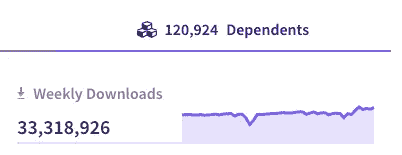

NPM 每周下载图表和依赖包

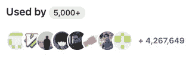

统计使用的 GitHub

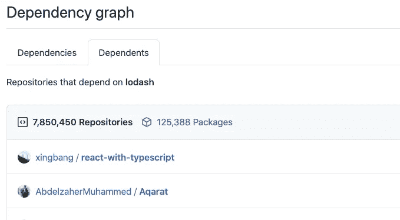

[GitHub 回购见解家眷](https://github.com/lodash/lodash/network/dependents)

问问你自己:

*   有多少周下载量？
*   其他重要的包依赖它吗？
*   有多少 GitHub 用户用过？
*   它有多少颗 GitHub 星？
*   可信的开发者和维护者开始了吗？

## 贡献者

查看每个项目的贡献者人数。更多人关注代码只会是一件好事。

[GitHub 回购贡献者](https://github.com/lodash/lodash/graphs/contributors)

问问你自己:

*   有多少贡献者？
*   受信任的开发人员对此有贡献吗？

## 维护

更频繁维护的包更可能有更少的错误，也更稳定。此外，频繁的更新表明问题已经解决，可能还有新的功能发布。

此外，检查发布次数。一个包含许多版本的包是一个很好的迹象，表明它更加活跃。

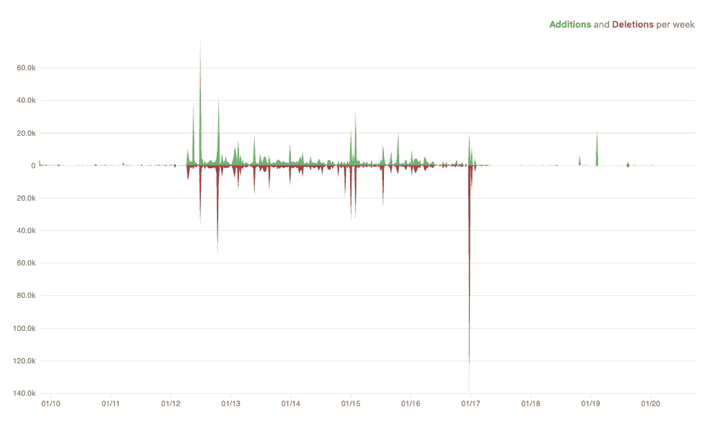

[GitHub repo insights 代码频率](https://github.com/lodash/lodash/graphs/code-frequency)

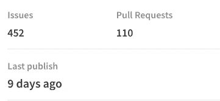

NPM 包装统计

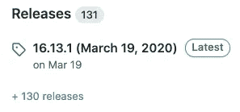

GitHub 发布统计数据

问问你自己:

*   最近更新了多久？
*   更新的频率如何？
*   有多少版本？
*   GitHub 上的问题是否已经关闭，或者相同的问题是否已经打开了很长时间？

## 大小

包的大小随着它的代码量和它所使用的依赖项的增加而增加。较大的包大小会影响您的应用程序及其性能。

为了避免这种情况，您可以在安装之前检查软件包的大小。你可以在 NPM 网站上或者通过使用一个叫做 [BundlePhobia](https://bundlephobia.com/) 的伟大工具来完成，这个工具可以帮助你查看这个软件包是否符合你的性能要求。

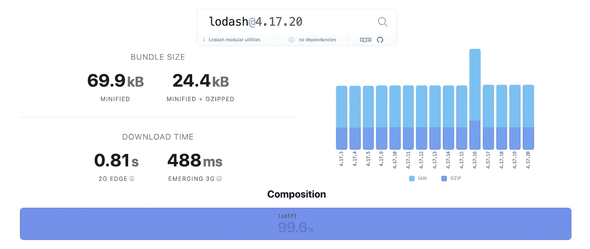

截图来自[恐布症](https://bundlephobia.com/)

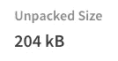

问问你自己:

*   包装尺寸可以接受吗？
*   它的下载时间对于你的用例来说是不是太长了？

## **质量**

质量包括诸如存在最新的依赖关系、文档、稳定性、测试、专用网站、严格的拉请求策略等考虑因素。

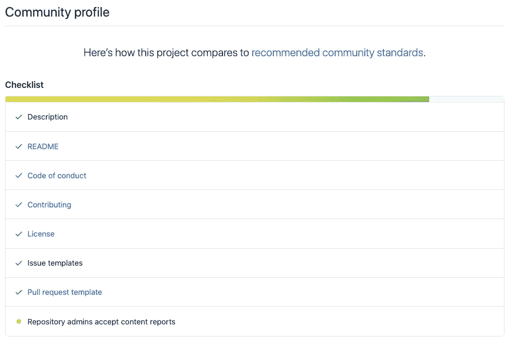

[GitHub 回购洞察社区](https://github.com/facebook/react/community)

问问你自己:

*   包是否有据可查，是否有自己的网站？
*   模块有测试覆盖率吗？
*   这个包有漏洞吗？

# 比较相似的包装

通常，您可能会找到多个适合您需求的包。在这种情况下，您可能想要比较它们，并确定哪个真正符合您的需求、经常管理并且常用。

## npm 趋势

比较产品包的最佳工具之一是 [npm 趋势](https://www.npmtrends.com/)。约翰·波特的这个工具允许你搜索包，并在图表上看到下载数量，时间表，GitHub 统计数据等等。

这是一个非常酷的工具，你可以搜索任何包，它会自动为你提供类似的包。因此，知道一个适合你的需求的包就足够了，然后你可以把它和竞争对手进行比较。

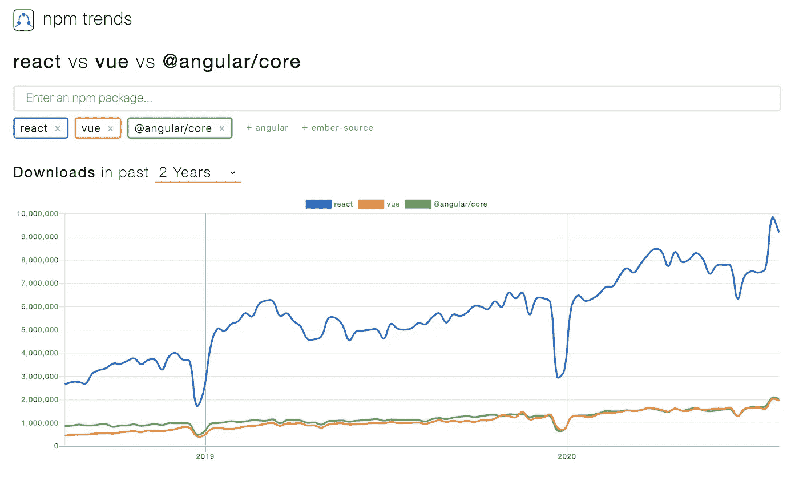

截图来自 [npm 趋势](https://www.npmtrends.com/)。

## NPMCompare

另一个很棒的工具是 [NPMCompare](https://npmcompare.com/) 。它显示了两个包的非常详细的并排比较，并突出显示了每个指标(报告的问题、平均更新时间、大小等)中哪个包是最好的。).最后给出一个汇总分数。

它还会产生一段详细的对比描述，您可以将这段描述发送给您的经理，以解释您为什么选择了这一特定的薪酬方案。

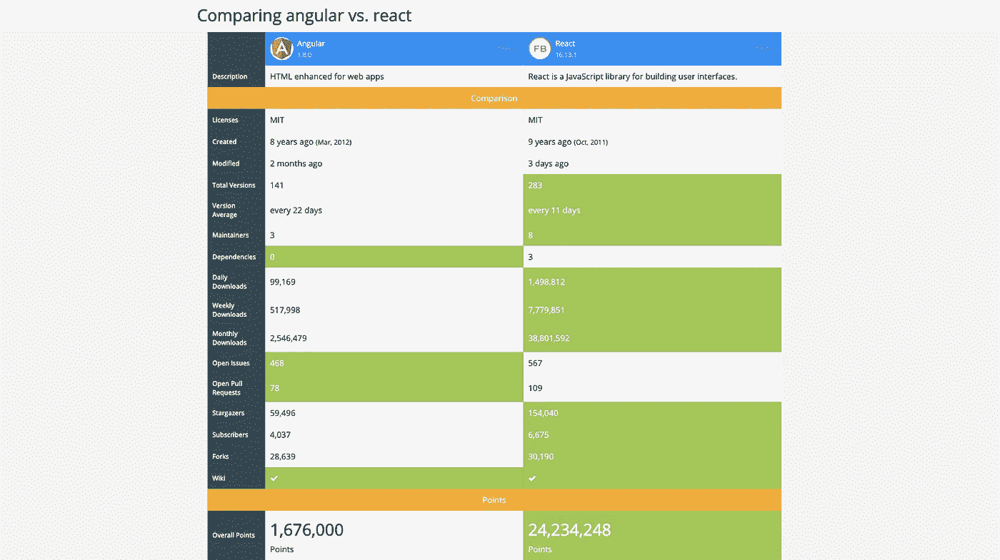

截图来自 [NPMCompare](https://npmcompare.com/) 。

# 结论

虽然使用预制的外包包并不总能解决您的问题，但是依赖现成的工具通常比从头开始重新实现解决方案更容易。

由于开源软件库已经变得更加全球化，作为开发者，不互相依赖没有任何意义。

我希望在这个指南的帮助下，您现在能够更好地理解如何为您的项目选择正确的包。

祝您愉快！感谢阅读！