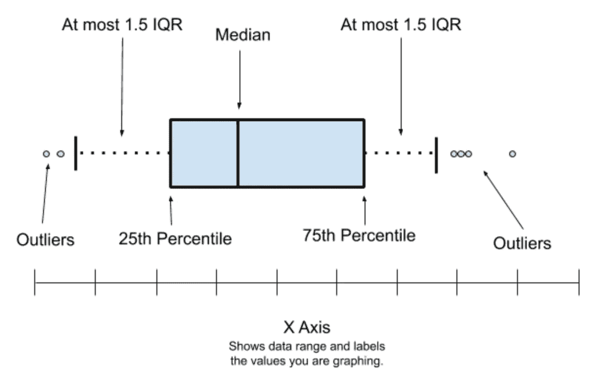
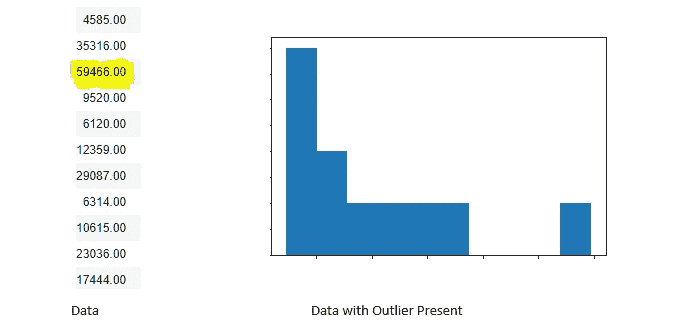
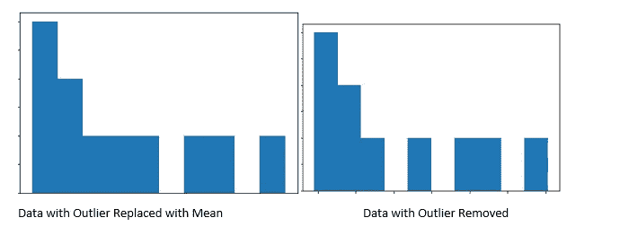

# 作为数据科学家，如何清理您的脏数据

> 原文：<https://betterprogramming.pub/how-to-clean-your-dirty-data-152d859dc417>

## 用熊猫清理数据


[在](https://unsplash.com/@thecreative_exchange?utm_source=medium&utm_medium=referral) [Unsplash](https://unsplash.com?utm_source=medium&utm_medium=referral) 上创意交流的照片。

数据很少干净到足以进行分析。数据分析的很大一部分涉及清理数据，因为现实生活中的数据是“脏的”下面是一些有用的技术，可以用来清除数据中的污垢。

# 消除多余字符

在分析数据时，密切注意某些变量是否包含额外的字符是很重要的。

一个额外的字符可能会改变数据集的性质。例如，它可以将数字字符转换为字符串。

虽然`1,000`是一个数值，但大多数编程语言和软件会将`$1000`解释为一个字符串，从而无法对其执行操作。当务之急是除掉`$`。

您可以使用 [pandas](https://pandas.pydata.org/) ' `str replace`函数删除 Python 中多余的字符:

```
df['A'] = df['B'].str.replace('$', '')
```

你也可以通过使用`.strip`方法去掉不必要的空格(开头和结尾):

```
df1['Gender'] = df1['Gender'].str.strip()
```

此外，数据集中的一个额外字符会让我们丢失重要信息。例如，“`Female`”不同于“ `Female`”或“`Female` ”如果我们想回答的问题是“一个班里有多少个`Females`？”，这可能会给我们一个不正确的结果然后有必要去掉多余的字符(在这个例子中包括空格),这样我们就有了一个干净的数据集。

# 重复记录

去杜平可以定义为从数据集中删除重复或相同记录的过程。几个因素可能会导致数据集中出现重复记录。可能是打字错误，数据输入了不止一次。这可能是数据收集错误，从同一来源多次收集数据。也可能是编程错误，程序不止一次提交记录。

重复的记录可能会给我们的数据增加偏见，并阻止我们正确地解释数据集。因此，识别数据集中的唯一值并去除所有重复值非常重要。

使用`unique`功能可以获得熊猫的唯一记录:

```
df['A'].unique() #For the Unique Records
df['A'].nunique() #For the number of Unique Records.df.duplicated() #Checks the duplicates in the dataset
df.drop_duplicates(inplace=True) #This drops the duplicates in the dataset
```

# 缺失数据

最常见的数据问题之一是处理缺失数据。通常，缺失数据可以表示为:

*   一片空白
*   破折号(`-`)
*   `NaN`、`N/A`或`Null`

解决这个数据问题很重要，因为当存在缺失数据时，许多统计分析无法进行。缺失数据也会给我们的数据增加偏差。

## ***处理缺失数据的方式***

处理丢失数据的一种方法是删除丢失的数据。通常不鼓励删除包含缺失数据的行/列，尤其是当许多行/列包含缺失值时。插补是处理缺失数据的另一种方法。插补是用替代值替换缺失数据的过程。我们可以用数字变量的平均值或中值或定性变量的众数来代替这些缺失值。

`isna`和`notna`可用于识别数据集中变量的缺失数据:

# 极端值

从统计学上来说，异常值是与其他观察值显著不同的数据点。异常值可能是类型/数据输入错误。例如，包含一名 199 岁高中生的学生记录。这也可能不是一个错误。例如，包含一个州的公民收入的收入数据可以使大多数公民的收入在$10K 和$30K 之间。在这种情况下，一个在该州收入 100 万美元的公民可以作为一个离群值。

识别异常值的一种方法是可视化数据。通常，这是使用盒须图来完成的。



学分:[公共实验室](http://publiclab.org)

这也可以通过统计得到。我们数据集中的异常值是任何大于 *Q3 + 1.5 IQR* 或小于 *Q1 -1.5 IQR* 的数据。

处理异常值的一种方法是识别数据源。例如，在学校记录数据中，可能是输入了`19`而输入了`199`。然而，在大多数情况下，不可能得到来源，所以我们要么删除，要么估算。

根据数据的不同，删除记录可能不会影响我们数据的整体结构。但是，在某些情况下，删除记录可能会影响数据集的结构。建议您观察移除异常值的效果。

在异常值未被删除的情况下，可能有必要进行估算。然后用替代值替换异常值。



图片来源:作者



图片来源:作者

# 结论

如前所述，数据清理是数据分析的一个重要部分。同样重要的是，要知道数据清理并不局限于本文中提到的内容。数据污垢可能以各种方式出现，需要优秀的数据分析师来检测和清除数据中的污垢。