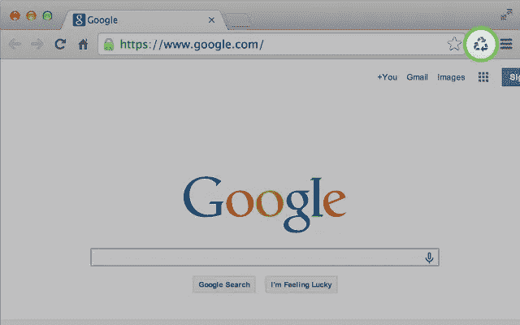
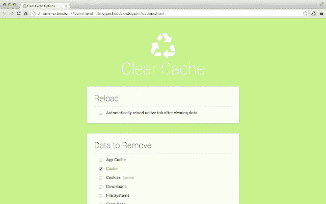
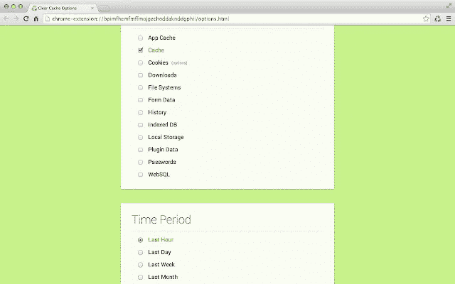

# 如何一键清除浏览器缓存

> 原文：<https://betterprogramming.pub/how-to-clear-your-browser-cache-with-a-single-click-67a9a0ed8e22>

## 也有一种方法可以清除那些烦人的多重步骤

鸣谢:Chrome 网络商店

你有没有想过用一种更简单的方式清理你的浏览器缓存？也许你想清除它，而不必浏览那么多的页面、选项和弹出窗口，询问你是否确定你在做什么。把它放在你浏览器的工具栏里怎么样？

你没看错。这是一个 Chrome 扩展，可以让你选择。

一旦你安装了它，它将在后台处理所有这些中间步骤，并达到相同的结果:清除你的缓存。没有弹出窗口，没有确认对话框，没有多次问你同样事情的烦恼。

此外，它还可以定制，给你的选项包括要清除的数据量、历史记录、本地存储、文件系统、应用缓存、下载、密码、插件数据、 [IndexedDB](https://developer.mozilla.org/en-US/docs/Web/API/IndexedDB_API) 和 [Web SQL](https://www.w3.org/TR/webdatabase/) 。

鸣谢:Chrome 网络商店

您可以删除所有域、某些域或除某些域之外的所有域的 cookies。

你可以在 Chrome 网上商店找到扩展[这里](https://chrome.google.com/webstore/detail/clear-cache/cppjkneekbjaeellbfkmgnhonkkjfpdn?hl=en%20)。