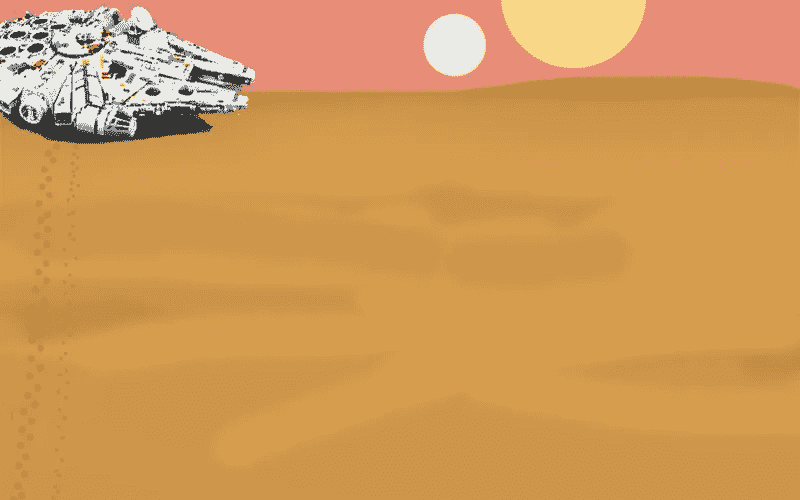
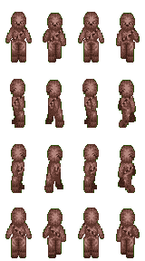
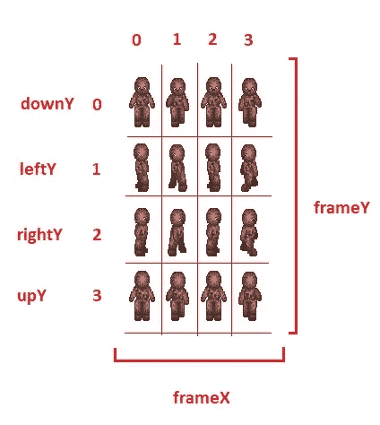
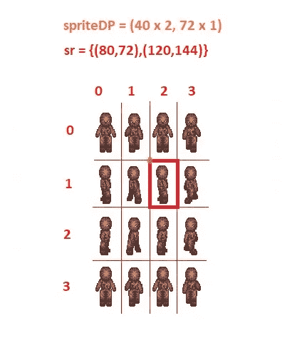

# 如何用 Golang 和 Fyne 编写一个简单的游戏

> 原文：<https://betterprogramming.pub/how-to-code-a-simple-game-in-golang-and-fyne-bff184bee9ef>

## 本文将探讨如何使用 Golang、图像包和 Fyne GUI 工具包编写一个可以在图像背景上行走的角色精灵

前段时间看了弗兰克实验室的一些有趣的教程，关于如何用 JavaScript 编写游戏。对于本文，我决定使用 Fyne GUI 工具包而不是 JavaScript 来编写他的一个简单游戏的 Golang 代码。

鉴于 Golang 与 JavaScript 的工作方式不同，我在这里向您展示的代码结构也将与 Frank 实验室的原始代码有所不同。

正如在他的视频教程中，我们不会建立一个完整的游戏，虽然。你可以使用键盘上的箭头键在背景图像上移动一个字符。然而，这可能是一场真正游戏的开始。

# 游戏资产

下面，你可以看到这个项目中使用的两个游戏元素。

我们将使用一个星球大战背景和一个以丘巴卡为特色的雪碧。“朱伊。”这些资源的原始链接可以在弗兰克实验室的教程的 YouTube 页面上找到[。](https://www.youtube.com/watch?v=EYf_JwzwTlQ)

背景图像(左)和字符精灵表(右)

一旦你下载了它们，这些 PNG 图像游戏资产应该放在运行 Go 代码的文件夹下面的一个名为`./assets`的文件夹中。

# 我们将使用的 Golang 软件包

*   **Fyne** :你可以在这里找到 Fyne GUI 工具包[的主页。如果你想了解更多关于 Fyne 的信息，那么我之前的文章，你可以在这里找到](https://fyne.io/)[这里找到](/how-to-create-a-simple-data-entry-desktop-app-with-golang-and-fyne-7c9e543d71e)和[这里找到](/how-to-create-a-crud-desktop-app-with-golang-fyne-and-mongodb-35c54c37291)，你可能也会感兴趣。
*   **图像**:来自标准库的基础图像包的文档可以在[这里](https://pkg.go.dev/image)找到。
*   **时间**:这是一个标准的 Golang 库。你可以在这里找到时间包[的文档。](https://pkg.go.dev/time)

# 代码概述

## 玩家和游戏模型

在第 1–16 行，我们定义了`Player`结构。

`x`和`y`区域是指玩家在游戏中的位置。

`width`和`height`是 sprite 工作表中每个 sprite 的大小。

变量`frameX`和`frameY`分别指子画面在 x 和 y 方向上的位置。

字段`cyclesX`统计子画面上 X 方向的子画面数量。当玩家行走时，这些精灵将从头到尾重复循环。

变量`upY`、`downY`、`leftY`、`rightY`指的是对应于玩家角色方向的特定精灵行。

有 16 个单独精灵的“朱伊”精灵表

变量`speed`是加到玩家 x 或 y 位置的量。

在游戏过程中按下特定键时设置字段`xMov`和`yMov`。

在第 18–24 行，我们定义了`Game`结构。

字段`canvasWidth`和`canvasHeight`是指背景的尺寸。

常量`fps`指的是我们希望运行游戏的每秒帧数。

最后，`then`用于计时——稍后会详细介绍。

## 加载 PNG 文件

上面的代码加载了我们用作游戏资产的 PNG 图像。

它改编自本文中[的代码。我将它修改为专门处理 PNG 图像，并使它返回一个`image.Image`类型的图像。](https://go-recipes.dev/manipulating-2d-images-in-go-96106dd1b93f)

本质上，它打开一个包含 PNG 图像的文件，然后对其进行解码。对于其中的每一步，都有一些基本的错误处理。

关闭文件是延迟的，所以它总是在程序离开函数时发生——不管错误是否发生。

## 设置资产、模型和 Fyne 应用程序

创建一个 Fyne 应用程序，主窗口以“游戏”为标题。

使用上面定义的`load()`功能加载 PNG 文件。

以 Unix 毫秒格式找出现在的时间—这是一个 int64 数字。另存为`now`。

创建一个游戏结构来保存一些相关的变量。将宽度设置为 800，高度设置为 500。`fps`或每秒帧数设置为 10。将`then`字段设置为正确的时间`now`。

最后，我们将`margin`字段设置为 4。这可以确保我们的玩家不会碰到背景边框。

然后我们使用`fps`变量来计算`fpsInterval`。这个变量将在游戏循环中使用——稍后会详细介绍。

完成后，我们将创建一个包含一些重要变量的 Player 结构。玩家的开始位置将在位置`(100, 200)`，其中`(0, 0)`在窗口的左上方。

每个玩家精灵的大小将会是`40px`乘`72px`。起点`frameX`和`frameY`都在`0`。映射到*上箭头*、*下箭头*、*左数组*和*右箭头*键的 sprite 表行将分别为 4、3、0 和 1。速度设定为`9`。`x`和`y`位置的变化`xMov`和`yMov`均设置为`0`。

创建一个名为`img`的 Fyne 画布，并让它保存背景图像。然后将画布的大小设置为背景的原始大小。

现在创建一个名为`sprite`的空白图像，大小与绘制精灵的背景相同，并将其放入 Fyne 画布中。这将被称为`playerImg`。

我们还将创建一个名为`spriteSize`的变量，稍后会用到它。这个变量保持单人精灵的大小。

然后将背景画布`img`和精灵画布`playerImg`添加到名为`c`的 Fyne 容器中。该容器将根据`MaxLayout`布局组织画布。这样做的结果是两个画布都将被设置为最大尺寸。你可以在这里阅读更多关于这个布局[的内容。](https://developer.fyne.io/container/max)

然后我们将窗口`w`的内容设置到容器`c`中。

关键事件和游戏循环将在下面讨论。

窗口`w`被设置为显示在屏幕中间。最后，它被告知显示和运行。

## 定义关键事件

这里我们实现了四个可能的关键事件。假设你应该能够在一部分背景上向四个方向移动玩家角色，我们需要实现这些可能性。

我们首先通过使用函数`Canvas().SetOnTypedKey()`将 Fyne 键事件处理程序附加到窗口`w`的画布上。

switch 语句将处理四种情况中的每一种。你可以在这里找到所有键盘按键[的定义](https://github.com/fyne-io/fyne/blob/master/key.go)。

我们检查玩家角色的位置是否在每种可能性的范围内。在这里，我们记得在适当的时候包括`game.margin`。

根据移动方向，`player.xMov`或`player.yMov`被设置为`player.speed`的正值或负值。此外，通过将`player.frameY`设置为特定的行索引来选择正确的子画面行。

## 游戏循环

这就是游戏循环。这部分程序包含一个无限循环。

对于循环的每次迭代，将有 1 毫秒的暂停。如果需要，这可能会被调整为更长的暂停。

然后我们得到正确的时间`now`并将其转换成`int64` Unix 毫秒。我们将使用它来找出自从我们上次设置`game.then`以来`elapsed`已经过了多长时间。

如果有`elapsed`的时间大于`fpsInterval`的时间，那么我们将进入实际的游戏力学分支。我们只有在`fpsInterval`已经过去时才进入这个分支，以达到正确的游戏速度。

然后我们将`game.then`设置为`now`。

为了从 sprite 表中提取一个 sprite，我们需要一个起点`spriteDP`和一个叫做`sr`的矩形，大小为`spriteSize`并覆盖这个特定的 sprite。

特定精灵周围的矩形示例

为了将精灵放置在背景之上，我们类似地需要一个玩家的参考点`dp`——基于玩家的 x 和 y 坐标——以及一个需要绘制精灵的矩形。这个矩形的尺寸也是`spriteSize`。

现在，让我们首先通过填充`image.Transparent`来清除`sprite`图像。一旦完成，我们可以将特定的精灵从`playerSprites`精灵表转移到`sprite`图像，并使用`canvas.NewRasterFromImage()`创建一个新的光栅。

在游戏循环的最后部分，如果`player.xMov`或`player.yMov`不为零，我们将确定玩家`x`和`y`的坐标以及下一个循环的`player.frameX`。此外，我们还将通过改变`player.frameX`来循环显示该行中的精灵。

如果移动为零，则`player.frameX`被设置为零，这是该行中的第一个子画面。这个精灵也代表了角色的静止姿态。

最后，容器`c`被刷新以确保窗口中的图像被更新。

# 完整的代码

# 参考

[《如何用 JavaScript 和 HTML 画布制作游戏|键盘输入&雪碧动画【香草 JS】》YouTube 上弗兰克斯实验室](https://www.youtube.com/watch?v=EYf_JwzwTlQ)

[“在 Go 中使用图像”，作者 Sau Sheong](https://go-recipes.dev/manipulating-2d-images-in-go-96106dd1b93f)

[Nigel Tao 的“Go image/draw package”](https://go.dev/blog/image-draw)