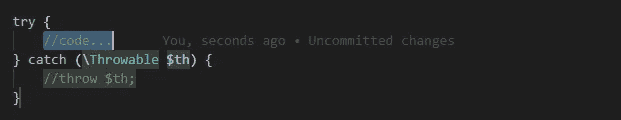

# 如何在 Visual Studio 代码中更快地编码

> 原文：<https://betterprogramming.pub/how-to-code-faster-in-visual-studio-code-e96e7201820c>

## 使用 Visual Studio 代码工具来提高生产率


由[马克·森德拉·马托雷尔](https://unsplash.com/@marcsm?utm_source=medium&utm_medium=referral)在 [Unsplash](https://unsplash.com?utm_source=medium&utm_medium=referral) 上拍摄的照片

Visual Studio Code 是一个免费的开源代码编辑器，支持几乎所有的编程语言。它可以在 Windows、macOS X 和 Linux 系统上运行。

# 超越 IDE

VS Code 有一个专属的 [marketplace](https://marketplace.visualstudio.com/vscode) ，提供许多现成的插件来定制平台以满足您的需求，例如主题、扩展、调试器、语言支持和其他附加支持。

与 Visual Studio 相比，VS 代码明显是轻量级的，这种差异可以立即感觉到。这是因为它在后台独立于 IDE 运行应用程序，确保 IDE 不会变慢。

无论是什么类型的项目，VS 代码都可以轻松帮助你设置 IDE。它还可以运行 Azure 和 Docker，并且在部署应用程序时可以放心轻松地进行部署。它支持 Git 和简单的调试，并且具有智能感知，有助于改进无错误和干净的编码。

# 编码更快

现在你已经了解了 VS 代码，这里有一些独有的特性，可以帮助你轻松地加速和改进编码，从而提高生产率。

## 多光标编辑

多光标编辑功能允许您在代码中的不同位置同时进行编辑。使用多光标编辑，可以通过以下方式实现:

*   **框选择:**用鼠标按下文本时，使用 Shift+箭头键(可选择任何方向)或 Shift+Alt。也可以考虑 Ctrl+Shift+箭头键来选择单词和节。
*   **添加光标:**使用 Ctrl+Shift+箭头键(向上或向下)或带 Alt 的鼠标点击。
*   **在所有出现处创建光标:**选择一个字符串实例并按 Ctrl+Shift+L。现在所有出现处将被一次选中。

## 智能感知

Visual Studio 代码附带了预构建的 JavaScript 和 TypeScript IntelliSense。因此，IDE 会建议下一个可能完成的代码。它类似于谷歌搜索或你的手机上的文本预测功能。

例如，在下面的代码中我们创建了`book` 对象:

```
var book = new  Book();
```

要访问书的`title`属性，我们需要做以下事情:

```
const title = book.title;
```

我们一点击`book`，VS 代码就开始列出`book` 对象的属性和功能。因此，我们可以选择我们需要的属性。假设 VS 代码没有提示任何。然后，我们可以按 Ctrl+Space 来启用带有建议的下拉菜单。

## 线动作

许多开发人员都会遇到使用一整行代码的情况。VS 代码提供了一些快捷方式来提高编辑整行代码的效率。以下是我们会对线条做的一些常见事情:

*   复制并粘贴到上一行或下一行:Ctrl+Alt+箭头键(向上或向下)。
*   复制上面或下面的完整代码块，并突出显示代码块:Alt+Shift+箭头键(向上或向下)
*   向上或向下移动整行:Alt+箭头键
*   删除一整行:Ctrl+Shift+K

## 重命名重构

有时我们会遇到这样的情况，我们必须在整个项目中重命名某个函数名或类，或者某个变量。在这种情况下，突出显示您希望重命名的术语，然后按 F2 键。这将重命名所有实例。

在下面的例子中，将`AppButton`组件重命名为`Button`。

```
function AppButton({id, name, onClick}){
    return(
        <>
            <Button id={id} name={name} onClick={onClick} />
        <>
)}
```

突出显示`AppButton`并按 F2 键。然后改名为`Button`。在带有术语的项目中，`AppButton`将被重命名为`Button`。

## 格式化

格式化程序保持代码整洁。它们使代码更加可读和可写。这使得调试代码更加容易和快速。Visual Studio 代码预安装了 JavaScript 和 TypeScript 的格式化程序。

您可以通过使用 Shift+Alt+F 来格式化整个文档，或者通过选择所需的代码块并使用 Ctrl+K Ctrl+F 来实现这一点

您还可以调整设置以格式化保存、自动保存等代码。我发现保存时格式化很方便。因此，我不想总是按不同的组合，而只是使用简单的救球。

## 代码折叠

对于数百到数千行代码，代码折叠是一个非常有用的特性。折叠代码块/代码段可以提高可读性。这可以通过从当前光标位置按 Ctrl+Shift+[折叠和 Ctrl+Shift+]展开来实现。

有时您会想要折叠所有部分。这可以通过 Ctrl+K Ctrl+0 折叠，Ctrl+K Ctrl+J 展开来实现。

很多语言都支持缩进，折叠大多是通过缩进来实现的。您可以使用 Ctrl+K Ctrl+1 到 Ctrl+K Ctrl+5 来缩进和创建可折叠部分。然而，更简单的方法是使用代码格式化程序格式化代码，然后折叠它。

## 错误和警告

Visual Studio 代码足够智能，可以识别并突出显示错误(通常是语法错误)和带有波浪线(摇摆下划线)的警告。使用 F8 键，您可以依次浏览它们并查看详细的错误消息。当您更正它们时，滚动条和曲线将会更新。

## 片段

代码片段是小段代码。使用 Visual Studio 代码，基于您创建的项目，无论是 PHP 还是 JavaScript，您都有简单的代码片段，这些代码片段一旦被选中，将为您完成其余的代码，帮助您加速编辑并编写更简洁的格式代码。

例如，让我们用 PHP 试试 try-catch 块。简单的键入“try”，从建议列表中选择“try catch”，并按下**键和**键。将按如下方式创建 try-catch 块。



图片作者[作者](https://umayir10.medium.com/)

要创建定制的代码片段，可以参考这篇文章。本文为 React 组件创建了一个定制的代码片段。

[](/how-to-write-your-first-vs-code-javascript-snippet-ca1c63a67bd1) [## 如何编写你的第一个 VS 代码 JavaScript 片段

### 节省编写重复代码的时间

better 编程. pub](/how-to-write-your-first-vs-code-javascript-snippet-ca1c63a67bd1) 

## JavaScript 类型检查

Visual Studio 代码对 JavaScript 和 TypeScript 有很强的吸引力。有时，类型检查 JavaScript 代码可以帮助您发现您可能没有发现的错误。只需在文件顶部添加`//@ts-check`注释，就可以对 JS 代码运行 TypeScript 类型检查器。

您可以通过对整个工作区使用`“javascript.implicitProjectConfig.checkJs” : true`并对单个文件或行使用`//@ts-nocheck`或`//ts-expect-error`来对整个工作区进行类型检查。

```
//ts-checklet loggedIn = true;
loggedIn = 1;
```

关于 VS 代码 JavaScript 的更多信息，请参考[文档](https://code.visualstudio.com/docs/languages/javascript)。

## 终端管理

除了代码之外，VS Code 还有一个终端，只需使用 Ctrl+~命令就可以访问。

您可以使用 Ctrl+Shift+~，添加新的终端。您可以使用 Ctrl+pgUp 或 pgDown 在终端之间导航。您可以使用 Ctrl+Shift+5 拆分您的终端，并使用 Alt+箭头键(右/左)在两者之间聚焦。

如需更详细的了解，请访问[官方文档](https://code.visualstudio.com/docs/editor/integrated-terminal)。

# 免费建议:键盘胜于鼠标

我更习惯使用键盘快捷键，我很少使用鼠标。在开始使用键盘的时候，这可能看起来需要记住很多东西，但是当你继续使用它时，它就像 Control C Control V:all in muscle memory。你甚至不需要记住它。

让我们试着用键盘来达到这个目的，尽量减少鼠标的使用。

[](https://levelup.gitconnected.com/how-to-become-a-true-keyboard-warrior-and-stop-using-your-mouse-a87cd29c5801) [## 如何成为一名真正的键盘战士(并停止使用你的鼠标)

### 看似缓慢的工作方式如何变得更快

levelup.gitconnected.com](https://levelup.gitconnected.com/how-to-become-a-true-keyboard-warrior-and-stop-using-your-mouse-a87cd29c5801) 

这就是为什么我更喜欢用键盘而不是鼠标。

# 结论

Visual Studio 代码为开发人员提供了最舒适的氛围，其可伸缩性使其非常灵活，可以随时随地开发任何类型的项目。

分享知识是获取知识的唯一途径。对于那些可能从这个故事中受益的人，请随意添加并通过评论做出贡献。

玩得开心！享受编码！