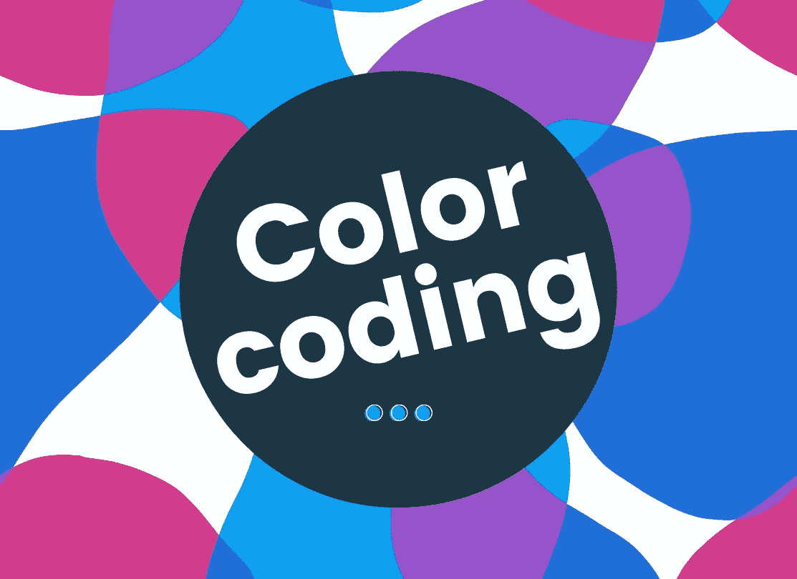
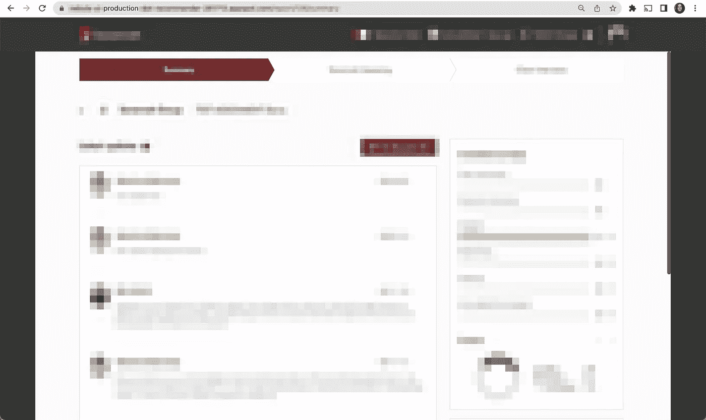
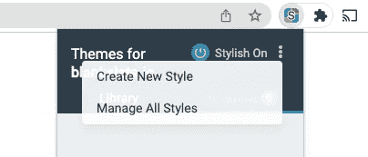
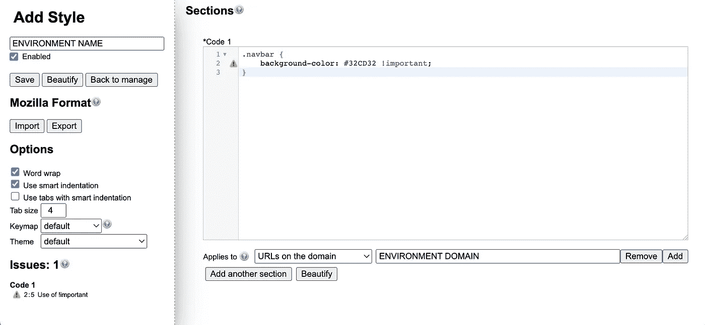
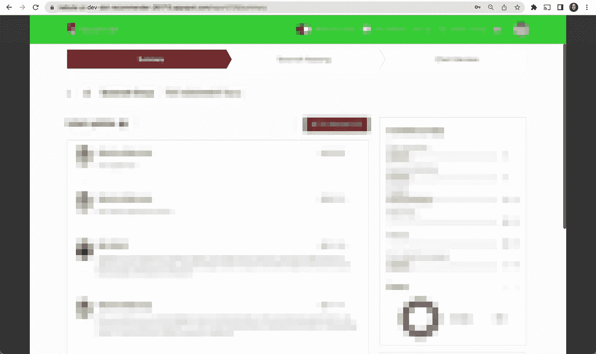
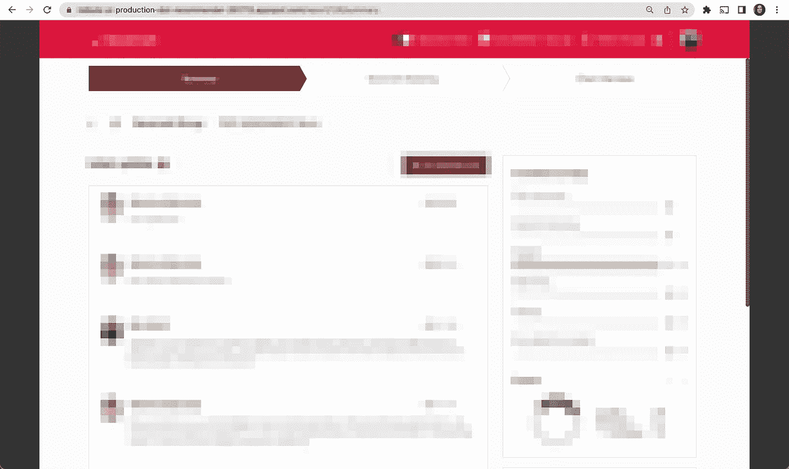
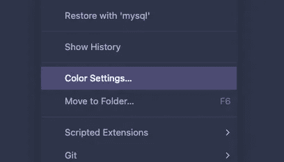
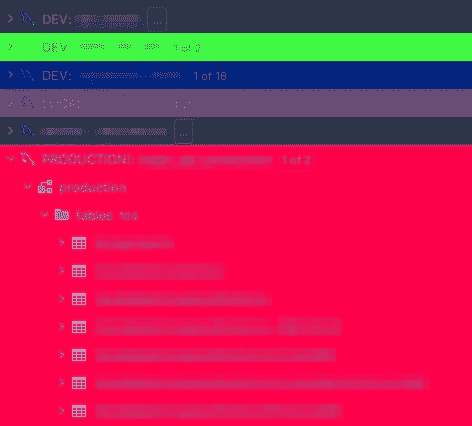
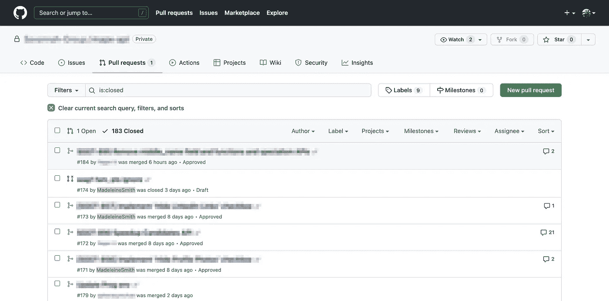

# 如何对您的部署环境进行颜色编码

> 原文：<https://betterprogramming.pub/how-to-color-code-your-deployment-environments-271c5ef862c6>

## 成为生产力大师💯

# 背景

对于我正在从事的一个客户项目，我们有多个正在运行的部署环境。根据最近的统计，我们有五个部门——本地、开发、qa、试运行和生产。

然而，在如此多的环境中，我发现很难区分它们，因为每个网站看起来都完全一样。唯一的区别是 URL 中的一个单词:

这是开发还是生产？我不知道！

我希望能够立即知道我在看哪个环境。这意味着我可以直观地分辨出每个环境，如果别人给了我一个 URL，我就可以确定是哪个环境。这也让我知道我应该有多小心——也就是说，我可能会在本地环境中发疯，但会对试运行/生产保持应有的谨慎。

我从在以前的团队中使用 [Postico](https://eggerapps.at/postico/) (一个 PostgreSQL 客户端)的经历中获得了解决这个问题的灵感。Postico 允许您对每个数据源进行颜色编码——因此我们的生产连接选项卡是红色的，而开发是绿色的。

我想出了根据环境改变顶部导航栏颜色的主意。经过一番搜索，[时尚的 Chrome 扩展版](https://chrome.google.com/webstore/detail/stylish-custom-themes-for/fjnbnpbmkenffdnngjfgmeleoegfcffe?hl=en)似乎符合要求。这个扩展允许你通过在现有的样式上应用自定义的 CSS 样式来自定义一个网站。

# 使用时尚的颜色编码部署环境

对于我的每个部署环境，我通过选择“创建新样式”选项创建了一个新样式:

从那里，你被带到一个“添加样式”页面，在那里你可以指定你的 CSS:

在我们的项目中，顶部导航栏有一个类`navbar`(超级原创😛)所以我加的 CSS 是:

其中`COLOR`占位符是我想要使用的特定颜色。对于每个环境，我使用“应用于”下拉菜单将规则限制为仅在其域上起作用。

结果是这样的:

啊，好多了——我马上就能看出区别💯

对于我的本地环境，我采取了稍微不同的策略。因为我有两个本地运行的存储库(FE 和 BE ),所以我只修改了 FE repo 中的 CSS 文件。我可能已经为本地开发设置了一个新的时尚规则，但这也意味着我可能会改变我在本地运行的任何网站的导航栏的颜色。

# 对第三方依赖关系进行颜色编码

同样，我们在项目中使用了一个重要的第三方依赖——存在一个非生产环境(沙箱)和一个生产环境。

我再次使用了 style 来更改这个站点的标题栏，以便能够知道我们的哪些部署环境指向沙盒依赖项，哪些使用生产依赖项。

这是第三方依赖的沙盒版本——我的本地(淡紫色)、开发(绿色)和 qa(橙色)环境都指向它。该依赖项的生产版本有一个单独的配色方案。

我在上面使用的 CSS 如下所示:

# 对数据库连接进行颜色编码(使用 JetBrains IDE)

为了结束这次彩色编码的冒险，我想对我的数据库连接进行彩色编码，以匹配我的部署环境。我目前使用 GoLand 中的数据库管理功能作为我的 SQL GUI。尽管我认为 JetBrains 的所有产品功能都大同小异:

添加数据源后，只需右键单击并选择“颜色设置”:

从那里你可以选择你的颜色，它会出现在不同的地方——比如编辑器标签和“数据库浏览器”。

这是我的样子:

噢，我的眼睛，火辣辣的……🤭

# 奖励:拉请求的时髦规则

作为一个有趣的小项目，我在时髦的上创建了一个规则[,以便能够在 GitHub 上轻松地确定哪些拉请求是我的。有时候，我们会同时收到太多的拉取请求，以至于无法立即确定哪些属于我！](https://userstyles.org/styles/237127/highlight-my-github-pull-requests)

*我创建的时髦规则突出了我的拉取请求。点击* [*这里*](https://userstyles.org/styles/237127/highlight-my-github-pull-requests) *下载*

我最初想突出显示有问题的整个 div，尽管我不确定这对于直接的 CSS 是否可行(因为不能用选择器来提升 DOM)。因此，我决定突出显示我的 GitHub 用户名——这样就行了。

*最初发布于*[*https://www . madeleinesmith . uk*](https://www.madeleinesmith.uk/blog/color-code-deployment-environments/)*。*