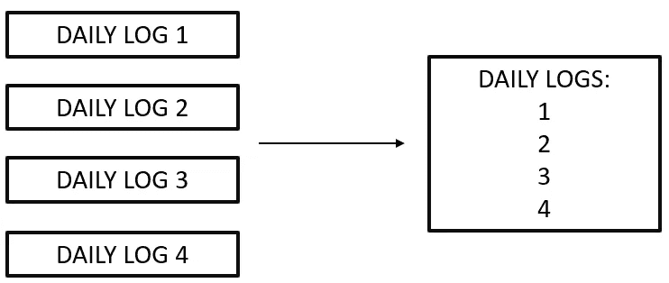
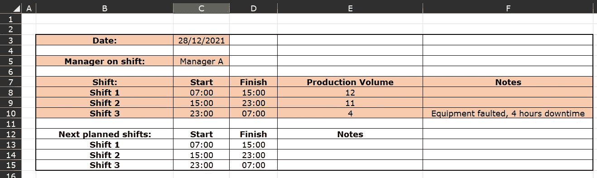
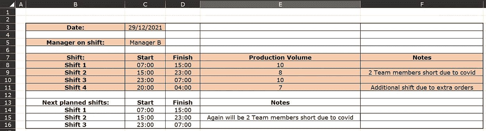
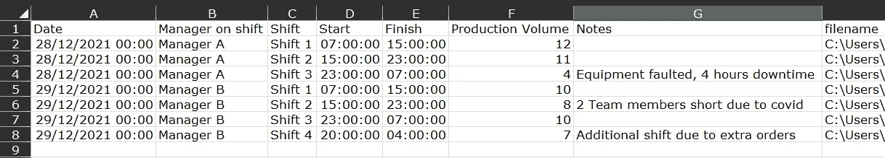
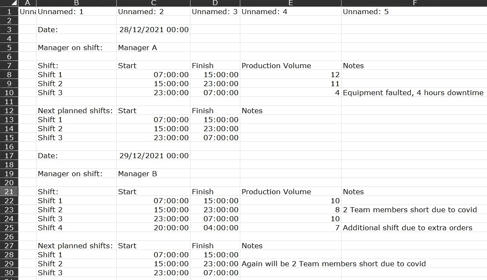
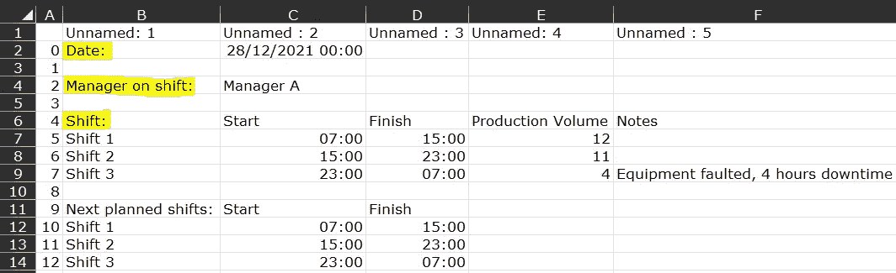

# 不要浪费时间，把不同的文件合并成一个

> 原文：<https://betterprogramming.pub/how-to-combine-many-excel-files-into-one-with-python-413372775a32>

## 不要单独打开每一个。停止手动将它们粘贴到一个文件中。S **开始**使用 Python 创建一个单一的、没有错误的文件


Firmbee.com 在 [Unsplash](https://unsplash.com?utm_source=medium&utm_medium=referral) 上[的照片](https://unsplash.com/@firmbee?utm_source=medium&utm_medium=referral)

一个古老的故事。分析师遇到“简单”的分析项目。分析师发现数据分散在数百甚至数千个不同的文件中。分析师面临一个选择，做事情容易还是困难。



点击四个日志中的每一个会浪费你多少时间？

无论是在多年的活动中收集的每日进度日志，还是涵盖数百种不同资产的检查报告，总会有一些数据位于我们结构良好的数据库之外，只等着让我们头疼。有一件事是肯定的，读完这篇文章后，你将不会把每个文件复制粘贴到一个母版页中。这不仅会让你早早地进入坟墓，浪费过程中的宝贵时间，而且还会导致一个充满人为错误的输出。这是双输。

即使您只是为了调查工作而阅读这些日志，您认为您在加载每个文件上花费了多少时间？在一年的时间里，我的朋友，你会损失掉很多时间。你需要这些数据在一个地方，而不是数百个。

输入 python。特别是熊猫和环球图书馆(好名字)。

我将快速浏览几个例子(一个直截了当的例子后面跟着一个不那么直截了当的例子),并分享模板脚本以及它们如何工作的解释。

# 简单的 CSV 文件

对于这个例子，假设我们在同一个文件夹中有多个 CSV 文件。通常，它们具有相同的布局，并且列标题位于第一行。

首先，确保您已经安装了 glob 库，如果使用 Anaconda，请在 Anaconda 提示符下键入以下内容:

```
pip install glob
```

此外，确保您还安装了 pandas(这是 Anaconda 的默认设置)。现在只需在下面的脚本中编辑文件夹位置*瞧！*

```
**# import libraries**
import pandas as pd
import glob**# define folder directory to look in. Change to xlsx if Excel file.**
path =r'folderlocation' 
allFiles = glob.glob(path + "/*.csv")**# make a list of all the files in the folder**
list_ = []
for file_ in allFiles:
 **# define sheet name and place data starts**
    df = pd.read_csv(file_, dtype=str, header=0)
 **# create a variable with the filename**
    df['filename']= file_
   ** # extract the date from the filename using string slice**
    df['date'] = df['filename'].str[-12:-4]**# stack each file all on top of the other**
    list_.append(df)
stack = pd.concat(list_, axis=0)**# output to excel or another database** 
stack.to_csv(r'filepath\filename.csv')
```

我们来分解一下。这个脚本:

1.  导入我们需要的库。
2.  告诉 glob 在哪里查找，并要求它读取所有以'结尾的文件。“csv”作为数据帧。如果你想在文件名中查找某个特定的单词，你可以在这里添加。
3.  为文件名创建新列。
4.  为从文件名中提取的日期创建新列。
5.  创建一个名为“stack”的新数据帧，每个数据帧一个在另一个之上。
6.  将这个组合文件作为 csv 文件写回到您选择的目标位置。

这对于我们只想将每个 csv 中包含的所有内容合并成一个文件的情况来说非常有效。我们可以轻松地过滤日期或文件名，这对调查工作很方便，而且还可以根据原始文件对输出进行质量检查。

但是如果你只是想提取文件的某些部分*会怎么样呢？例如，您可能将每天的日志保存在一个漂亮的 excel 模板中，但是，对您有用的数据并没有放在行为良好的列中，如果不完全重新塑造它，很难进行查询和分析。我们如何有效地处理这个问题？*

# *处理更复杂的格式*

*下面是一个典型的“每日日志”的模型，我将从头到尾运行一个例子。在本练习中，我用橙色突出显示了我希望以更有用的格式每天保留的信息。*

*我有两个涵盖两天的日志(如下所示),我会将它们合并，并将相关信息提取到一个结构整齐的表格中。我将首先展示组合这些文件的最终输出、使用的脚本，然后更详细地描述它是如何工作的。*

****

*每日日志示例 1 和 2。橙色的单元格将被提取出来，重新调整成更有用的格式，文件将合并到一个表格中。*

## *最终输出*

**

*很好。这样就好用多了。我可以打开该文件，并在特定日期或班次进行过滤，而无需点击查看单独的报告。我可以很容易地创建一些分析，例如平均生产量，并按班次或月份进行分组。虽然我只合并了两个文件，但是这个脚本是可扩展的，所以可以在数百个(甚至数千个)文件上运行。那我是怎么到那里的呢？*

*如果我们运行前面例子中的简单模板脚本，我们会得到下面的输出。所有的数据都在，但那是一堆乱七八糟的东西。我们需要创建适当的列标题，丢失不相关的信息，并删除空白。*

**

*简单组合脚本的输出。我们需要添加一些指令来获得我们想要的输出。*

## *剧本*

*这有点大，但我会在我们进行的过程中更详细地解释发生了什么。*

```
***# define folder directory to look in** 
path =r'folderpath' 
allFiles = glob.glob(path + "/*.xlsx")**# make a list of all the files in the folder**
list_ = []
for file_ in allFiles:
    **# define sheet name and place data starts**
    df = pd.read_excel(file_, sheet_name = 'Sheet1', index_col=None, dtype=str, usecols = "B:F")

 **# create a variable with the filename**
    df['filename']= file_

   **# set row number as index** 
    df.index = range(len(df))

    **### GET SHIFT TIMES
    # set index selection based on text**
    index_start = df[df.iloc[:,0]=='Shift:'].index.values.astype(int)[0]    
    index_finish = df[df.iloc[:,0]=='Next planned shifts:'].index.values.astype(int)[0] - 1
   ** # select the data between set indexes**
    df_shifts = df.query('index > [@index_start](http://twitter.com/index_start) & index < [@index_finish](http://twitter.com/index_finish)')

 **   ### GET DATE 
    # set index selection based on text**
    index_start2 = df[df.iloc[:,0]=='Date:'].index.values.astype(int)[0]  
    **# select the data between set indexes**
    df_date = df.query('index == [@index_start2](http://twitter.com/index_start2)')

 **### GET MANAGER
    # set index selection based on text**
    index_start3 = df[df.iloc[:,0]=='Manager on shift:'].index.values.astype(int)[0]  
   ** # select the data between set indexes**
    df_manager = df.query('index == [@index_start3](http://twitter.com/index_start3)')    

    **# merge the data together**
    df_all = pd.merge(df_shifts, df_date, left_on = ['filename'], right_on = ['filename'], how = 'left')
    df_all = pd.merge(df_all, df_manager, left_on = ['filename'], right_on = ['filename'], how = 'left')

    **# stack all files on top of each other**
    list_.append(df_all)
log = pd.concat(list_, axis=0)**## rename columns**
log.rename(columns={log.columns[0]: "Shift", log.columns[1]: "Start", log.columns[2]: "Finish",log.columns[3]: "Production Volume", log.columns[4]: "Notes",  log.columns[5]: "filename", log.columns[7]: "Date", log.columns[12]: "Manager on shift"  }, inplace=True)**# retain only useful columns**
log = log[['Date', 'Manager on shift', 'Shift','Start','Finish','Production Volume','Notes','filename']]**# write to csv**
log.to_csv(r'filepath\combinedlog.csv', index = False)*
```

*这个脚本:*

1.  *导入库。*
2.  *告诉 glob 去哪里找。就像之前的简单例子一样，我们定义文件夹，这次我让 glob 查看。xlsx 文件，特别是名为“Sheet1”的图纸。*
3.  *定义如何读取文件。我已经在这些日志中设置了 usecols = "B:F ",因为模板被限制在这些单元格中，所以以后可以省去一些清理步骤。类似地，输入 skiprows 也可以用来在需要的地方去掉一些行。*
4.  *为文件名创建新列。*
5.  *使用`df.index = range(len(df))`将行号设置为文件索引。我们将使用这个数字来定义我们希望将哪些行转移到我们的组合文件中。*
6.  *基于文本匹配选择要提取的特定索引号。*

> ****这是关键部分所以我来细说。*** *如果可以，我会把闪亮的大星星围在这一段*。*为了可视化正在发生的事情，我已经运行了我们目前使用的脚本，并显示了下面的数据帧* **。** *突出显示的字段是模板中我们需要的部分。我们可以告诉 python 基于它们相对于这些部分的位置*来提取哪些部分。例如，日期(这里是 2021 年 12 月 28 日)将始终与“日期”位于同一行，因此我们肯定希望保留该行。“值班经理”也是如此。至于“班次:”我们需要它下面的行，但不要太低，因为我们现在对“下一个计划的班次”不感兴趣。*

**

*在突出显示的字段上使用文本匹配来获取索引号。例如，值班经理位于索引为 2 的行中。*

*先说前两个。为了找出这些是什么行，我们使用代码:*

```
*index_num = df[df.iloc[:,0] == 'Text'.index.values.astype(int)[0]*
```

*这会以整数形式返回所需行的索引号，例如，搜索“值班经理:”会返回“2”，因此我们希望行索引= 2。将它与一个查询结合起来，我们就可以调用该行:*

```
*df_new = df.query('index == [@index_](http://twitter.com/index_start3)num')*
```

*对“Date:”重复，并输出到一个单独的数据帧中(上面我使用了 df _ shifts 和 df_manager)。*

*可以使用类似的方法来收集班次信息，但是由于这跨越许多行，我们需要**定义一个开始行和一个结束行。**我们需要的数据*在“班次:”后的一行开始*，*在“下一计划班次:”前两行结束*。使用下面的代码设置这些参数:*

```
*index_start = df[df.iloc[:,0]=='Shift:'].index.values.astype(int)[0]    
index_finish = df[df.iloc[:,0]=='Next planned shifts:'].index.values.astype(int)[0] - 1* 
```

*现在，再次运行查询来隔离行，我们将考虑日志的所有橙色部分。*

```
*df_shifts = df.query('index > [@index_start](http://twitter.com/index_start) & index < [@index_finish](http://twitter.com/index_finish)')*
```

*使用文本匹配来标识行的主要好处是可以灵活地改变记录的长度。每日日志 1 只包含三个班次，但是日志 2 包含四个班次，谁知道将来会有多少班次。对行号进行硬编码(例如，说总是收集第 5-10 行)可能会导致丢失数据或大量空白/不相关的数据，使您的工作更加困难。另一方面，如果单元格名称发生变化(例如，“shift:”变成了“Shift”)，则需要编辑脚本来解决这个问题。事情的快速解决方案。好的，回到脚本的工作流程。*

*7.将文件的不同部分合并在一起。我们需要把我们的三个数据帧(`df_shifts`、`df_date`、`df_manager`)重新放在一起。幸运的是，它们都有一些共同点:filename，我们之前将其设置为一个列，我们可以基于它进行合并。这几乎就像是计划好的…*

```
*df_all = pd.merge(df_shifts, df_date, left_on = ['filename'], right_on = ['filename'], how = 'left')
    df_all = pd.merge(df_all, df_manager, left_on = ['filename'], right_on = ['filename'], how = 'left')*
```

*8.**创建一个名为“log”的新数据帧**，该数据帧是一个接一个的独立数据帧。*

*9.**通过重命名列、删除任何我们不需要的列并最终写回 CSV 来清理**。*

*哒哒！完成了。我们可以定期运行它(或者如果我们觉得真的*高效*建立一个流程来自动为我们运行它)，并确保我们总是在一个地方拥有最新的数据。如果可能的话，我建议将合并后的日志导入到一个数据库中，比如 MSSQL，特别是当文件变得很大时，因为在 Excel 中加载和处理它可能会很慢。*

*给猫剥皮的方法不止一种，通过几种不同的方法也可以达到和上面一样的效果。我的绝不是最*的蟒*，但是你知道吗？没关系。作为程序员，使用对你有意义的逻辑是很重要的。这样，如果对模板脚本进行了更改，您可以轻松地调整脚本以适应它。*

*我希望这是有用的，并为您节省一些时间和精力。将这一页加入书签，以备不时之需。*

*[](https://medium.com/@hollydalligan/membership) [## 通过我的推荐链接加入 Medium-Holly Dalligan

### 作为一个媒体会员，你的会员费的一部分会给你阅读的作家，你可以完全接触到每一个故事…

medium.com](https://medium.com/@hollydalligan/membership)*