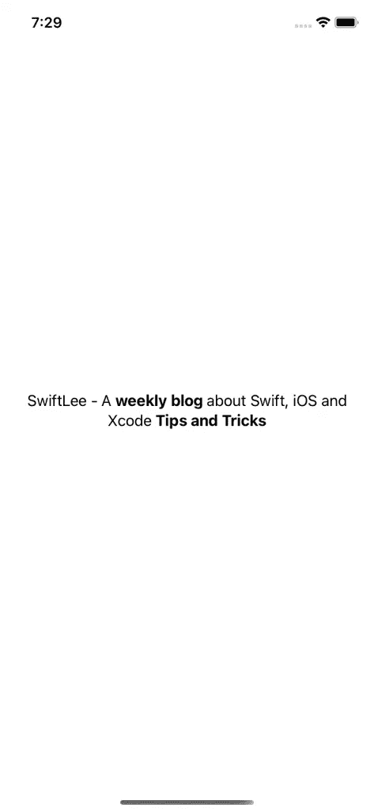

# 如何在 SwiftUI 中组合文本权重

> 原文：<https://betterprogramming.pub/how-to-combine-text-weights-in-swiftui-b11a110412dc>

## 自定义 SwiftUI 应用程序中的文本


布鲁诺·马丁斯在 [Unsplash](https://unsplash.com?utm_source=medium&utm_medium=referral) 上拍摄的照片。

起初，在 SwiftUI 中组合多个文本权重可能看起来并不简单。如果你习惯于使用 UIKit，你可能正在寻找对`NSAttributedString`的支持，其中你可以为某些范围应用不同的文本样式。

SwiftUI 使得通过内置的加号(+)操作符实现来组合不同的文本样式成为可能。多个文本视图被合并成一个，如果使用正确，可以很好地换行。

# 你可能考虑过的方法

在我们深入研究对我的情况最有效的解决方案之前，我想先回顾一下论坛上经常推荐的几个解决方案，比如 [Stack Overflow](https://stackoverflow.com/questions/59531122/how-to-use-attributed-string-in-swiftui) 。

## h 带包装的堆叠

您可以将在单个文本视图中组合多个权重视为在网格类型的视图中显示多个关键字。搜索解决方案可能会将您带到[这个](https://stackoverflow.com/questions/58842453/swiftui-hstack-with-wrap)页面，它告诉您使用与自定义对齐参考线结合的`GeometryReader`来模拟文本换行。

尽管该解决方案最终可能会成功，但是代码很复杂，并且规模调整可能并不总是如预期的那样工作。

## 使用 UIViewRepresentable

最接近使用`NSAttributedString`的解决方案是使用一个`UIViewRepresentable`，它将一个属性化的字符串实现连接到 SwiftUI。如果您正在将代码从 UIKit 迁移到 SwiftUI，这可能是您最快的解决方案，但它感觉不太像原生 SwiftUI 代码。

## ForEach 组合多个文本视图

我发现最有效的解决方案是使用一个`ForEach`来迭代一个句子的单词，以在一个`HStack`中组合多个`Text`视图。

这种方法的缺点是，我们最终会得到不相关的单独文本视图，它们不能很好地包装在一起。视图之间互不了解，这就取消了对多行文本的支持。如果你把短句放在一行上，它可能会起作用，但是当你想增加多行文本内容的权重时，它很容易变得有限。

# 在 SwiftUI 文本视图中添加对多个权重的支持

组合多个权重可能有助于强调句子中的单词。在本例中，我们希望以粗体显示某些单词，结果如下:“SwiftLee —一个关于 Swift、iOS 和 Xcode 的每周博客**提示和技巧**。”

为了提高工作效率，我们需要一种方法来定义需要样式化的文本范围。我们还希望得到一个单个文本元素的结果，该元素负责将单词换行到多行上。

最终代码如下所示:

如您所见，我们用星号标记了`weekly blog`和`Tips and Tricks`,表示这些单词应该被转换成粗体文本元素。为了做到这一点，我们使用了一个 regex 实现，它允许我们使用 Markdown 类型的样式。

让我们一步一步地检查代码。

## 创建自定义 RichText 视图

我们首先创建一个名为`RichText`的定制视图。该视图带有一个`String`初始化器，并定义了一个`Element`结构，我们将使用它来定义输入语句的不同元素。

使用`parseRichTextElements()`方法解析元素。这种方法使用星号分割句子，并使用粗体字粗细标记需要显示的元素:

这是很多代码，但是使用行内注释通读它应该会让您对它在做什么有所了解。这篇文章的核心部分是告诉你如何从将多个`Text`元素组合成一个元素中获益。例如，这可能是编写自己的 Markdown 解析文本元素的起点。

最后，我们需要为自定义视图创建一个主体，并将所有元素解析成一个`Text`元素:

我们身法的内容是最重要的部分。如果我们使用了一个`ForEach`来代替，我们最终会得到多个独立的`Text`元素，它们不能很好地在多行中包装在一起。

仔细看看这段代码:

```
var content = text(for: elements.first!)
elements.dropFirst().forEach { (element) in
    content = content + self.text(for: element)
}
return content
```

我们首先将第一个元素作为开始的`Text`元素。我们检查元素集合并使用`+`操作符，它基本上将现有的`Text`视图与给定元素的新的`Text`视图结合起来。

最后，我们返回句子的合并版本，其中包含以粗体显示的标记单词:



创建具有多个权重的 SwiftUI 文本视图。

# 结论

SwiftUI 带来了挑战，可能会吸引人们使用使用`UIViewRepresentable`实现的定制解决方案。然而，有了正确的知识，它并不总是需要的，因为我们可以利用 SwiftUI 附带的高级 API。将多个文本视图合并成一个视图允许我们将多个权重显示为一个合并的、包装良好的文本视图。

感谢阅读！