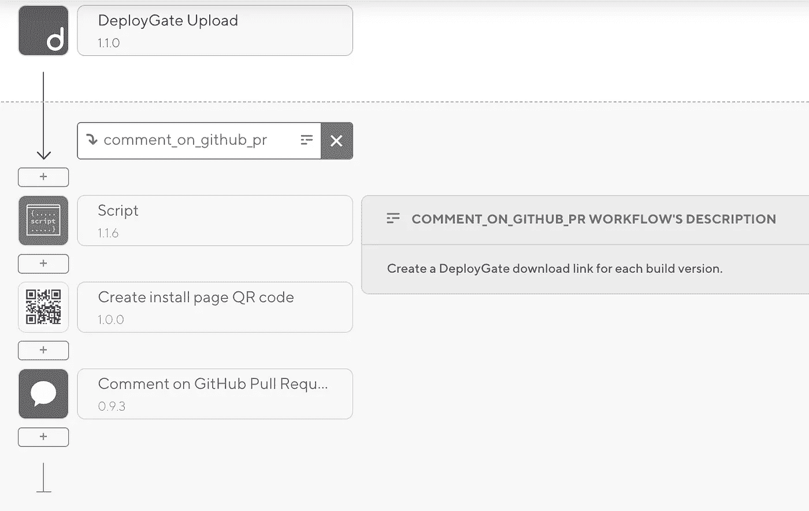
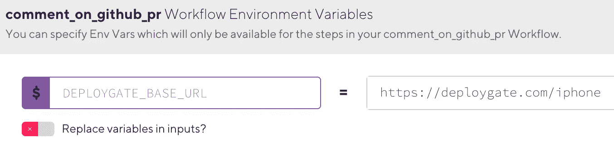
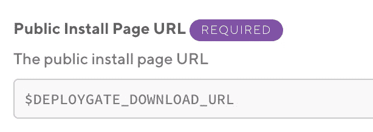
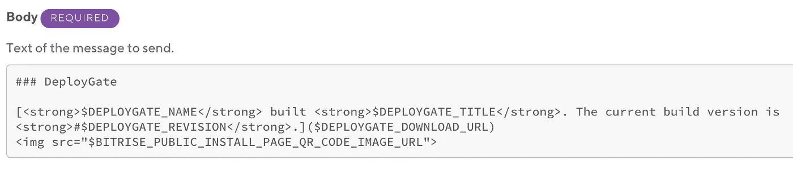
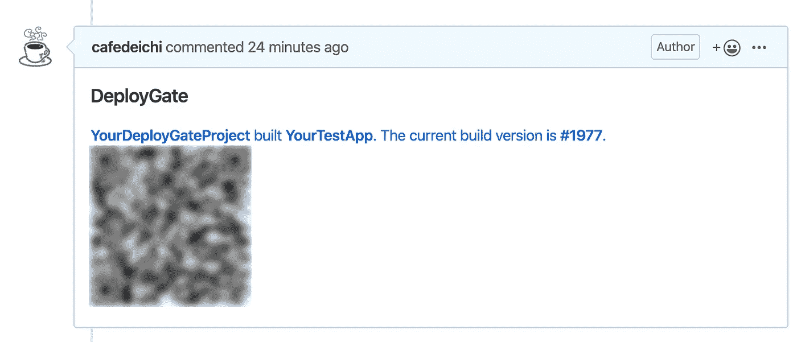

# 如何用 Bitrise 注释 GitHub Pull 请求上每个构建版本的 DeployGate 链接

> 原文：<https://betterprogramming.pub/how-to-comment-a-deploygate-link-for-each-build-version-on-github-pull-requests-with-bitrise-6a0943bc56ca>

## 一个简单的提示，让你的同事在他们的拉动式请求审查期间更快地审查你的应用程序

照片由[克里斯蒂娜·莫里路](https://www.pexels.com/@divinetechygirl?utm_content=attributionCopyText&utm_medium=referral&utm_source=pexels)从[派克斯](https://www.pexels.com/photo/eyeglasses-in-front-of-laptop-computer-1181253/?utm_content=attributionCopyText&utm_medium=referral&utm_source=pexels)拍摄

# 背景

作为一名开发人员，当你在 GitHub 上创建一个 pull 请求时，你不仅需要让你的同事检查你的代码，有时你还需要让他们在你添加了新功能、修复了错误等之后确认应用的行为。

在我的项目中，当我创建一个新的 pull 请求时，一个 [Bitrise](https://www.bitrise.io/) 工作流会自动构建一个应用程序并上传到 [DeployGate](https://deploygate.com/) 。当构建完成时，控制台上配置的 DeployGate 的通知[提到了 Slack 通道，评审人员可以通过单击通道中的下载链接来访问应用程序。](https://docs.deploygate.com/docs/chat-integration)

然而，由于 DeployGate 通知总是提供与最新构建版本相同的链接，并且不能将其作为 GitHub pull 请求上的评论发布，因此评审人员几乎从未捕捉到应用程序的正确构建版本进行评审，他们必须进入控制台并无论如何都要查找应用程序(或者放弃，只查看代码)。

# 解决办法

作为上述一些问题的解决方案，我在现有的 Bitrise 工作流中添加了以下步骤。

## [脚本](https://www.bitrise.io/integrations/steps/script)

[将应用上传到控制台的工作流步骤之一](https://www.bitrise.io/integrations/steps/deploygate--upload-app-bitrise-step)deploy gate Upload 返回`$DEPLOYGATE_UPLOAD_APP_STEP_RESULT_JSON`。通过使用里面的值，您可以创建到适当应用程序的直接链接。我使用 [jq](https://stedolan.github.io/jq/) 通过引用 [fromkk 的要点](https://gist.github.com/fromkk/6987bbdebf1bd6b56fa3811d51bdbe88)来解析 JSON 数据。

`$DEPLOYMENT_BASE_URL`是预先在该工作流上设置的环境变量。

## [创建安装页面二维码](https://app.bitrise.io/integrations/steps/create-install-page-qr-code)

创建直接链接的二维码甚至更好，因为评论者只需扫描代码就可以轻松获得应用程序。只需在这一步将`$DEPLOYGATE_DOWNLOAD_URL`设置为`Public Install Page URL`就能给你带来你需要的东西。

## [评论 GitHub 拉请求](https://app.bitrise.io/integrations/steps/comment-on-github-pull-request)

通过使用该步骤，由前述步骤创建的下载链接和 QR 码图像 URL 可以被发送到适当的拉取请求。

不要忘记预先生成并设置您的[个人访问令牌](https://help.github.com/en/github/authenticating-to-github/creating-a-personal-access-token-for-the-command-line)，这是访问存储库所必需的。

# 完成的

完成构建后，您可以在 pull 请求上看到这样的注释:

> "正在添加:审阅者必须是 DeployGate 上的团队成员。如果您无法访问该链接，您可以询问管理员。”

虽然只是一个小小的改变，但是你创建的拉请求越多，就越有意义。

享受您的编码和审查！