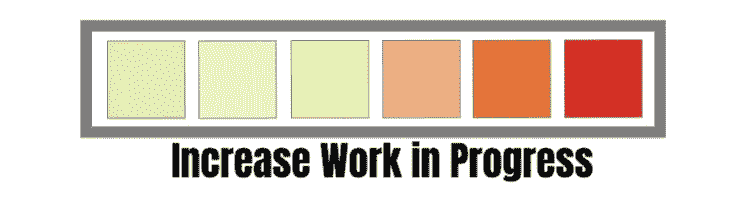
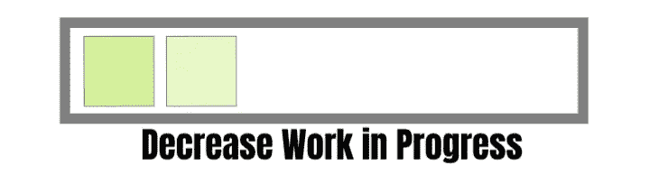
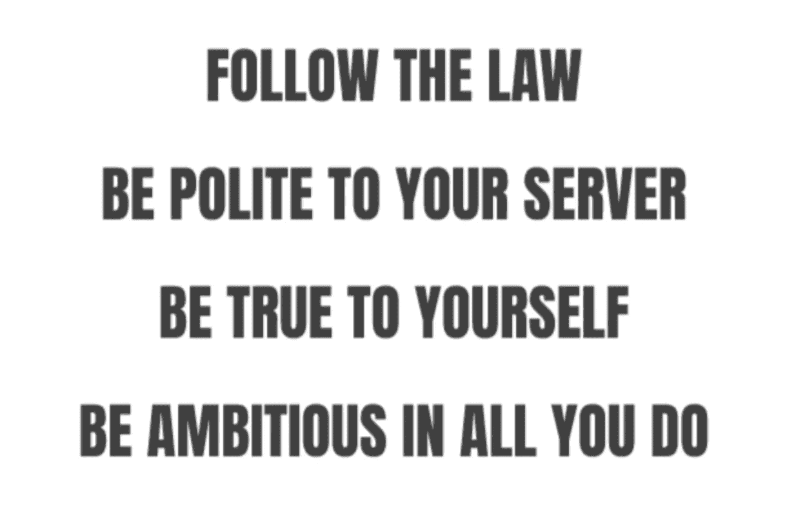
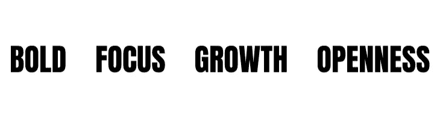
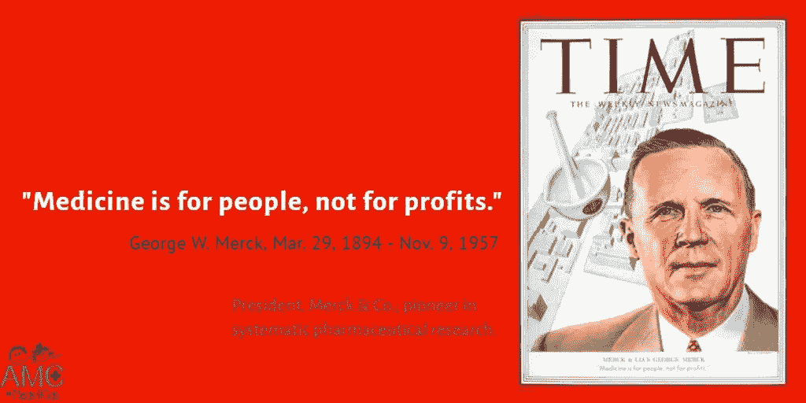

# 如何传达你的身份

> 原文：<https://betterprogramming.pub/how-to-communicate-your-identity-1e23d77880e5>

## 你的价值观对你的公司有什么影响？

弗兰克·维西亚在 [Unsplash](https://unsplash.com/s/photos/idea?utm_source=unsplash&utm_medium=referral&utm_content=creditCopyText) 上拍摄的照片

你上一次阅读一套公司价值观并且*知道*那家公司是什么时候？

我不是说表面上。我不是在说他们所处的行业，或者他们有多少员工。我的意思是，你知道他们的使命，他们的目标，他们的目标。他们是一家乐观的公司，还是做最坏的打算？保守还是鲁莽？他们是设计两次还是裁剪一次然后边做边学？

在[上升期](https://upside.energy/)，我们已经对我们的价值观进行了长时间的思考。

你的价值观体现了你公司的本质。它们是你的签名，你的印记。它们是对你是谁的最短可能的描述。告诉我，当你看到这样的值时，你会怎么想？

你们中的一些人可能会觉得这很振奋人心。它只有三个词，有一个随机的脏话，并持有最重要的命令语气。但是，如果一家公司胆大妄为，把它贴满了他们的墙壁，那么这个告诉了你这家公司什么？我们能确定的是，这是一家重视做事的公司。就像其他公司一样。

也许这种说法是针对同事的，而不是外人的。这是各部门开始忙碌起来的战斗口号。让我们运行这个例子，并描绘一个简单的组织。这家公司只有两个部门——销售部和软件部。让我们从两个不同的角度来看这个价值的执行，并通过这样的价值陈述来挖掘问题。

# 销售

销售是一个复杂而困难的职业。有一种神奇的元素可以把一个好的推销变成一个伟大的推销。很容易理解一个高绩效的销售部门做什么。他们*卖*。我们可以通过几种不同的方式来分割这部分市场——交易量、有利的合同利率、新市场等等。但是如果一个销售部门“完成了任务”，他们总是会签订更多的合同，赢得更多的生意。

随着我们赢得更多业务，我们会增加组织的工作进度。这是自然的。我们签订的合同越多，我们的承诺就越大。如果我们在截止日期方面很聪明，我们也许能够一次性将我们正在进行的工作减到最少，但是我们的销售部门正在完成任务。整个团队都在一个接一个地实现销售目标，不久之后，公司就达到了最大产能。

# 工程

与直觉相反，一个想要*完成任务*的软件部门不可能对所有事情都说是。说**不**这背后有一些数学。[利特尔法则](https://en.wikipedia.org/wiki/Little%27s_law)是一个来自排队论的等式，描述了我们正在进行的工作与我们完成每项工作所需时间之间的关系。这是制造业的一个主要部分，在过去的几年里，已经进入了软件工程的普遍意识。

可以想象，队列越长，工作项等待的时间就越长。如果再加上[上下文切换](https://blog.trello.com/why-context-switching-ruins-productivity)的危险和[不断增加的操作开销](https://whatis.techtarget.com/definition/operational-costs#:~:text=What%20are%20operational%20costs%3F,procurement%2C%20storage%20rental%20and%20security.)，你就得到了一杯危险的鸡尾酒。一个负责任的工程部门将这些因素最小化。

你的工程部门开始冻结不必要的工作。如果你想让他们完成任务，这是必要的。销售部门的表现就像服用了类固醇的乔丹·贝尔福特，他们将如何管理所有这些新工作？

## 事情是这样的

在最好的情况下，人们内化并实践你创造的价值观。他们把它们带回家，并和他们的配偶、父母或孩子谈论它们。他们热爱这些价值观，他们在个人层面上产生共鸣。那么 *get s*** done* 到底怎么了，又是怎么导致这种错位的呢？让我们回到基础。

# 价值观的目的是什么？

当我们在商业环境之外的野外看到价值观时，它们可以采取严格或宽松的形式。

前两个是严格的指导方针——不要曲解它们。你总是遵守法律，你总是尊重你的服务器。后两种针对性较弱，但仍采用祈使形式。它们是一个方向。

## 价值观约束行为，不管它采取什么形式

价值观、指导方针、原则和理想都有明确的目的。它们缩小了我们的视野，限制了我们可能的选择。它们是对我们行为的约束。我们用少量的自由换取了大量的一致。

这听起来很消极——我们都不想被约束——但是对约束作为一种生产力机制的研究很有意思。甚至像“忠于自己”这样的口号也是约束。我们在这里建立的联盟可以创造一种共同的目标感——一种按同一准则生活的同志情谊。

## 很明显为什么我们的价值观不起作用

我们能从*得到什么目的？*我们对自己有什么约束？还不清楚。在创造这个价值之前，可能有过一次奇妙的谈话。一屋子的人被便条和便利贴包围着，笑着终于描述了他们共有的感觉。他们想*把 s***搞定。* Only，那不是值吧？它描述了在某个时刻，一小撮人共有的一种感觉。几十个、几百个或几千个其他人是如何将这些内化的呢？

如果公司只有几个人，这可能行得通。明智的做法是去和十个人谈论这些价值观。在这种规模下，每个员工都可以在开始时在场。但是当你的公司是 100 人的时候会怎么样呢？1000 人？那种特殊的意义消失了，剩下的只是这句话。

看看这些其他的价值观，告诉我，你能从它们身上收集到什么？我们对自己的行为施加了什么约束？我们是如何缩小关注范围的？

其中一些比另一些更好，但是我可以把它们举起来，贴到任何公司，让它们工作。记住，你的价值观就是你的签名。它们是你的精华。你不想要样板，因为你不是样板。

# 伟大的价值是什么样的？

幸运的是，伟大的公司价值观并不难找到。以乔治·默克在 1950 年写的价值陈述为例。

这里的约束很明显。默克公司的每一位员工都知道这意味着什么，作为一名局外人，我立即感受到了默克公司的优先事项。这个讨论鼓励销售部门和软件部门进行一场道德辩论，但是他们并不是相互对立的。Etsy 的这个怎么样:

> 为开发人员的幸福而优化

这一点最初似乎很明显。当然，你想要快乐的员工，但是再看看。他们没有对增长、收入、交易量和市场份额进行优化。他们在为开发人员的幸福而优化。

现在，当销售部门即将签署新合同时，他们不得不找出这对工程部门的影响。当一个工程团队在构建一个内部工具时，他们没有选择走 UI 的捷径。他们需要与其他开发人员交流，找出可行的方法。协作是这一价值观的一部分。

像 Nordstrom 这样完全不同的企业呢，他们遵循这样的原则:

> 对顾客的服务高于一切

我们不能把这一点应用到其他商店，因为很明显，其他商店有不同的野心。不，这是一个诺德斯特龙值。这是他们公司结构的一部分。这是他们的签名。

## 所有这些价值观有什么共同点？

每个人都会在这些价值观中看到一些略有不同的东西，但我认为它们有一些一致的地方。将它们与我们之前讨论过的值进行比较。首先，它们是开放的，但不含糊。70 年后，乔治·默克声明的精神是明确的。

这些价值观毫无歉意地磨损了它们的约束。看看诺德斯特龙的价值。它为你区分事情的轻重缓急。最重要的是“为顾客服务”其他一切都服从于顶层。

上面列出的值足够具体来代表公司。它们足够开放，是描述性的，而不是指令性的。他们承诺。在任何真正的意义上，你都不能承诺把事情做完。想象一下，如果乔治·默克在接受《时代》杂志采访时说:*“嗯，我只是希望我的员工大胆一点”*。对于作为一个人的默克或作为一家公司的默克公司，我们不会有任何新的了解。相反，他承诺。

# 现在怎么办？

检查你的公司价值观。自己去看，没有你经验的支撑。想象一下当他们被写的时候你不在房间里。你能从他们身上学到什么？他们对其他人说什么？这些价值观做出了什么承诺？

如果你审视自己的价值观，发现一种不确定感，你认为从外部看起来是什么样的？搜索您的组织已经做出的承诺。真正的、宏大的、大胆的目标。找出你为什么想做这些事情，并把它们变成一个简单的、令人难忘的信息。这比像*把事情做完*这样的口号更有说服力。