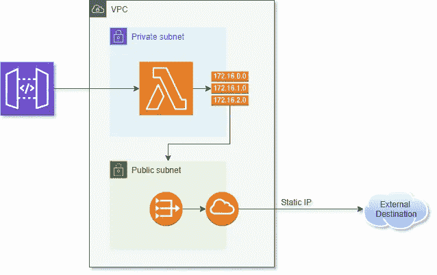

# 如何为您的无服务器应用程序配置静态 IP

> 原文：<https://betterprogramming.pub/how-to-configure-a-static-ip-for-your-serverless-app-d2c1296f68cc>

## 通过静态 IP 地址发送出站 Lambda 流量听起来可能很难，但这比你想象的要简单

来自 Stockphotos.com 的 Amos 在 T2 的 Unsplash 上拍摄的照片。

无服务器很棒。好了，我说了。

在这一点上，我不确定很多人会和我争论，但每个人都有自己的看法。

无服务器为我们提供了在云中进行快速计算的便利，而不必担心机器或状态。相当棒。

但是，由于我们不必担心机器或状态，一些我们以前没有的问题出现了。像[监控你的应用](/the-challenges-of-stateless-architecture-and-how-to-monitor-your-serverless-application-94c0e8b8dd1)这样的事情变得更加困难。你还会遇到分布式计算的所有困难。

但是一个静态的 IP 呢？您需要静态 IP 地址的原因有很多，比如与第三方集成或连接到内部网络。为了安全措施，这些任务通常需要将 IP 地址列入白名单。

很难反驳安全性，所以我们必须想出一种方法让 Lambda 函数从一个已知的 IP 地址发送外部流量。

# 设置

充分披露:这是一个已经解决了一段时间的问题。当我在做关于如何让 Lambda 使用静态 IP 的初步研究时，我使用了[本教程](https://medium.com/cloud-prodigy/aws-lambda-with-static-ip-address-c82e3043c2ed)和[本教程](https://matthewleak.medium.com/aws-lambda-functions-with-a-static-ip-89a3ada0b471)来通过控制台工作并设置它。

但我是童子军。我喜欢让东西保持原样。

我收集了教程、评论、试验和错误，并且[创建了一个 SAM 模板](https://github.com/allenheltondev/aws-lambda-static-ip)，它将通过最少的设置自动将您需要的一切部署到云中。

这是你需要的:

*   您机器上配置的 AWS CLI
*   [SAM CLI](https://docs.aws.amazon.com/serverless-application-model/latest/developerguide/serverless-sam-cli-install.html)
*   您帐户中用于部署资源的一个 [S3 存储桶](https://s3.console.aws.amazon.com/s3/home)
*   一个 [CIDR 块](https://www.digitalocean.com/community/tutorials/understanding-ip-addresses-subnets-and-cidr-notation-for-networking)为你即将创建的网络

如果您像我一样不熟悉 CIDR、网络、子网和 IP 配置，请不要担心。这些是我在测试中使用的值。

您可能希望为生产用途更改这些值，但是它们应该可以满足您的 POC 需求。

# 体系结构

人脉很难。我常说:“不要把复杂和不熟悉混为一谈。”但是我的大学学位是“软件工程理学学士，重点是网络”，我仍然认为这很难。我对它很熟悉，但它仍然很复杂。

这就是我们选择无服务器的原因，对吗？因为我们希望专注于解决业务问题，而不是处理网络。

对于那些好奇的人，我希望每个人都阅读这篇文章，因为这只是工程师的本性，这是我们用这个 SAM 模板建立的架构。

概括地说，我们已经配置了一些相互通信的移动部件，以便通过静态 IP 路由流量:

*   接受传入请求的 API 网关
*   包含私有子网和公有子网的 VPC
*   私有子网中的 Lambda 函数
*   为公共子网提供互联网接入的互联网网关
*   配置了静态 IP 的 NAT 网关，用于路由外部流量
*   通过网关发送流量的路由表

# 输出

当你在你的 AWS 账户中部署这个栈时， [CloudFormation](https://aws.amazon.com/cloudformation/) 将为你提供两个输出:一个 IP 地址和一个 URL。

IP 地址是您分配的弹性 IP。这是您可以提供给您的集成商以加入白名单的地址。这是不会改变的。私有子网中 Lambda 函数的所有出站 web 流量都将来自该 IP。

该 URL 是一个测试端点。它是一个 API，点击 [ipify](https://www.ipify.org/) 来获取 Lambda 的 IP 地址，并将该地址与您的静态 IP 进行比较。该响应将为您提供预期 IP、实际 IP，并告诉您它们是否匹配。

就是这样！配置几个小参数，部署，享受！

从这里，您可以修改测试端点或者创建一个新的来满足您的需求。

我希望这能让你尽快解决你的问题，并打开解决业务问题的大门。同样，这也是我们选择无服务器的原因:花尽可能多的时间帮助我们的客户，而不是配置和维护基础架构。

干杯！