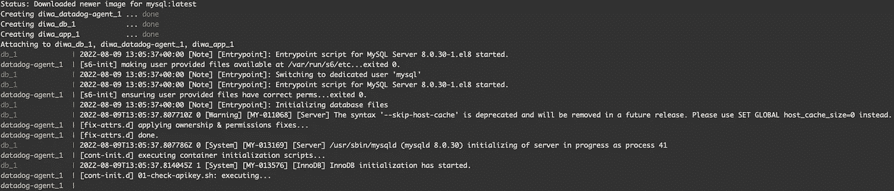
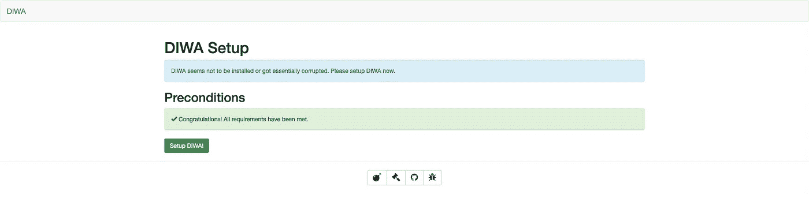
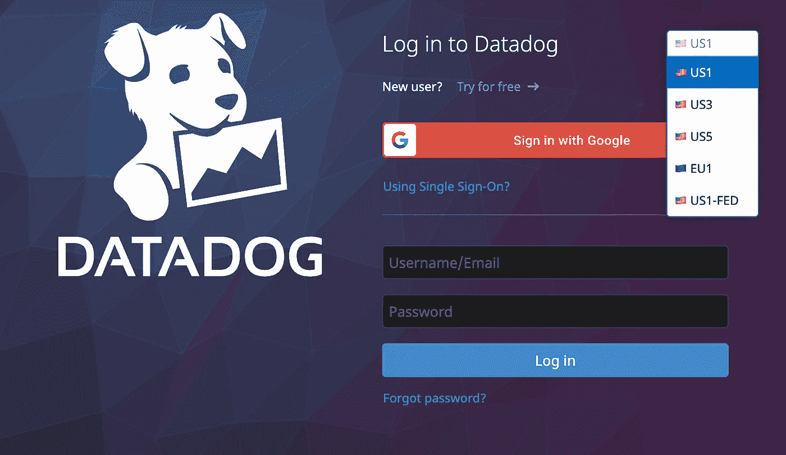
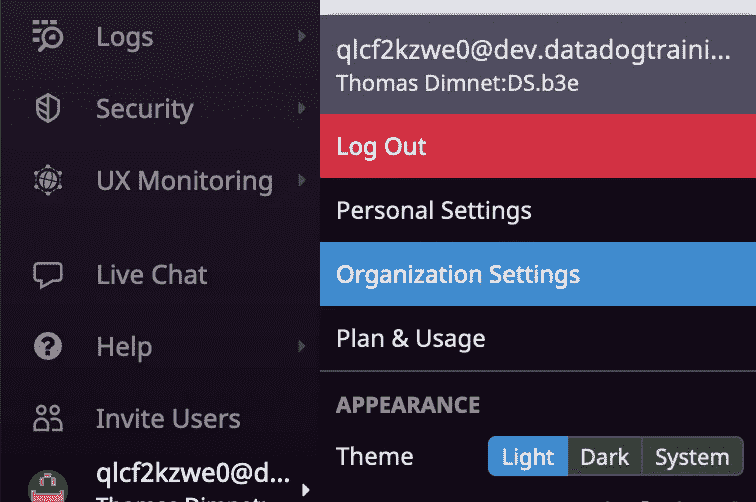
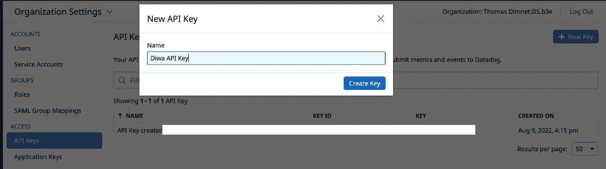
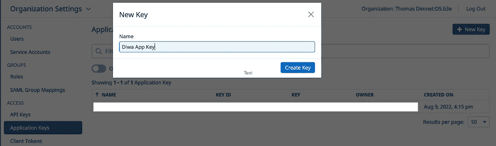
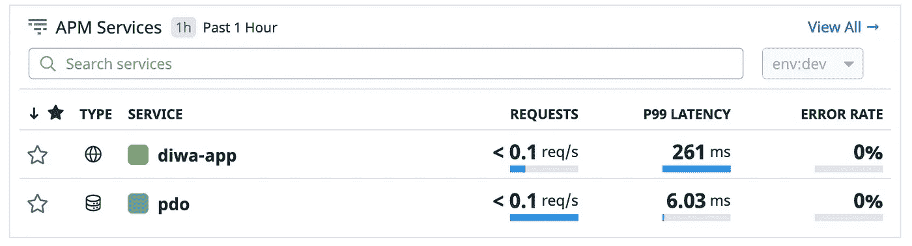
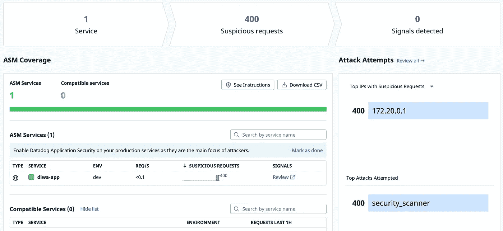
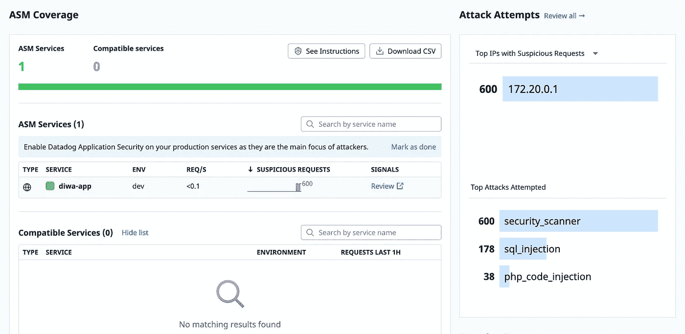
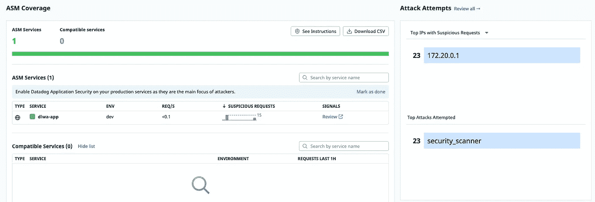

# 如何为 PHP 应用程序配置 Datadog 应用程序安全监控

> 原文：<https://betterprogramming.pub/how-to-configure-datadog-application-security-monitoring-for-php-applications-4eb4631ad7ca>

## 从安装和配置代理到执行攻击和获取警报


资料来源:pixabay.com

上一次写关于 SQL 注入的。说实话，当时我心里有两个目标:第一，解释什么是 SQL 注入，如何工作，如何执行和防范。第二，如何阻止他们使用可观察性工具。因为要意识到潜在的攻击，你需要得到警告，知道有什么事情出错了。考虑到这一点，攻击听起来就像是 bug。大多数时候，我们甚至不知道我们的代码中是否有 bug。好吧，也许不是我们在编写应用程序时可以发现的大错误，但是想想种族痕迹！

您如何知道您的代码不包含其中之一呢？它们往往很难被发现，而且通常是我们不想要的那种错误。在处理 bug 时，前端和后端开发人员经常使用可观察性或监控工具。像 Datadog 这样的工具允许我们捕捉跟踪错误，监控前端和移动应用程序，并意识到潜在的错误。

一些工具还允许我们监控应用程序的安全性。它们可以在检测到潜在攻击时向我们发出警报，向我们展示攻击的表现，并在有攻击发生时向我们发出警报。今天，我将向您展示如何设置和使用这些工具之一。

如果你想跟进，你必须有一个数据狗帐户。这可能是一个试验，因为我们将使用全球可用的服务。您将很快看到在哪里创建 API 和 APP 密钥以及如何使用它们。您还需要在您的计算机上安装 Docker，因为我们将使用 docker-compose 容器。不管你用 Windows 还是 Mac 都应该可以。我们开始吧！

# 克隆和建立地洼项目


资料来源:pixabay.com

第一步是[在我的 GitHub Repo](https://github.com/tdimnet/diwa) 上检索 Diwa 项目。请注意，这是一个叉子。最初的版本使用 Docker，但不使用 MySQL(改为 SQLite)或 Docker Compose。Docker Compose 将有助于检索 Datadog 代理并使其收集数据。此外，由于 Docker Compose，启动和运行过程很快:构建映像，然后启动容器。只有两个命令。使用以下命令将 repo 和“cd”克隆到其中:

```
$ git clone [git@github.com](mailto:git@github.com):tdimnet/diwa.git$ cd diwa
```

在构建和运行容器之前，我们需要向项目中添加环境变量。可以复制`env.example`文件。它包含三个环境变量:`DD_SITE`、`DD_API_KEY`和`DD_APP_KEY`。您现在不需要更改它们，所以让它们保持空白。一旦你复制了你的`env.example`并创建了一个`.env`文件。您应该有相同的文件结构。代码如下:

我们现在只需要构建和启动容器:

```
$ docker-compose build
$ docker-compose up
```



当你看到这样的日志时，似乎一切都应该在工作(来源:作者)

然后，等几秒钟，一切才恢复生机。一旦你的容器准备好了，你应该打开你的网络浏览器并进入`[localhost:8080](http://localhost:8080/)`。瞧啊。



点击“设置 DIWA！”按钮，你就可以走了！(来源:作者)

请随意探索该应用程序，看看它是如何构建的。[如果想学习如何执行 SQL 注入](/hacking-the-web-with-sql-injections-cd418d84219a)，还是可以参考我之前的文章。顺便说一句，一部关于 XSS 袭击的新电影即将上映。现在，让我们配置 Datadog 及其代理。

# 添加并配置 Datadog 代理


资料来源:pixabay.com

## 配置您的 Datadog 帐户

如果您还没有帐户，第一步是创建一个帐户。我建议你使用一个可以试用的电子邮件地址。这样，环境看起来就和我的一样了。配置工具有时就像编码一样。在把情况复杂化之前，你需要先从简单开始。

所以，请[去 datadoghq.com](https://www.datadoghq.com/)点击免费开始。在那里，通过提供您的电子邮件和密码来创建您的帐户。请注意在选择下拉列表中选择的数据中心。这是您可以登录的地方。完成表格后，检查您的电子邮件并返回到登录表格。选择您之前选择的数据中心，并提供您的电子邮件和密码。

如果您遇到错误，大多数情况下，这意味着您没有选择正确的数据中心。这是我在做对之前犯过几次的愚蠢错误之一！



数据中心下拉按钮在右上角(来源:作者)

现在，让我们通过单击“组织设置”按钮转到我们的组织设置。你需要看着屏幕底部，将鼠标悬停在你的电子邮件地址上。对了，你会看到下面的日志(在左上方)。这张图片显示了 ASM 住的地方和我们下一步要去的地方。



安全和组织设置在同一个屏幕截图上

让我们从创建一个 API 键开始。在“访问”部分中搜索 API 密钥页面，然后单击蓝色按钮“新建密钥”让我们把它命名为“Diwa API Key”



填写您的 API 密钥(来源:作者)

对应用程序密钥进行同样的操作。在 API Keys 链接下面查找应用程序密钥页面。



填写您的应用密钥(来源:作者)

现在，是时候回到地洼了。如果你的文本编辑器没有打开，打开它并进入`.env`文件。将 API 和 APP 密钥粘贴到各自的字段中。然后，选择您的数据中心，并写下哪一个是您的。然后，您可以通过执行以下操作来重新启动 docker 容器:

```
$ docker-compose stop
$ docker-compose up
```

您不需要重新构建它们，因为您只是更改了环境变量。您的项目现在应该开始收集数据。浏览到您的 APM 页面。如果它还没有数据，请尝试等待几分钟。然后你应该开始看到数据。



[APM 页面应该是这样的](https://app.datadoghq.com/apm/home?env=dev)(来源:作者)

现在这个项目已经开始工作了，是时候看看 Docker 的配置了。

## 提取和使用数据狗 docker 图像

打开`docker-compose.yml`文件。它包含三种服务:

*   `app`，这是 PHP 地洼 app 本身
*   `datadog_agent`，这是一个 Docker 代理，它运行在一个独立于应用程序的容器中
*   `db`，这是 MySQL 数据库

一般来说，如果您运行容器化的应用程序，最好让 Datadog 代理运行在它自己的容器上。这样，您就有了一个收集所有数据的中心节点。如果你知道 AWS X 射线，它的工作原理是一样的。

我们先来看看 app 服务:

它使用了一个我们几分钟后将会看到的本地 other 文件，并且它依赖于另外两个服务:`db`和`datadog-agent`。这意味着在启动这个容器之前，它将首先提取图像。

它在内部运行；在 Docker 容器内部，在端口 80 上，在外部，在您的浏览器上，在`port 8080`上。它还使用环境变量。它们对您的 Datadog 配置很重要，所以让我们花点时间来看看它们:

*   `DATADOG_AGENT_HOST`告知您的 Datadog 代理运行实例的位置。例如，当您使用 APM(跟踪)时，您必须将应用程序性能数据发送给代理。
*   `DD_TRACE_AGENT`与上述环境变量一起使用。它告诉你哪个端口向哪个服务发送数据。默认端口是`8126`。
*   `DD_ENV`定义工作环境。例如，`dev`、`staging`或`prod`。
*   `DD_SERVICE`，服务的名称，它将出现在 Datadog 中。
*   `DD_APPSEC_ENABLED`启用应用安全监控(ASM)。这也是我写这篇文章的主要原因:)。

最后，`labels`只是给负责服务的团队一个名字。说实话，`app`没那么棒。你应该起个更好的名字，比如`product-catalog-team`。

接下来，让我们看看 Datadog 代理服务:

它使用`datadog/agent` Docker 图像。我们使用来自 [Dockerhub](https://hub.docker.com/r/datadog/agent) 的图片，但你可以免费使用[谷歌云平台](https://console.cloud.google.com/gcr/images/datadoghq/GLOBAL/agent?pli=1)或 [AWS](https://gallery.ecr.aws/datadog/agent) 。和上面的例子一样，它使用了环境变量。`.env`文件仅使用`DD_SITE`、`DD_API_KEY`和`DD_APP_KEY`。我已经在上面写了。相反，我们将查看上面定义的环境变量:

*   `DD_APM_ENABLED`为您的应用启用 APM。我知道我没有对 APM 和跟踪说太多，因为这不是本文的主题。如果你想了解更多关于 APM 的信息，请查看这个资源。
*   `DD_APM_NON_LOCAL_TRAFFIC`从其他容器跟踪时允许非本地流量。
*   `DD_LOGS_ENABLED`使用日志代理启用日志收集。
*   `DD_LOGS_CONFIG_CONTAINER_COLLECT_ALL`从其他容器收集日志。
*   `DD_CONTAINER_EXCLUDE`从数据狗指标中排除`datadog-agent`。

`volumes`帮助您在容器之间共享信息，尤其是日志。我们的 Datadog 代理现在已经配置好了，可以使用了:它已经从您的本地 Diwa 收集数据，并将它们发送到 Datadog。在继续之前我们只需要看最后一件事。

## 为 PHP 应用程序安装跟踪和安全库

以下是该项目的 docker 文件。它用于设置使用 Apache 的项目，并为 PHP 应用程序安装`pdo`，但它也安装 Datadog 跟踪和应用程序安全库。请看第 6 行和第 7 行。

它检索 Datadog Php 库，并安装所有东西。如果您使用其他编程语言，这一部分会有所不同。我将很快写一些关于如何设置 Datadog 的文章。好消息是所有的配置都完成了。该项目现在可以使用了；APM 和 ASM 一样工作正常。该进攻了！

# 使用工具执行攻击并获取警报


资料来源:pixabay.com

在本节中，我们将使用一些自动化脚本来被 ASM 检测到。我将快速展示这些脚本和工具，但这不是一篇关于黑客的文章。如果您想了解黑客技术，特别是 SQL 注入技术，请阅读本文。我正在写另外两本关于 XSS 和暴力的书。我应该在夏末之前出版它们。

## 执行基本验证脚本

我们要做的第一件事就是让 ASM 兴奋起来。这不会执行真正的攻击，但它会向 ASM 发送足够的数据，以意识到正在发生的事情。下面是我们将要执行的脚本:

你可以在`scripts`文件夹里找到它。您的项目需要在启动这个命令之前运行，所以请确保之前已经点击了`docker-compose up`。然后，键入以下内容:

```
$ bash ./scripts/asm.sh
```

这将对你的项目执行 200 次百转并击中路线`/`和`/?page=toto`。一旦命令结束，浏览到[数据狗汇编](https://app.datadoghq.com/security/appsec)。你可以在安全>应用安全下找到。很快，您应该会看到类似这样的内容:



是的，数据狗 ASM 肯定很兴奋！(来源:作者)

## 使用 SQLMAP

是时候使用更先进的工具了！我们不打算用 SQLMap 来代替这个基本脚本。你会问，SQLMap 是什么？

> Sqlmap 是一种开源软件，用于检测和利用数据库漏洞，并提供向其中注入恶意代码的选项。— sqlmap

转到这个[库 GitHub](https://github.com/sqlmapproject/sqlmap) 并克隆它。遵循安装说明。它不使用 Docker 或另一个容器系统，但是您应该仍然能够让它工作。如果没有，请留言告诉我哪里出了问题。

一旦将 repo 和`cd`克隆到其中，执行以下命令:

```
$ python sqlmap.py -u [http://localhost:8080/\?page\=documentation](http://localhost:8080/\?page\=documentation)
```

然后，它会要求您这样做:

```
[11:31:29] [INFO] testing connection to the target URL
you have not declared cookie(s), while server wants to set its own ('PHPSESSID=e3af09572ca...84abd8330f'). Do you want to use those [Y/n] Y
```

按“y”。
然后，它会向您询问以下内容:

```
it is recommended to perform only basic UNION tests if there is not at least one other (potential) technique found. Do you want to reduce the number of requests? [Y/n] n
```

按“n”

在本例中，查询参数是不可注入的。它由 Php 路由器使用，而不是在 SQL 查询中使用。回到 ASM。您应该看到请求的数量增加了。



现在，我们还有 SQL_INJECTIONS 和 PHP_CODE_INJECTIONS(来源:作者)

好了，最后一个工具，你已经准备好了！

# 使用 Gobuster(可选)

Gobuster 是一个用 Go 编写的目录/文件、DNS、VHost 破坏工具。你可以用它来暴力破解 URIs，DNS 子域，甚至 AWS S3 桶。这里是从它的 [GitHub 库](https://github.com/OJ/gobuster)克隆它的地方。

如果你想跟着做，你必须在你的机器上安装 Go。(*当我写这篇教程时，我想用 Docker 来代替，但这意味着我们需要创建一个网络并编写更多的命令*)。

如果你在安装 Gobuster 时遇到问题，请在评论区告诉我，我会帮助你的。

安装 Go 后，运行命令:

```
$ go install github.com/OJ/gobuster/v3@latest
```

然后发射 Gobuster。试着看看 Gobuster 是否在你的路径上(对我来说不是这样)。您可以尝试以下任一方法:

```
$ gobuster# OR$ /Users/${yourUserName}/go/bin/gobuster
```

这应该会显示以下内容:

```
Usage:
  gobuster [command]Available Commands:
  dir         Uses directory/file enumeration mode
  dns         Uses DNS subdomain enumeration mode
  fuzz        Uses fuzzing mode
  help        Help about any command
  s3          Uses aws bucket enumeration mode
  version     shows the current version
  vhost       Uses VHOST enumeration modeFlags:
      --delay duration    Time each thread waits between requests (e.g. 1500ms)
  -h, --help              help for gobuster
      --no-error          Don't display errors
  -z, --no-progress       Don't display progress
  -o, --output string     Output file to write results to (defaults to stdout)
  -p, --pattern string    File containing replacement patterns
  -q, --quiet             Don't print the banner and other noise
  -t, --threads int       Number of concurrent threads (default 10)
  -v, --verbose           Verbose output (errors)
  -w, --wordlist string   Path to the wordlistUse "gobuster [command] --help" for more information about a command.
```

创建一个文本文件`test.txt`并粘贴以下内容:

```
?page=documentation
?page=downloads
?page=contact
?page=installation
?page=login
?page=register
```

最后，确保您的项目仍在运行，并针对您的`localhost:8080`启动 Gobuster。

```
/Users/${yourUserName}/go/bin/gobuster dir -u [http://localhost:8080/](http://localhost:8080/) -w ./test.txt -n
```

最后，回到 Datadog，转到 ASM，然后点击 refresh。你应该可以在主仪表板上看到`security_scanner`攻击。



Datadog 检测到 security_scanner(来源:作者)

# 包扎

好了，下面是为 Docker 容器中运行的 PHP 应用程序启用 Datadog ASM 需要做的事情:

*   创建数据狗 API 和应用程序密钥
*   在您的编排工具中添加 datadog-agent 映像
*   添加环境变量(针对 APM、AppSec 以及您的应用程序和 API 密钥)
*   在 docker 文件中安装所需的库

就是这样！

祝大家愉快！