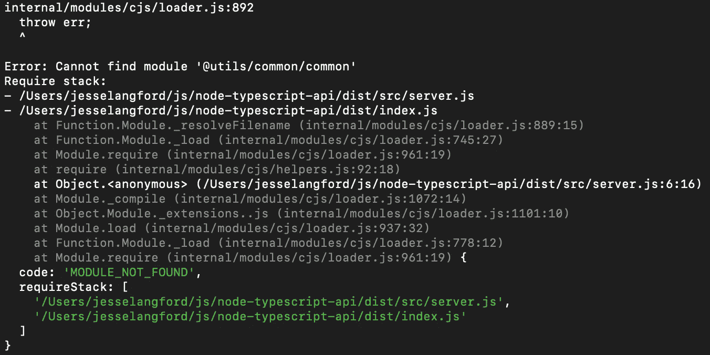

# 如何用 TypeScript 配置路径别名

> 原文：<https://betterprogramming.pub/how-to-configure-path-aliases-with-typescript-8586dc0aa214>

## 展示了这种有用的命名策略的细微差别


作者:比尔吉特·雷茨-霍夫曼

在本文中，我将展示如何在 TypeScript 项目中配置路径别名。示例项目可能过于简单，但是该配置将适用于真实世界的应用程序。TypeScript 使添加路径别名变得容易，但是它不是预先配置的。有一些细微的差别，这是我将涉及的。

# 入门指南

路径别名是用户定义的名称，用于替换长的相对路径。

```
Non-aliased relative import
import { IUser } from "../../../../../../../@interfaces/user"Aliased import
import { IUser } from "@interfaces"
```

从上面的例子可以看出，别名对导入语句的可读性有很大的影响。

# 示例文件夹结构

下面是我将在其余示例中使用的文件夹结构:

```
@interfaces/
  user.d.ts
e2e/
src/
  utils/
    common/
      common.ts
    user/
      user.ts
  server.ts
index.ts
```

## 没有混叠

在我实现路径别名之前，让我们看一下我的两个文件。

`src/server.ts`

`src/utils/user/user.ts`

`src/server.ts`和`src/utils/user/user.ts`进口`IUser`型。相对进口的`IUser`型内`src/utils/user/user.ts`已经看起来很长了。随着我的应用程序的增长，我的相对导入的长度也会增长。

# 类型路径别名

我将设置的第一种别名是保存我所有自定义类型/接口的文件夹。

首先，我需要编辑我的`tsconfig.json`文件。我正在寻找`baseUrl`和`paths`值。我将更改我的文件以匹配下面的示例:

```
"baseUrl": "." ,
"paths": {
  "@interfaces/*": ["@interfaces/*"]
}
```

`baseUrl`:告诉 TypeScript 应该从哪个基本目录开始工作。该路径基于我的`tsconfig.json`文件的位置。对于这个例子，我将把`baseUrl`设置为我的项目的根。

`paths`:告诉 TypeScript 哪个别名与哪个文件路径相关联。

保存 tsconfig 设置后，我可以将接口导入从相对路径更改为新别名。

`src/server.ts`

`src/utils/user/user.ts`

## 非界面混淆

接下来，我将为非接口目录配置别名导入。

首先，我将向我的`tsconfig.json`文件中的 paths 对象添加另一个项目。

```
"baseUrl": "." ,
"paths": {
  "@interfaces/*": ["@interfaces/*"],
  "@utils/*": ["src/utils/*"]
}
```

从那里，我可以对`utils`目录的相对路径进行类似的更改。

但是，类型路径别名和非类型别名是有区别的。如果我传输我的应用程序并尝试运行它，我会收到以下错误:



为了找到关于这个错误的更多信息，我将查看转换后的 JavaScript 文件，如下所示:

我可以在第 6 行看到，我在 TypeScript 中设置的别名已经被移植到 transpiled JavaScript 中。JavaScript 需要相对文件路径来找到指定的模块。

这不是接口别名的问题，因为在转换过程中所有类型都被去除了。

为了将我的别名转换回相对路径，我将导入一个名为 [tsc-alias](https://www.npmjs.com/package/tsc-alias) 的有用包。

```
npm install --save-dev tsc-alias- or -yarn add ts-alias -D
```

为了使用这个包，我将把它添加到我的构建过程中。

```
"build": "npm-run-all clean tsc tsc-alias",
```

现在，当我构建我的项目时，第 6 行再次使用相对路径。

# 包扎

路径别名是添加到 TypeScript 项目中的一个很好的特性。它使您的代码更容易阅读，并让您更熟悉 TypeScript 的配置及其翻译过程。自从我学会了如何实现路径别名，我就把它添加到我工作的每个项目中。

我希望这对你有所帮助，并让你知道如何将它添加到你的项目中。