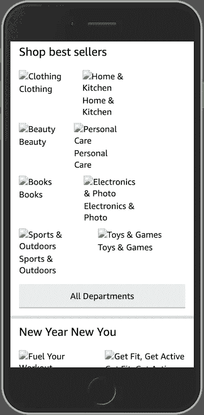
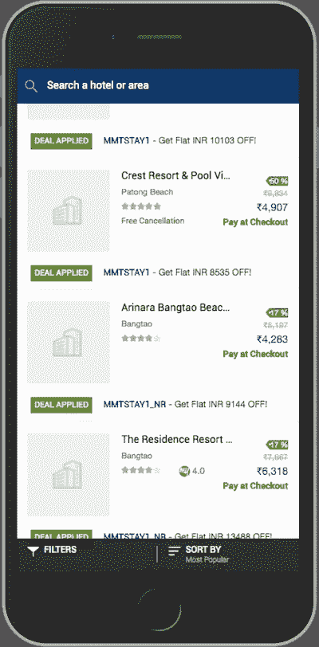

# 如何为 PWAs 配置占位符图像回退

> 原文：<https://betterprogramming.pub/how-to-configure-placeholder-image-fallbacks-for-pwas-bab216e0031e>

## 通过添加图像占位符来创建类似本机应用程序的 pwa，以防找不到原始图像


[插画](https://undraw.co/illustrations)。

如果您还想添加离线功能，构建 PWA 有时会变得有点复杂。虽然建立良好的离线体验需要时间，但您可能会发现更多的方法来增强用户的离线体验。其中一种方法是确保每个图像都有一个占位符图像，作为在出现错误、缓存失效或网络状况不佳时的备用图像。

这是我们希望避免的:



如果由于某种原因，您的原始图像不可用，就会发生这种情况。

图像不可用的情况:

*   缓存的图像已过期。
*   用户离线，但没有图像被缓存。
*   用户第一次导航到一个离线页面，图像不是预先缓存就是在运行时缓存。
*   由于重命名错误，未找到原始图像。
*   图像被意外地从 CMS 中删除，但仍在网站上使用。

为了修复这种糟糕的用户体验，我们需要“保护”我们的 PWA，防止图像从网络或缓存中不可用！

在本文中，我将向您展示一种简单的方法，在您的 web 应用程序中的任何地方包含这些占位符图像，甚至不需要接触您的原始应用程序代码！



[MakeMyTrip 示例](https://thegoodmobileui.com/#/screenshot/makemytrip-images-placeholders)占位符图片截图

# 输入服务人员

为了在不接触应用程序代码的情况下，使这项功能简单易行，我们将使用一名服务人员。

服务工作者在这里有用的原因是因为它的性质:服务工作者充当客户端(网站)与网络和缓存之间的代理。

[](https://www.wisdomgeek.com/development/web-development/service-worker-progressive-web-applications/)

服务工作者充当客户端(网站)与网络和缓存之间的代理。图由 [Fundebug](https://zhuanlan.zhihu.com/p/54004486) 绘制。

由于服务人员的 HTTP 请求拦截功能，我们将在应用程序中添加以下逻辑:

1.  一旦用户登陆页面，注册一个服务人员。
2.  预缓存占位符图像，以便将其保存在用户的设备上。
3.  监听客户端图像请求(例如，`img`的`src`属性将触发一个请求)。
4.  在服务人员内部，检查网络中是否存在映像。
5.  如果没有，检查它是否存在于缓存中。
6.  如果它也不存在，用预先缓存的占位符图像来响应。

# 好吧，现在怎么办？

## 1.注册服务人员

您可以在您的`index.html`文件或`app.js`文件中注册服务人员。如果您还没有注册服务人员，这将是您必须在应用程序代码中进行的唯一*更改*。

## 2.预缓存占位符图像

对于预缓存，更安全的做法是使用工具箱工具[生成预缓存清单](https://developers.google.com/web/tools/workbox/guides/precache-files#generating_a_precache_manifest)，并确保您的占位符图像包含在清单文件中。无论哪种方式，请仔细检查 URL 是否与正确的图像匹配。

## 3.监听任何图像获取事件

根据您的要求，选择您希望有占位符后备图像的图像。

`HANDLER`通常是工具箱策略应该去的地方，但是这一次，我们将使用一些更加定制的东西。

```
/* service-worker.js */workbox.routing.registerRoute(
  /\.(?:webp|png|jpg|jpeg|svg)$/,
  /* <HANDLER> */
)
```

## 4.检查网络和缓存中的图像

我们仍将使用 [stale-while-revalidate 策略](https://developers.google.com/web/tools/workbox/modules/workbox-strategies#stale-while-revalidate)，但仅当在缓存或网络中找到映像时。如果没有找到，我们抛出一个`Error`,稍后我们捕获并处理它。

## 5.用占位符图像响应

在捕捉到获取错误并知道在网络或缓存中没有找到请求的图像后，我们可以继续前进，用占位符图像来响应。

# 把所有的放在一起

综上所述，我们将在你的`service-worker.js`文件中得到如下代码，你的应用程序代码没有任何变化:

我希望这是一个相对容易和快速的实现，这样你的用户就不用看着那些没有对齐的丢失图像的盒子了。相反，他们将在你的 PWA 中享受到更像本地应用的感觉。

# 进一步阅读

*   [离线 UX 考虑事项](https://developers.google.com/web/fundamentals/instant-and-offline/offline-ux) —谷歌开发者
*   [缓存 API 文档](https://developer.mozilla.org/en-US/docs/Web/API/Cache) — MDN 文档
*   [使用缓存 API](https://developers.google.com/web/fundamentals/instant-and-offline/web-storage/cache-api) —谷歌开发者
*   [使用服务工作者和缓存 API 的缓存处理](https://medium.com/@charistheodoulou/7c00c478d39b?source=friends_link&sk=414f61ce6a9b9d612be1d617217422ad) —中等
*   [PWA 维客](http://pwa.js.org/)