# 如何像专业人士一样配置 VS 代码

> 原文：<https://betterprogramming.pub/how-to-configure-vs-code-like-a-pro-782d2d718586>

## VS 代码生产率的终极指南

由[女星](https://nl.freepik.com/vrije-vector/neonlicht-pijlrichting-in-perspectief_6024598.htm)在[免费视频](https://www.freepik.com/)上拍摄的照片。

我使用 VS 代码已经快两年了，我真的很喜欢这种开发体验。也就是说，就在几个月前，我才真正开始使用 VS 代码中的一些特性，这些特性让我的生产力和开发过程进入了高速运转。这就是今天这篇文章的目的:展示 VS 代码必须提供的高级特性，以使您的生活更加轻松和高效。

以下是我将在本文中涉及的主题列表:

*   如何设置工作区？
*   如何设置多文件夹工作区？
*   通过您的工作区公开和共享扩展(对团队非常有用)。
*   如何在工作区/多文件夹工作区中设置和运行自动化任务。
*   如何在工作区内创建自定义代码段。

一路上，我还会分享一些我日常使用的最好的 VS 代码扩展。在文章的最后，我还将提供一个小的 repo，其中包含我将在接下来的几分钟内介绍的所有技巧和调整。我使用的是最新版本的 VS 代码(在撰写本文时是 1.47.2)，所以请确保您的编辑器是最新的，以便没有任何问题地跟进。

# 为什么我们甚至需要一个工作空间？

为了在基于项目的级别而不是在全局(用户)级别应用任何设置或配置，您将需要一个工作区。拥有一个工作空间可以让你对工作环境的各个方面进行定制，以满足你正在进行的项目的特定需求。

在这里，我谈论的是扩展、任务、代码片段，甚至是你的文本编辑器的外观。这正是我要介绍的内容，我将向您展示如何在您自己的工作空间中设置和配置。

说够了，让我们看看如何创建一个工作空间:

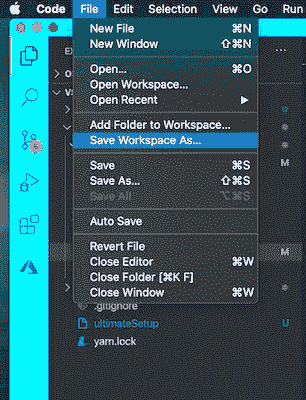

工作空间设置

就这么简单！一旦您命名了您的项目工作环境，您应该在您的项目的根级别上有一个扩展名为`.code-workspace`的文件，如下所示:

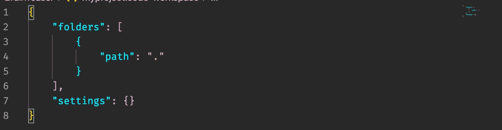

。代码工作空间文件

此外，我需要提到的是，如果您已经关闭了项目并想要重新打开它，您应该从文件 *>* 打开工作区来应用项目工作区内所有保存的设置。

现在，工作空间文件看起来真的很空，没有做什么，但是我们可以通过安装我最喜欢的扩展之一[来快速改变 VS 代码的外观。](https://marketplace.visualstudio.com/items?itemName=johnpapa.vscode-peacock)

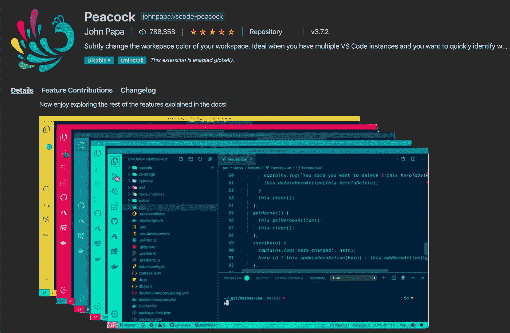

孔雀延伸

*注意:如果你已经决定不在你的工作区安装 Peacock，就跳过下面几行。*

一旦你有了扩展，打开命令面板(Mac 上的 **⌘+** ⇧+P)。从那以后，只需点击一下鼠标，就可以完全改变 VS 代码的外观。

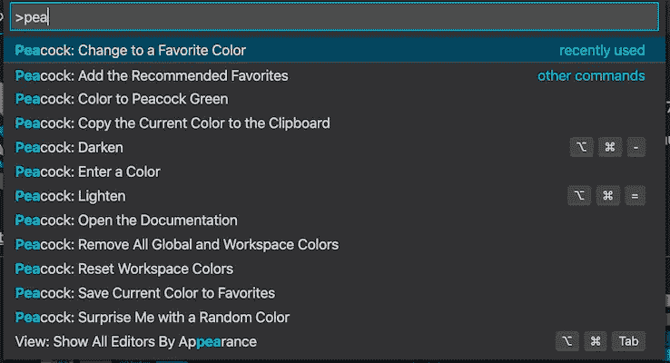

除了这个扩展的纯视觉优势，它还可以更容易和更快地在几个打开的项目之间导航或搜索，在这里修复一些东西，或者在那里引用。我经常需要这样做，这就是为什么我真的很喜欢这个扩展。

现在我们已经讨论过了，如果你再看一下你的`.code-workspace`文件，你会发现在你选择了孔雀主题后它发生了巨大的变化。

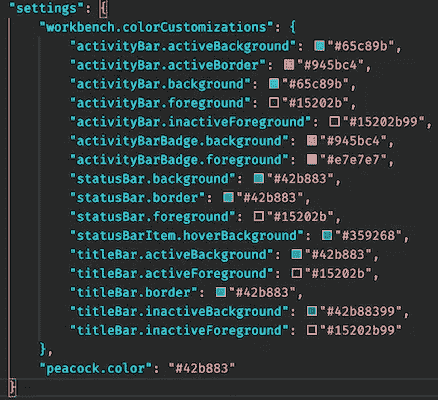

在`workbench`对象中，你可以进一步定制 VS 代码中的许多其他元素和部分(例如终端部分)。我将在文章的最后给出我准备的 GitHub repo 中这些选项的参考。

# 多文件夹工作区

什么是多文件夹工作区，为什么有人需要它？我知道这听起来有点吓人，但实际上，多文件夹工作区只是一个常规的工作区，只是在原始项目的文件夹中添加了额外的文件夹(项目)。真的很简单。让我展示给你看:

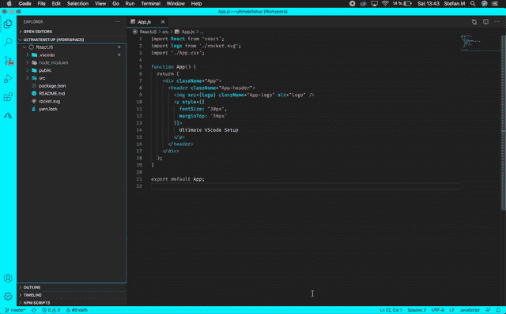

多文件夹工作区

就这样，您可以向当前工作区添加任意数量的项目。您可以让您的前端和后端项目共享一个工作区，或者您可能希望您的 monorepo 为其中的 React 应用程序配置一个工作区。

多文件夹工作区中的设置和功能与普通工作区完全相同。这里没有额外的魔法。

# 通过您的工作区公开和共享您的扩展模块

如果您与其他开发人员在一个团队中处理同一个项目，这是一个特别有用的特性。让我们想象一个场景，为了保持代码风格和代码库的整洁和一致，有一些必须的扩展。

这就是 VS Code 的扩展推荐选项派上用场的地方。我将借此机会与您分享我在下面的示例中使用的几个扩展:

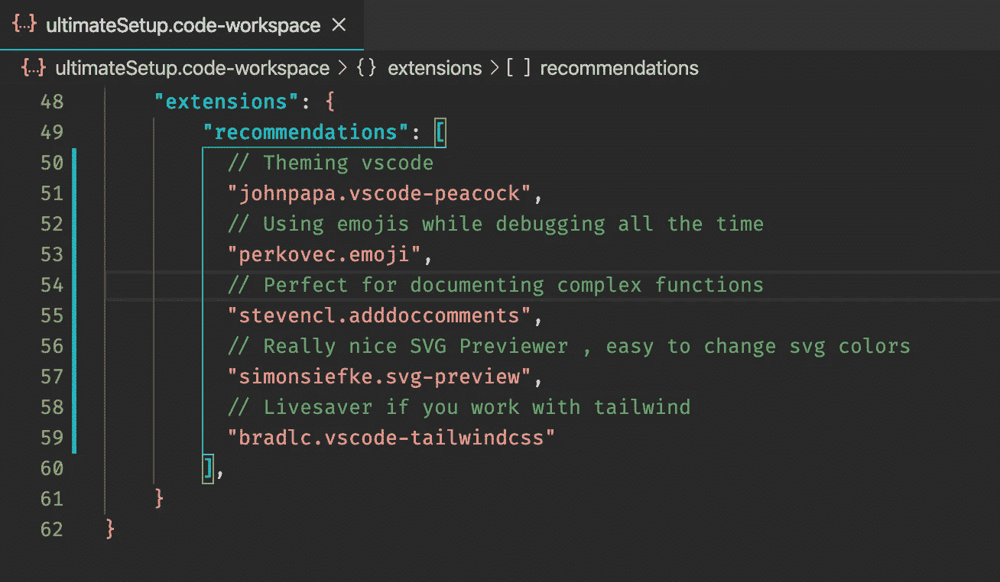

扩展建议

这是一项非常简单的工作。这里唯一要提到的是，每当有人打开这个工作空间，VS 代码检测到没有安装任何推荐的扩展时，编辑器的右下角会弹出一个对话框，说:

接下来，让我们看看如何通过在多文件夹工作区和单个工作区运行自动化任务来真正提高我们的工作效率。

# 在 VS 代码中设置和运行任务

可能每个开发人员都在尽可能地避免和减少重复的任务和命令。VS 代码有内置的功能，允许我们执行诸如`git`、`yarn/npm`、`gulp`、`grunt typescript`、`lint`等任务。甚至将一系列相互依赖的任务链接起来。

让我们举一个命令链的例子。我确信这里的大多数开发人员对它们都很熟悉:

*   `git checkout development`
*   `git pull — rebase`
*   `yarn install`
*   `yarn run dev`

我们可以很容易地配置 VS 代码，根据我们的需要，在一次点击或每次打开我们的工作区时执行这一系列命令。
这是`tasks.json`文件的样子:

任务文件

如您所见，该文件放在`.vscode`文件夹中。这是 VS 代码可以检测和运行预定义任务的地方。

要执行该任务，我们需要进入 Terminal > Run Task，并从下拉菜单中选择我们的触发命令的名称(在本例中为`Init`)。很简单，对吗？

我想指出的是，如果您在一个多文件夹工作区中工作，您可以让任务在您的每个文件夹(项目)中同时运行，彼此独立。你只需要在每个项目中有一个`.vscode`文件夹和一个`tasks.json`文件，里面有你的命令。

每当我们从工作区打开项目时，我们可以很容易地配置 VS 代码来运行这种任务，从而真正实现自动化。这个过程还包括两个步骤:

*   首先，我们需要在触发器对象中添加一个额外的选项。
*   然后我们配置 VS 代码在运行时运行自动化任务。

如果我们希望我们的任务
被 VS 代码选中并运行，那么我们的触发器对象应该是这样的:

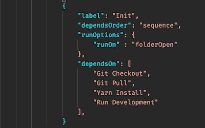

运行选项标志

*   对于第二部分，我们需要打开命令面板，键入“管理文件夹中的自动任务”，然后允许选项。

应该就是这样了。现在，如果您从工作区重新打开项目，您应该会在终端中看到已执行的任务。

最后但同样重要的是，让我们看看如何创建我们自己的自定义片段。

# 如何在工作空间中创建自定义代码片段

代码片段是一种很好的方式，可以节省您一直键入模板或样板代码的时间。当然，可以选择安装一个 snippet 扩展，但是我更喜欢根据我的喜好和需要来定制 snippet。

因此，为了创建代码片段，您应该在 VS 代码中导航到
代码>首选项>用户代码片段。然后，您应该会看到一个下拉列表，其中列出了您当前拥有的代码片段和选项“新的全局代码片段文件…”“新代码段文件”表示“您的工作空间的名称”

正如您可能已经猜到的那样，全局代码片段是在用户级别上应用的，与“workplace”的新代码片段文件只能在特定的工作区内使用的选项相反。

无论哪种方式，在您选择了想要的选项并为代码片段命名后，您应该会在`.vscode`文件夹中看到一个文件，如下所示:

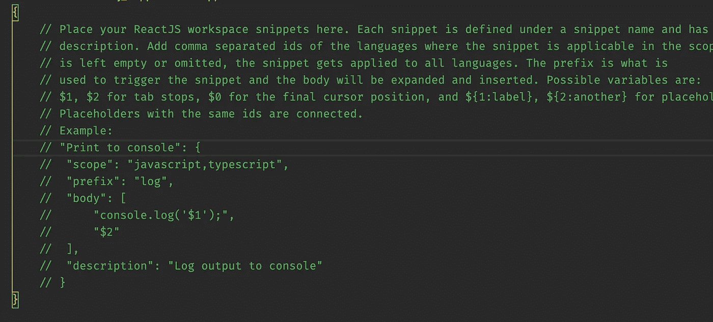

样本片段

乍一看，这个文件看起来有点奇怪，但是如果您在下面的行中评论一下`Example:`、*、*整个事情是如何工作的，实际上应该开始有一些意义了。请参见 [VS 代码文档](https://code.visualstudio.com/docs/editor/userdefinedsnippets)以真正深入了解代码片段语法。

以下是您需要了解的要点的简要概述，以便您可以快速创建自己的代码片段:

*   在配置定制代码片段时,`scope`属性非常重要。这个选项告诉 VS 代码我们的代码片段应该在哪个文件中可用。默认情况下，我们包含了 JavaScript 和 TypeScript，所以我们的代码片段只能在包含。js 和。结尾的 ts 扩展。

例如，如果我们想让它为 React 和。jsx 或者。tsx 文件，我们应该做一个小小的添加，在`scope`里面添加`javascriptreact` 和`typescriptreact`。

下面是我使用的 React 片段示例:

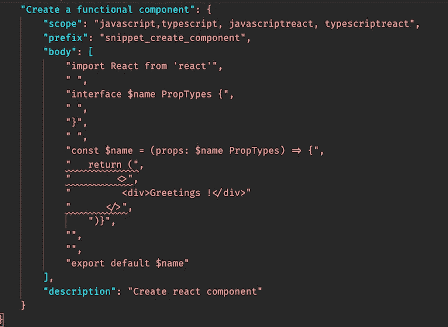

反应片段示例

我知道这看起来不太好。如果我们想有一些接近正确的缩进，这种奇怪的方法，有空白的字符串应该应用:

*   `prefix`属性告诉 VS 代码应该如何在全局名称空间中命名和调用该代码段，所以要小心选择名称。
*   正如您已经看到的，`body` **，**是实际代码片段所在的地方。您可以使用许多选项和变量来自己创建一个相当复杂的代码片段。
*   `description` 道具相当自明。我唯一见过它运行的地方是在 VS 代码 IntelliSense 中，当你调用你的代码片段的时候。

下面是 React 片段的示例:

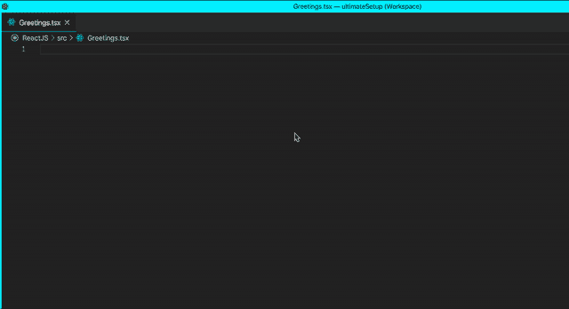

# 结论

如果您已经阅读完本文，那么您现在应该是一名真正的 VS 代码专家了！这里是我之前承诺的 [GitHub 回购](https://github.com/Squiff88/vscodeSetup)。在那里，您可以找到本文中涉及的所有内容，以及终端定制方面的一些额外内容。

享受快乐的黑客生涯！