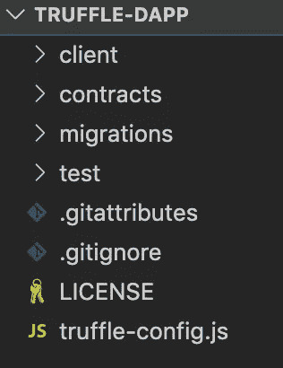
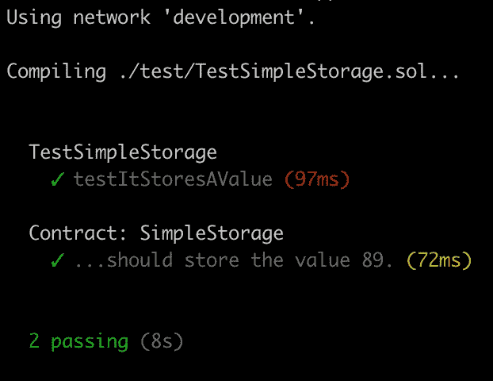
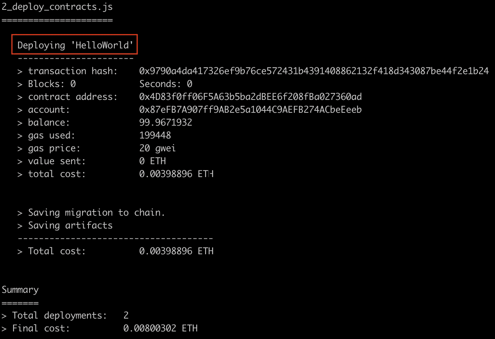
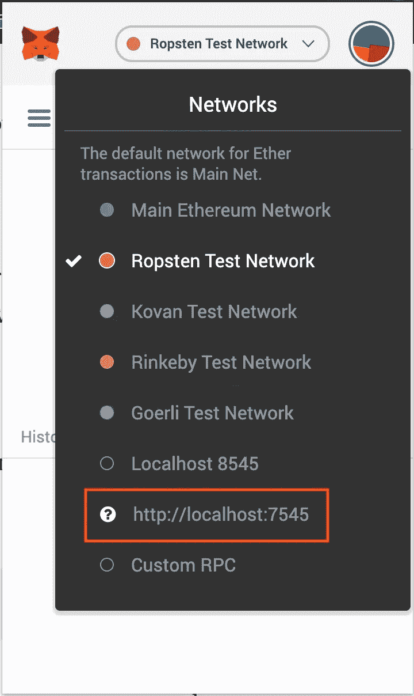
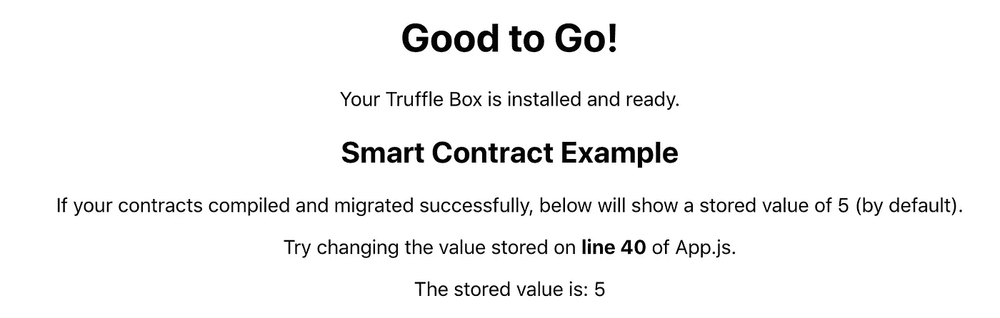
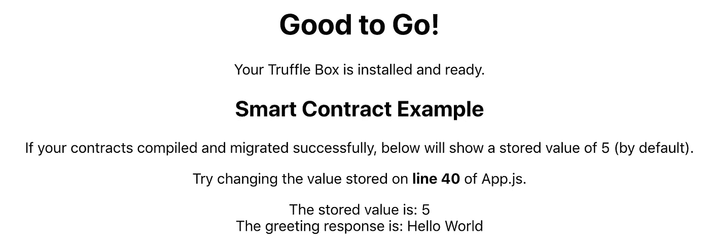

# 如何将 React 应用程序连接到区块链

> 原文：<https://betterprogramming.pub/how-to-connect-a-react-app-to-the-blockchain-fa9dbd0bbd69>

## 用 React 开发以太坊 DApps


费伦茨·阿尔马西在 [Unsplash](https://unsplash.com/s/photos/javascript?utm_source=unsplash&utm_medium=referral&utm_content=creditCopyText) 上拍摄的照片。

*先决条件:ReactJS 开发经验和以太坊智能合约的基本理解。*

Github 上提供了完整的工作项目代码[。](https://github.com/alexroan/truffle-dapp-tutorial)

# 介绍

本文解释了如何使用 Truffle 套件创建从区块链读取数据的 React 应用程序的分步说明。我们将使用与本文中[描述的相同的智能契约。我们将重点关注如何创建一个 React web 应用程序来读取区块链并显示数据，而不是浏览智能合约的细节。](https://medium.com/swlh/develop-test-and-deploy-your-first-ethereum-smart-contract-with-truffle-14e8956d69fc)

本教程中会有代码检查点，让你看到你的代码在每个阶段应该是什么样子。

# 创建项目

如果您已经阅读了本文，那么您已经安装了正确的依赖项。如果您还没有，我强烈建议您阅读它，以了解智能合约开发和部署生命周期。

首先，创建一个新的项目目录，并从您的终端导航到它。我把我的项目叫做松露-dapp:

```
mkdir truffle-dapp
cd truffle-dapp/
```

## 松露盒

我们正在使用 [Truffle Suite](https://www.trufflesuite.com/docs/truffle/overview) 来创建我们的 DApp，这是一个在以太坊网络上开发全栈分布式应用的流行框架。

Truffle 提供了一些名为[box](https://www.trufflesuite.com/boxes)的很棒的样板项目，它们是预先配置好的，让你专注于功能而不是摆弄配置。我们将使用 [React Box](https://www.trufflesuite.com/boxes/react) ，它带有一个现成的 React 前端。在项目目录中，运行以下命令:

```
truffle unbox react
```

这可能需要一点时间，但是一旦完成，您应该会在文本编辑器中看到如图 1 所示的文件夹结构。



图 1:文件夹结构。

*   `client/`包含我们的前端 React 代码。一旦我们的合同部署完毕，我们将需要在这里进行深入研究，以对我们的网页进行更改。
*   `contract/`是我们存储 Solidity 智能合同代码的地方。您会注意到这里已经有两个智能合约:一个叫做`Migrations.sol`，另一个叫做`SimpleStorage.sol`。`Migrations.sol`在迁移过程中使用，而`SimpleStorage.sol`是 React Truffle Box 附带的一个示例契约。我们将在本演练中添加另一个。
*   `migrations/`是我们的迁移逻辑所在。
*   `test/`是我们测试智能合约的地方，以确保它们按预期运行。
*   `truffle-config.js` 包含关于网络、编译器、文件位置和其他自定义配置的信息，让 Truffle 框架知道我们的东西在哪里。

## 迁移

打开本地区块链 [Ganache](https://www.trufflesuite.com/ganache) ，记下网络 ID 和 RPC 服务器信息。将这些信息复制到项目根目录下的`truffle.config.js`文件中，如图 2 所示。

图 2:松露配置文件。

确保您的网络名称是`development`而不是`develop`。

接下来，在您的终端中运行以下代码，将样板智能合约迁移到我们的 Ganache 区块链:

```
truffle migrate
```

完成后，运行现有的样板测试，以确保部署的契约按预期工作:

```
truffle test
```

输出应该如图 3 所示:



图 3:初始测试输出。

## 智能合同

现在，我们将创建新的智能合约。我们使用的是在这篇文章中使用的同一份合同。首先，在项目的`contracts/`文件夹中创建一个名为`HelloWorld.sol`的新文件。将图 4 的内容复制到文件中并保存。

图 4: HelloWorld.sol

接下来，我们需要确保我们的项目部署了正确的契约。在`migrations/`文件夹中，打开`2_deploy_contracts.js`并将图 5 中的代码复制到其中。

图 5: 2_deploy_contracts.js

这里，我们指示 Truffle 部署我们的 HelloWorld 契约和 SimpleStorage 契约。

最后，运行以下命令将新合同迁移到网络:

```
truffle migrate --reset
```

在输出中，您应该看到我们的 HelloWorld 契约正在部署，如图 6 所示:



图 HelloWorld 契约的部署。

## 试验

我们还将引入一个可靠性测试文件来测试`HelloWorld.sol`。在`test/` 文件夹下新建一个名为`TestHelloWorld.sol`的文件，将图 7 的内容粘贴进去，保存。

图 7: TestHelloWorld.sol

通过在终端中运行以下命令，检查所有测试是否通过:

```
truffle test
```

[*代码库检查点:版本 0.0.1*](https://github.com/alexroan/truffle-dapp-tutorial/releases/tag/0.0.1)

# 反应客户端

在我们编写任何 React 代码之前，我们需要确保我们的浏览器能够与访问区块链的站点进行交互。我们通过使用名为[元掩码](https://metamask.io/)的浏览器扩展来实现这一点。

## 元掩码

MetaMask 是一个浏览器插件，允许用户通过正规网站进行以太坊交易。前往他们的网站，安装扩展并创建一个帐户。



图 8:元掩码网络。

接下来，单击浏览器中的元掩码图标并登录。在那里，您需要添加一个定制的 RPC，以便扩展可以访问您的本地区块链。使用来自 Ganache 的信息，返回到 MetaMask，单击 Custom RPC，然后输入信息。您应该看到它出现在图 8 所示的连接列表中，带有 [http://localhost:7545](http://localhost:7545.) 。通过单击连接到此网络。

元掩码会在您创建帐户时创建一个钱包地址，但您也可以导入其他钱包地址，前提是您拥有对私钥的控制权。这对于测试来说非常好，因为我们可以使用 Ganache 提供的帐户与我们本地的区块链进行交互。

前往 Ganache，从列表中的第一个地址复制私钥。您可以通过单击每个帐户所在行右侧的密钥图标来显示私钥，如图 9 所示。


图 9:显示私钥。

回到浏览器中的 MetaMask，单击右上角的图标打开 Accounts 面板，如图 10 中的圆圈所示。


图 10:元掩码中的 Accounts 按钮。

点击【导入账户】*，*粘贴私钥，点击导入。这会将该帐户添加到您的帐户列表中。选择该帐户。太好了！让我们来测试一下。

## 前端

让我们测试一下我们的 React 客户端。正如我前面提到的，Truffle Box 提供了一些 React 样板文件。在您的终端中，导航到`client/`文件夹并运行以下程序:

```
npm run start
```

这将打开一个新的浏览器选项卡，并尝试将您的浏览器连接到区块链。您将从试图连接的元掩码扩展收到通知。确认一下。显示的网页应该如图 11 所示。



图 11:反应前端。

接下来，我们将加载新的 HelloWorld 契约，通过调用`getGreeting()` *，*检索问候语，并将其显示在此页面上。

## 质疑区块链

打开你的文本编辑器，打开`client/`文件夹中的`App.js`。

首先，导入编译好的合同。将下面一行添加到导入语句中:

```
import HelloWorld from "./contracts/HelloWorld.json";
```

然后我们需要做以下事情:

*   在`componentDidMount()`中，我们需要`this.setState()`包含 HelloWorld 契约，目前它只有简单存储契约。
*   一旦我们完成了这些，我们需要`runExample()`在 HelloWorld 契约上使用 call `getGreeting()`，就像它在 SimpleStorage 契约上调用`get()`一样。
*   最后，我们需要在`render()`方法中添加一个新的 div 来显示值。

自己尝试一下，并检查浏览器，看看您的更改是否达到了预期的效果。完成后，您的`App.js`文件应该类似于图 12 中的代码。

图 12: App.js



图 13:网页变化。

恭喜你！您已经使用 React Truffle Box 成功创建了一个 Truffle 项目，向该项目添加了一个智能合约，从该合约中检索了数据，并将其显示在 React 应用程序中。干得好！我希望这能激励你更多地探索区块链的发展，我鼓励你通过下面的一些链接来扩展你的知识。

[*代码库检查点:版本 0.0.2*](https://github.com/alexroan/truffle-dapp-tutorial/releases/tag/0.0.2)

# 进一步阅读

*   [如何将您的智能合约部署到公共测试网](https://medium.com/swlh/develop-test-and-deploy-your-first-ethereum-smart-contract-with-truffle-14e8956d69fc)
*   [如何在 you React app 中加载区块链](https://medium.com/better-programming/ethereum-dapps-how-to-load-the-blockchain-8756ca0fa0d1)
*   [如何成为区块链开发者](https://medium.com/better-programming/how-to-become-a-blockchain-developer-7a6d643d1d4d)

[](https://medium.com/blockcentric/blockchain-development-resources-b44b752f3248) [## 区块链开发资源马上跟进

### 学习区块链、以太坊和 DApp 开发的资源列表

medium.com](https://medium.com/blockcentric/blockchain-development-resources-b44b752f3248) 

如果你喜欢这篇文章，并想了解更多关于智能合约安全、区块链开发或区块链空间的知识，我强烈推荐 [Blockgeeks 平台](https://courses.blockgeeks.com/?ref=637)。他们开设的课程涉及行业内的广泛话题，从编码到营销再到交易。事实证明，它是我在区块链领域发展的一个非常宝贵的工具。