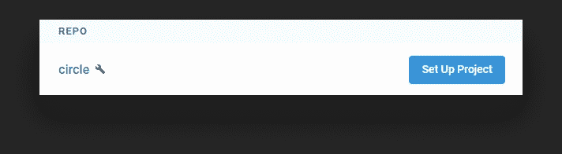
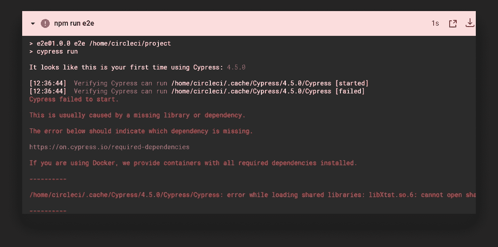
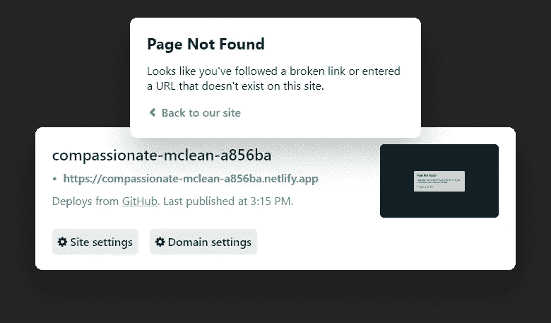
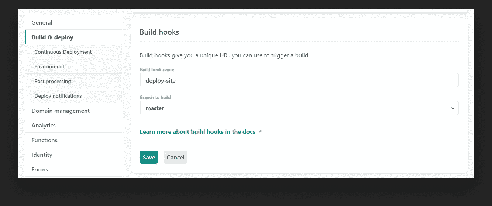
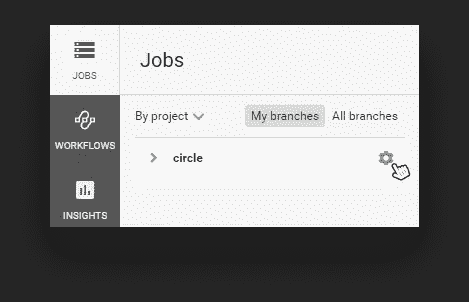
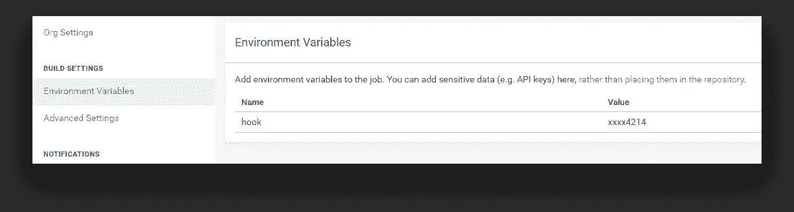
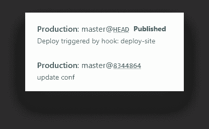
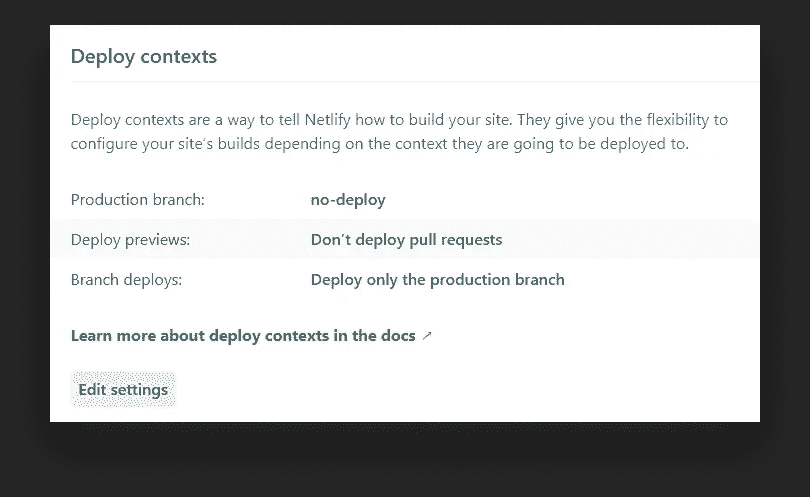
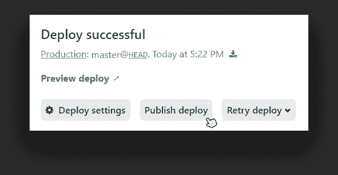

# 如何连接 CircleCI 和 Netlify

> 原文：<https://betterprogramming.pub/how-to-connect-circleci-with-netlify-94faf73ddcdb>

## 使用 webhooks 提高部署的质量

照片由[诺德伍德主题](https://unsplash.com/@nordwood?utm_source=medium&utm_medium=referral)在 [Unsplash](https://unsplash.com?utm_source=medium&utm_medium=referral) 上拍摄

Netlify 是一个自动化部署现代应用程序的一体化平台，是一个让您的网站以最快速度运行的伟大工具。

唯一的问题是，我们没有足够的灵活性来运行一个完整的测试套件。然而，这对于保持您的应用程序没有 bug 以及防止意外破坏您的站点是至关重要的。

幸运的是，有一个解决方案。我们也不一定要离开 Netlify。相反，我们将连接 CircleCI，根据我们自己的喜好设置测试过程。剩下的将由 Netlify 处理。让我们建立一个新项目，从头开始。

# 设置我们的项目

为了测试我们是否能防止部署过程出问题，我们需要某种测试，我们可以故意失败。为此，我将使用[柏树](https://www.cypress.io/)。建立一个新项目，用`[npm i cypress --save-dev](https://www.npmjs.com/package/cypress)`安装。我还在`package.json`文件中添加了一个脚本，使它更容易运行。

如果你跑`npm run cypress`，它现在应该为你开柏树。如果这是您的第一次，它将在您的项目根目录下生成一个`cypress.jon`配置文件和一个 cypress 文件夹。

你可以删除`cypress/integration`文件夹中的所有内容，创建一个新的`test.js`文件。由于编写测试不在本教程的范围之内，我们将有一个单一的规范:

为了能够在 CI 上执行这个，向您的`package.json`文件添加另一个脚本。我们将在 CircleCI 配置文件中将其称为。在此之后，您可以将您的更改推送到 GitHub。

# 积分电路

我们的下一步是将 CircleCI 集成到我们的应用程序中。前往 [CircleCI](https://circleci.com/) 并使用您的 GitHub 帐户登录。您将看到一个存储库列表。点击“设置项目”按钮。

它将为您生成一个配置文件。但是在将它添加到您的代码库之前，请确保在最后一步添加 E2E 脚本。

可以将 CircleCI 创建的分支合并到 master。

现在，您应该看到您的管道正在运行。如果您的构建因为类似这样的错误而失败…

您需要在您的`config.yml`文件中添加一个额外的步骤:

这将预先安装缺失的库。既然我们已经排除了 CircleCI，我们还可以设置 Netlify。

# 通过 Netlify 部署站点

下一步是通过 Netlify 使网站上线。如果你还没有一个新账户，去 Netlify 的主页创建一个新账户。然后在您的仪表板上，从 Git 创建一个新站点。

如果在将 Git 连接到 Netlify 后没有看到您的存储库，您需要通过在 GitHub 上配置 Netlify 应用程序来为您的 repo 添加读取权限。

页面底部的链接会将您重定向到 GitHub 上的配置页面。

第三步，保持一切不变，部署您的站点。您将被重定向到该页面的概述部分，您可以通过该链接进行查看。

不幸的是，你会得到一个信息说“页面没有找到”。这是因为我们没有添加任何可以显示的 HTML 文件。所以让我们快点修好它。将以下内容添加到项目的根文件夹中，并提交您的更改。

它将触发 CircleCI 上的构建，并在 Netlify 上部署更改。唯一的问题是这些步骤是分开进行的。即使测试失败，站点仍然会被部署。这不是我们想要的。最后一步，让我们最终将两者连接在一起，并通过 CircleCI 触发网络部署。

# 将 CircleCI 连接到网络

最后，我们需要将 CircleCI 连接到 Netlify。这其实比你想象的要简单。首先，转到 Netlify 上的“构建和部署”选项卡，设置一个构建挂钩。

随便你怎么称呼它。一旦保存它，您将获得一个 API 端点。如果我们向这个 URL 发送 POST 请求，Netlify 将触发一个构建。因此，让我们转到 CircleCI 配置文件，并将其添加为最后一个命令。

将应用程序的敏感信息提交给源代码控制并不是一件好事。相反，我们将把它设置为一个名为“hook”的环境变量。因此，在提交您的更改之前，请打开 CircleCI 上的仪表板，进入“Jobs”选项卡下的项目设置。

单击齿轮图标转到项目设置。

在“环境变量”下，添加一个名为“hook”的新键，其中的值是 Netlify 为我们提供的构建钩子的端点。

如果我们提交对配置文件所做的更改，我们可以看到在作业结束时，部署被触发。但是，一旦我们将更改推送到存储库，它也会触发 Netlify 上的部署。这意味着，即使前面的步骤失败，站点仍然可以部署。

我们不希望部署被推动触发。

不幸的是，要解决这个问题，只有一个变通办法。转到您的“构建和部署”设置，并将生产分支设置为永远不会存在的东西。这样，Netlify 将无法部署分支，只有一个钩子可以触发部署。

如果我们破坏了测试，CircleCI 将永远不会向 Netlify 发送 post 请求，除非我们解决了这个问题，否则这个网站将无法部署。

# 摘要

现在，无论您何时推出您的本地更改，只需几秒钟就能让事情变得活跃起来。Netlify 的好处是，即使您的测试没有发现关键问题，您仍然可以通过单击按钮恢复到以前的版本。

通过发布以前的部署来还原更改。

感谢您花时间阅读这篇文章。部署愉快！

