# 如何在 Go 应用程序中将 Ent 连接到 PlanetScale

> 原文：<https://betterprogramming.pub/how-to-connect-ent-to-planetscale-in-a-go-application-c1337a54d2aa>

## MySQL 无服务器数据库平台


Joshua Woronieckion 在 [Unsplash](https://unsplash.com/?utm_source=medium&utm_medium=referral) 上拍摄的照片。

[PlanetScale](https://planetscale.com/) 是 MySQL 的无服务器数据库平台。Ent 是一个 ORM 框架，具有 100%静态类型的 API。这篇文章将带你了解如何在 Go 应用程序中将 Ent 连接到 PlanetScale。

# 先决条件

在开始之前，去 [PlanetScale](https://planetscale.com/) 免费注册。

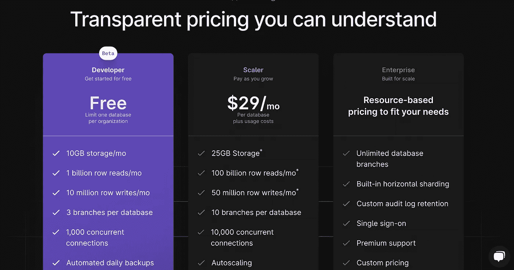

尺度行星

# 示例存储库

这是 GitHub 的最终代码库。

# 属国

所需的依赖关系如下:

*   Go v1.18 版
*   [ent/ent](https://github.com/ent/ent)

# 实施概述

实施的步骤如下:

*   设置 ent
*   设置行星秤

# 设置行星秤

注册后，转到仪表板并创建一个新的数据库。

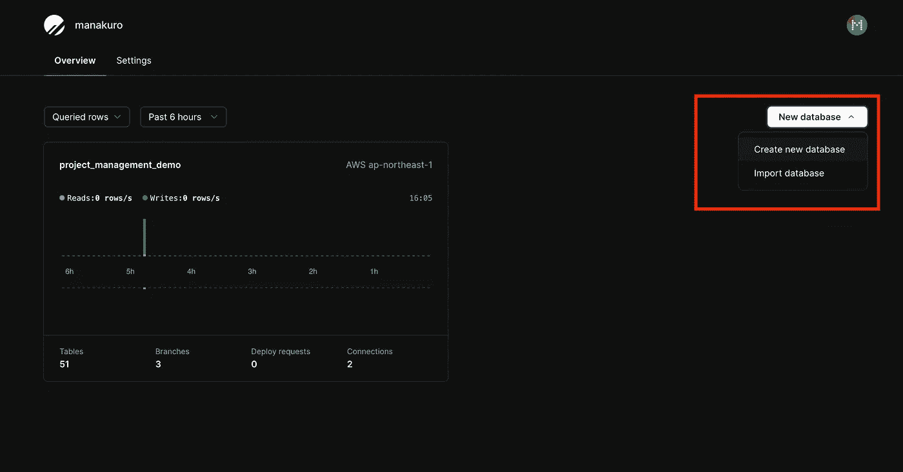

仪表盘

并填写您的数据库名称。

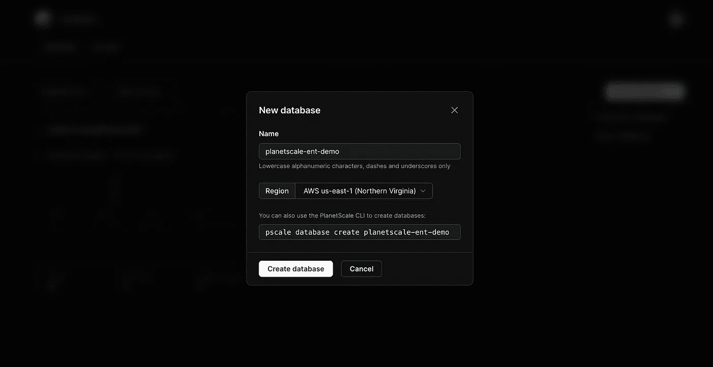

创建后，单击一个新分支。

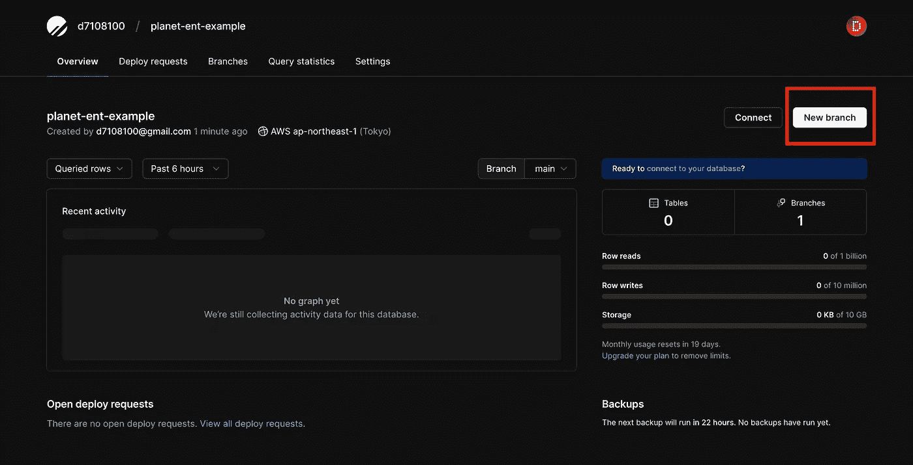

创建一个名为`staging`的分支。

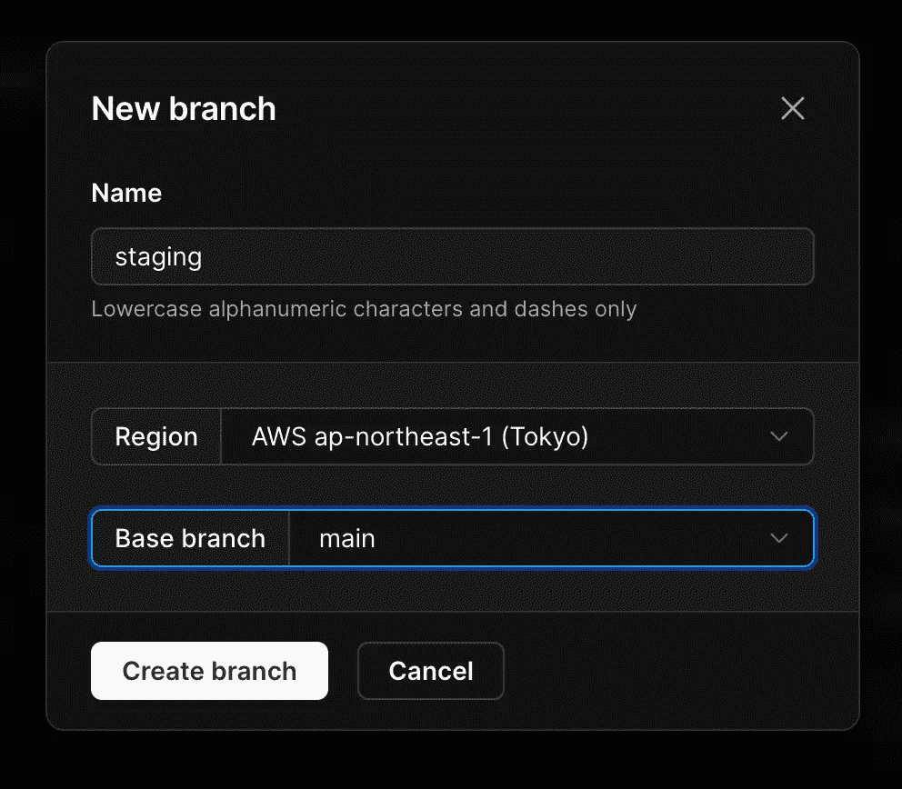

既然已经创建了数据库和分支，就可以导入我们的模式和数据了。

# 设置 ent

为了将我们的模式导入 ScalePlanet，接下来让我们设置 ent。

首先，将 [ent](https://github.com/ent/ent) 包引入我们的应用程序并配置数据库。

让我们安装它:

```
$ go get -d entgo.io/ent/cmd/ent
```

并创建一个用户模式。

```
$ ent init User
```

然后，生成的目录应该如下所示:

```
ent
├── generate.go
└── schema
    └── user.go
```

打开`ent/schema/user.go`并添加如下字段:

并运行发电机:

```
$ go generate ./ent
```

## 数据库迁移

现在我们已经准备好将我们的模式迁移到行星尺度。但是首先，添加 viper 包以便于访问共享配置。

```
$ go get github.com/spf13/viper
```

并创造出这样的`config/config.go`:

这将读取一个 YAML 文件，并允许您在整个应用程序中使用它的值。MySQL 配置应该包含在这个文件中。

要进入 PlanetScale 的数据库，我们需要得到他们的配置。转到`Settings`和`Passwords`，创建一个新密码:

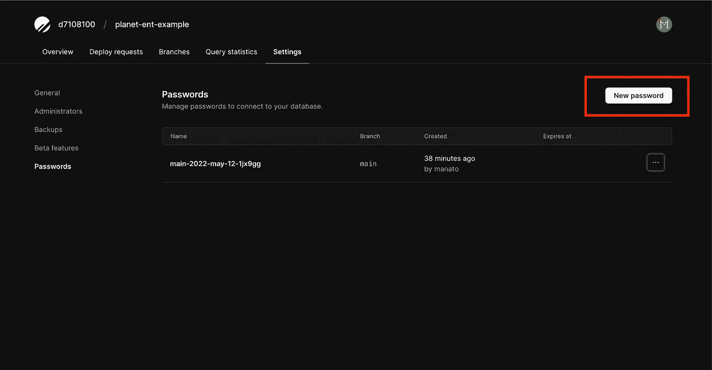

创建一个名为 staging 的密码，并复制连接字符串。

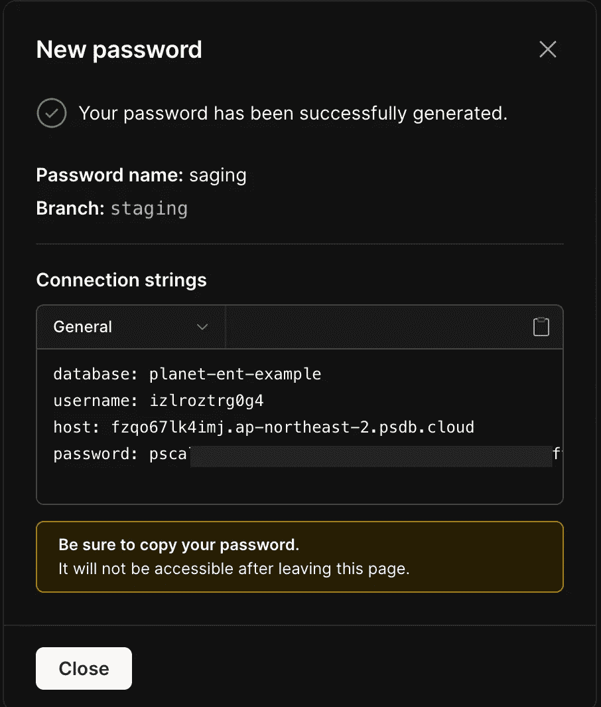

回到我们的代码，像这样做一个`config/config.staging.yml`:

创建`cmd/migration/main.go`并写下:

并添加`datastore/datastore.go`:

通过以下命令运行迁移:

```
$ APP_ENV=staging go run ./cmd/migration/main.go
```

之后，临时分支中的模式应该如下所示:

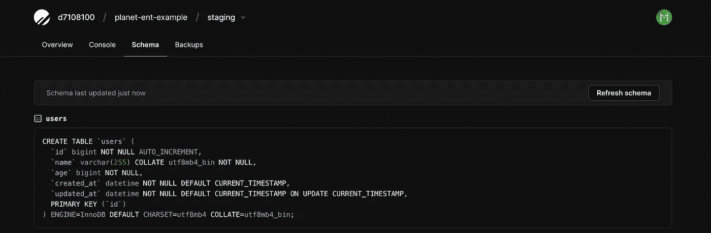

(计划或理论的)纲要

## 播种

种子数据可以用 Ent 包创建。

首先，为 codegen 启用模板特性。

创建一个名为`ent/entc.go`的新文件，并添加以下代码:

然后，打开`ent/generate.go`文件，将代码改为:

并补充`ent/template/mutation_input.tmpl`:

要在 Ent 中执行 SQL，创建`ent/template/external.tmpl`:

运行 codegen:

```
go generate ./ent
```

这为每个模式的输入和更新生成了一个结构。在这种情况下，文件中会生成`CreateUserInput`和`UpdateUserInput`。

接下来，创建`cmd/seed/user.go`并编写如下代码:

该函数使用大容量插入将数据导入用户表。

创建一个`cmd/seed/seed.go`并在这里调用用户函数:

并创建`cmd/seed/main.go`:

运行脚本:

```
$ APP_ENV=staging go run ./cmd/seed/main.go
```

种子数据已创建，控制台显示插入的数据，如下所示:

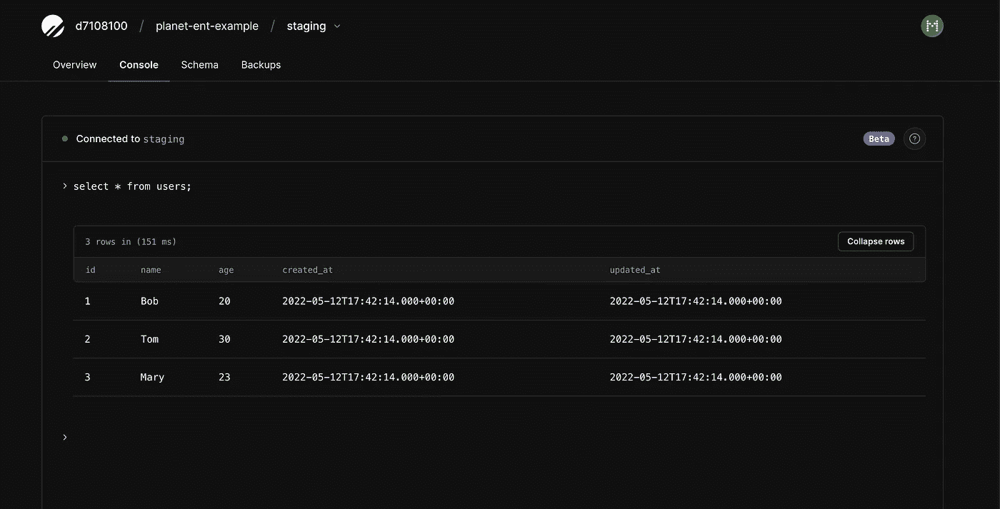

# 将一个分支提升到生产阶段

既然我们已经创建了暂存分支并定义了模式。临时分支现在已经准备好进行生产，将其迁移到主分支。

转到概述部分，点击主分支中的`Promote a branch to production`。

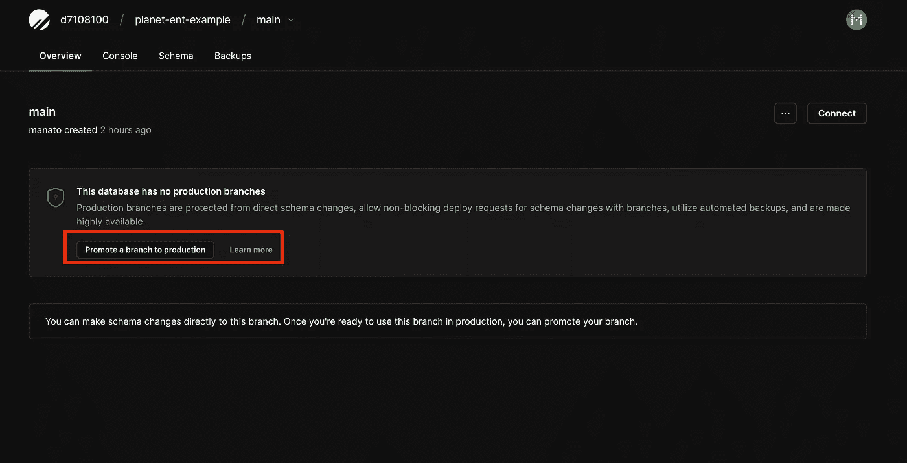

切换到临时分支，并向主分支创建部署请求。

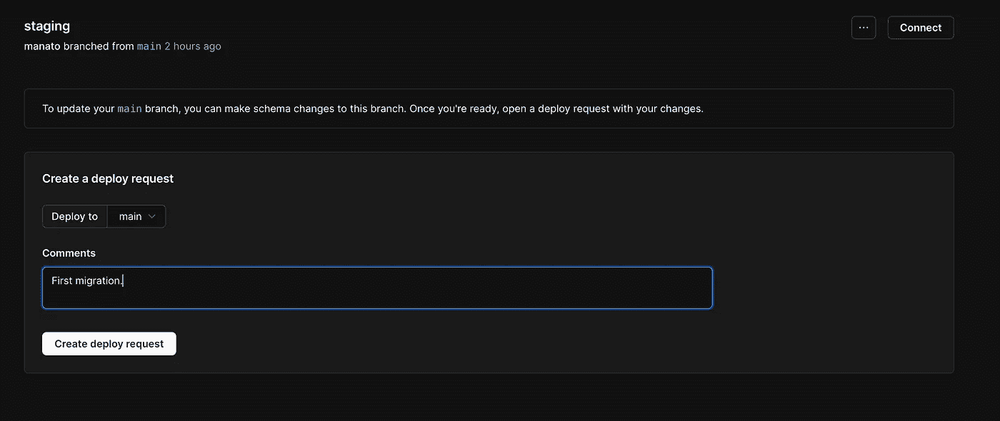

如果更改没问题，请点击部署更改。


在主分支中，模式是这样创建的:

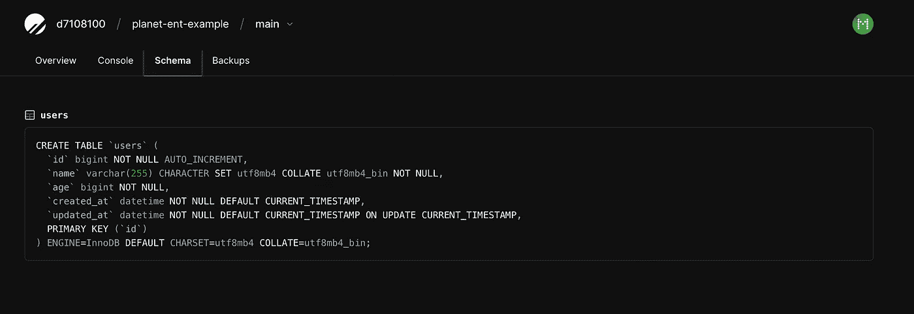

# 结论

我们已经介绍了如何通过 Ent 和 PlanetScale 部署数据库模式。生产分支应该通过 PlanetScale 中的 deploy 请求进行更改，以便此工作流允许我们安全地部署模式和更新数据库表，而不会锁定或导致停机。