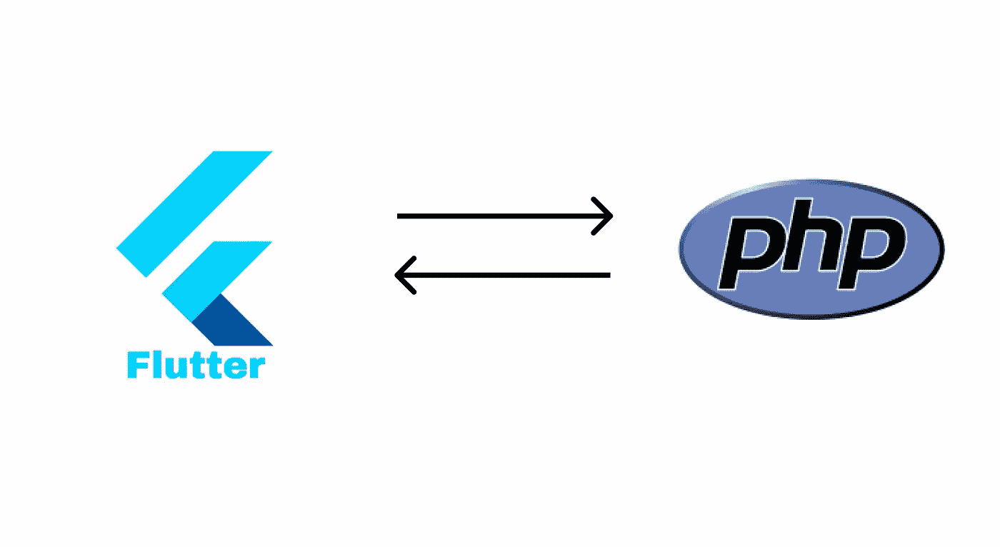

# 如何将 Flutter 连接到 PHP

> 原文：<https://betterprogramming.pub/how-to-connect-flutter-to-php-8be032df0f55>

## 这一惊人功能的简要指南


图片来自 [Unsplash](https://unsplash.com/) 作者[詹姆斯·哈森](https://unsplash.com/photos/vpOeXr5wmR4)

上次，我写了一篇名为“如何将 Flutter 连接到 Node.js”的文章，这是我迄今为止写得最好的一篇文章，所以我决定再写一篇。

在本教程中，我将向您展示如何向 PHP 发送数据和从 PHP 接收数据。

在我们开始这个教程之前，你必须在你的电脑上安装 Flutter 和 PHP。以下是一些链接:

*   https://www.apachefriends.org/download.html XAMPP
*   扑:[https://docs.flutter.dev/get-started/install](https://docs.flutter.dev/get-started/install)

一旦你成功安装了这些，我们就可以开始创建一个新的颤振项目。我们的第一个目标非常简单——从网络上获取数据。

使用这个命令，您可以创建一个新的 Flutter 项目并安装您将在本教程中使用的所有包:

```
flutter create phptut && cd phptut && flutter pub add http && flutter run
```

如果已经安装了，您可以在您喜欢的 IDE 中打开这个文件夹并开始编码。

我喜欢使用 VS 代码，但那是我的偏好。



应用架构|作者:Teun Grondman

# 摆动

现在可以打开`lib/main.dart`。这是我们可以创建 dart 项目的地方。我喜欢扔掉所有我们不需要的垃圾，所以它看起来像这样:

我还创建了一个消息`String`，我们稍后会用到它。我们需要将“`http`”包导入到我们的`main.dart`文件中，以确保我们可以使用它。

我们还将使用另一个名为`dart:convert`的包。这确保了我们可以将数据解码成 JSON。

```
import ‘package:http/http.dart’ as http;
import 'dart:convert';
```

所以，现在一切都已经设置好了，我们需要创建一个名为`initState()`的新函数。在`initState()`中，我们还将调用我们的函数`getData()`，我们将在后面创建它。

所以，现在让我们创建函数，`getData()`。这个函数是我们从网上收集数据的地方。

我们可以从这个网站收集数据:`[https://jsonplaceholder.typicode.com/albums/1](https://jsonplaceholder.typicode.com/albums/1)`，而这正是我们即将要做的！

仅此而已。一切都准备好了。因此，让我们使用命令来运行它。如果一切正常，它应该可以正常工作。

```
flutter run
```

你的应用程序现在应该说，“quidem 猥亵儿童”

现在，我们可以创建我们的后端。在本教程中，我们的后端将非常简单。

我们的目标是来回传递数据。这就是为什么我们将回显后端收到的数据。

# 服务器端编程语言（Professional Hypertext Preprocessor 的缩写）

现在，让我们为 PHP 后端创建一个新文件。因为我们正在使用 XAMMP，所以我们必须在我们的`htdocs`文件夹中创建一个新文件夹。

我将把我的新文件夹命名为`phptut`，我将添加一个名为`index.php`的文件。就是这样！

正如我所说，这将是非常简单的。

在这个文件中，我们将检查`$_POST[“msg”]`是否确实存在。当它存在时，我们在回应我们收到的信息。

> *简单易行😏。*

# 摆动

现在我们已经成功创建了一个发送数据的后端，我们可以开始创建我们的应用程序了。

在这个应用程序中，我们将发送一条消息到我们的后端。因此，我们需要稍微改变一下我们的 UI，创建一个名为`_newMessage`的新`String`。

这就是我们新的用户界面的样子。对你来说很容易理解！接下来，我们需要找到一种方法来与我们的后端对话。首先，我们需要更改我们的 URL 地址。对于 iOS，这将是:

```
[http://localhost/phptut/index.php](http://localhost/phptut/index.php)
```

对于 Android，它是这样的:

```
[http://10.0.2.2/phptut/index.php](http://localhost/phptut/index.php)
```

我喜欢坚持使用 iOS，因为我更喜欢它。其次，我们必须将请求从`GET`更改为`POST`。这是因为我们现在正在向我们的服务器发送数据。最后，我们希望将数据发送到我们的后端。因此，我们将使用`request.bodyfields`。

这就是你将你的 Flutter 应用程序与 PHP 连接起来所需要做的一切。现在，你可能在想，“我能用它做什么”？答案是——很多！PHP 真正优秀的地方是 MySQL。这是一个非常容易使用的有趣的数据库。

GitHub 资源库如下:

[](https://github.com/turboteun2/phptut) [## GitHub — turboteun2/phptut:有关该网站的更多信息:

### 此时您不能执行该操作。您已使用另一个标签页或窗口登录。您已在另一个选项卡中注销，或者…

github.com](https://github.com/turboteun2/phptut) 

感谢您阅读我的文章。如果你需要任何帮助，请给我发信息。