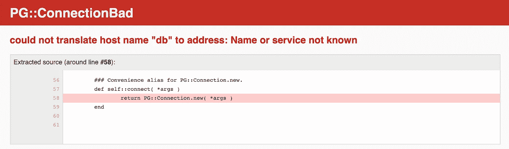
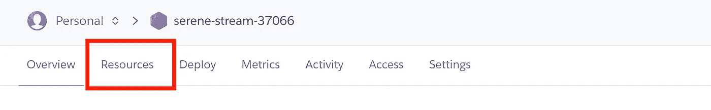
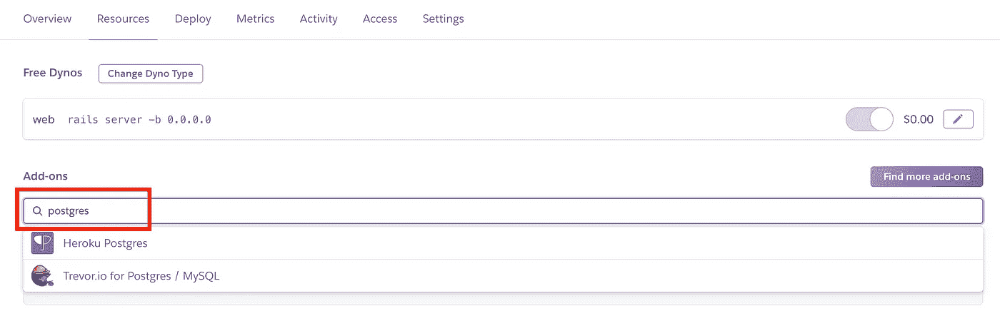
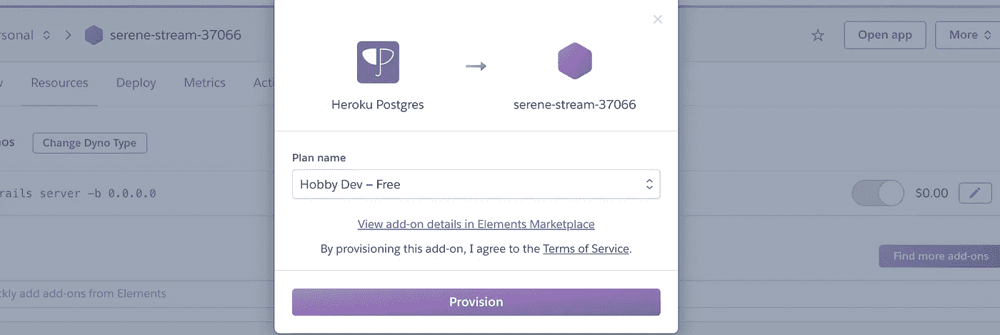
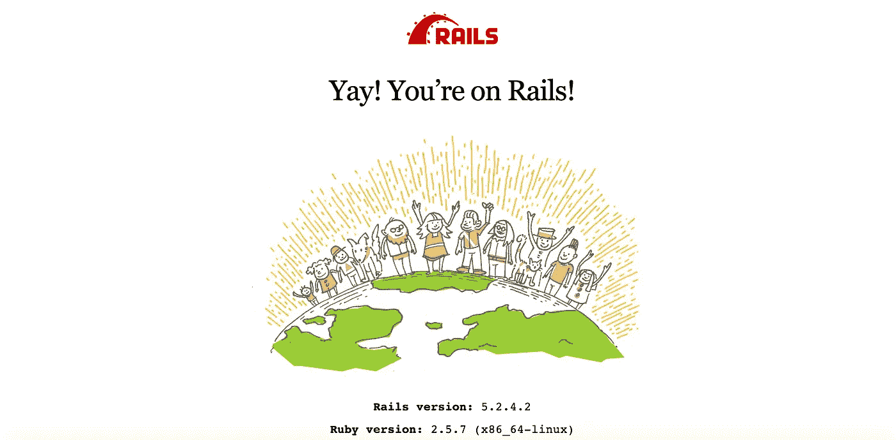

# 如何用 Docker 和 Heroku 封装和部署应用程序

> 原文：<https://betterprogramming.pub/how-to-containerize-and-deploy-apps-with-docker-and-heroku-b1c49e5bc070>

## 构建、对接和部署 Rails 和 PostgreSQL 应用程序


托德·克雷文在 Unsplash[上的照片](https://unsplash.com/s/photos/whale?utm_source=unsplash&utm_medium=referral&utm_content=creditCopyText)

您将学习在 [Docker](https://www.docker.com/why-docker) 中开发应用程序，并通过构建一个简单的 Rails/ [PostgreSQL](https://www.postgresql.org/) 笔记应用程序部署到 [Heroku](https://www.heroku.com/) 。如果您从本文中复制并粘贴，您甚至不需要了解 Rails 就能做到。

这里的一切应该适用于其他 web 开发框架，比如 [Django](https://www.djangoproject.com/) 。

声明:本教程的部分内容深受 Docker Rails 文档和 Heroku 容器注册文档的启发。我试图将它们结合在一起，并添加一些 web dev，这样你就可以在 Heroku 上从一无所有到一个可用的容器化 Rails 应用程序。

我还为可能不直观的步骤添加了解释。我希望您能够将学到的知识应用到自己的应用中。

# Docker 简介

## Docker 是什么？

Docker 是操作系统级虚拟化，允许通过容器化将应用从环境中分离出来。

容器附带了打包在一起的库和依赖项，可以在任何其他 Linux 机器上运行。

如果你过去使用过 vagger、VirtualBox 或 VMWare，你会发现 Docker 更轻更快。

## 为什么 Docker 会改变游戏规则？

*   调试更容易，因为您的整个团队都在一个配置完全相同的环境中工作，而不管笔记本电脑和操作系统有何不同。不再有“它在我的笔记本电脑上工作。”
*   整个开发环境可以签入到源代码控制中，使团队中的新开发人员更容易上手。
*   部署速度快得惊人，因为每个进程都有一个容器，并且每个进程只在必要时才重新构建。

# 用 Docker 建立一个基本的应用

导航到您编写代码的目录，并为此项目创建一个新目录。我们称我们的为`rails-on-docker`。

```
mkdir rails-on-docker
```

`cd`进入项目目录，并在您喜欢的代码编辑器中打开它。和往常一样，我用的是 [Atom](https://atom.io/) 。

```
cd rails-on-docker
atom .
```

## Dockerfile 文件

`Dockerfile`定义依赖关系并包含构建映像的命令。容器是图像的一个实例。在命令行上运行`docker images`将显示所有本地图像。

创建`Dockerfile`。

```
touch Dockerfile
```

并粘贴以下内容:

## Gemfile

一个`Gemfile`描述了 Ruby 程序的依赖关系。创建一个`Gemfile`。

```
touch Gemfile
```

并粘贴以下内容:

```
source 'https://rubygems.org'
gem 'rails', '~>5'
```

当我们初始化 Rails 应用程序时，这个文件将被清除并重新创建，但我们现在需要它来安装 Rails。

## Gemfile.lock

创建没有任何内容的`Gemfile.lock`。Bundler 在这个文件中记录了安装的 Ruby 库的确切版本。在 Rails 开发中，您通常不会接触到这个文件，但是 Docker 需要它。

```
touch Gemfile.lock
```

## entrypoint.sh

创建`entrypoint.sh`。这修复了一个 Rails 问题，如果有一个`server.pid`存在，它会阻止服务器重新启动。

```
touch entrypoint.sh
```

粘贴在下面。这将删除`server.pid`进程(如果存在的话);否则，服务器将无法启动。

## docker-compose.yml

`docker-compose.yml`描述您的应用中的服务，例如`web`、`db`或`redis`，它们在构建时都以单独的容器结束。创建此文件。

```
touch docker-compose.yml
```

粘贴以下内容:

## 构建应用程序

运行此程序来构建应用程序。这将为 web 构建图像，然后在容器中运行`rails new`。

```
docker-compose run web rails new . --force --no-deps --database=postgresql
```

请注意，您需要在任何传统的 Rails 命令前面加上前缀`rake...`。

现在我们有了一个新的`Gemfile`，再次构建图像。

```
docker-compose build
```

在 Rails 应用程序中，更新`/config/database.yml`,如下所示:

注意`url: <%= ENV[‘DATABASE_URL’] %>`对于生产非常重要，因为`DATABASE_URL`是在添加 Postgres 附加组件后 Heroku 赋予数据库 URL 的名称。

创建数据库。

```
docker-compose run web rake db:create
```

启动应用程序。

```
docker-compose up
```

此时，您应该能够在本地浏览器中导航到 [http://localhost:3000](http://localhost:3000) ，并看到应用程序正在运行。


要停止应用程序，运行`docker-compose down`或者直接终止终端中正在运行的进程。

# 将基本应用程序部署到 Heroku

这需要一个 Heroku 账户。

从命令行登录 Heroku。然后登录 Heroku 的容器注册表。

```
heroku login
heroku container:login
```

在 Heroku 上为您的应用创建一个应用。当你这样做的时候，记下它给你的应用名称。稍后您将需要它来在 Heroku 的控制台中配置正确的应用程序。这些名字通常都很古怪——我的名字是`serene-stream-37066`。

```
heroku create
```

构建一个映像，并将其推送到容器注册表中。第一次运行它可能需要 10 分钟(如果你的家庭网络和我的一样慢的话)。但是随后的运行只需要几秒钟。

```
heroku container:push web
```

先前的命令把图像放在 Heroku 上。现在将图片发布到 Heroku 上的应用程序中。将流量重定向到它。

```
heroku container:release web
```

在浏览器中打开应用程序。

```
heroku open
```



哦，不。我们的应用程序运行在 Heroku 上，但我们有一个问题。那是因为我们还需要做一件事。

在 [Heroku](https://dashboard.heroku.com/apps) 中添加 Postgres 插件。导航至 [Heroku](https://dashboard.heroku.com/apps) 并点击您创建的应用程序。


单击资源。



在参考资料中，搜索“postgres”并点击 Heroku Postgres。



将其添加到您的应用程序中。单击设置。



还记得我们之前在 Rails 应用中设置`<%= ENV[‘DATABASE_URL’] %>`的时候吗？Heroku 现在用关键字`DATABASE_URL`将这个数据库的 URL 设置为一个环境变量。

因此，我们应该能够刷新我们的应用程序，瞧！



# 更新 Rails 应用程序

如果我们让它像这样，我们不能肯定我们在 Heroku 上的容器化应用程序可以正确地利用我们设置的数据库。所以让我们再深入一点。

尽管我讨厌 Rails 搭建(太多的 cruft)，但还是用它来快速实例化我们的应用程序的模型、视图和迁移文件。

注意这是以`docker-compose run web`命令为前缀的。

```
docker-compose run web rails g scaffold Note header:string body:string
```

现在修改`/config/routes.rb`,如下图所示。这会将 Notes 索引视图设置为应用程序的根 URL。

```
Rails.application.routes.draw do
  resources :notes
  root 'notes#index'
end
```

现在重建部署，并将生产指向新映像。

```
heroku container:push web
heroku container:release web
```

迁移 Heroku 上的数据库。这是必需的，因为我们已经推出了一个迁移文件。

```
heroku run rake db:migrate
```

如果您想在本地运行迁移，您应该做`docker-compose run web rake db:migrate`。

并查看 Heroku 中的应用程序。

```
heroku open
```


嘣！现在创建一些笔记来庆祝(并确保它有效)。

# 结论

你做到了！您已经构建了一个 Rails 应用程序，将其容器化，并部署到 Heroku。虽然这是一个非常简单的应用程序，但你现在已经有了 Docker 做什么和如何使用它的框架。

如果你想要一个挑战，尝试为`redis`添加另一个服务，它可以处理后台工作，比如向新注册的用户发送确认电子邮件。