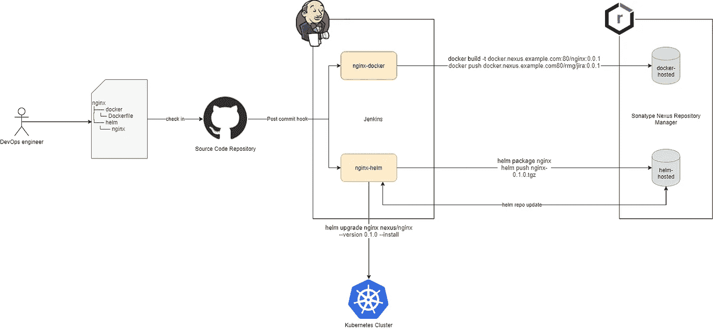
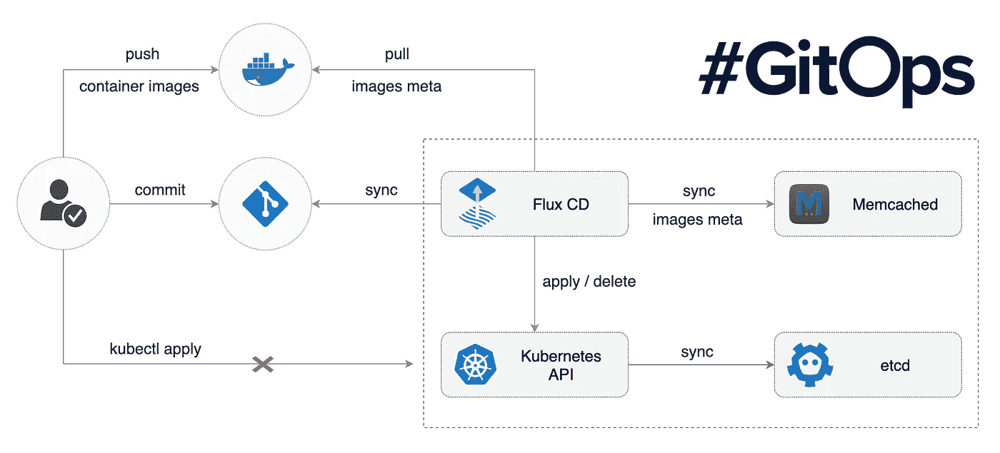
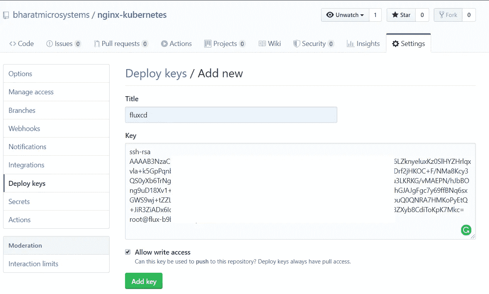

# 如何使用 Flux CD 持续交付 Kubernetes 应用程序

> 原文：<https://betterprogramming.pub/how-to-continuously-deliver-kubernetes-applications-with-flux-cd-502e4fb8ccfe>

## 针对 Kubernetes 工作负载的 GitOps


Clem Onojeghuo 在 [Unsplash](https://unsplash.com/s/photos/flowing?utm_source=unsplash&utm_medium=referral&utm_content=creditCopyText) 拍摄的照片

[Flux CD](https://fluxcd.io/) 是一款持续交付工具，正在迅速流行起来。Weaveworks 最初开发了这个项目，他们将它开源给了云原生计算基金会。

其成功的原因在于它支持 Kubernetes，并且设置简单。它提供的最有前途的特性是它允许团队以声明的方式管理他们的 Kubernetes 部署。

Flux CD 通过定期轮询存储库，将存储在源代码存储库中的 Kubernetes 清单与 Kubernetes 集群同步，因此团队不需要担心运行 kubectl 命令和监控环境来查看他们是否部署了正确的工作负载。相反，Flux CD 确保 Kubernetes 集群始终与源代码存储库中定义的配置保持同步。

它允许团队实现 [GitOps](https://www.gitops.tech/) ，其原则如下:

1.  Git 是真理的唯一来源。
2.  Git 是操作所有环境的唯一地方，所有配置都是代码。
3.  所有变化都是可观察/可验证的。

# 为什么是 Flux CD？

Kubernetes 的传统 CI/CD 部署遵循以下模式:



图片来源:作者

1.  开发人员创建代码并编写 docker 文件。他们还为应用程序创建 Kubernetes 清单和舵图。
2.  他们将代码推送到源代码库。
3.  源代码存储库使用提交后挂钩来触发 Jenkins 构建。
4.  Jenkins CI 流程构建 Docker 映像和头盔包，并将它们推送到人工制品库。
5.  然后，Jenkins CD 进程在 Kubernetes 集群上部署舵图。

流程听起来很合理，也或多或少是行业内的标准。但是，有一些限制:

*   您需要将 Kubernetes 凭证存储在 Jenkins 服务器中。由于服务器是共享的，因此有可能受到威胁。
*   虽然您可以使用 Jenkins 创建和更改配置，但不能使用它删除现有资源。例如，如果您从存储库中删除一个清单文件，kubectl 不会将其从服务器中删除。这是自动 GitOps 的最大障碍。

# Flux CD 如何工作

Flux CD 允许团队使用 YAML 清单声明性地指定所有需要的 Kubernetes 配置。

*   团队编写 Kubernetes 清单，并将它们推送到源代码库。
*   memcached pod 存储当前配置。
*   Flux 使用 Kubernetes 操作符定期(默认为五分钟)轮询存储库的变化。Flux 容器将其与 memcached 中的现有配置进行比较。
*   如果检测到更改，它会通过运行一系列 kubectl apply/delete 命令将配置与集群同步。然后，它再次将最新的元数据存储在 memcached 存储中。



[助焊剂 CD 过程](https://fluxcd.io/img/flux-cd-diagram.png)

此外，如果您想自动升级工作负载，Flux CD 允许您轮询容器注册中心，并使用最新的映像更新 Git 存储库上的 Kubernetes 清单。

由于 Flux CD 作为一个 Kubernetes 操作程序运行，因此它的设置很简单，并且很容易启动。

让我们看一看实际操作演示，以便更好地理解它。

# 先决条件

确保您有一个正在运行的 Kubernetes 集群和部署 Flux CD 的`cluster-admin`角色。

# 安装 fluxctl

Flux CD 提供了一个`fluxctl`二进制文件，帮助您在 Kubernetes 集群中部署和管理 Flux CD。下载最新版本的`fluxctl`，并将其移动到`/usr/bin`目录下。

```
$ wget [https://github.com/fluxcd/flux/releases/download/1.19.0/fluxctl_linux_amd64](https://github.com/fluxcd/flux/releases/download/1.19.0/fluxctl_linux_amd64)
$ mv fluxctl_linux_amd64 /usr/bin/fluxctl
$ sudo chmod +x /usr/bin/fluxctl
```

对于这个例子，让我们使用 GitHub 作为源代码库。将[bharat Microsystems/nginx-kubernetes](https://github.com/bharatmicrosystems/nginx-kubernetes)存储库放入您的 GitHub 帐户中。

存储库包含位于`workloads`目录中的`nginx-deployment`和`nginx-service`清单，以及位于`namespaces`目录中的`web`名称空间定义。

```
├─ namespaces
│  └─ web-ns.yaml
├─ workloads
│  ├─ nginx-deployment.yaml
│  └─ nginx-service.yaml
├─ .gitignore
├─ LICENSE
└─ README.md
```

在`GHUSER`环境变量中提供您的 GitHub 用户名，在`GHREPO`环境变量中提供 GitHub repo，如下所示。创建一个名为`flux`的新名称空间，并在 Kubernetes 集群中安装 Flux CD 操作符。

`fluxctl install`命令根据以下选项生成所需的 Kubernetes 清单:

*   `git-user`—Git 用户。在这种情况下，GitHub 用户名
*   `git-email` —Git 用户电子邮件。在这种情况下，默认的 GitHub 电子邮件
*   `git-url` —Git 存储库的 URL
*   `git-path`—Git 存储库中要从中同步更改的目录
*   `namespace` —部署通量运算符的名称空间

```
$ export GHUSER="<YOUR_GITHUB_USER>"
$ export GHREPO="<YOUR_GITHUB_REPO>"
$ kubectl create ns flux
namespace/flux created
$ fluxctl install \
--git-user=${GHUSER} \
--git-email=${GHUSER}@users.noreply.github.com \
--git-url=git@github.com:${GHUSER}/${GHREPO} \
--git-path=namespaces,workloads \
--namespace=flux | kubectl apply -f -
service/memcached created
serviceaccount/flux created
clusterrole.rbac.authorization.k8s.io/flux created
clusterrolebinding.rbac.authorization.k8s.io/flux created
deployment.apps/flux created
secret/flux-git-deploy created
deployment.apps/memcached created
```

检查助焊剂部署是否成功。

```
$ kubectl -n flux rollout status deployment/flux
deployment "flux" successfully rolled out
```

让我们获取`flux`名称空间中的所有资源，以查看对象的当前状态。

如你所见，有一个`flux`吊舱和一个`memcached`吊舱。还有一个`memcached`服务，因为`flux` pod 需要与之交互。

```
$ kubectl get all -n flux
NAME                             READY   STATUS    RESTARTS   AGE
pod/flux-86d86b868-lndhn         1/1     Running   0          2m
pod/memcached-86869f57fd-qwnts   1/1     Running   0          2mNAME                TYPE        CLUSTER-IP    EXTERNAL-IP   PORT(S)     AGE
service/memcached   ClusterIP   10.8.11.199   <none>        11211/TCP   2mNAME                        READY   UP-TO-DATE   AVAILABLE   AGE
deployment.apps/flux        1/1     1            1           2m
deployment.apps/memcached   1/1     1            1           2mNAME                                 DESIRED   CURRENT   READY   AGE
replicaset.apps/flux-86d86b868       1         1         1       2m
replicaset.apps/memcached-86869f57fd 1         1         1       2m
```

# 授权 Flux CD 连接到您的 Git 库

我们现在需要允许 Flux CD 操作符与 Git 存储库交互，因此，我们需要将它的公共 SSH 密钥添加到 repo 中。

使用`fluxctl`获取公共 SSH 密钥。

```
$ fluxctl identity --k8s-fwd-ns flux
ssh-rsa AAAAB3NzaC1yc2EAAAADAQABAAABgQCryxSADyA+GIxtyCwpO3R9EuRcjZCqScKbYO246LZknyeluxKz0SlHYZHrlqxvla+k5GpPqnbImLLhuAD+YLzn0DbI58hUZLsrvxPWKiku--REDACTED--MKoPyEtQ+JiR3ZiADx6Iq8tYRRR+WBs1k5Hc8KNpg+FSRP8I8+CJRkCG4JQacPwK8FESP4qr1dxVv1tE8ZXyb8CdiToKpK7Mkc= root@flux-b9b4cc4f9-p9w88
```

将 SSH 密钥添加到您的存储库中，以便 Flux CD 可以访问它。

*   进入 https://github.com/<your_github_user>/nginx-kubernetes/设置/按键</your_github_user>
*   在标题部分中为密钥添加一个名称。
*   将 SSH 密钥粘贴到密钥部分。
*   选中“允许写访问”



Flux CD 每五分钟自动与配置的 Git 存储库同步一次。然而，如果您想让 Flux 与 Git repo 立即同步，您可以使用`fluxctl sync`，如下所示。

```
$ fluxctl sync --k8s-fwd-ns flux
Synchronizing with ssh://[git@github.com](mailto:git@github.com)/bharatmicrosystems/nginx-kubernetes
Revision of master to apply is 8db9163
Waiting for 8db9163 to be applied ...
Done.
```

现在让我们看看是否有 nginx 的两个副本。

```
$ kubectl get pod -n web
NAME                                READY   STATUS    RESTARTS   AGE
nginx-deployment-7fd6966748-lj8zd   1/1     Running   0          20s
nginx-deployment-7fd6966748-rbxqs   1/1     Running   0          20s
```

获取服务，您应该看到一个 nginx 负载平衡器服务在端口 80 上运行。如果您的 Kubernetes 集群可以旋转负载平衡器，您应该会看到一个外部 IP 出现。

```
$ kubectl get svc -n web
NAME            TYPE           CLUSTER-IP   EXTERNAL-IP      PORT(S)        AGE
nginx-service   LoadBalancer   10.8.10.33   35.222.174.212   80:30609/TCP   94s
```

使用外部 IP 测试服务。如果您的集群不允许您旋转负载平衡器，您可以使用`NodeIP:NodePort`组合。

```
$ curl [http://35.222.174.212/](http://35.222.174.212/)
This is version 1
```

将图像更新到`workloads/nginx-deployment.yaml`上的`bharamicrosystems/nginx:v2`

```
$ sed -i "s/nginx:v1/nginx:v2/g" workloads/nginx-deployment.yaml
$ git add --all
$ git commit -m 'Updated version to v2'
$ git push origin master
```

现在让我们等待五分钟的自动同步，同时，观看豆荚更新。

```
$ watch -n 30 'kubectl get pod -n web'NAME                                READY   STATUS        RESTARTS   AGE
nginx-deployment-5db4d6cb84-8lbsk   1/1     Running       0          11s
nginx-deployment-5db4d6cb84-qc6jp   1/1     Running       0          10s
nginx-deployment-6784c95fc7-zqptk   0/1     Terminating   0          6m43s
```

如你所见，旧的圆荚体正在终结，新的正在旋转。检查 pod 状态以确保所有 pod 都在运行。

```
$ kubectl get pod -n web
NAME                                READY   STATUS    RESTARTS   AGE
nginx-deployment-5db4d6cb84-8lbsk   1/1     Running   0          1m
nginx-deployment-5db4d6cb84-qc6jp   1/1     Running   0          1m
```

现在让我们再次调用服务。

```
$ curl [http://35.222.174.212/](http://35.222.174.212/)
This is version 2
```

如您所见，该版本现已更新至 v2。

恭喜你！您已经成功地在 Kubernetes 集群上设置了 Flux CD。

# 结论

感谢阅读！我希望你喜欢这篇文章。

Flux 是将 Git 存储库中的 Kubernetes 配置与集群进行声明式同步的最轻量级方法之一，尤其是在您开始使用 GitOps 的情况下。

在下一篇文章“如何用 Kaniko 在 Kubernetes 集群中构建容器”中，我们将讨论另一个很酷的 Google 工具 Kaniko，到时见！