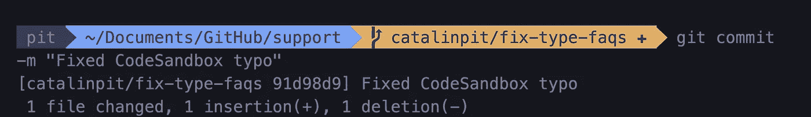
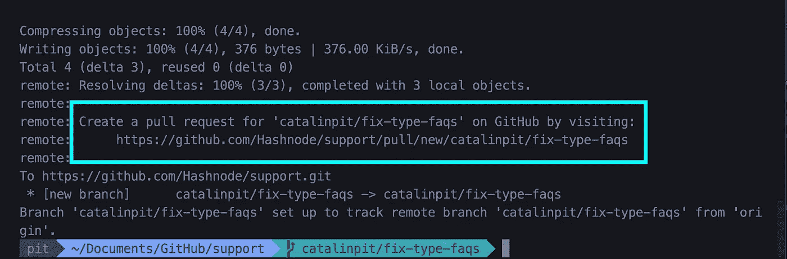
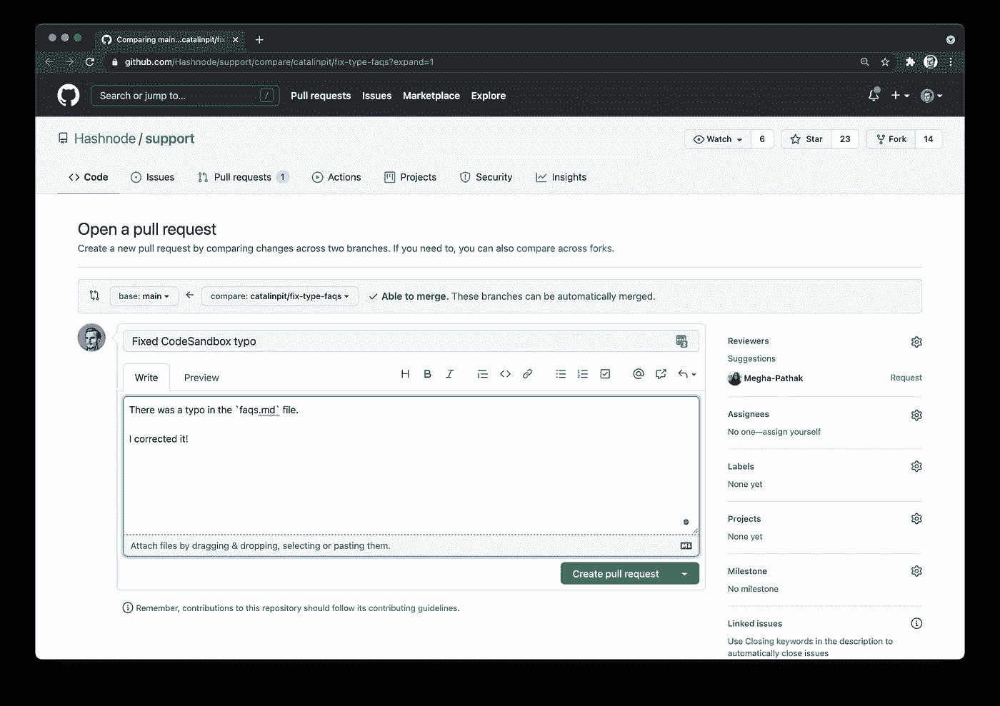

# 作为初学者如何为开源做贡献

> 原文：<https://betterprogramming.pub/how-to-contribute-to-open-source-as-a-beginner-cb936fffbe1f>

## 了解如何做出您的第一份开源贡献


马库斯·斯皮斯克在 [Unsplash](https://unsplash.com?utm_source=medium&utm_medium=referral) 上的照片

为开源做贡献是提高编程技能、帮助他人以及学习如何在协作环境中工作的好方法。

然而，许多人对项目的复杂性望而却步。他们还认为为开源做贡献就是编码。

但这不是真的！您可以通过其他方式为开源项目做出贡献，例如:

*   编写文档
*   创建支持材料
*   审查代码
*   翻译成其他语言
*   构建和重新构建代码和项目结构

因此，在本文中，您将学习如何在 Hashnode 文档的帮助下做出您的第一份开源贡献。 [Atlassian 网站](https://hashnode.com#:~:text=The%20git%20commit%20command%20captures,you%20explicitly%20ask%20it%20to.)——“git commit 命令捕获项目当前阶段变更的快照。”

以下命令是您提交更改的方式:

```
git commit -m "Fixed CodeSandbox typo"
```

当您提交您的更改时，您还需要提供描述您的更改的消息。上面命令中的`-m`标志代表“消息”,它允许你添加你的修改的摘要。

一旦您运行了“commit”命令，您应该会得到您的更改的摘要，如下面的图 6 所示。



图 6

现在您已经准备好推送更改并创建拉取请求了！

# **推送您的更改**

提交的更改目前只在您的本地存储库中可用。这意味着它们只对你可用。

如果您想将它们发送到远程存储库，您需要“推送”它们。您可以使用以下命令将更改推送到远程存储库:

```
git push --set-upstream origin catalinpit/fix-type-faqs
```

**注意**:用你的分行名称替换`catalinpit/fix-type-faqs`！

运行该命令后，您应该在终端中得到一条消息，您可以从这里创建一个拉请求。请参见下面的图 7 以供参考。



图 7

点击链接，它会带你到 GitHub 打开拉请求。

# 打开拉取请求

让我们先来谈谈为什么你首先需要一个拉请求。那么，为什么需要拉取请求呢？

当您在协作环境中工作时，您不应该对代码库进行直接更改。通过在不打开拉请求的情况下进行直接更改，很有可能会引入低效、糟糕的代码、错误和其他问题。

但是，通过创建拉请求，您可以避免这些问题。当您打开“拉”请求时，团队成员和开发人员可以看到您的更改。他们可以检查您的代码，指出问题或提出改进建议。因此，这对每个人来说都是双赢的——您提高了编程技能，避免了不正确的代码进入数据库。

因此，通过打开拉式请求，团队:

*   保持代码库的高质量标准
*   避免糟糕、低效的代码、错误和其他问题
*   可以获得有价值的反馈，从而提高他们的技能

现在您已经知道了拉请求的重要性，让我们创建一个吧！

# **创建拉动式请求**

当您从终端点击链接时(如图 7 所示)，您将被带到 Github 打开 pull 请求。

在打开拉取请求之前，请阅读贡献指南，并确保您遵守这些指南。大多数项目都有一个模板，您可以将它用于拉取请求。

在图 8 中，您可以看到我对 Hashnode 文档所做的更改的 pull 请求。



图 8

添加描述性名称和描述后，单击绿色按钮“创建拉式请求”来创建它。

现在，您已经完成了，您需要等待项目维护人员审查您的代码。如果一切正常，评审人员会将您的更改合并到代码库中。如果需要改进，您必须在合并代码之前实现它们。

**代码评审的一个小技巧**——不要对你的代码产生依赖，不要把反馈当成个人意见。其他开发者只想帮你！

# 结论

在本文中，您了解了进行开源贡献所需的基本 Git 工作流。这不是唯一的方法，还有其他的方法。但是，工作流足以开始贡献。

此外，请记住，为开源做贡献不仅仅是写代码。你也可以通过其他方式为开源做出贡献。

> 你准备好做出贡献了吗？开始打开您对文档的第一个拉动请求[！](https://github.com/Hashnode/support)