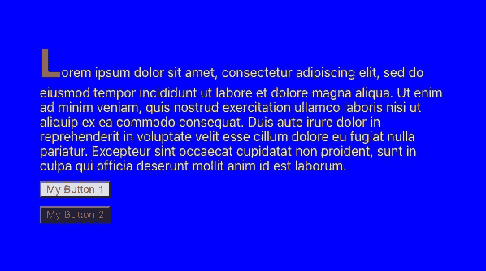
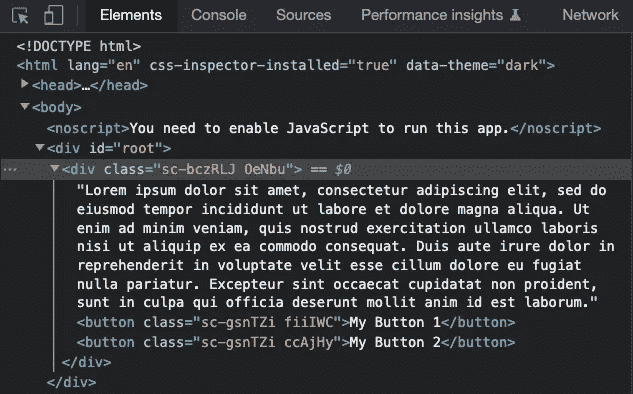
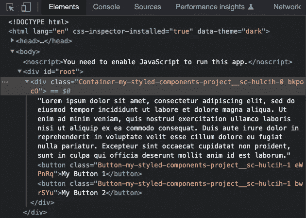
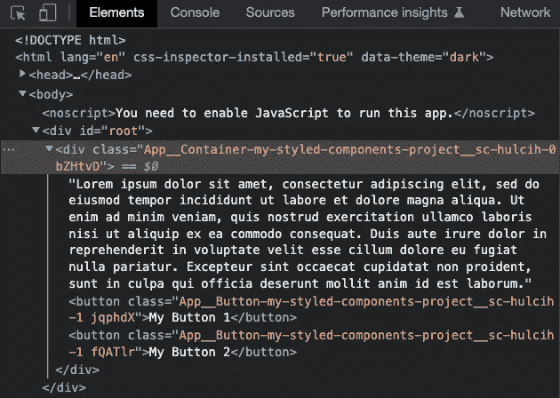
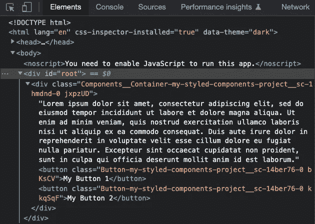
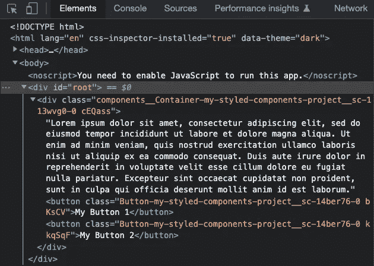
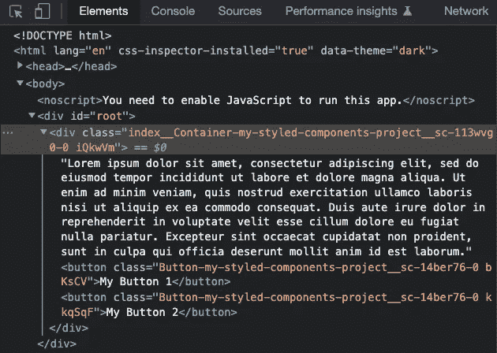
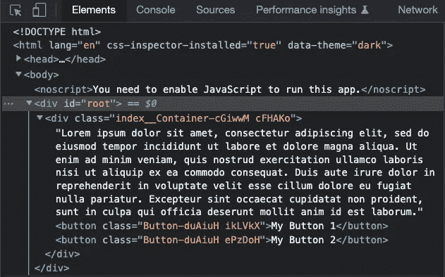

# 如何控制样式化组件中的类名

> 原文：<https://betterprogramming.pub/how-to-control-class-names-in-styled-components-72ed4b165cb9>

## 样式组件的巴别塔配置

由 [Pakata Goh](https://unsplash.com/@pakata?utm_source=medium&utm_medium=referral) 在 [Unsplash](https://unsplash.com?utm_source=medium&utm_medium=referral) 上拍摄的照片

是一个流行的库，用来设计 React 应用程序。我们已经介绍了[是什么以及如何使用](/styled-components-a-css-in-js-approach-755f6a196c42)。我们还探讨了继承样式的 7 种方法和 12 个符号用法的编码示例。

在本文中，我们将讨论如何在`styled-components`中控制类名。

# 默认类名

我们在上一篇文章中重用了[Create React App 工作环境。以下软件包已安装在环境中:](https://medium.com/p/69debaad97e3#16d6)

*   `styled-components`

这里是`src/App.js`:

*   在第 1 行，`styled`从`styled-components`导入。`styled`是默认的导出，用于创建`styled.tagname` helper 方法，将样式从 JavaScript 转换为实际的 CSS 规则。
*   在第 3–13 行，样式化组件`Container`扩展了`div`的样式。它包含了`div`元素的 CSS 属性。`::first-letter`伪元素(第 8–13 行)将样式应用于块级元素第一行的第一个字母。
*   在第 15–20 行，样式化组件`Button`扩展了`button`的样式。它包含了`button`元素的 CSS 属性。

执行`npm start`。我们看到蓝色背景上的一段文字。第一个字母是红色粗体，末尾有两个按钮。

作者图片

这是检查窗口:

作者图片

在内部，`styled-components`为每个组件生成两个类——一个是静态的，一个是动态的。类名由 [MurmurHash 算法](https://en.wikipedia.org/wiki/MurmurHash)生成。它根据组件 id 和计算的样式字符串生成一个唯一的标识符，然后将散列值转换为字母类名。

静态类名是`sc-<hashedStringName>`。它用于标识样式化的组件，并且没有附加到它的样式。所有实例的名称都相同。在上面的例子中，`Container`的静态类是`sc-bczRLJ`，而`Button`的静态类是`sc-gsnTZi`。

根据插值的结果，每个实例的动态类名可能不同。上例中，`Container`的动态类是`OeNbu`。`Button`的动态类是`My Button 1`的`fiiIWC`，和`My Button 2`的`ccAjHy`。

# 自定义类名

默认的类名很难识别。我们能在调试时让它们更容易识别吗？

是的，我们可以。

它需要`[babel-plugin-styled-components](https://github.com/styled-components/babel-plugin-styled-components)`和定制的巴别塔配置。

`styled-components`安装后，`[babel-plugin-styled-components](https://github.com/styled-components/babel-plugin-styled-components)`和`[babel-plugin-macros](https://github.com/kentcdodds/babel-plugin-macros)`随`package-lock.json`一起出现。

有几个选项可以设置自定义的 babel 配置:

*   弹出创建 React 应用程序
*   使用`[react-app-rewired](/10-fun-facts-about-create-react-app-eb7124aa3785#2d4e)`
*   使用`[craco](https://github.com/dilanx/craco)`(创建 React 应用程序配置覆盖)

这里，我们通过执行`npm run eject`来弹出 Create React 应用程序。弹出的`package.json`有以下巴别塔构型:

除了默认名称之外，一个有意义的类名可以由`namespace`、`displayName`和`fileName`组成。我们最多可以配置一个类名为`fileName__displayName-namespace-defaultName`。

## 命名空间

命名空间将确保生成的类名是唯一的。这是避免应用程序间名称冲突的简便方法。

让我们在`package.json`中试试这个巴别塔配置:

*   在第 9 行，`namespace`被配置为`my-styled-components-project`。
*   在第 10 行，`displayName`关闭。
*   在第 11 行，`fileName`关闭。

这是检查窗口:

作者图片

我们可以看到`Container`的静态类变成了`sc-hulcih-0`，而`Button`的静态类变成了`sc-hulcih-1`。所有名称都以名称空间`my-styled-components-project`为前缀。

## 显示名称

`displayName`是组件名。这使得在应用程序中更容易找到样式化的组件。

让我们在`package.json`中试试这个巴别塔配置:

*   在第 10 行，`displayName`开启。

这是检查窗口:

作者图片

样式化的组件名称`Container`和`Button`放在名称空间`my-styled-components-project`的前面。

## 文件名

`fileName`是组件所在的文件名。使用带前缀的文件名，组件名称变得尽可能唯一。

让我们试试`package.json`中的这个巴别塔配置:

*   在第 11 行，`fileName`开启。

这是检查窗口:

作者图片

文件名`App`放在`displayName`前面。

如果和`displayName`一样呢？

让我们为这个案例建立一个例子。

这里是放置样式组件`Button`的`src/components/Button.js`:

这里是`src/components/Components.js`，放置样式化组件`Container`的地方:

据此，`src/App.js`修改为:

这是检查窗口:

作者图片

对于`Container`，由于`fileName`和`displayName`不同，所以都显示。

对于`Button`，由于`fileName`和`displayName`相同，所以只显示其中一个名字。

## 无意义文件名

如果样式化的组件`Container`放在`src/components/index.js`而不是`src/components/Components.js`中会怎样？

让我们来看看检查窗口:

作者图片

目录名`components`显示为`fileName`，而不是`index`。

这是因为`meaninglessFileNames`的默认设置相当于下面第 11 行的代码。它认为`index`是一个无意义的文件名。因此，将显示目录名。

在`package.json`的 babel 配置中删除`index`这个无意义的文件名。

这是检查窗口:

作者图片

现在文件名`index`显示为 filename，不管它有多无意义。

## 服务器端渲染

我们正在尝试配置样式化的组件类名。为什么要讲服务器端渲染？

默认情况下，`ssr`设置为真。它保证为每个样式化的组件生成一个惟一的标识符，这避免了由于客户机和服务器上不同的类生成而导致的校验和不匹配。

关闭它将导致类名更改。让我们在`src/package.json`试试吧:

这是检查窗口:

作者图片

因此，`namespace`丢失，`defaultName`没有前缀`sc`。在再水合过程中，SSR 可能会显示 HTML 属性不匹配警告。因此，建议将`ssr`设为默认值。

# 结论

是一个流行的库，用来设计 React 应用程序。它被 React 项目广泛采用。我们已经在`styled-components.`中展示了如何控制类名，希望可识别的类名能使您的调试更容易。

感谢阅读。

*如果你有兴趣，可以看看* [*其他风格化组件文章*](https://jenniferfubook.medium.com/jennifer-fus-web-development-publications-1a887e4454af#266e) *。*