# 如何用 CSS 控制文本中的空白

> 原文：<https://betterprogramming.pub/how-to-control-white-space-in-text-with-css-2a7695a0c73b>

## CSS 基础

## 包含空白、行高、文本属性、单词间距、垂直对齐、高度、宽度、填充和边距

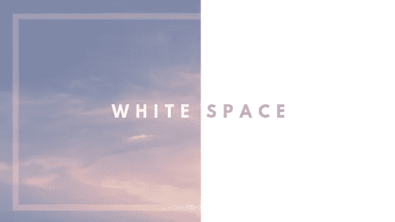

空白在易读性方面起着重要的作用。它对内容进行分组和划分，吸引注意力，并提供视觉休息。

在 CSS 中，我们不局限于使用`white-space`属性来控制文本中空白的数量。我将仔细阅读我所遇到的，我将它们大致分为两类:

## **1。文本中的空白:**

*   `white-space`
*   `line-height`
*   `text-align`、`text-indent`、`text-overflow`
*   `word-spacing`
*   `vertical-align`

## **2。文本周围的空白:**

*   `height`和`width`
*   `padding`和`margin`

# 1.文本中的空白

## 空白属性

控制 文本内*的空白量。*

它确定:

*   元素内部的空白是否折叠以及如何折叠
*   线条是否可以换行

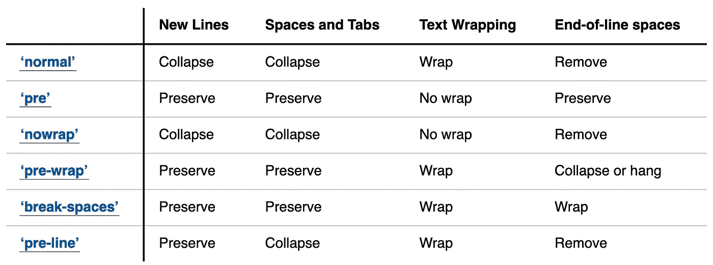

来自 w3.org

通过比较`white-space: break-spaces`、`white-space:normal`和`white-space:nowrap`的使用，可以看出 a .)折叠与保留新行和空格制表符以及 b .)文本换行与不换行之间的区别:

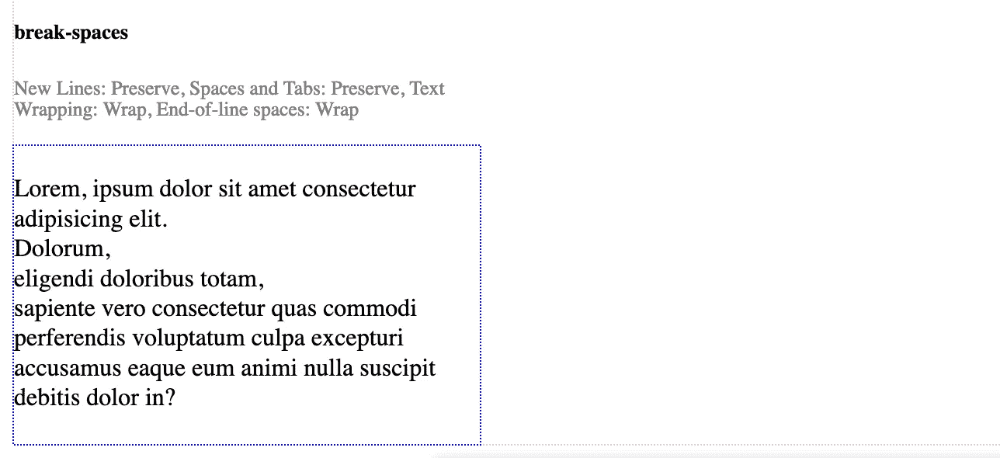

可以在文本的开始和文本之间观察到换行符。文本在段落宽度内换行。

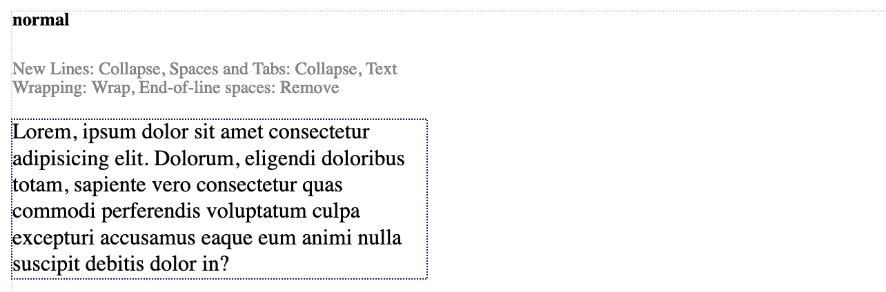

最常用的。这里的空白是折叠的。

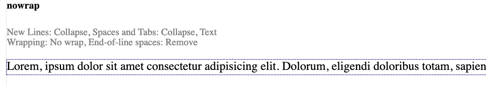

请注意文本是如何在一行中呈现并超出段落宽度的

## 行高属性

属性设置了一个行框的高度，以使文本行间隔更近或更远。

`line-height`属性的值可以是数字、长度、百分比或关键字`normal`。

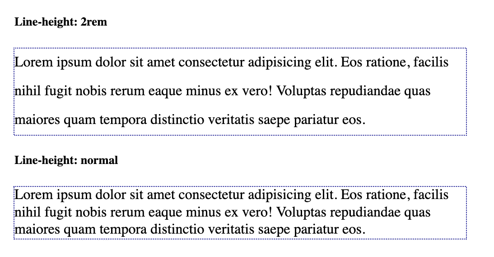

正常线高度和 2 线高度之间的差异

## 文本属性

**文本对齐属性**

`text-align`属性设置元素的水平对齐。

文本可以设置为`left`、`right`、 `justify`和`center`。

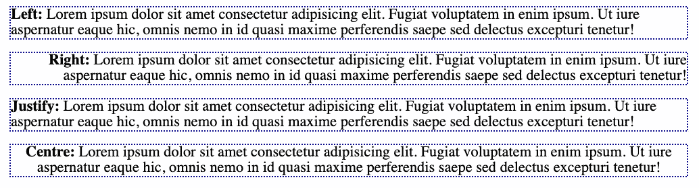

**文本缩进**

属性为文本添加缩进，即文本块开始处的空格。

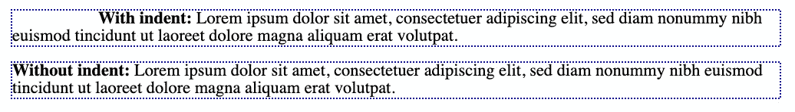

**文本溢出**

属性控制溢出时文本的流向。

当应用值`clip`、`ellipsis`和 `string`时，文本被剪掉。`ellipsis`还会在末尾添加一组三个圆点。

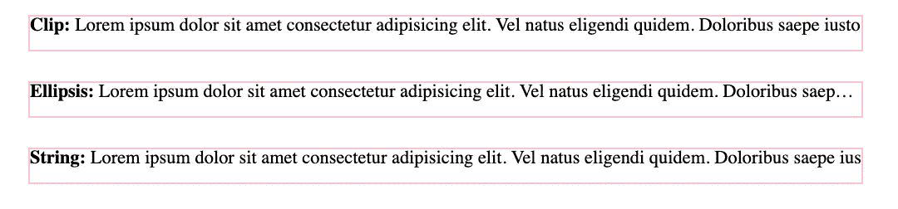

## 单词间距属性

属性设置单词之间的空白。

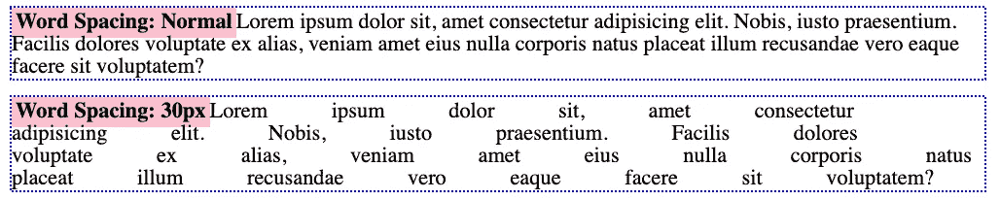

## 垂直对齐

设置元素的垂直对齐方式。

可以应用值`baseline`、`text-top`、`text-bottom`、`sub`和`sup` 。

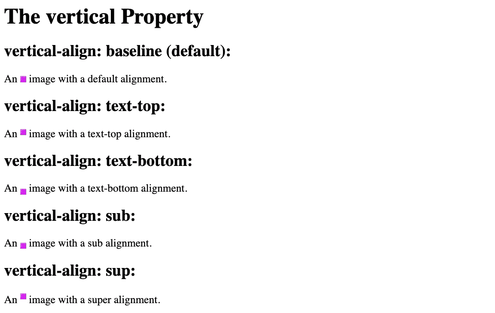

来自 w3schools.com

# 2.文本周围的空白

## 高度和宽度

设置元素的高度和宽度。

这些属性可以改变文本的尺寸，从而改变周围元素之间的空白量。

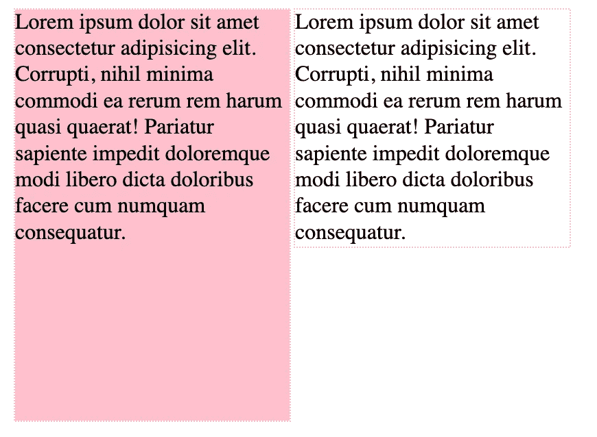

这两个文本块使用具有指定宽度的内嵌块来设置样式。右边的具有指定的高度和颜色。

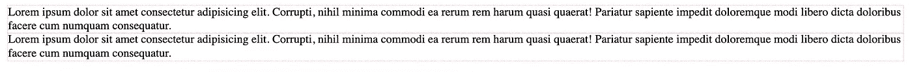

相同的文本使用没有指定宽度的内嵌块来设置样式

## 填充和边距属性

设置元素的填充和边距。

最后的属性是`padding` 和`margin`，它们可以用来在文本(以及其他元素)周围创建空白区域*。*

例如，为了对标题、副标题和文本块进行分组，可以减小`padding`和`margin` ，使得标题和副标题的空白空间更靠近，从而在视觉上分组在一起。

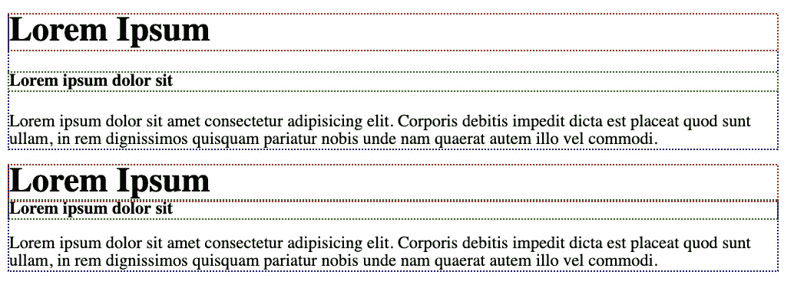

顶部显示默认填充和边距，而底部显示标题和副标题的零边距

# 结论

我希望这篇文章很好地介绍了我们用来控制文本中空白的 CSS 属性。

我没有背过，当然也不建议任何人这么做。简单地知道这些特性对我们来说是可用的，并自己尝试它们是一个很好的开始。

希望这对你有用！

## 资源

*   w3schools 的 CSS 文本
*   [基于 MDN 的 CSS 文本](https://developer.mozilla.org/en-US/docs/Web/CSS/CSS_Text)
*   [链接到我的代码笔，其中包含文章](https://codepen.io/collection/ngGEeE/)中使用的代码