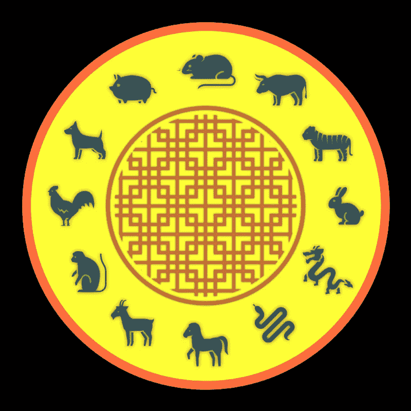

# 如何在 Swift 中将日期转换成中文生肖

> 原文：<https://betterprogramming.pub/how-to-convert-dates-into-chinese-zodiacs-30ed15e2f2a9>

## 将中国日历整合到您的应用程序中

# 我们需要的工具

*   安装了 Swift Playgrounds 的 iPad，或者
*   安装了 Xcode 的 Mac 电脑。

# 我们需要知道的是

*   对 Swift 编程的基本理解。

# 背景

不同文化的日历总是让我着迷。除了我们使用的公历，我从小到大都是用中国历来记录中国和世界各地不同的节日和文化活动。

中国历法的另一个有趣的方面是它将不同的动物与每年联系在一起，被称为“中国生肖”。

这种联系通常有助于估计另一个朋友或家人的大致年龄，而无需直接询问他们。不同的特征和前景也被认为与每种动物有关。

十二生肖按照特定的顺序排列:鼠、牛、虎、兔/兔、龙、蛇、马、山羊/绵羊/公羊、猴子、公鸡、狗和猪/野猪。

你有没有去过一个中国餐馆，在盛放餐具的餐巾下面，你可能会发现一张纸，上面会根据你的出生年份告诉你哪一个是你的生肖？

例如，它可能会说，如果你出生在 1967 年，1979 年，1991 年，2003 年或 2015 年，你出生在羊年。但是你知道吗，如果你出生在那一年的农历新年之前，你的生肖其实是山羊之前的那一个，是马。

这是因为中国的历法和我们使用的历法有点不同步。不是一月 1ˢᵗ标志着新的一年的开始，而是中国新年，因此，一个新的十二生肖。

中国新年通常比我们同年的一月 1ˢᵗ晚开始，但是我们怎么知道每年的中国新年是什么时候呢？

根据中国历法的规则，有一个被称为*干知*的系统，用于记录每年的流逝。

它由两个汉字组成，每年农历新年都会变化，第二个汉字决定了哪种动物与那一年相关联。

# 开始编码

首先，我们需要能够将正常日期转换为中国日历日期，然后转换为黄道。

在 Mac 上用 Xcode 创建一个新的游乐场，或者如果你有 iPad，使用 Swift Playgrounds。

为了处理日期和日历，我使用内置的`Calendar`和`DateComponents`。

让我们尝试将日期“2020 年 5 月 1ˢᵗ”转换成中国日历日期。快速看了一眼 prokerala.com，日期是 4718 年的 4ᵗʰ月，9ᵗʰ日。让我们看看如何使用 Swift 实现这一点。

首先，我们需要一个`DateComponents`实例来存储我们的正常日历日期。“五月”是 5ᵗʰ月。确保顶部有`import Foundation`或`import UIKit`。

接下来，我们需要创建一个`Calendar`实例，将标识符指定为“Gregorian”，并从上一步的`DateComponents`创建一个日期实例。

我们强制打开`normalDate`，因为我们知道我们已经提供了创建日期实例所需的日期组件。

接下来，我们需要能够使用`DateFormatter`将我们的日期以不同的格式显示为`String`。

运行操场，我们可以看到我们的日期打印在控制台正确。没什么特别的。现在，将`DateFormatter`的日历更改为中文，让我们以完整的形式显示日期。

再次跑操场，我们会得到类似`Friday, Fourth Month 9, 2020(geng-zi)` **的东西。**太好了！我们刚刚将一个正常的日期转换成了中国的日历日期。

但这只是开始。请注意，打印日期后面跟着“`(geng-zi)`”。这就是我们所说的*感指*，这也是我们提取生肖信息的地方。

请注意两个罗马化汉字之间的连字符。连字符的右边是汉字，它会告诉我们某一年的生肖。

这样，我们就不需要知道特定年份的农历新年是什么时候了。下面是一个表格，显示了这个角色告诉我们的事情。

奇怪的是，这些汉字是作为一个排序系统给 12 个“地支”命名的，而不是动物本身。

这些动物被分配到每年来代表其他人如何看待我们或者我们如何呈现自己。我们可以把这些信息储存在字典里:

接下来，我们从字符串日期中提取分支。如果`chineseDate`格式不正确，我们在这里使用`guard`。

看起来我们已经具备了将日期转换成中国生肖的所有条件。让我们将所有已编写的代码重构为函数，以便以后可以使用它们。

为了测试我们的功能，我们调用`normalDate(fromYear:month:day:)`来创建一个`Date`实例，并将其传递给`zodiacFrom(date:)`。

为了好玩，让我们举一个 1991 年的例子，正如我们从餐馆学到的，这一年是羊年。

通过快速查找 travelchinaguide.com，中国新年发生在 1991 年的 2 月 15 日。如果我们选择晚于那个日期，比如说 1991 年 6 月 22 日，我们是安全的。

跑操场，我们确实得到了所有小写字母的“山羊”。只是为了好玩，让我们测试一个在中国新年之前但仍在 1991 年内的日期。

再跑操场，我们就有“马”了。

为了纠正那些餐馆餐具垫，应该说 1991 年，在 2 月 15 日之前出生的人有马作为他们的生肖，在 2 月 15 日或之后会有山羊。

# 由此处

看看我做的应用程序，它将人们的生日转换成生肖，存储起来，并根据兼容性进行匹配！

 [## 我的中国生肖

### “我的中国十二生肖”是你找到你和你朋友的中国十二生肖以及他们的…

apps.apple.com](https://apps.apple.com/kw/app/my-chinese-zodiacs/id1259902125)