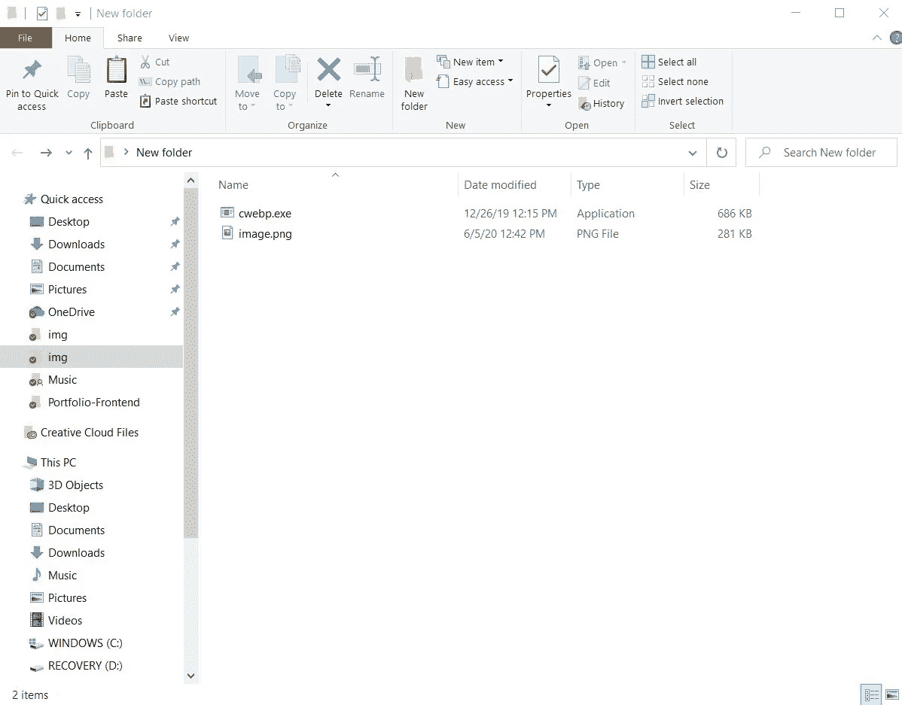
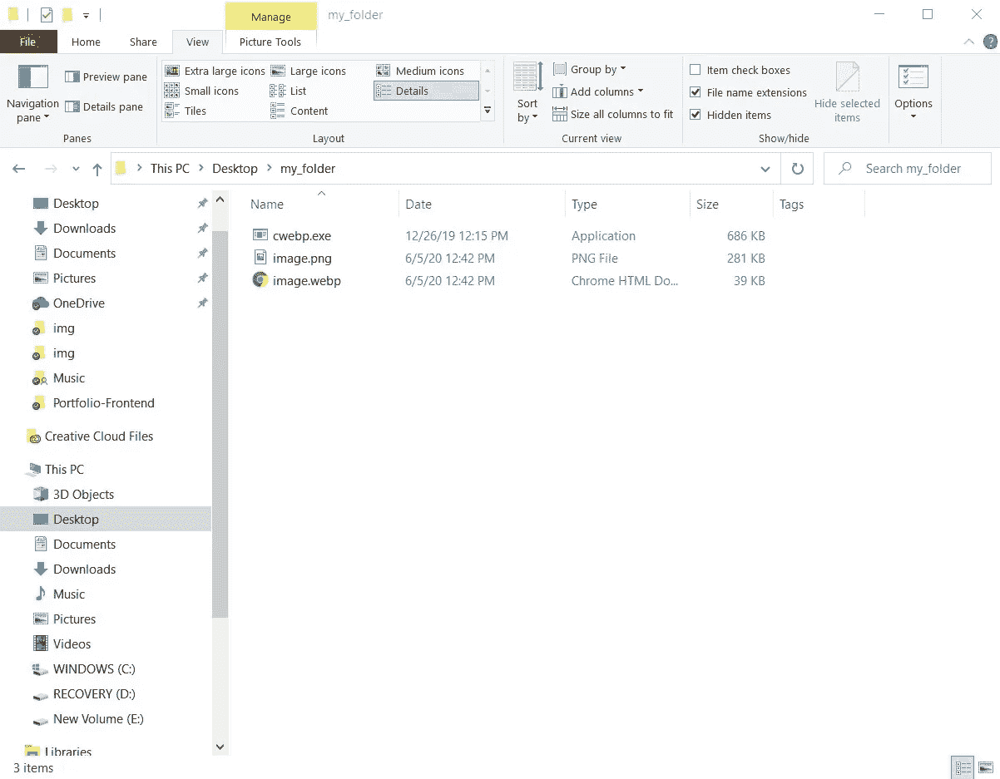

# 如何将图像从 PNG/JPEG 转换为 WebP 格式

> 原文：<https://betterprogramming.pub/how-to-convert-images-from-png-jpeg-to-webp-format-a7f4a6ceba13>

## 使用谷歌的 CWebP 编码器，将图像转换成网页友好格式


克里斯·劳顿在 [Unsplash](https://unsplash.com?utm_source=medium&utm_medium=referral) 上的照片。

WebP 是一种迅速流行的图像格式，是用于网络的图像的首选格式。

> “W ebP 是一种现代的**图像格式**，它为网络上的图像提供了卓越的**无损和有损**压缩。”— [谷歌](https://developers.google.com/speed/webp)

Google 使用他们的 CWebP 编码器将图像转换成这种格式变得非常简单。

*注意:本教程中使用的命令适用于 Windows 和 MacOS。*

# 第一步

[下载](https://storage.googleapis.com/downloads.webmproject.org/releases/webp/index.html)编码器。zip 文件。确保下载与您的操作系统对应的文件。例如，如果您运行的是 Windows x64 位，请下载以`-windows-x64.zip`结尾的文件。如果您使用的是 MacOS，请查找以`-mac-10.15.tar.gz`结尾的文件。文件按时间升序排列，最新版本在底部。

# 第二步

打开。zip 文件。导航到子文件夹`bin`，提取名为`cwebp`的文件。确保`cwebp`和您要转换的图像文件在同一个文件夹中，如下图所示:



# 第三步

打开命令提示符/终端，使用更改目录命令导航到上面的文件夹。我的情况是这样的:

```
cd desktop/my_folder
```

# 第四步

在正确的目录中，输入如下所示的命令。根据您需要的是有损压缩还是无损压缩，您可以根据需要调整命令。有损压缩提供了最小的文件大小，但降低了图像质量。无损压缩会产生相对较大的文件，同时保持图像质量。

对于有损压缩，请输入:

```
*// The integer used in the command below, 80, is the quality of the // output file. 0 is the lowest quality while 100 is the highest.
// The general form of the command is:
// cwebp -q [int between 0 and 100] input-file -o output-file*cwebp -q 80 image.png -o image.webp
```

对于无损压缩，输入:

```
cwebp -lossless image.png -o image.webp
```

在命令执行之后，您应该能够在同一个文件夹中看到`webp`文件。



# 结论

WebP 仍然没有获得所有浏览器的完全支持。在你的网站上使用 WebP 图片之前，我建议看看哪些浏览器支持它。

# 资源

1.  [CWebP 文档](https://developers.google.com/speed/webp/docs/using)
2.  [浏览器支持 WebP 格式](https://developers.google.com/speed/webp/faq#which_web_browsers_natively_support_webp)