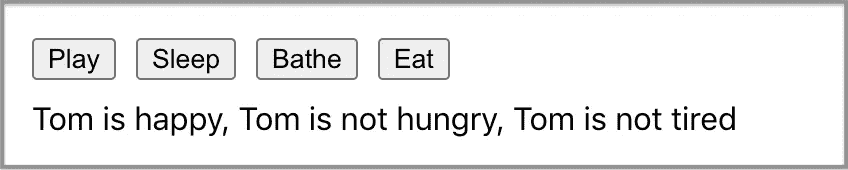
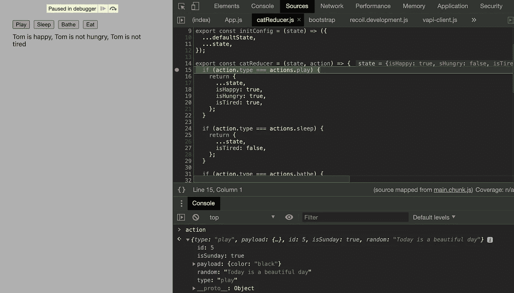
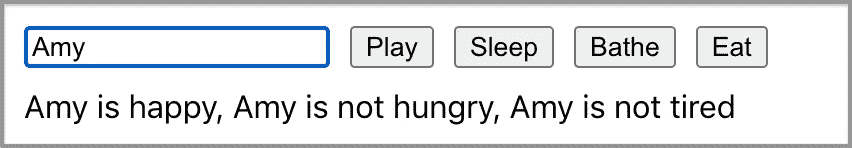

# 如何将 JavaScript 类转换成 React 的 useReducer 钩子

> 原文：<https://betterprogramming.pub/how-to-convert-javascript-classes-to-reacts-usereducer-hook-575769b0c7e9>

## 如何在 React 应用程序中应用函数式编程的案例研究


斯科特·沃尔什在 [Unsplash](https://unsplash.com?utm_source=medium&utm_medium=referral) 上拍摄的照片。

面向对象编程是一种基于“对象”概念的编程范式，对象被定义为类。命令式编程使用语句来改变程序的状态。

函数式编程是另一种编程范例，通过应用和组合函数来构造程序。它是一种声明式编程范式，其中函数被视为一等公民(即，它们可以被赋给变量，作为参数传递，并从其他函数返回)。强烈建议编写纯函数，避免共享状态、可变数据和副作用。

随着 React、Angular 和 Vue 等大型库和框架的出现，函数式编程对前端 web 开发社区变得越来越有吸引力。React 是函数式编程的大力提倡者。在 2018 年 5 月推出 hooks 之后，仅仅用 React 组件的功能来编写整个应用程序已经成为可能。

您可能已经有面向对象的编程代码，或者您可能熟悉面向对象的编程。你现在如何用一种功能性的方式来构造东西？

我们将提供一个例子来展示如何将类转换成 React 的`useReducer`钩子。

# **面向对象的方法**

我们使用 [Create React App](https://medium.com/better-programming/10-fun-facts-about-create-react-app-eb7124aa3785) ( `npx create-react-app my-app`)设置了一个工作环境，并将`src/App.css`更改为以下内容以获得最小样式:

ECMAScript 2015 (ES 6)引入了`class`，这是 JavaScript 现有的基于原型的继承之上的语法糖。类可以定义为类表达式或类声明，类似于函数。

在`src/Cat.js`中声明了一个类`Cat`:

这个类有状态(即成员变量)的初始值，它们是`name`(第 7 行)、`isHappy`(第 2 行)、`isHungry`(第 3 行)和`isTired`(第 4 行)。它使用一个`constructor`实例化`name`(第 6-8 行)。

上面的例子说明了初始化类状态的两个地方:类体和构造函数。

`Cat`类还实现了行为(即成员函数，也称为方法)，它们是`play`(第 10-14 行)、`sleep`(第 16-18 行)、`bathe`(第 20-22 行)和`eat`(第 24-27 行)。`getStatus`(第 29-36 行)是另一种描述状态的方法。

在第 39 行，用`new`操作符实例化了一个`cat`实例。此实例已导出供使用。

我们定义一个接口来表达这个类:



有四个按钮调用四个成员函数，显示`getStatus`值来展示类状态。

修订后的`src/App.js`中使用了`cat`实例:

*   在第 2 行，导入了`cat`实例。
*   第 9-16 行定义了`Play`按钮。点击该按钮时，调用`cat.play`并更新显示字符串。
*   第 17-24 行定义了`Sleep`按钮。点击该按钮时，调用`cat.sleep`并更新显示字符串。
*   第 25-32 行定义了`Bathe`按钮。点击该按钮时，调用`cat.bathe`并更新显示字符串。
*   第 33-40 行定义了`Eat`按钮。点击该按钮时，调用`cat.eat`并更新显示字符串。
*   第 41 行显示了`cat.getStatus()`的值。

这个程序是可行的，只是它没有采用函数式方法。

# 功能方法

`useReducer`是一个内置的钩子，更适合管理包含多个子值的状态对象。它非常适合定义一个类。

`useReducer`的使用方法如下:

```
const [state, dispatch] = useReducer(reducer, initialArg, init?);
```

在左侧，它被分解为两个项目:

*   `state`:可以装东西的对象，相当于一个类的成员变量。
*   `dispatch`:可以处理状态变化的方法，相当于一个类的成员函数。`dispatch`函数的引用是稳定的，不会在重新渲染时改变。因此，从`useEffect`或`useCallback`依赖列表中省略是安全的。

在右边，它有三个属性:

*   `reducer`:具有`(state, action) => newState`类型的函数。它有两个参数——当前状态和用户执行的操作。然后，它根据所调度的动作有条件地返回一个新状态。
*   `initialArg`:减速器的初始状态。
*   `init?`:初始化可选功能。如果提供，初始状态将被设置为`init(initialArg)`。否则，直接应用`initialArg`。

在定义一个缩减器之前，我们声明了与`src/catActions.js`中`Cat`的成员函数相似的`actions`:

然后这些动作被`src/catReducer.js`中的减速器使用:

我们将成员变量声明转换为默认状态(第 3-7 行)。有一个状态初始化器，`initConfig`(第 9-12 行)，它将`defaultState`与`useReducer`的初始状态(`name: “Tom”`)结合起来。

改变状态的成员函数被转换成 reducer 函数中的动作处理(第 14-47 行)。重要的是状态是不可变的。ECMAScript 2015 的`spread`操作符提供了一种简单的方法。如果返回具有相同引用的状态，React 将退出，而不渲染子级或点火效果。

这是使用`catReducer`的`src/App.js`:

`useReducer`用于第 7 行。`constructor`参数`name`在此初始化。

第 9-17 行的`getStatus`成员函数被转换为`status`。`useMemo`记忆数值，直到`state`改变。这是一种优化，以避免每次渲染时重新计算。

当每个按钮被点击时，它调用`dispatch`函数，而不是调用成员函数。

就是这样。现在我们的`Cat`例子以函数的方式工作。

# 关于派遣的更多信息

你可能对`dispatch`功能有疑问。类成员函数可以接受参数。如何在`dispatch`函数中完成同样的事情？

在我们的简单示例中，`type`用于缩减器有条件地转换状态:

```
dispatch({ type: actions.play });
```

可选地，我们可以传入一个有效负载作为动作的参数。有效载荷可以被称为`payload`或任何其他名称。需要多少有效载荷就有多少。

```
dispatch({ type: actions.play, payload: { color: 'black' }, id: 5, isSunday: true, random: 'Today is a beautiful day' });
```

上面的`dispatch`除了`type`之外，还有`payload`、`id`、`isSunday`、`random`等称呼。

在下面的断点处，我们可以看到`catReducer`接收所有的参数来构建它的逻辑。



如果`payload`是异步操作的结果呢？

那么应该调用`dispatch`作为异步操作的结果。这样，我们将副作用保留在 reducer 之外，以确保它是一个纯函数。

上面的例子显示异步操作最初将`isLoading`设置为`true`(第 2 行)。当调用成功时，调度`result`进行处理(第 4 行)。当调用失败时，调度`error`进行错误处理(第 5 行)。最后`isLoading`设置为`false`(第 6 行)。

# 关于州的更多信息

我们希望创建一个新的界面，能够更改猫的名字:



在`src/catActions.js`中需要一个新的名称更改动作(第 6 行):

这个新动作在`src/catReducer.js`中处理:

第 46-51 行添加了`actions.changeName`的案例，以处理名称更改。

以下是修改后的`src/App.js`使用`catReducer`:

第 20-28 行定义了输入元素。当值发生变化时，它会将动作`changeName`与`name`的负载一起发送出去。

这和预期的一样有效。

我们也可以把猫的属性分解成两种状态。`catReducer`、`isHappy`、`isHungry`、`isTired`处于一种状态。`name`处于自己的状态。这样，我们就不需要有新的动作了(`changeName`)。

变化仅出现在`src/App.js`中:

第 7 行，`name`由`useState`管理。第 21 行定义了管理猫的名字的输入元素。第 17 行的`useMemo`依赖列表需要有`name`。

在第 8 行，猫的其他财产仍然由`useReducer`管理。

第二种方法似乎更简单。状态可以根据用例进行不同的设计。`useState`适用于简单状态，`useReducer`适用于多值状态。

当一个状态被管理时，避免共享状态是很重要的，共享状态是在多个函数或多个数据结构之间共享的状态。

# 结论

我们已经展示了一个如何使用`useReducer`的例子。重要的是 reducer 函数是一个纯函数，并且 reducer 函数生成的状态是不可变的。

`useReducer`等同于`useState`，因为它作用于特定组件及其所有后代。

我们可以通过上下文传递`dispatch`函数:`const ParentDispatch = React.createContext(null)`。

将孩子包裹在上下文中:

```
<ParentDispatch.Provider value={dispatch}>
  <Child someProps={someProps} />
</ParentDispatch.Provider>
```

那么任何子组件都可以通过调用`useContext` : `const dispatch = useContext(ParentDispatch)`来访问`dispatch`函数。

在我们的 React 项目中，`useReducer`运行良好。我们对 100%的函数式编程很满意。

感谢阅读。我希望这有所帮助。你可以在这里看到我的其他媒体出版物。