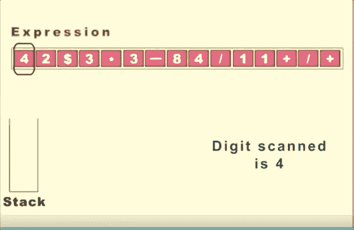

# 如何将计算机中的数学运算转换成人类可读的表达式

> 原文：<https://betterprogramming.pub/how-to-convert-mathematical-operations-in-computer-to-human-readable-expressions-ea1b7039ec41>

## 将后缀表达式转换为中缀表达式，以便高效阅读和编辑


照片由[沃尔坎·奥尔梅斯](https://unsplash.com/@volkanolmez?utm_source=unsplash&utm_medium=referral&utm_content=creditCopyText)在 [Unsplash](https://unsplash.com/s/photos/maths?utm_source=unsplash&utm_medium=referral&utm_content=creditCopyText) 上拍摄

# 什么是中缀和后缀，为什么要关心？

让我们来看看这个等式:

```
(1+2)–3*(1+2)
```

你有十秒钟的时间来想出这个等式的答案。在得到答案之前不要偷看下面。时间开始。


照片由 [NeONBRAND](https://unsplash.com/@neonbrand?utm_source=medium&utm_medium=referral) 在 [Unsplash](https://unsplash.com?utm_source=medium&utm_medium=referral) 上拍摄

这个的答案是 0！等等，让我再查一下，对不起，是-6。如果你的答案是 0，不用担心。我在计算自己编的公式时也是一头雾水。

对于人类来说，遵循算术运算的顺序来计算正确答案是至关重要的。括号有助于表示操作的优先级。但是这些括号对计算机的帮助不是很大。

计算机不容易区分运算符和括号。此操作:

```
1 2 + 3 1 2 + * -
```

叫做*后缀*，对计算机来说可读性更强。后缀是计算机上数学表达式的语法，其中数学运算符总是放在操作数之后。因此，我们有时喜欢将人类可读的表达式(中缀)转换成后缀来提高计算速度。

尽管上面的表达式对计算机很有帮助，但对人类来说却不容易理解。

一旦表达式存储在 postfix 中，我们想把它们转换成中缀以便阅读和编辑。本文将向您展示如何使用堆栈来实现这一点。

# 创建堆栈

我们首先要创建一个堆栈类，它允许我们执行一些基本的功能，比如`is_empty`、`push`、`pop`、`peek`和`size`。Python 允许我们轻松地实现这些方法。

# 后缀计算

首先，用我们上面创建的`Stack`类初始化结果。

```
result = Stack()
```

创建一个字典，将字符串`“+”`、`“-”`、`“*”`、`“/”`转换为运算符。

```
operators = {"+": operator.add,
                 "-": operator.sub,
                 "*": operator.mul,
                 "/": operator.truediv
                }.get
```

现在我们已经准备好使用堆栈执行操作了。



从[希瓦姆频率](https://www.youtube.com/watch?v=SfhhPJeF_vE)中检索

从左向右扫描时:

*   如果字符串中的字符是一个数字，我们将这个字符压入堆栈。
*   如果字符是一个操作符，我们从堆栈中弹出前两个数字，并用操作符在这两个数字之间执行运算。
*   操作执行后，我们将结果推回堆栈。
*   我们重复上述步骤，直到所有的字符都被扫描。

# 把所有东西放在一起

使用后缀字符串进行测试:

```
>>> pf = "1 2 + 3 1 2 + * -">>> postfix_calculation(pf)-6
```

# 结论

恭喜你！在本文中，您了解了如何将后缀转换成中缀。希望这篇文章对你理解 postfix 的工作原理以及如何创建自己的 postfix 转换器有所帮助。

我喜欢写一些基本的数据科学概念，并尝试不同的算法和数据科学工具。你可以通过 [LinkedIn](https://www.linkedin.com/in/khuyen-tran-1401/) 和 [Twitter](https://twitter.com/KhuyenTran16) 与我联系。

如果你想查看我写的所有文章的代码，请点击这里。在 Medium 上关注我，了解我的最新数据科学文章。