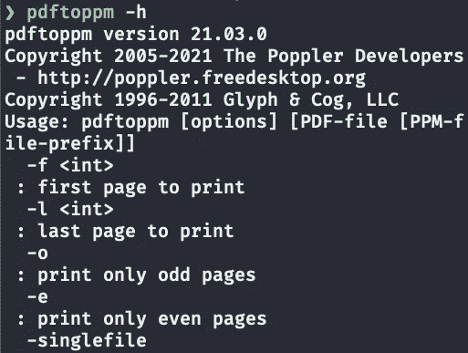
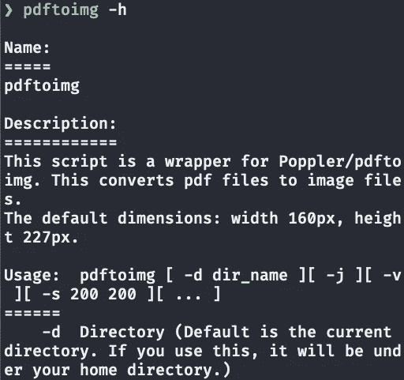
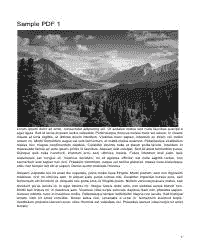

# 如何从您的终端将 pdf 转换为图像

> 原文：<https://betterprogramming.pub/how-to-convert-pdfs-to-images-from-your-terminal-3786ebc798c8>

## 让您的生活更轻松的现成工具


由 [Joshua Aragon](https://unsplash.com/@goshua13?utm_source=medium&utm_medium=referral) 在 [Unsplash](https://unsplash.com?utm_source=medium&utm_medium=referral) 拍摄的照片。

我妻子有许多 pdf 文件，她与她的博客订阅者分享。她让我从每个 PDF 的第一页创建缩略图。我找到波普勒帮我做这项工作。该指南很容易理解，但对她来说并不容易，因为她没有终端/编程经验。所以我创建了一个包装器来方便她。

[Poppler](https://poppler.freedesktop.org/) 是一个 PDF 转换器和实用工具。它将 [PDF 转换为图像(pdftoppm)](https://www.mankier.com/1/pdftoppm) 、[文本](https://www.mankier.com/1/pdftotext)和[后记](https://www.mankier.com/1/pdftops)并且[附加](https://www.mankier.com/1/pdfattach)或[提取](https://www.mankier.com/1/pdfdetach)文件、[分析 PDF 字体](https://www.mankier.com/1/pdffonts)、[从 PDF 中提取图像](https://www.mankier.com/1/pdfimages)、[更多](https://www.mankier.com/package/poppler-utils)。

在本文中，您将学习如何使用`[pdftoppm](https://www.mankier.com/1/pdftoppm)`将 pdf 转换成图像，以及一个名为`pdftoimg`的 Bash 脚本，它是`pdftoppm`的包装器。

# 安装 Poppler

Ubuntu:

```
$ sudo apt-get install poppler-utils
```

macOS:

```
$ brew install poppler
```

Windows 用户可以使用 [Poppler for Windows](http://blog.alivate.com.au/poppler-windows/) 。

安装后，检查它是否工作:

```
$ pdftoppm -h
```



pdftoppm -h 输出的一部分。图片由作者提供。

# 波普勒基础

Poppler 的一个模块叫做`[pdftoppm](https://www.mankier.com/1/pdftoppm)`:

> **Pdftoppm** 将可移植文档格式(PDF)文件转换为可移植像素图(ppm)格式的彩色图像文件、可移植灰度图(PGM)格式的灰度图像文件或可移植位图(PBM)格式的单色图像文件

## 波普勒选项

默认情况下，`pdftoppm`将所有 PDF 页面转换为 PPM 文件。您可以使用`-png`或`-jpeg`标志转换成 PNG 或 JPEG 文件。

```
$ ls
test.pdf
$ pdftoppm test.pdf test -png
$ ls
test-1.png  test-2.png test-3.png  test.pdf
```

`test.pdf`有三页，所以`pdftoppm`为每页创建一个 PNG 文件。上例中的第二个`test`参数是一个新文件名。你可以把它改成你喜欢的任何东西。

*   `-f`接受起始页码。
*   `-singlefile`创建单页。
*   `-scale-to-x 200`将图像宽度设置为 200 像素。
*   `-scale-to-y`设置图像高度。使用`-1`按比例缩放高度。
*   `-r 100`指定了 *X* 和 *Y* 的图像分辨率。默认值为 150 DPI。
*   `-scale-to 200`将最长的一边缩放至 200 像素，并按比例缩放另一边。

```
$ pdftoppm file.pdf file1 -png -f 1 -singlefile -scale-to-x 160 -scale-to-y -1
```

这将把`file.pdf`的第一页转换成 PNG 文件，宽度为 160 像素，长度按比例缩放。

`pdftoppm`也可以裁剪 PDF，您可以在[手册](https://www.mankier.com/1/pdftoppm)中找到更多详细信息。

# 一个 pdftoppm 包装程序:pdftoimg

因为我的妻子很难用不同的选项输入上面的命令，所以我做了一个名为`pdftoimg`的`pdftoppm`包装器。她只需要输入`pdftoimg path/to/directory`就可以将指定目录下的所有 pdf 转换成 PNG 文件。

# 装置

创建一个名为`~/bin`的目录，并将其路径添加到您的终端配置文件(`~/.zshrc`或`~/.bashrc`):

```
# ~/.zshrc or ~/.bashrc
export PATH="$HOME/bin:$PATH"
```

在`~/bin`目录中，用下面的代码创建一个名为`pdftoimg`的文件。您可以将`height`和`width`值更改为默认值。

使文件可执行:

```
$ cd ~/bin
$ chmod u+x pdftoimg
```

检查它是否工作:

```
$ pdftoimg -v
v0.0.2
$ pdftoimg -h
```



pdftoimg -h 输出的一部分。图片由作者提供。

# 替换它

她所有的 PDF 文件名都有空格。为了使它们 URL 安全，我使用 [replaceit](https://towardsdatascience.com/4-bash-script-helpers-to-get-more-done-4144046be13#bce6) 将所有空格替换为下划线。

```
$ ls
file 1.pdf file 2.pdf file 3.pdf$ replaceit
$ ls
file_1.pdf file_2.pdf file_3.pdf
```

# 如何使用 pdftoimg

默认操作是将当前目录中所有 PDF 文件的第一页转换为 PNG 文件(默认图像格式为 PNG)。

```
$ pdftoimg
```

您可以设置一个目录:

```
$ pdftoimg Downloads/dir 
```

您可以使用`-s`开关将当前目录下所有 PDF 文件的第一页转换为尺寸为 200x250px 的 PNG 文件:

```
# currrent dir
$ pdftoimg -s 200 250
# or set a dir
$ pdftoimg -s 200 250 path/to/dir
```

您可以在其他选项之前或之后添加`path/to/dir`。

您可以使用`-j`标志将所有 PDF 文件的首页转换为尺寸为 200x250px 的 JPEG 文件:

```
# current dir
$ pdftoimg -j -s 200 250
# or set a dir
$ pdftoimg -j -s 200 250 path/to/diir
```

您可以使用`-a`标志转换目标目录中的所有 PDF 页面:

```
# current dir
$ pdftoimg -a
# or set a dir
$ pdftoimg -a path/to/dir
```

你也可以使用`pdftoppm`的选项。例如，您可以使用`pdftoppm`的`-grey`标志转换为灰色图像:

```
$ pdftoimg path/to/dir -s 200 250 -grey
```



pdftoimg -j -s 200 250 次下载/测试的结果-灰色

# 结论

如果您正在处理 PDF 文件，Poppler 是一个有用的工具。语法很简单，而且`man pdftoppm`有你需要的所有信息。

如果你需要一个更简单的解决方案，试试`pdftoimg`，在评论区告诉我你的想法。`pdftoimg`适用于对终端没有多少经验的新手。希望老婆觉得好用。

**通过** [**成为**](https://blog.codewithshin.com/membership) **会员，可以完全访问媒体上的每个故事。**


[https://blog.codewithshin.com/subscribe](https://blog.codewithshin.com/subscribe)